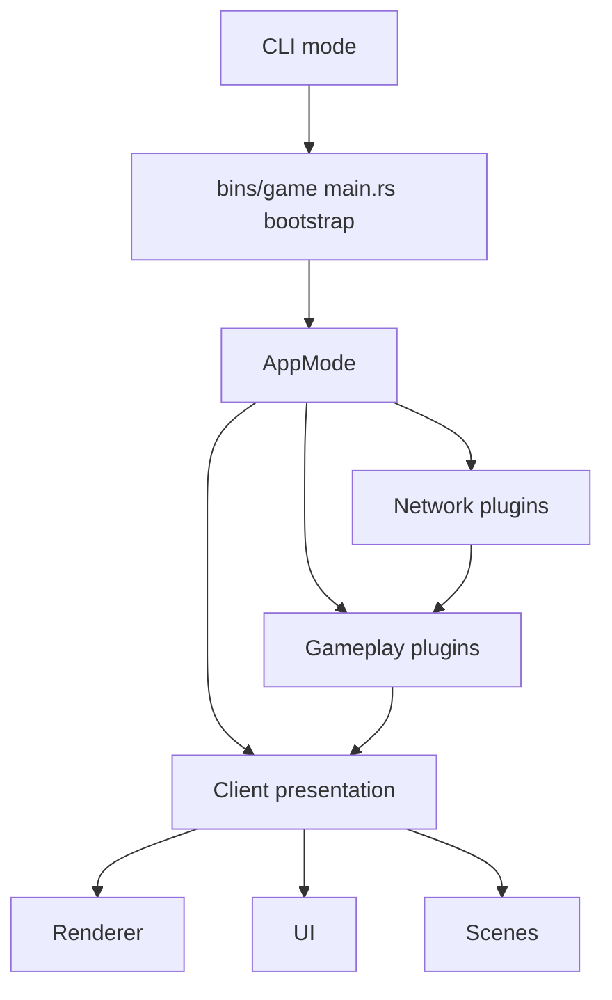

# BevyMMO

[](LICENSE)
[](https://www.rust-lang.org/)
[](https://bevyengine.org/)

BevyMMO is an open-source multiplayer MMO prototype built with [Bevy](https://bevyengine.org/) and [SpacetimeDB](https://spacetimedb.com/). Gameplay is composed with Bevy ECS on the client; the authoritative server is a SpacetimeDB module written in Rust and compiled to WebAssembly, where the database tables *are* the game state, the persistence and the replication.

The `game` binary is the client. The server is published into a running SpacetimeDB instance rather than launched as a process.

## Table of Contents

- [Features](#features)
- [Technology Stack](#technology-stack)
- [Repository Layout](#repository-layout)
- [Prerequisites](#prerequisites)
- [Quick Start](#quick-start)
- [Run Modes](#run-modes)
- [Configuration](#configuration)
- [Database](#database)
- [Docker](#docker)
- [Development Workflow](#development-workflow)
- [Architecture Overview](#architecture-overview)
- [Controls](#controls)
- [Adding Gameplay Content](#adding-gameplay-content)
- [Troubleshooting](#troubleshooting)
- [Further Documentation](#further-documentation)
- [Contributing](#contributing)
- [Security and Secrets](#security-and-secrets)
- [License](#license)

## Features

- Multiplayer networking with SpacetimeDB: clients subscribe to tables and call reducers.
- Server-authoritative simulation running inside the database, with client-side prediction and reconciliation.
- Server-authoritative gameplay systems gated by explicit application roles.
- Client-side rendering and UI built from replicated gameplay state.
- Replicated gameplay entities with shared health, stats, position, color, and lifecycle state.
- Player movement with networked input and prediction/interpolation support.
- Targeting and spell casting systems.
- Persistence with no persistence layer: writing a row is saving it, in the same transaction.
- Automatic schema migration on publish; no migration files to write.
- Layered runtime configuration for development, production, local overrides, and environment variables.
- Docker Compose setup for a local SpacetimeDB instance.

## Technology Stack

| Area | Technology |
| --- | --- |
| Language | Rust 2021 |
| Game engine | Bevy `0.19` |
| Networking | SpacetimeDB Rust SDK `2.8` (WebSocket) |
| CLI | Clap |
| Configuration | `config` crate with TOML and environment sources |
| Server / database | SpacetimeDB 2.8 (Rust module, WebAssembly) |
| Containers | Docker and Docker Compose |

## Repository Layout

```text
.
├── bins/
│   └── game/               # Composition root CLI binary
├── config/                 # Runtime configuration files
│   ├── default.toml         # Shared defaults
│   ├── development.toml     # Development environment overrides
│   ├── production.toml      # Production environment overrides
│   └── local.toml.example   # Template for gitignored local overrides
├── crates/
│   ├── client/             # Client-only input, targeting, movement logic
│   ├── presentation/       # Visual presentation, rendering, UI widgets, scenes
│   ├── server/             # Authoritative simulation, persistence, migrations
│   └── shared/             # Shared entities, protocol, settings, state
├── docs/                   # Architecture and contributor documentation
├── plans/                  # Design notes and feature/refactor plans
├── Cargo.toml              # Workspace root Cargo manifest
├── docker-compose.yml
├── Dockerfile
└── LICENSE
```

## Prerequisites

Install the following tools before running the project locally:

- Rust stable toolchain with Cargo.
- Docker with Docker Compose v2 for the local SpacetimeDB service.
- The `spacetime` CLI, to build and publish the server module.
- A GPU/graphics environment supported by Bevy when running client modes.
- Network access to TCP port `3000` when connecting to a remote SpacetimeDB instance.

Recommended checks:

```sh
rustc --version
cargo --version
docker --version
docker compose version
```

## Quick Start

### 1. Clone and enter the repository

```sh
git clone https://github.com/alessandrobrunoh/BevyMMO.git
cd BevyMMO
```

### 2. Install the SpacetimeDB CLI

```sh
curl -sSf https://install.spacetimedb.com | sh
```

Needed to build and publish the server module. The database itself runs in Docker, but `publish` and `generate` are CLI operations.

### 3. Start SpacetimeDB

```sh
docker compose up -d spacetimedb
```

Listens on `:3000` and keeps its data in the `spacetime_data` volume.

### 4. Publish the server module

```sh
./scripts/stdb.sh publish
```

This compiles `crates/stdb-module` to WebAssembly and uploads it. There are no migrations to run: schema changes are applied automatically, and only a change that cannot be migrated automatically needs `./scripts/stdb.sh reset` (which wipes the data).

### 5. Run the game

```sh
cargo run -- client
```

Pick a name and you are in. Run it twice to see two characters in the same world.

### Useful module commands

```sh
./scripts/stdb.sh dev                       # watch, rebuild, republish, regenerate bindings
./scripts/stdb.sh logs                      # module logs
./scripts/stdb.sh sql "SELECT * FROM player"
./scripts/stdb.sh reset                     # wipe and re-seed (destructive)
```

## Run Modes

There is one: the client.

```sh
cargo run -- client
cargo run -- client --uri ws://192.168.1.10:3000 --module bevymmo
```

The authoritative server is the SpacetimeDB module, not a Bevy process, so the old `server` and `host-client` modes no longer exist. `--uri` and `--module` override `config/default.toml`.

### Build a distributable Windows client

Do not distribute `game.exe` by itself. Bevy loads textures, UI sprites, models, and map GLBs from the filesystem, so the executable must be shipped next to the repository `assets/` directory.

From a full checkout on Windows:

```powershell
powershell -ExecutionPolicy Bypass -File .\scripts\package-client.ps1
```

This creates:

```text
dist/client-windows/
├── game.exe
├── run-client.bat
└── assets/
```

Then zip or copy the whole `dist/client-windows/` folder. Run the remote client with:

```bat
run-client.bat --uri ws://193.70.42.29:3000 --module bevymmo-v2
```

## Cargo Features

The binary is a client, so there is only one feature and it is on by default:

```toml
default = ["client"]
```

The old `server`, `netcode`, `udp`, `replication` and prediction/interpolation features were lightyear transport knobs. The server is now the SpacetimeDB module, built separately with `spacetime build`.

## Configuration

Configuration is loaded in layers. Later sources override earlier ones:

```text
config/default.toml
  < config/<APP_ENV>.toml
  < config/local.toml
  < environment variables
```

`APP_ENV` defaults to `development`.

Examples:

```sh
APP_ENV=production cargo run -- client
```

Important settings:

| Setting | Description | Default / Development value |
| --- | --- | --- |
| `tick_rate` | Fixed simulation tick rate in Hz. | `60.0` |
| `log_filter` | Bevy/Rust log filter syntax. | `warn,bevy_lightyear_game=debug` |
| `spacetime_uri` | SpacetimeDB instance the client connects to. | `ws://127.0.0.1:3000` |
| `spacetime_module` | Name the module was published under. | `bevymmo` |
| `client.client_addr` | Local client UDP bind address. | `0.0.0.0:0` |

Use `config/local.toml` for local overrides, for example:

```toml

[client]
spacetime_uri = "ws://127.0.0.1:3000"
```

## Database

There is no separate database layer. SpacetimeDB tables *are* the authoritative state, the persistence and the replication, all at once — the schema in `crates/stdb-module/src/tables.rs` is the only place state is declared.

### Migrations

None to write. Schema changes are applied automatically on `./scripts/stdb.sh publish`. A change SpacetimeDB cannot migrate automatically needs a reset, which destroys the data:

```sh
./scripts/stdb.sh reset
```

Reset is also how you re-run `init`, which seeds the world: `init` only fires against an empty database.

### Inspecting state

```sh
./scripts/stdb.sh sql "SELECT display_name, position FROM game_entity"
./scripts/stdb.sh logs
```

### Persistent versus runtime tables

Everything persists, including tables that model transient state. `player`, `player_stats`, `inventory`, `equipment`, `hotbar`, `known_glyphs` and `prop_override` are meant to; `game_entity` (for non-players), `projectile`, `aoe_region`, `cast_state`, `crowd_control`, `threat` and `boss_state` are not, and `init` clears and re-seeds them. Without that, a republish would inherit yesterday's projectiles mid-flight.

## Docker

`docker-compose.yml` defines one service:

- `spacetimedb`: the first-party `clockworklabs/spacetime` image, listening on `:3000`, with its storage on the `spacetime_data` volume.

```sh
docker compose up -d spacetimedb   # start
docker compose down                # stop, keep the data
docker compose down -v             # stop and delete the world
```

The module itself is not in the image: it is published into the running instance with `./scripts/stdb.sh publish`.

## Development Workflow

Run tests:

```sh
cargo test
```

Run Clippy with warnings as errors:

```sh
cargo clippy -- -D warnings
```

Format code:

```sh
cargo fmt
```

Common local loop:

```sh
docker compose up -d spacetimedb
cargo test
cargo clippy -- -D warnings
cargo run -- client
```

## Architecture Overview

The application is built from Bevy plugins. Each plugin owns one observable capability such as networking, movement, entities, persistence, spells, rendering, scenes, or UI.



### Application Roles

`network::mode::AppMode` is the source of truth for whether the process has server and/or client responsibilities.

| Mode | Server systems | Client presentation |
| --- | ---: | ---: |
| `Client` | No | Yes |
| `Server` | Yes | No |
| `HostClient` | Yes | Yes |

Systems should be gated with:

- `network::mode::has_server` for server-authoritative logic.
- `network::mode::has_client` for client-side presentation/input/UI logic.

Do not infer application role from transport configuration presence. In `HostClient` mode, both client and server configuration can exist intentionally.

### Server Responsibilities

The server is headless and authoritative. It owns gameplay simulation, persistence, migration execution, and replicated state production. It does not register scenes, UI, or rendering plugins.

### Client Responsibilities

The client reads replicated gameplay state and creates local presentation state such as:

- `Mesh3d`, materials, and `Transform` components.
- UI widgets and HUD state.
- Local visual indicators for movement and targeting.

This separation keeps simulation state portable and avoids coupling authoritative gameplay with presentation details.

## Controls

Default controls are defined in `crates/client/src/input/key_mapping.rs` and related input systems.

| Input | Action |
| --- | --- |
| Right mouse button | Move to world position |
| Left mouse button | Select target |
| `Space` | Cast basic attack |
| `Q` | Cast ray of light |
| `E` | Cast fireball |
| `R` | Cast healing circle |
| `T` | Cast meteorite |
| `F` | Cast swift |
| `Tab` | Show scoreboard |
| `Escape` | Toggle pause / clear target depending on current UI state |

## Adding Gameplay Content

Gameplay entities are organized under `crates/shared/src/entity/`. A typical entity module contains:

```text
crates/shared/src/entity/<name>/
├── mod.rs
├── components.rs
├── spawn.rs
└── systems.rs
```

To add a replicated entity:

1. Create the entity submodule.
2. Define a marker component.
3. Implement `EntityDefinition`.
4. Register systems in the entity plugin.
5. Register the plugin in `crates/shared/src/entity/mod.rs`.
6. Spawn it through the shared entity spawn helpers where appropriate.

See [`docs/create-a-new-plugin.md`](docs/create-a-new-plugin.md) for the detailed guide.

## Troubleshooting

### The client reports missing `assets/...` files

The executable was launched without the sibling `assets/` directory. Copying only `game.exe` into `Downloads` is not enough; the runtime expects this layout:

```text
client-folder/
├── game.exe
└── assets/
```

Use `scripts/package-client.ps1` to create the folder automatically, then distribute that folder instead of the standalone executable.

### The client connects but no character appears

`join` is authoritative and can reject the name — too short, too long, or already taken by another account. Check `./scripts/stdb.sh logs`. Names are 3-16 characters.


## Further Documentation

- [`docs/architecture.md`](docs/architecture.md): deeper architecture notes and module boundaries.
- [`docs/database.md`](docs/database.md): SpacetimeDB tables, Docker, and the module workflow.
- [`docs/create-a-new-plugin.md`](docs/create-a-new-plugin.md): entity plugin creation guide.
- [`plans/`](plans/): implementation plans and design notes for upcoming or recent features.

## Contributing

Contributions are welcome. For a smooth contribution flow:

1. Open an issue or discussion for larger gameplay, networking, or persistence changes.
2. Keep changes focused and consistent with the plugin-based architecture.
3. Run formatting, tests, and Clippy before opening a pull request:

```sh
cargo fmt
cargo test
cargo clippy -- -D warnings
```

When adding gameplay systems, make sure server and client responsibilities are gated with the correct run conditions described in [Architecture Overview](#architecture-overview).

## Security and Secrets

This repository is intended to be public. Do not commit secrets, production credentials, or private connection strings.

Use one of these mechanisms instead:

- `.env` for local Docker Compose variables.
- `config/local.toml` for local machine overrides.
- Environment variables for production deployment.

The template files `.env.example` and `config/local.toml.example` should contain only safe example values.

## License

This project is licensed under the [MIT License](LICENSE).
