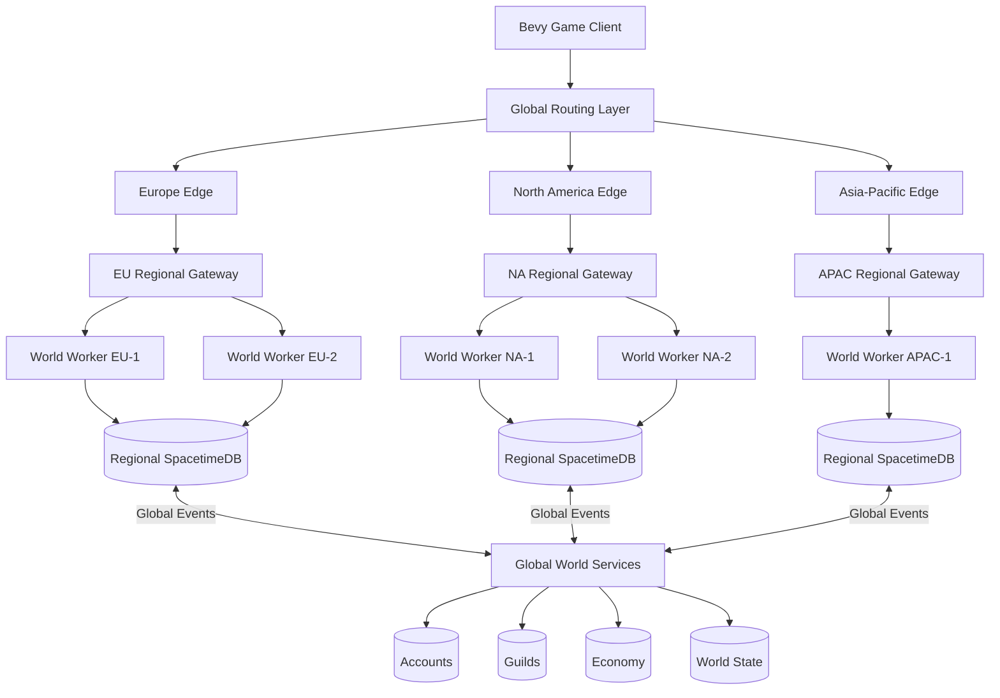
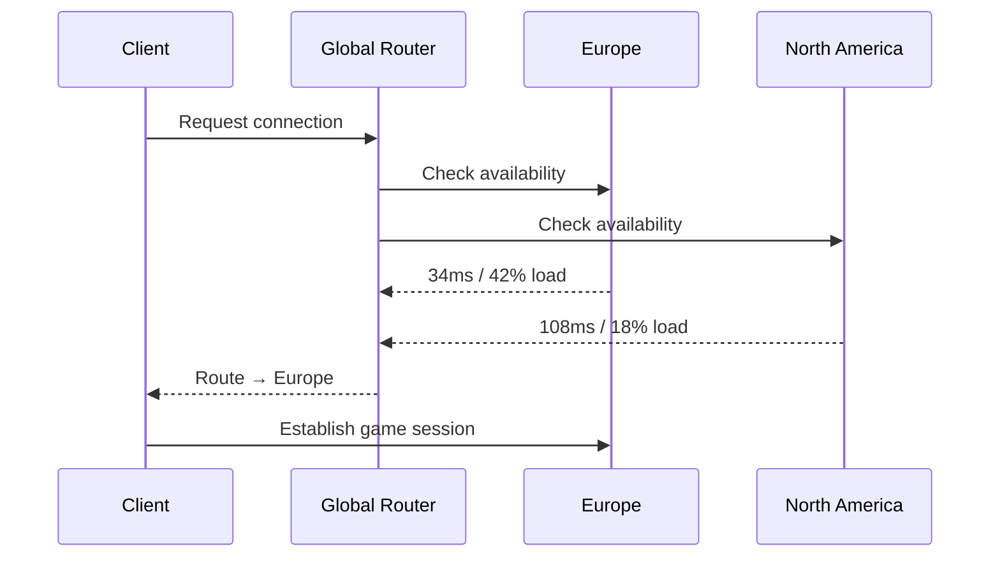
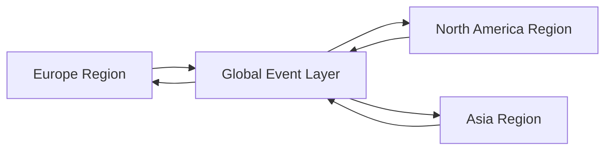
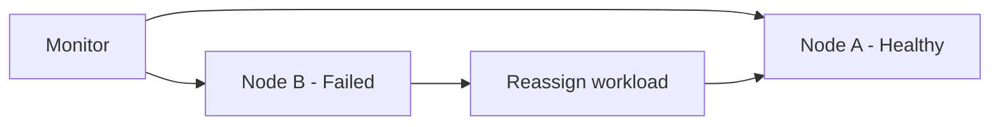
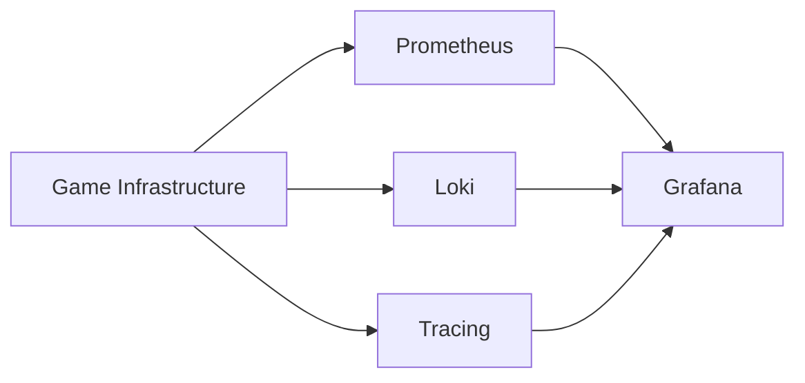
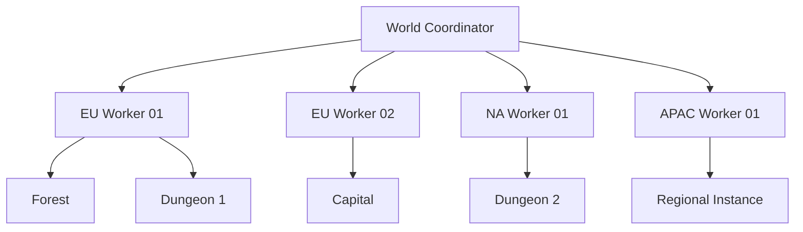

# Eivar Online — Global Server Infrastructure Architecture

> **Status:** Architecture Vision / Research & Development
> **Project:** Eivar Online
> **Client:** Rust + Bevy
> **Backend:** Rust + SpacetimeDB
> **Deployment Strategy:** Self-hosted / hybrid, multi-region capable
> **Primary Goal:** Build an MMO backend that can evolve from a low-cost alpha deployment into a distributed global infrastructure without requiring a complete architectural rewrite.

---

## 1. Overview

Eivar Online is being designed around a **server-authoritative, distributed MMO infrastructure**.

The objective is not simply to run several independent game servers.

The long-term objective is to create a network of regional infrastructure capable of behaving as parts of the **same persistent world**, while dynamically deciding where players, zones and simulation workloads should be executed.

The architecture is designed around five principles:

1. **Authoritative server simulation**
2. **Geographically distributed infrastructure**
3. **Horizontal scalability**
4. **Aggressive interest management**
5. **Infrastructure that can start extremely small**

The same architecture should theoretically support:

```text
Developer Machine
        ↓
Single Alpha Server
        ↓
Multiple Game Processes
        ↓
Multiple Servers in Europe
        ↓
Multiple Geographic Regions
        ↓
Distributed Global MMO Infrastructure
```

The most important design constraint is that the architecture should **scale by adding machines**, rather than continuously replacing existing machines with increasingly expensive hardware.

---

# 2. Core Philosophy

Traditional small multiplayer architectures often look approximately like this:

```text
Players
   │
   ▼
Game Server
   │
   ▼
Database
```

This architecture works extremely well at small scale but eventually creates a large central bottleneck.

Eivar Online instead aims toward:

```text
                    GLOBAL WORLD
                         │
        ┌────────────────┼────────────────┐
        │                │                │
        ▼                ▼                ▼
     Europe          N. America        Asia
        │                │                │
   ┌────┴────┐      ┌────┴────┐      ┌────┴────┐
   │         │      │         │      │         │
 Zone A    Zone B  Zone C    Zone D  Zone E    Zone F
```

A physical machine should not conceptually represent **the world**.

It should represent **compute capacity available to the world**.

Zones, instances, dungeons, battles and eventually sections of the open world can be assigned to available compute resources.

---

# 3. High-Level Architecture



This diagram represents the **long-term architecture**, not necessarily the alpha deployment.

Several logical components may initially coexist on the same physical machine.

---

# 4. Client Architecture

The game client is written in **Rust using Bevy**.

The client should never be trusted as an authority for important gameplay state.

The client can request actions such as:

```text
Move
Cast ability
Equip item
Craft item
Interact
Trade
Attack
Use inventory item
```

but the server decides whether those actions are valid.

Conceptually:

```text
CLIENT

"I want to cast Fireball at Player 173"
               │
               ▼
SERVER

Is the player alive?
Is the spell equipped?
Is the spell on cooldown?
Is the target valid?
Is the target inside range?
Does the player have enough resources?
Is the cast interrupted?
               │
        ┌──────┴──────┐
        │             │
      VALID         INVALID
        │             │
        ▼             ▼
 Apply spell       Reject
```

This provides the foundation for cheat resistance and deterministic game rules.

---

# 5. SpacetimeDB as the Authoritative Backend

A major architectural decision for Eivar Online is the migration toward **SpacetimeDB**.

Instead of maintaining a traditional architecture composed of:

```text
Game Server
+
Networking Framework
+
Serialization Layer
+
Database
+
Cache
+
Synchronization Layer
```

a significant portion of authoritative game logic can live directly inside the SpacetimeDB model.

Conceptually:

```text
┌─────────────────────────────────────────────┐
│                SPACETIMEDB                  │
│                                             │
│   Tables                                    │
│   ├── Players                               │
│   ├── Entities                              │
│   ├── Inventories                           │
│   ├── Guilds                                │
│   ├── Items                                 │
│   ├── Combat State                          │
│   └── World State                           │
│                                             │
│   Reducers                                  │
│   ├── Move                                  │
│   ├── CastAbility                           │
│   ├── Damage                                │
│   ├── Craft                                 │
│   ├── Trade                                 │
│   └── Spawn                                 │
│                                             │
│   Subscriptions                             │
│   └── Relevant state → clients              │
└─────────────────────────────────────────────┘
```

SpacetimeDB reducers execute mutations transactionally, while subscriptions can synchronize selected table state with clients. This makes it possible to treat the backend as both the authoritative state engine and persistent data layer.

For Eivar Online, this removes a substantial amount of networking/database glue code that would otherwise have to be developed manually.

---

# 6. Network Authority Model

The client should be considered:

```text
UNTRUSTED
```

The backend should be considered:

```text
AUTHORITATIVE
```

Important state must therefore exist server-side.

Examples include:

```text
Health
Mana / Energy
Cooldowns
Inventory
Equipment
Position authority
Combat state
Crafting results
Loot
Currency
Guild membership
Trading
Marketplace transactions
Character progression
```

The client primarily becomes a:

```text
Input
  +
Prediction
  +
Presentation
  +
Rendering
```

layer.

---

# 7. Interest Management

One of the most important concepts for MMO scalability is **interest management**.

A player does not need information about every entity in the world.

If the world contains:

```text
100,000 entities
```

but the player can only perceive:

```text
80 nearby entities
```

then ideally the server should synchronize approximately those 80 entities rather than all 100,000.

Conceptually:

```text
WORLD

+-------------------------------------------------------+
|                                                       |
|      X                                                |
|                                  X                    |
|                                                       |
|                     +-----------+                     |
|                     |           |                     |
|              X      |  PLAYER   |      X              |
|                     | INTEREST  |                     |
|                     |   AREA    |                     |
|                     +-----------+                     |
|                                                       |
|     X                                      X          |
|                                                       |
+-------------------------------------------------------+
```

The client subscribes only to relevant state.

Potential filtering dimensions include:

* world region;
* map;
* zone;
* spatial cell;
* distance;
* party;
* guild;
* dungeon instance;
* combat encounter;
* ownership;
* visibility;
* relevance category.

This becomes critical because MMO networking problems are often less about:

> How many entities exist?

and more about:

> How many entity updates must each connected player receive?

---

# 8. Spatial Partitioning

The world can eventually be divided into logical spatial cells.

Example:

```text
WORLD REGION

┌─────┬─────┬─────┬─────┐
│ A1  │ A2  │ A3  │ A4  │
├─────┼─────┼─────┼─────┤
│ B1  │ B2  │ B3  │ B4  │
├─────┼─────┼─────┼─────┤
│ C1  │ C2  │ C3  │ C4  │
├─────┼─────┼─────┼─────┤
│ D1  │ D2  │ D3  │ D4  │
└─────┴─────┴─────┴─────┘
```

Each cell can track entities contained within it.

A player's interest set might contain:

```text
       ┌─────┬─────┬─────┐
       │ A1  │ A2  │ A3  │
       ├─────┼─────┼─────┤
       │ B1  │ B2* │ B3  │
       ├─────┼─────┼─────┤
       │ C1  │ C2  │ C3  │
       └─────┴─────┴─────┘

* player position
```

This allows subscriptions and simulation queries to operate on subsets of the world rather than global datasets.

---

# 9. Regional Architecture

The long-term infrastructure is intended to operate across several geographical regions.

For example:

```text
EUROPE
  ├── France
  ├── Germany
  └── Additional EU capacity

NORTH AMERICA
  ├── East
  └── West

ASIA-PACIFIC
  └── Future region
```

These regions are **not separate game universes**.

They should ideally participate in the same global logical world.

---

# 10. The Latency Problem

A fundamental limitation must be explicitly acknowledged:

> A distributed infrastructure cannot eliminate the physical latency between continents.

A European player and an American player cannot both have 10 ms latency to the same physical machine.

No software architecture can bypass the speed of light.

Instead, Eivar Online attempts to minimize the impact of geographical latency.

The strategy is:

```text
Local actions
     ↓
Nearest regional infrastructure
     ↓
Fast authoritative simulation

Global actions
     ↓
Cross-region synchronization
     ↓
Eventual / asynchronous propagation where possible
```

Operations that require immediate combat resolution should remain as geographically local as possible.

Operations that tolerate delay can propagate globally.

Examples:

```text
LATENCY SENSITIVE
─────────────────
Movement
Combat
Projectiles
Dodging
Ability casts
Collision
Nearby entities


LESS LATENCY SENSITIVE
──────────────────────
Guild state
Marketplace
Mail
Achievements
Global statistics
Leaderboards
World events
Social systems
```

This distinction is extremely important.

---

# 11. Regional Routing

When a player connects, the system can eventually select the most appropriate region.

The decision does not necessarily need to depend only on physical distance.

Possible variables include:

```text
Latency
Server load
Region health
Current player population
Party location
Guild activity
World zone ownership
Maintenance state
Capacity
```

Conceptual flow:



Eventually this could evolve from simple geographic DNS into a dedicated routing service.

---

# 12. World Workers

The architecture should not assume that one process simulates an entire MMO world.

Instead, simulation can be divided among **world workers**.

A worker could own:

```text
A geographic zone
A dungeon
A PvP arena
A city
A world boss encounter
A temporary instance
A large battle
```

Example:

```text
Physical Machine #1

Worker 1 → Forest North
Worker 2 → Forest South
Worker 3 → Dungeon #428
Worker 4 → Arena #82


Physical Machine #2

Worker 5 → Capital City
Worker 6 → Desert West
Worker 7 → Dungeon #429
```

Workers become movable logical workloads.

---

# 13. Dynamic Zone Ownership

An advanced version of the architecture can assign zones dynamically.

For example:

```text
08:00

EU-01
 ├── Capital
 ├── Forest
 └── Desert


20:00

EU-01
 ├── Capital North
 └── Forest

EU-02
 ├── Capital South
 └── Desert
```

As the population increases, a busy zone can be divided or replicated into additional simulation units.

This enables horizontal scaling.

---

# 14. Hot Zone Scaling

Suppose a normal zone contains:

```text
150 players
```

One worker may handle it comfortably.

But a world event could suddenly attract:

```text
2,000 players
```

Instead of requiring the entire MMO server to be massively overpowered at all times, the infrastructure should eventually detect the hot zone.

```text
NORMAL

Worker A
└── Zone X
    └── 150 players
```

becomes:

```text
HOT ZONE

Worker A
├── Zone X / Cell 1
├── Zone X / Cell 2

Worker B
├── Zone X / Cell 3
├── Zone X / Cell 4

Worker C
└── Overflow / battle instance
```

The exact implementation remains an R&D problem, but the data model should avoid making such partitioning impossible.

---

# 15. Cross-Region World State

Some systems logically belong to the entire world rather than an individual simulation region.

Examples include:

```text
Accounts
Character ownership
Guild identity
Guild metadata
Marketplace
Global economy
Mail
Friends
Global events
World progression
Leaderboards
Moderation
```

These systems form the **global control plane**.

Meanwhile, combat and nearby simulation form the **regional data plane**.

```text
              GLOBAL CONTROL PLANE

       Accounts ─ Guilds ─ Economy
          │          │         │
          └──────────┼─────────┘
                     │
       ┌─────────────┼─────────────┐
       │             │             │
       ▼             ▼             ▼

      EU           NA            APAC

   REGIONAL       REGIONAL       REGIONAL
   SIMULATION     SIMULATION     SIMULATION
```

This separation prevents every sword swing in Europe from requiring synchronous communication with America.

---

# 16. Server-to-Server Communication

Regional services will eventually require a communication layer.

Possible messages include:

```text
PlayerTransferredRegion
GuildCreated
MarketOrderCreated
WorldBossDefeated
TerritoryCaptured
CharacterMigrated
GlobalEventStarted
PlayerBanned
ServerDrainRequested
```

These should be modeled as explicit domain events rather than tightly coupling every server directly to every other server.

Conceptually:



The exact technology behind this layer can remain replaceable.

Potential future implementations could use:

```text
NATS
Kafka
Redpanda
RabbitMQ
Custom Rust messaging
```

The domain model should not depend heavily on a specific broker.

---

# 17. Regional Transfer

A player may sometimes need to migrate between server authorities.

Example:

```text
Player
  │
  │ EU Region
  ▼
Forest
  │
  │ Travel / matchmaking / group migration
  ▼
Transfer Service
  │
  ▼
North America Region
```

A safe transfer can conceptually use:

```text
1. Freeze transferable player state
2. Generate transfer token
3. Persist authoritative snapshot
4. Reserve destination
5. Connect player to destination
6. Validate token
7. Restore state
8. Confirm migration
9. Release source ownership
```

The player should never simultaneously have two authoritative owners.

---

# 18. Failure Isolation

Distributed architecture should make failures smaller.

Bad architecture:

```text
Database dies
      ↓
Entire MMO dies
```

Target architecture:

```text
EU Dungeon Worker dies
         ↓
Only affected dungeon/session recovers

NA Region fails
         ↓
Europe remains online

Marketplace unavailable
         ↓
Combat remains operational
```

Subsystem boundaries are therefore also **failure boundaries**.

---

# 19. Failure Recovery

Every important service should eventually expose health information.

Example:

```text
HEALTHY
DEGRADED
DRAINING
UNHEALTHY
OFFLINE
```

A coordinator can then stop assigning new workloads to unhealthy nodes.



For persistent MMO systems, failure recovery matters more than pretending failures never happen.

---

# 20. Graceful Server Draining

Deployment should not immediately terminate active worlds.

Instead:

```text
Server marked DRAINING
          │
          ▼
Stop accepting new workloads
          │
          ▼
Existing instances finish/migrate
          │
          ▼
Players move away
          │
          ▼
Server becomes empty
          │
          ▼
Safe shutdown
```

This enables safer updates and infrastructure maintenance.

---

# 21. Deployment Model

A key requirement is being able to start cheaply.

The alpha infrastructure does **not** require Kubernetes, twenty microservices or ten servers.

The initial deployment can be extremely simple.

```text
               OVH VPS / Dedicated Server

┌────────────────────────────────────────────┐
│                                            │
│   Reverse Proxy / TLS                      │
│                                            │
│   SpacetimeDB                              │
│                                            │
│   Eivar Backend Modules                    │
│                                            │
│   Monitoring                               │
│                                            │
└────────────────────────────────────────────┘
```

The logical architecture remains separated in code even if everything initially runs on one machine.

That is the core idea:

> **Logical separation first. Physical separation only when necessary.**

---

# 22. Infrastructure Evolution

## Stage 0 — Local Development

```text
Developer PC
├── Bevy Client
└── Local SpacetimeDB
```

Target:

```text
1–10 developers/testers
```

Purpose:

* gameplay development;
* reducer development;
* combat testing;
* networking experiments;
* profiling.

---

## Stage 1 — Private Alpha

```text
OVH VPS
├── Reverse Proxy
├── SpacetimeDB
├── Game Module
└── Monitoring
```

Target:

```text
Small tester population
```

The goal is not extreme scale.

The goal is collecting **real measurements**.

---

## Stage 2 — Stronger European Node

```text
EUROPE

Dedicated / larger machine

├── SpacetimeDB
├── Game workloads
├── Metrics
├── Backups
└── Gateway
```

At this stage optimization decisions can finally be based on production telemetry.

---

## Stage 3 — Multiple European Nodes

```text
                EU ROUTER

             /      |      \
            /       |       \
         EU-01    EU-02    EU-03
```

Now horizontal scaling begins.

Individual workloads can start being separated.

---

## Stage 4 — Multi-Region

```text
                    GLOBAL ROUTER

             ┌──────────┼──────────┐
             ▼          ▼          ▼

          EUROPE     N. AMERICA   APAC

           EU-01        NA-01      AP-01
           EU-02        NA-02
```

Players are routed toward appropriate infrastructure.

---

## Stage 5 — Distributed World

```text
                    EIVAR WORLD

     ┌──────────────────────────────────────┐
     │       Global Control Services        │
     └──────────────────────────────────────┘
              │           │          │
       ┌──────┘           │          └──────┐
       ▼                  ▼                 ▼

    Europe            America             Asia

  Zone workers       Zone workers       Zone workers
  Instances          Instances          Instances
  Dungeons           Dungeons           Dungeons
  Cities             Cities             Cities
```

At this point machines become interchangeable compute resources rather than permanent representations of game worlds.

---

# 23. Containerization

Services should eventually be packaged as reproducible units.

A simple early environment could use:

```text
Docker
+
Docker Compose
```

Example logical deployment:

```yaml
services:

  gateway:
    image: eivar/gateway

  spacetimedb:
    image: clockworklabs/spacetime

  monitoring:
    image: eivar/monitoring
```

This should remain intentionally simple during early development.

Container orchestration should only become more sophisticated when there is a real operational requirement.

---

# 24. Kubernetes — Eventually, Not Immediately

Kubernetes could eventually become useful when Eivar needs:

```text
Many physical nodes
Automatic scheduling
Rolling deployments
Service discovery
Horizontal scaling
Health-based restarts
Infrastructure automation
```

But introducing Kubernetes during the early alpha would likely add unnecessary operational complexity.

The preferred progression is:

```text
Systemd / Docker Compose
          ↓
Several machines
          ↓
Infrastructure automation
          ↓
Nomad / Kubernetes / equivalent
```

The orchestration layer should solve an existing scaling problem, not create one prematurely.

---

# 25. Infrastructure as Code

Once multiple servers exist, infrastructure should become reproducible.

Potential tools include:

```text
Terraform / OpenTofu
Ansible
Docker
GitHub Actions
```

Instead of manually configuring a machine:

```text
SSH
apt install ...
edit file...
copy binary...
restart...
```

the desired infrastructure should eventually be represented as code.

Example:

```text
infra/
├── terraform/
│   ├── europe/
│   ├── america/
│   └── network/
│
├── ansible/
│   ├── spacetimedb.yml
│   ├── monitoring.yml
│   └── gateway.yml
│
└── docker/
```

---

# 26. Observability

A distributed MMO cannot be operated efficiently without telemetry.

The infrastructure should eventually measure:

### Infrastructure

```text
CPU
RAM
Disk
Network throughput
Packet loss
Connections
Storage latency
```

### Game

```text
Players online
Players per region
Players per zone
Entities per zone
Reducer execution time
Simulation time
Network messages
Subscription size
Ability casts/sec
Damage events/sec
```

### Database

```text
Transactions/sec
Transaction latency
Table sizes
Subscription activity
Persistence latency
Failures
```

### Player Experience

```text
RTT
Disconnect rate
Reconnect rate
Server correction frequency
Loading duration
Region selected
```

---

# 27. Metrics Architecture

A future observability stack could look like:



The exact stack is replaceable.

What matters is instrumenting the architecture from the beginning.

---

# 28. Capacity Planning

The architecture intentionally avoids claiming:

```text
"This server supports 10,000 players."
```

without benchmarks.

Player capacity depends heavily on:

```text
Entity count
Ability frequency
Subscription size
Movement update rate
AI complexity
Physics
Database workload
Player density
Interest radius
Network bandwidth
```

For example:

```text
1,000 players
spread across 100 zones
```

can be dramatically easier than:

```text
1,000 players
standing in the same PvP battle.
```

Therefore the most meaningful metric is not simply:

```text
Players per server
```

but something closer to:

```text
Simulation cost
per
active player × nearby entities × event frequency
```

---

# 29. Load Testing

Eivar should eventually include synthetic clients capable of simulating real users.

Example:

```text
Bot Client

Connect
   ↓
Move
   ↓
Cast abilities
   ↓
Subscribe to nearby entities
   ↓
Loot
   ↓
Change zone
   ↓
Repeat
```

Load tests should gradually increase:

```text
10
50
100
250
500
1,000
2,500
5,000+
```

The objective is to find the **actual bottleneck**.

It may be:

```text
CPU
Memory
Bandwidth
Serialization
Subscriptions
Database transactions
Specific reducers
Spatial queries
```

Optimization should follow measurements.

---

# 30. Performance Budget

High-frequency gameplay code should avoid unnecessary allocations and expensive global queries.

Example:

```text
BAD

For every player:
    iterate every entity in the world
```

Instead:

```text
Player
   ↓
Spatial Cell
   ↓
Nearby Cells
   ↓
Relevant Entities
```

Target complexity should scale approximately with local activity rather than total world population wherever possible.

---

# 31. Security Model

MMO infrastructure must assume hostile clients.

Never trust values such as:

```text
damage = 999999
position = target_position
gold = 999999
cooldown = 0
```

Instead:

```text
Client sends intent
        ↓
Server validates
        ↓
Server computes result
        ↓
Server persists state
        ↓
Clients observe result
```

SpacetimeDB private tables and server-side reducers provide useful primitives for keeping authoritative information inaccessible to normal client queries while exposing only intended state.

---

# 32. DDoS and Network Protection

The hosting strategy currently considers OVHcloud partially because game infrastructure must eventually account for hostile network traffic.

OVHcloud currently provides anti-DDoS infrastructure across its network and additional GAME-focused protection for applicable products.

However, infrastructure security cannot rely exclusively on the hosting provider.

Eivar should still implement:

```text
Connection rate limits
Authentication
Reducer validation
Request limits
Abuse detection
Temporary bans
IP / identity throttling
Replay protection where required
Server-side sanity checks
```

Network protection and application protection solve different problems.

---

# 33. Authentication

Identity should remain independent from character state.

Conceptually:

```text
Identity
   │
   ▼
Account
   │
   ├── Character A
   ├── Character B
   └── Character C
```

Authentication proves:

```text
Who is calling?
```

Game state determines:

```text
What are they allowed to do?
```

These concerns should remain separated.

---

# 34. Backups and Persistence

An MMO contains persistent state that can become economically valuable to players.

Examples:

```text
Characters
Items
Currency
Guild ownership
Marketplace transactions
Territory
Progression
```

Loss or duplication of this state can be catastrophic.

Backups therefore require more than occasionally copying files.

The eventual strategy should consider:

```text
Automated backups
Off-machine backups
Restore testing
Retention policies
Transaction auditing
Disaster recovery
```

The most important backup question is not:

> Do backups exist?

It is:

> Can the game actually be restored from them?

---

# 35. Economy Integrity

The economy should be treated similarly to a financial ledger.

High-value operations must be atomic.

Example trade:

```text
Player A loses Sword
Player B gains Sword

Player B loses 500 Gold
Player A gains 500 Gold
```

The system must never successfully execute only half of the trade.

Transactional server-side operations are therefore extremely important for:

```text
Trading
Crafting
Marketplace purchases
Currency transfers
Loot ownership
Item destruction
```

---

# 36. Global Economy

A global economy can be shared across regions even when combat simulation remains regional.

```text
             GLOBAL MARKET

         /        |        \
        /         |         \
      EU          NA        APAC

    Player      Player      Player
```

Market operations tolerate substantially more latency than combat simulation.

This makes them excellent candidates for globally coordinated services.

---

# 37. World Event Architecture

Global world events can use the same event-driven infrastructure.

Example:

```text
Dragon defeated in EU
        │
        ▼
World Event
        │
        ├── Update global progression
        ├── Unlock region
        ├── Update leaderboard
        └── Broadcast event
```

Not every server needs direct synchronous access to every other server.

They need a reliable way to exchange meaningful events.

---

# 38. Service Boundaries

The backend should avoid becoming one enormous tightly coupled module.

Potential domains:

```text
Identity
Character
World
Combat
Inventory
Equipment
Crafting
Guild
Social
Economy
Marketplace
Matchmaking
Moderation
Telemetry
```

This does **not** mean each domain needs its own physical microservice immediately.

Initially:

```text
ONE MACHINE
ONE DEPLOYMENT
MULTIPLE LOGICAL MODULES
```

Later:

```text
MULTIPLE MACHINES
SELECTIVELY DISTRIBUTED SERVICES
```

---

# 39. Why Not Blockchain?

Blockchain was considered as an architectural inspiration for decentralized world state.

Using a public blockchain such as Solana for high-frequency gameplay would introduce unnecessary complexity and latency.

However, several blockchain concepts remain useful inspirations:

```text
Immutable event history
Explicit ownership
Transactional transfers
Auditability
Distributed validation concepts
Event-driven state transitions
```

These ideas can be implemented using traditional distributed systems without making combat dependent on blockchain consensus.

---

# 40. Networking Abstraction

Even with SpacetimeDB becoming the primary backend, gameplay code should avoid unnecessary coupling to transport-specific implementation details.

A useful conceptual boundary remains:

```rust
trait GameBackend {
    fn cast_ability(...);
    fn move_player(...);
    fn interact(...);
    fn subscribe_world(...);
}
```

The concrete implementation can use SpacetimeDB.

This reduces the cost of future architectural experiments.

If extremely specialized high-frequency networking is ever required, a dedicated protocol could theoretically coexist with the broader backend without rewriting game rules.

---

# 41. Multi-Region Consistency

Not every piece of MMO state needs the same consistency model.

### Strong consistency

Required for:

```text
Inventory transfers
Currency
Trades
Marketplace purchases
Character ownership
Critical progression
```

### Regional authoritative consistency

Appropriate for:

```text
Combat
Movement
Abilities
Nearby physics
AI
```

### Eventual consistency

Potentially acceptable for:

```text
Leaderboards
Presence
Analytics
Some guild metadata
World statistics
Activity feeds
```

Choosing consistency requirements per domain prevents globally distributed infrastructure from becoming unnecessarily expensive and slow.

---

# 42. Infrastructure Cost Philosophy

The architecture is intentionally designed around a constrained indie-development budget.

The philosophy is:

```text
DO NOT buy infrastructure for players that do not exist.
```

Instead:

```text
Small machine
     ↓
Measure
     ↓
Optimize
     ↓
Add capacity
     ↓
Measure
     ↓
Scale horizontally
```

This avoids paying for:

```text
US servers with no US players
Asian servers with no Asian players
Huge European machines sitting idle
Complex orchestration with three testers
```

Infrastructure should follow actual player geography.

---

# 43. Region Expansion Strategy

The first production region should likely be the region containing the majority of early testers.

Example:

```text
PHASE 1

Europe
████████████████████


PHASE 2

Europe
████████████████████

North America
██████


PHASE 3

Europe
████████████████████

North America
████████████

Asia-Pacific
██████
```

Regions are added because demand exists, not simply because a theoretical global architecture allows them.

---

# 44. Target Repository Layout

A possible future workspace structure:

```text
eivar-online/
│
├── crates/
│   │
│   ├── eivar-client/
│   ├── eivar-shared/
│   ├── eivar-protocol/
│   │
│   ├── eivar-world/
│   ├── eivar-combat/
│   ├── eivar-items/
│   ├── eivar-abilities/
│   ├── eivar-guilds/
│   └── eivar-economy/
│
├── server/
│   │
│   ├── spacetimedb/
│   ├── gateway/
│   ├── coordinator/
│   └── world-worker/
│
├── infrastructure/
│   │
│   ├── docker/
│   ├── ansible/
│   ├── terraform/
│   └── monitoring/
│
├── tools/
│   ├── load-test/
│   ├── admin-cli/
│   └── bot-client/
│
└── docs/
    ├── architecture/
    ├── networking/
    ├── world/
    └── infrastructure/
```

Not every directory needs to exist immediately.

It represents the intended separation of responsibilities.

---

# 45. Future Coordinator

At sufficient scale, a **World Coordinator** could manage infrastructure ownership.

Its responsibilities might include:

```text
Node registration
Health monitoring
Zone assignment
Instance creation
Instance destruction
Capacity tracking
Player routing
Server draining
Zone migration
Regional balancing
```

Conceptually:



The coordinator should coordinate ownership.

It should **not** become responsible for executing every gameplay action.

Otherwise it simply becomes the new bottleneck.

---

# 46. Desired Properties

The final infrastructure should aim for the following properties.

### Scalable

```text
More players
    ↓
Add compute
```

### Region-aware

```text
Player
    ↓
Nearest appropriate region
```

### Fault tolerant

```text
One worker fails
    ≠
Entire MMO fails
```

### Observable

```text
Every important subsystem
    ↓
Metrics + Logs + Traces
```

### Server authoritative

```text
Client requests
Server decides
```

### Cost efficient

```text
Small population
    ↓
Small infrastructure
```

### Evolvable

```text
Alpha architecture
    ↓
Production architecture

without rewriting the entire game
```

---

# 47. Major Technical Challenges

This architecture intentionally does not hide the difficult problems.

The largest engineering challenges are expected to be:

### 1. Large player concentrations

Thousands of players interacting in the same area are fundamentally difficult.

### 2. Cross-region combat

Geographic latency cannot be eliminated.

### 3. Dynamic partitioning

Migrating ownership while players are active requires careful consistency guarantees.

### 4. Distributed persistence

Global state needs clearly defined ownership and recovery rules.

### 5. Subscription scalability

Poorly designed subscriptions can waste enormous amounts of bandwidth and compute.

### 6. Hotspots

Cities and world bosses can produce highly uneven server load.

### 7. Failure recovery

Distributed systems create more partial failure modes than a single server.

### 8. Deployment complexity

Infrastructure automation becomes mandatory as the number of machines grows.

### 9. Observability

Debugging a bug across several regions is substantially harder than debugging one process.

---

# 48. Non-Goals

The architecture is **not** attempting to:

```text
Eliminate physics / global latency
Use blockchain for gameplay consensus
Deploy Kubernetes during early alpha
Run dozens of empty servers
Prematurely build hundreds of microservices
Guarantee millions of players without benchmarks
```

The objective is to make future scale **architecturally possible**, not to pretend it already exists.

---

# 49. Long-Term Vision

The final conceptual architecture resembles a distributed compute fabric.

```text
                         PLAYERS
                            │
                            ▼
                    GLOBAL ROUTING
                            │
          ┌─────────────────┼─────────────────┐
          │                 │                 │
          ▼                 ▼                 ▼
       EUROPE            AMERICA            ASIA
          │                 │                 │
     ┌────┴────┐       ┌────┴────┐       ┌────┴────┐
     │         │       │         │       │         │
   Worker    Worker   Worker    Worker   Worker    Worker
     │         │       │         │       │         │
   Zones    Dungeons  Zones     PvP     Zones    Dungeons
     │         │       │         │       │         │
     └─────────┴───────┴────┬────┴───────┴─────────┘
                            │
                            ▼
                  GLOBAL WORLD SERVICES
                            │
            ┌───────────────┼───────────────┐
            │               │               │
         Economy          Guilds         Accounts
            │               │               │
            └───────────────┼───────────────┘
                            │
                            ▼
                    PERSISTENT WORLD
```

A player should conceptually connect to:

> **Eivar Online**

—not to:

> `Server #EU-03`.

Servers are implementation details.

The world is the product.

---

# 50. Final Architecture Principle

The central idea behind the Eivar Online infrastructure can be summarized as:

```text
                 ONE LOGICAL WORLD

                        ▲
                        │

             MANY AUTHORITATIVE WORKERS

                        ▲
                        │

               MANY PHYSICAL MACHINES

                        ▲
                        │

                 MULTIPLE REGIONS
```

The architecture begins with a single inexpensive machine.

If the project grows, the same conceptual model can evolve toward multiple machines, multiple regions, dynamically assigned world workloads, regional simulation and globally coordinated persistent systems.

The objective is not to deploy a massive infrastructure before it is necessary.

The objective is to ensure that **if Eivar Online ever needs massive infrastructure, its foundations will already be designed for it.**

---

## Current Technical Baseline

At the time this architecture document was written:

* the game client is based on **Rust and Bevy 0.19**;
* the backend architecture is centered around **SpacetimeDB**;
* SpacetimeDB reducers provide transactional server-side mutations;
* subscriptions provide real-time synchronization of selected database state;
* SpacetimeDB supports self-hosted deployment;
* OVHcloud is one of the primary infrastructure candidates because it provides infrastructure across Europe, North America and Asia-Pacific and includes anti-DDoS capabilities across relevant products.

These technologies are implementation choices.

The architectural concepts described in this document are intentionally designed to survive individual technology changes.

---

## Architecture Status

```text
[████████████████████] Architecture research

[██████████████░░░░░░] Core backend design

[████████░░░░░░░░░░░░] SpacetimeDB integration

[███░░░░░░░░░░░░░░░░░] Production infrastructure

[░░░░░░░░░░░░░░░░░░░░] Global multi-region deployment
```

> **This document describes the intended technical direction of Eivar Online.
> Components marked as future architecture should not be interpreted as currently deployed production infrastructure.**
