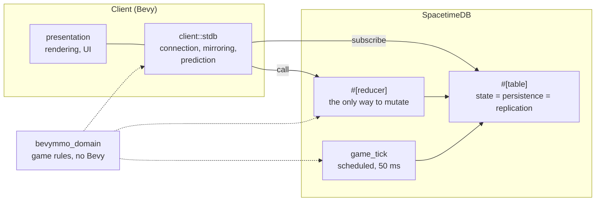

# Architecture

The authoritative server is a **SpacetimeDB module**: a Rust crate compiled to WebAssembly that runs inside the database. The client is a Bevy application that subscribes to the module's tables and calls its reducers. There is no Bevy server process and no separate persistence layer.

## Boundaries

The dotted lines are the important ones. `bevymmo_domain` holds the rules — movement, spell effects, stat formulas, item definitions — and **both sides link it**. The client's dead reckoning calls the same `step_towards` the server's tick calls. That is what stops the two from disagreeing.

| Crate | Responsibility | Bevy? | WASM? |
|---|---|---|---|
| `bevymmo_domain` | Game rules and data. The shared half. | Behind a feature | Yes |
| `crates/stdb-module` | Tables, reducers, the tick. The server. | No | Yes, only |
| `bevymmo_shared` | Bevy-facing components, resources, world loading from disk | Yes | No |
| `bevymmo_client` | Connection, row-to-entity mirroring, input, targeting | Yes | No |
| `bevymmo_presentation` | Rendering, scenes, UI | Yes | No |
| `bins/game` | Composition root. Client only. | Yes | No |

`crates/stdb-module` is deliberately **outside the Cargo workspace**: it links WASM host functions that do not exist natively, so a host build fails at link time. Build it with `spacetime build`.

## Where does a rule go?

If it has to run on the server, it goes in `bevymmo_domain` — the server is a WASM module and cannot link Bevy. If it is about rendering, input, or the ECS, it goes in `bevymmo_shared` or above.

The pressure this creates is deliberate. It is what stopped the gameplay rules from quietly growing a dependency on the engine.

## State flow

1. A player clicks. `client::stdb` calls the `move_to` reducer.
2. The reducer validates the caller with `ctx.sender()` and writes `game_entity.move_target`. There is no entity to spoof: the caller *is* the key.
3. `game_tick` runs every ~50 ms, in one transaction, and advances the world.
4. Changed rows are pushed to subscribed clients.
5. The bridge writes them into the same Bevy components lightyear used to replicate — `Position`, `VitalStats`, `Inventory` — so the presentation layer never learns the transport changed.

## Prediction

SpacetimeDB provides neither prediction nor interpolation, and the tick measures ~18-19 Hz. The client therefore simulates too: every entity's destination is replicated on purpose, and the client walks towards it each frame with the shared movement function, then eases back towards the authoritative position. Beyond a threshold it snaps instead, because a genuine desync should not look like a character gliding across the map.

## Entities

`game_entity` is one table for players, enemies, bosses and dummies, because every query that matters — what is near this point, what can this spell hit — is kind-agnostic. It carries a `cell_x`/`cell_z` grid index: there is no ECS to query, so range lookups are index scans and a linear scan per mob per tick does not scale.

Static content — spell definitions, item definitions, placeable kinds — lives in `bevymmo_domain` as plain registries built once behind a `OnceLock`. They are not tables: only mutable state needs to be.

## Presentation

The renderer reads replicated state and adds local Bevy components (`Mesh3d`, materials, `Transform`). UI widgets are local views of gameplay state. `LocalPlayer` marks the entity this client controls — it replaced lightyear's `Controlled` and is inserted by the bridge when a row's owner matches the connection's `Identity`.
