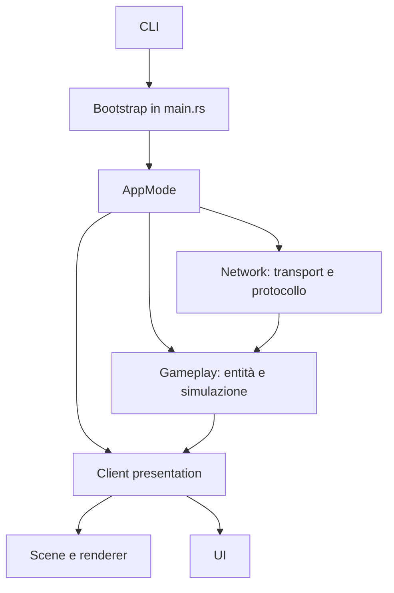

# Architettura

Il gioco usa Bevy ECS e Lightyear. Le feature sono organizzate come plugin Bevy: ogni plugin registra componenti, risorse e sistemi appartenenti a una capability osservabile.

## Confini

| Modulo | Responsabilità |
|---|---|
| `network` | Client/server Lightyear, socket, protocollo e replica. |
| `plugins/entity` | Componenti gameplay comuni, definizioni e spawn delle entità. |
| `plugins/player_movement` | Input client, simulazione autorevole e prediction del movimento. |
| `scenes` | Camera, luci e mondo statico, solo presentation client. |
| `plugins/renderer` | Mesh/materiali locali derivati dallo stato replicato. |
| `ui` | Widget client-only e loro sistemi. |

## Ruoli applicativi

`network::mode::AppMode` è la fonte di verità per i ruoli:

| Ruolo | Server | Client/presentation |
|---|---:|---:|
| `Client` | No | Sì |
| `Server` | Sì, headless | No |
| `HostClient` | Sì | Sì |

I sistemi usano `network::mode::has_server` e `network::mode::has_client` come run condition. Non dedurre il ruolo dalla presenza di una configurazione del transport: in host-client entrambe le configurazioni esistono deliberatamente.

## Entità

- `GameEntity` identifica qualsiasi entità di gameplay.
- `GameEntityBundle` aggiunge stato comune: `Health`, `Stats`, `EntityState`, `Position`, `EntityColor` e replica.
- `EntityDefinition` fornisce bundle/default statici per entità standard come enemy e NPC.
- Player aggiunge al bundle comune le componenti Lightyear che dipendono dall'owner: prediction, interpolation e `ControlledBy`.

Per aggiungere una nuova entità, consulta [create-a-new-plugin.md](create-a-new-plugin.md).

## Presentation

Il server non registra scene, renderer o UI. Il renderer legge lo stato replicato e aggiunge componenti Bevy locali (`Mesh3d`, materiali, `Transform`). La UI segue lo stesso principio: `EntityBar` è una vista locale del target gameplay e conserva riferimenti diretti ai propri elementi figli.
