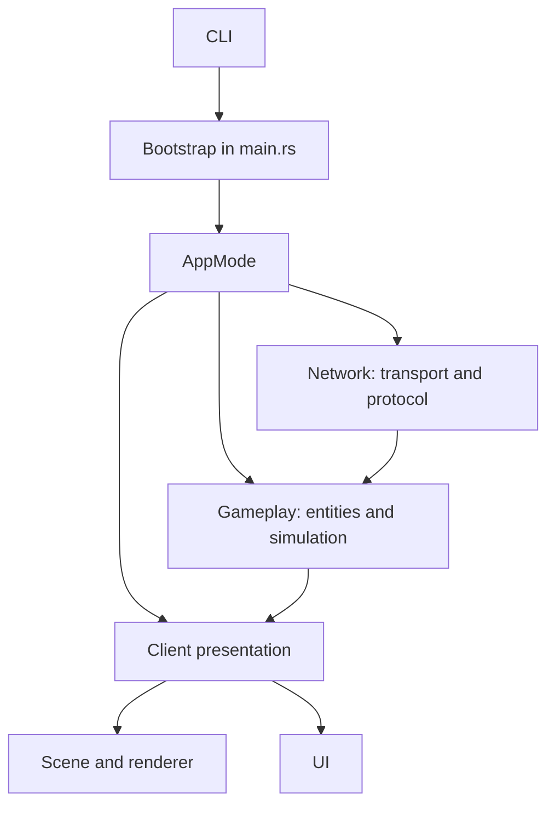

# Architecture

The game uses Bevy ECS and Lightyear. Features are organized as Bevy plugins: each plugin registers components, resources, and systems belonging to an observable capability.

## Boundaries

| Module | Responsibility |
|---|---|
| `network` | Lightyear client/server, sockets, protocol, and replication. |
| `plugins/entity` | Shared gameplay components, entity definitions and spawning. |
| `plugins/player_movement` | Client input, authoritative simulation, and movement prediction. |
| `scenes` | Camera, lights, and static world, client presentation only. |
| `plugins/renderer` | Local meshes/materials derived from replicated state. |
| `ui` | Client-only widgets and their systems. |

## Application Roles

`network::mode::AppMode` is the source of truth for roles:

| Role | Server | Client/presentation |
|---|---:|---:|
| `Client` | No | Yes |
| `Server` | Yes, headless | No |
| `HostClient` | Yes | Yes |

Systems use `network::mode::has_server` and `network::mode::has_client` as run conditions. Do not infer the role from the presence of a transport configuration: in host-client both configurations deliberately exist.

## Entities

- `GameEntity` identifies any gameplay entity.
- `GameEntityBundle` adds shared state: `Health`, `Stats`, `EntityState`, `Position`, `EntityColor`, and replication.
- `EntityDefinition` provides static bundle/defaults for standard entities like enemies and NPCs.
- Player adds Lightyear owner-dependent components to the shared bundle: prediction, interpolation, and `ControlledBy`.

To add a new entity, check [create-a-new-plugin.md](create-a-new-plugin.md).

## Presentation

The server does not register scenes, renderers, or UI. The renderer reads replicated state and adds local Bevy components (`Mesh3d`, materials, `Transform`). The UI follows the same principle: `EntityBar` is a local view of the gameplay target and holds direct references to its child elements.
