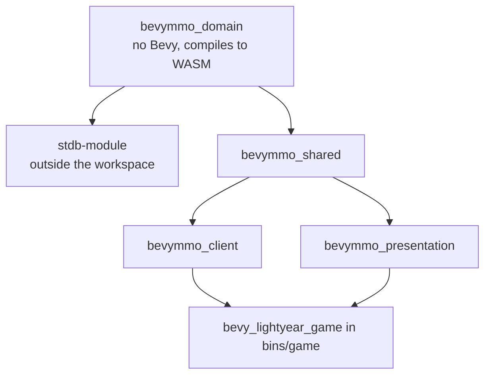

# Crates Overview

This repository is now a Cargo workspace. The old single-crate layout has been split by runtime responsibility.

## Dependency graph



`bevymmo_domain` is the only crate both halves link. `crates/stdb-module` is **not a workspace member**: it targets `wasm32-unknown-unknown` as a `cdylib` and links host functions that do not exist natively, so a host build fails at link time. Build it with `spacetime build`.

## Responsibilities

| Crate | Owns | Must not own |
|---|---|---|
| `bevymmo_domain` | The game's rules and data: stats formulas, spell/item/ability definitions and registries, movement, world manifest types. Bevy derives are behind the `bevy` feature | Bevy, filesystem, threads, the clock, the OS RNG — none exist in a WASM module |
| `crates/stdb-module` | The authoritative server: tables, reducers, the scheduled tick, world seeding | Game rules (they belong in `bevymmo_domain`, so the client can share them) |
| `bevymmo_shared` | The Bevy-facing layer: components and resources wrapping domain types, world loading from disk, user settings, screen state | Rules that the server also needs |
| `bevymmo_client` | Connection to SpacetimeDB, row-to-entity mirroring, prediction, input, targeting | Server simulation, rendering policy |
| `bevymmo_presentation` | Rendering, scenes, presentation-side spell HUD/cast bars, reusable UI widgets and screen state presentation | Sockets, DB, authoritative gameplay |
| `bins/game` | Thin composition root. Client only — the server is published, not launched | Deep domain logic |

## Source-of-truth rules

### The question to ask is "does the server need it?"

If a rule has to run authoritatively, it belongs in `bevymmo_domain` — the server is a WASM module and cannot link Bevy. That constraint is the whole reason the crate exists, and it is load-bearing: it is what keeps the gameplay rules from quietly growing a dependency on the engine.

Belongs in `bevymmo_domain`:
- stat formulas, damage mitigation, modifiers
- spell, item, ability and placeable definitions and their registries
- movement (`step_towards` is called by the server's tick *and* the client's prediction)
- world manifest types and collision queries

Belongs in `bevymmo_shared`:
- the Bevy components and resources that wrap those types
- anything touching the filesystem, the window, or the ECS
- app-local resources shared across client/presentation (`GameScreen`, `ConnectionRequest`, ...)

If a module needs windows, the filesystem, or Bevy UI trees, it does **not** belong in `bevymmo_domain`.

### Server-only features

Authoritative behaviour goes in `crates/stdb-module`, split by concern:
- `reducers/` — what a client may ask for (one module per area)
- `sim/` — the per-tick simulation: movement, combat, spells, crowd control, AI
- `tables.rs` — the schema, and the contract everything else is written against
- `world.rs` — seeding the map

Note the split: the *rules* (how much damage, what shape the AoE is) live in `bevymmo_domain`; the module owns storage, scheduling, and who is allowed to ask for what.

### Presentation-only features

Put rendering/UI in `bevymmo_presentation`:
- scenes and camera follow
- renderer mesh/material sync
- HUD/cast bar/target frame/menus

## Running the project

From the repository root:

```sh
docker compose up -d spacetimedb   # the server's host
./scripts/stdb.sh publish          # build and upload the server module
cargo run -- client                # the game
```

The workspace root uses `default-members = ["bins/game"]`, so `cargo run` keeps targeting the game binary. The module is not part of the workspace and is never built by `cargo`.

## Adding a new feature

### New shared type

Put it in `bevymmo_domain` when the server needs it — which is most gameplay data. Give it named fields if it will be stored: the `SpacetimeType` derive panics on tuple structs, so newtypes are mirrored in `crates/stdb-module/src/rows.rs` instead.

Put it in `bevymmo_shared` when only the client cares: anything about rendering, input, or the ECS.

### New authoritative gameplay system

Rules in `bevymmo_domain`, wiring in `crates/stdb-module`: a new table if it holds state, a reducer if a client triggers it, a `sim::` step if it happens every tick. Then `./scripts/stdb.sh generate` to refresh the client bindings.

### New UI or rendering widget

Put it in `bevymmo_presentation`, even if it reads replicated gameplay state.

### New input helper or client lifecycle helper

Put it in `bevymmo_client`.

## Migration status note

Some modules under `bins/game/src/` still exist as compatibility facades that `pub use` items from the new crates. This is intentional during the transition: the source of truth has already moved even if the old path still exists.
