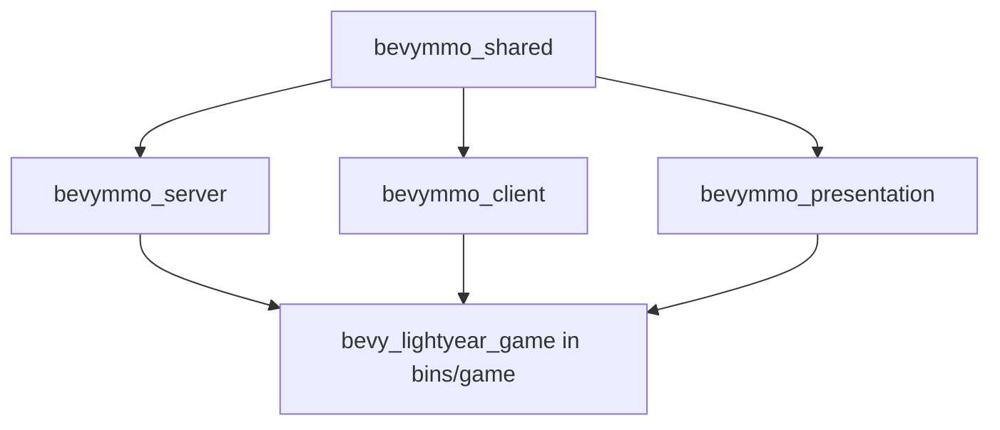

# Crates Overview

This repository is now a Cargo workspace. The old single-crate layout has been split by runtime responsibility.

## Dependency graph

## Responsibilities

| Crate | Owns | Must not own |
|---|---|---|
| `bevymmo_shared` | Pure data and shared contracts: protocol types, replicated components, spell data, stats data, entity spawn contracts, game/application state resources, map manifest types | Sockets, rendering, Bevy UI, DB runtime |
| `bevymmo_server` | Authoritative runtime: server transport, persistence, migrations, gameplay simulation, spell pipeline, boss/enemy AI, CC systems | Client windows/UI, rendering |
| `bevymmo_client` | Client-only runtime helpers: input/key mapping, targeting, client transport/lifecycle helpers | Server simulation, rendering policy |
| `bevymmo_presentation` | Rendering, scenes, presentation-side spell HUD/cast bars, reusable UI widgets and screen state presentation | Sockets, DB, authoritative gameplay |
| `bins/game` | Thin composition root for CLI modes (`client`, `server`, `host-client`) | Deep domain logic |

## Source-of-truth rules

### `shared = data only`

Anything that both sides must agree on belongs in `bevymmo_shared`:
- `AppMode`
- replicated components/messages (`Position`, `SpellCastProgress`, ...)
- gameplay DTOs (`StatsBundleData`, `SpellId`, ...)
- app-local resources shared across client/presentation (`GameScreen`, `ConnectionRequest`, ...)

If a module needs windows, sockets, DB connections, or Bevy UI trees, it does **not** belong in `shared`.

### Server-only features

Put authoritative systems in `bevymmo_server`:
- AI
- damage/heal application
- crowd control lifecycle
- projectile/AoE runtime
- persistence and migrations

### Presentation-only features

Put rendering/UI in `bevymmo_presentation`:
- scenes and camera follow
- renderer mesh/material sync
- HUD/cast bar/target frame/menus

## Running the project

From the repository root:

- `cargo run -- client`
- `cargo run -- server`
- `cargo run -- host-client`

The workspace root uses `default-members = ["bins/game"]`, so `cargo run` and `cargo build --bin game` keep targeting the game binary by default.

## Adding a new feature

### New shared type

Put it in `bevymmo_shared` when:
- server and client must serialize/replicate it, or
- both client runtime and presentation need to read it.

### New authoritative gameplay system

Put it in `bevymmo_server` and expose only the minimal API the binary needs.

### New UI or rendering widget

Put it in `bevymmo_presentation`, even if it reads replicated gameplay state.

### New input helper or client lifecycle helper

Put it in `bevymmo_client`.

## Migration status note

Some modules under `bins/game/src/` still exist as compatibility facades that `pub use` items from the new crates. This is intentional during the transition: the source of truth has already moved even if the old path still exists.
