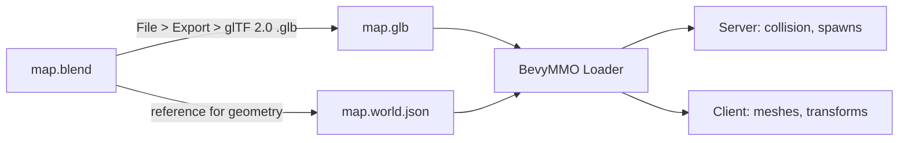

# Level Designer Guide — Authoring Maps in Blender

This is the canonical reference for the BevyMMO Level Designer. It explains
**what to build in Blender, how to name it, how to export it, and how the
engine turns it into a playable map.**

> Read this once end-to-end before opening Blender. Every convention here is
> enforced by the engine's loader (`bevymmo_shared::world::loader`) and the
> validation pipeline, so ignoring it will produce maps that fail to load.

---

## 1. The Pipeline at a Glance

A BevyMMO map is **three files** that live side by side under `assets/maps/`:

| File | Source | Contents | Authority |
|---|---|---|---|
| `<map_id>.blend` | You author this in Blender | The editable scene | Not consumed at runtime |
| `<map_id>.glb` | Exported from `.blend` | Visual meshes + map metadata node + prop nodes (each with `bevymmo_*` custom properties) | Authoritative for **visuals and prop transforms** |
| `<map_id>.world.json` | Hand-authored or generated | Walkable surfaces, heightfields, blockers, traversals, world metrics, test routes | Authoritative for **gameplay data (v2 format)** |

When the engine loads `<map_id>.glb`, it first checks for a `.world.json`
sidecar. If present, the sidecar wins: the GLB is used only for rendering,
and all gameplay data (collision, walkable surfaces, blockers) comes from
the JSON. This is the **v2 format** and the one every new map must use.



The reference example is `assets/maps/rolling_hills_test.{blend,glb,world.json}`.
Open all three side by side when learning the format.

---

## 2. Coordinate System & Units

These conventions are **non-negotiable**. They are baked into the movement
system, the camera, the collision grid, and the replication protocol.

### 2.1 Axes

| Axis | Meaning |
|---|---|
| **+X** | East |
| **+Y** | **Up** (height above the ground plane) |
| **+Z** | South (Blender's `-Z` is North; engine uses `+Z` forward as South for camera conventions) |

The ground is the plane **`y = 0`**. Every walkable surface is sampled in the
XZ plane and queried for a height along Y.

### 2.2 Scale

> **1 Blender unit = 1 game world unit = 1 meter.**

Set this in Blender before doing anything else:

1. `Scene Properties > Unit System`: **Metric**
2. `Scene Properties > Length`: **Meters**
3. `Scene Properties > Unit Scale`: **`1.0`**
4. `N > Item > Dimensions` should display values you expect in meters
   (e.g. a player capsule 1.7 m tall, a tree 8 m tall).

### 2.3 Reference Anchors

Always model with **world origin at the geometric centre of the map**. The
map metadata node records `MapBounds` as `min_x / max_x / min_z / max_z`,
and the engine assumes the origin is the centre.

For reference sizes when blocking out:

| Object | Recommended size |
|---|---|
| Player capsule | radius `0.35`, height `1.7`, eye at `1.6` |
| Doorway | min width `1.4 m`, min height `2.2 m` |
| Stairs step | max height `0.45 m` (the `WorldMetrics.max_step_height`) |
| Walkable slope | max `45°` (the `WorldMetrics.max_walkable_slope_deg`) |
| Standard prop (tree, lamp) | base footprint `~1 m` |

These numbers come from `WorldMetrics::default()` in
`crates/shared/src/world/manifest.rs`. If a map overrides metrics, document
it in `display_name` (e.g. `"Low Gravity Arena"`).

---

## 3. Object Naming Conventions

The engine identifies an object's role by the **name prefix** of its Blender
object. Names are case-sensitive and use `UPPERCASE_PREFIX_SnakeCase`.

| Prefix | Meaning | Lives in | Engine behaviour |
|---|---|---|---|
| `__bevymmo_map_meta` | The map metadata node | GLB only | Provides `map_id`, `display_name`, `bounds`. Not rendered. |
| `WALKABLE_*` | A walkable surface mesh | GLB + JSON `surfaces[].object` | Sampled by the height query system; player walks on it. |
| `BLOCKING_*` | An invisible collision volume | GLB + JSON `blockers[].object` | Stops movement; not rendered by the client. |
| `TRAVERSAL_*` | A ramp or stairwell segment | GLB + JSON `traversals` | Lets the player transition between two surfaces. |
| *(any other name)* | A regular prop | GLB only (extras) | Rendered + optional collision via `bevymmo_*` extras. |

### 3.1 Rules

1. **One prefix per object.** A mesh is either a `WALKABLE_*` or a
   `BLOCKING_*`, never both. Layered walkable + blocking is done with two
   objects at the same location.
2. **`WALKABLE_*` objects must be single-user mesh data.** Linked duplicates
   confuse the heightfield sampler.
3. **`BLOCKING_*` objects have no material requirements.** They are
   invisible at runtime; give them a bright wireframe material in Blender so
   they are easy to inspect.
4. **Never rename** a `WALKABLE_*` / `BLOCKING_*` object after the
   `.world.json` has been written. The sidecar references objects by name
   (`surfaces[].object`, `blockers[].object`); renaming breaks the link.

### 3.2 Recommended Sub-Naming

| Pattern | Use |
|---|---|
| `WALKABLE_Ground_Main` | The primary flat or rolling ground plane |
| `WALKABLE_Plateau_North` | A raised flat area the player can stand on |
| `WALKABLE_Roof_House_01` | A walkable rooftop |
| `BLOCKING_North_Map_Edge` | An invisible wall sealing the map border |
| `BLOCKING_House_01_Walls` | Walls of a building that block movement but are visually modelled elsewhere |
| `BLOCKING_Ridge_Too_Steep` | A slope that is too steep to walk (steeper than `max_walkable_slope_deg`) |
| `TRAVERSAL_Stairs_Tower_01` | A staircase connecting two `WALKABLE_*` surfaces |

---

## 4. The Map Metadata Node

Every map GLB must contain **exactly one** node named `__bevymmo_map_meta`
(or `__bevymmo_map_meta__`). It is an **Empty** (no mesh) carrying the
map-level custom properties.

### 4.1 How to Create It

1. `Add > Empty > Plain Axes`
2. Rename the object to `__bevymmo_map_meta`
3. Place it at the world origin `(0, 0, 0)` with no rotation/scale
4. Add the following **Custom Properties** (Object Properties > Custom
   Properties > Add, then `Edit` to set name/type/default):

| Property name | Type | Example | Notes |
|---|---|---|---|
| `bevymmo_map_id` | String | `"rolling_hills_test"` | Must match the filename and `[A-Za-z0-9_-]+`. Used for DB keys. |
| `bevymmo_display_name` | String | `"Rolling Hills Test Map"` | Human-facing name shown in menus. |
| `bevymmo_min_x` | Float | `-22.0` | Map bounds, X minimum |
| `bevymmo_max_x` | Float | `22.0` | Map bounds, X maximum |
| `bevymmo_min_z` | Float | `-22.0` | Map bounds, Z minimum |
| `bevymmo_max_z` | Float | `22.0` | Map bounds, Z maximum |

### 4.2 Why an Empty and Not a Mesh

The metadata node carries data only. The loader keys on its **name** and its
`extras.bevymmo_*` payload; geometry would be wasted bytes and could be
wrongly parsed as a prop.

### 4.3 Bounds Semantics

`bounds` describes the **playable rectangle on the XZ plane**. Out-of-bounds
should be sealed by `BLOCKING_*` objects (see §6). The loader rejects any
prop whose XZ translation falls outside `bounds`.

---

## 5. Authoring Props (Visible World Objects)

A "prop" is anything that should appear in the world and optionally block
movement: trees, rocks, houses, lamps, fences, statues, crates. Props are
**driven entirely by the GLB**; the `.world.json` does not list them.

### 5.1 The `kind` Property

Each prop must declare which **placeable kind** it is. The kind is a logical
id registered in the placeable catalog (`crates/shared/src/placeables_impl/`),
**not** a file path.

Examples of valid kinds:

| Kind id | Catalog location | Category |
|---|---|---|
| `tree_oak` | `placeables_impl/props/tree_oak.rs` | Prop |
| `rock_01`, `rock_02` | `placeables_impl/props/rock_01.rs` | Prop |
| `house_simple` | `placeables_impl/props/house_simple.rs` | Prop |
| `mob_goblin` | `placeables_impl/creatures/goblin.rs` | Creature (enemy spawn) |
| `boss_dragon` | `placeables_impl/creatures/boss_dragon.rs` | Creature (boss spawn) |
| `player_spawn` | `placeables_impl/creatures/player_spawn.rs` | Creature (player start) |
| `merchant` | `placeables_impl/npcs/merchant.rs` | NPC |
| `treasure_chest`, `wooden_door` | `placeables_impl/interactables/` | Interactable |
| `copper_vein` | `placeables_impl/resources/copper_vein.rs` | Resource node |
| `pvp_zone`, `safe_zone`, `teleport_*` | `placeables_impl/triggers/` | Trigger |

> If you need a kind that does not exist yet, ask a programmer to add a
> definition file. Do **not** invent ids — the loader validates every `kind`
> against the registry and rejects unknown ones.

### 5.2 Custom Properties on a Prop Object

Blender writes custom properties to glTF `extras` with the exact key names
you give them. The engine reads them with the `bevymmo_` prefix (flat
format). Required and optional properties:

| Property | Type | Required | Meaning |
|---|---|---|---|
| `bevymmo_kind` | String | **Yes** | Logical placeable id, e.g. `"tree_oak"`. |
| `bevymmo_id` | String | No | Stable id for this placement. Leave empty to auto-generate `prop_NNN`. Set it explicitly for objects referenced by triggers/scripts. |
| `bevymmo_blocks_move` | Bool (0/1) | No | Default `0`. If `1`, the prop blocks movement on the server collision grid. |
| `bevymmo_collision` | String | No | `"cylinder"`, `"box"`, `"sphere"`, or `"none"`. Required if `bevymmo_blocks_move` is `1`. |
| `bevymmo_radius` | Float | No | Used by `cylinder` and `sphere`. In metres. |
| `bevymmo_height` | Float | No | Used by `cylinder`. Full height in metres (not half). |
| `bevymmo_half_extents` | String | No | Used by `box`. Three comma-separated floats, e.g. `"0.5,1.0,0.5"`. |
| `bevymmo_tint` | String | No | Optional linear RGB multiplier, e.g. `"0.2,0.5,0.2"`. |

### 5.3 Worked Example: An Oak Tree

Object name: `Tree_Oak_01`
Object type: Empty parent containing the trunk + foliage meshes as children
(instances are fine).

Custom properties on the parent Empty:

```
bevymmo_kind         = "tree_oak"
bevymmo_id           = "tree_oak_village_01"
bevymmo_blocks_move  = 1
bevymmo_collision    = "cylinder"
bevymmo_radius       = 0.3
bevymmo_height       = 2.5
bevymmo_tint         = "0.25,0.55,0.20"
```

The engine reads the Empty's transform for placement and the
`tree_oak.glb` scene (registered in the catalog) for visuals. The cylinder
collision is centred on the Empty's XZ position with height extending along Y.

### 5.4 Pivots

- The object's **origin** is its placement point. Put the origin on the
  ground plane (`y = 0`) for things that sit on the floor.
- For walls and fences, put the origin at the centre of the collision box.
- Avoid parenting props to scaled empties — the engine reads the **world
  transform**, which compounds parent scale.

### 5.5 Instancing

Use **Linked Duplicates** (`Alt+D`) freely for visuals, but be aware the
engine flattens each instance into its own `Prop` (one entry per
`bevymmo_*` object in the GLB). For forests, prefer Bevy-side instancing
via the catalog over thousands of GLB nodes — talk to a programmer if a
map exceeds ~2000 props.

---

## 6. Walkable Surfaces (Height-Aware Movement)

A walkable surface is a mesh the player can stand on. Its **geometry**
lives in the GLB; its **gameplay metadata** lives in `.world.json` under
`surfaces[]`.

### 6.1 Three Surface Kinds

| `kind` | Use | Required fields in JSON |
|---|---|---|
| `"flat"` | A perfectly flat area at a known height (a plateau, a rooftop) | `bounds`, `height` |
| `"flat_mesh"` | A flat area whose visual is a mesh but whose walk height is constant | `object`, `bounds`, `height` |
| `"mesh"` | A real 3D mesh with variable height (rolling terrain, stairs-shaped terrain) | `object`, `heightfield` |

### 6.2 Mesh Surfaces and Heightfields

For a `"mesh"` surface the engine needs a **heightfield** — a regular grid
of height samples. The player's height at `(x, z)` is bilinearly
interpolated from the four surrounding samples
(see `HeightfieldData::sample_height` in `manifest.rs`).

**To produce a heightfield from a Blender mesh:**

1. Model the terrain as a single mesh, name it `WALKABLE_<Area>_LowPoly`.
2. Keep the mesh **low-poly and grid-regular** where possible (use
   `Subdivide` on a plane with constant grid spacing). The engine does not
   need the visual mesh and the heightfield to be the same resolution, but
   generating the heightfield from a grid-aligned mesh is trivially
   scriptable.
3. The heightfield's `resolution` is the number of **cells** per side; the
   sample grid has `(resolution + 1) * (resolution + 1)` vertices.
4. The heightfield's `bounds` must match the mesh's XZ footprint exactly.
5. Heights are stored **row-major, Z varies fastest** (i.e. iterating
   `for z in 0..=res { for x in 0..=res { heights[z * stride + x] } }`).

A small Python helper is recommended for exporting the heightfield JSON
from the selected mesh (see §10 for a starter script).

### 6.3 Multiple Surfaces

A map can have several walkable surfaces. They **must not overlap** on the
XZ plane — the engine picks one surface per query; overlapping surfaces
produce undefined results. Use `TRAVERSAL_*` objects (see §7) to bridge
them.

### 6.4 Recommended Surface Layout

For a typical outdoor map:

```text
WALKABLE_Ground_Main          (mesh, the rolling terrain)
WALKABLE_Plateau_North        (flat_mesh, a raised platform)
WALKABLE_Roof_House_01        (flat_mesh, a rooftop)
```

Each gets its own entry in `.world.json > surfaces[]`.

---

## 7. Traversals (Ramps and Stairs)

A traversal is a logical link between two walkable surfaces that lets the
player move between them. Without a traversal, the height sampler will
snap the player to whichever surface they were last on, and the boundary
between two surfaces will feel like a wall.

### 7.1 Authoring

Traversals are **data only** in `.world.json`. You do not need a Blender
object for them, but you may add a `TRAVERSAL_*` helper object for visual
reference (it will be ignored by the loader unless you give it prop extras).

```json
{
  "id": "traversal_stairs_tower_01",
  "kind": "stairs",
  "start": [10.0, 0.0, 5.0],
  "end":   [10.0, 4.0, 8.0],
  "width": 2.0,
  "start_surface": "WALKABLE_Ground_Main",
  "end_surface":   "WALKABLE_Roof_Tower_01"
}
```

| Field | Type | Notes |
|---|---|---|
| `id` | String | Stable unique id within the map |
| `kind` | `"ramp"` or `"stairs"` | Affects animation/footstep, not movement math |
| `start` / `end` | `[x, y, z]` | World-space endpoints. `y` is the height at each end. |
| `width` | Float | How wide the walkable corridor is, in metres |
| `start_surface` / `end_surface` | String (optional) | Object names of the two surfaces being linked |

Validation requires `width > 0` and a non-negligible horizontal distance
between `start` and `end`.

---

## 8. Blockers (Invisible Collision Walls)

A blocker is an invisible volume that prevents movement. It is the primary
tool for sealing map edges, blocking off steep slopes, and preventing the
player from walking through walls whose visuals are modelled separately.

### 8.1 Authoring in Blender

1. Create a mesh (typically a thin box or a cylinder) sized to cover the
   area you want to block.
2. Name it `BLOCKING_<Descriptive_Name>` (e.g. `BLOCKING_North_Map_Edge`).
3. Give it a bright, distinctive material so it's easy to see while editing.
   The client will not render it.
4. Repeat for every blocker region.

### 8.2 Registering in `.world.json`

```json
{
  "id": "blocker_north_edge",
  "kind": "box",
  "object": "BLOCKING_North_Map_Edge"
}
```

| Field | Notes |
|---|---|
| `id` | Stable unique id |
| `kind` | `"box"` (axis-aligned) or `"cylinder"` |
| `object` | **Exact** Blender object name. The engine reads its world transform to derive the volume. |

> The engine currently uses the **axis-aligned bounding box** of the named
> mesh. For non-axis-aligned walls, model the blocker as a thin axis-aligned
> slab, or split it into multiple blockers.

### 8.3 Common Blocker Patterns

| Need | Solution |
|---|---|
| Seal the map border | Four thin boxes: `BLOCKING_{North,South,East,West}_Map_Edge` |
| Block a too-steep slope | A box covering the steep face: `BLOCKING_Ridge_Too_Steep` |
| Block a cliff | A box at the cliff base: `BLOCKING_Mountain_North_Cliff` |
| Block a building wall | One box per wall face, or a single box covering the building footprint if interior is inaccessible |

---

## 9. GLB Export Settings

Export via `File > Export > glTF 2.0 (.glb)`. Use **exactly** these settings;
the loader is permissive but wrong settings silently break transforms.

### 9.1 Required Settings

| Section | Setting | Value |
|---|---|---|
| Include > Limit to | (leave unticked, or tick if you have a clean selection) | |
| Include > Selection Only | Off | Export everything (the meta node must be present) |
| Transform > +Y Up | **Off** (the engine uses Y up natively; Blender's default is already Y up) | |
| Transform > Apply Modifiers | **On** | |
| Data > Mesh > Apply | **On** | |
| Data > Object > Apply | **On** (so empties with custom properties are exported as nodes) | |
| Data > Custom Properties | **On** | **Critical.** Without this, `bevymmo_*` extras are lost. |
| Data > Camera / Punctual Lights | Off | Not used by the engine. |
| Animation | Off | Not used by the engine. |

### 9.2 File Format

- **Format**: `glTF Binary (.glb)`
- **Filename**: `<map_id>.glb`, lowercase, no spaces.
- **Path**: `assets/maps/<map_id>.glb`

### 9.3 Verify the Export

After exporting, open the `.glb` in any glTF inspector (e.g. the glTF
Validator at <https://github.khronos.org/glTF-Validator/>) and check:

1. There is exactly one node named `__bevymmo_map_meta`.
2. That node has `extras` containing `bevymmo_map_id`,
   `bevymmo_display_name`, and the four bound fields.
3. Each prop object has `extras.bevymmo_kind`.
4. `WALKABLE_*` and `BLOCKING_*` objects are present as nodes with their
   transforms intact.

If `extras` are missing, re-export with **Data > Custom Properties = On**.

---

## 10. The `.world.json` Sidecar

This is the authoritative gameplay file for v2 maps. It is a JSON
serialization of `MapManifest` (see `crates/shared/src/world/manifest.rs`
for the full schema).

### 10.1 Skeleton

```json
{
  "version": 2,
  "map_id": "my_new_map",
  "display_name": "My New Map",
  "unit_convention": "1 Blender unit = 1 game world unit = 1 meter",
  "bounds": { "min_x": -20.0, "max_x": 20.0, "min_z": -20.0, "max_z": 20.0 },
  "world_metrics": {
    "player_radius": 0.35,
    "player_height": 1.7,
    "eye_height": 1.6,
    "max_step_height": 0.45,
    "max_walkable_slope_deg": 45.0
  },
  "surfaces": [],
  "traversals": [],
  "blockers": [],
  "test_route": [],
  "test_checklist": [],
  "mountain_switchback_test": null,
  "distant_plateau_test": null
}
```

> The `version`, `map_id`, `display_name`, `bounds`, and `world_metrics`
> fields mirror what's in the GLB metadata node. Keep them in sync by
> convention; if they disagree the JSON wins.

### 10.2 Field Reference (Authoring-Relevant)

| Field | Type | Notes |
|---|---|---|
| `version` | u32 | **Must be `2`** for new maps. |
| `map_id` | String | Same `[A-Za-z0-9_-]+` rules as the GLB. Must match filename. |
| `display_name` | String | Free-form, shown in menus. |
| `bounds` | `MapBounds` | Playable XZ rectangle. |
| `world_metrics` | `WorldMetrics?` | Optional; omit to use defaults. Override per-map with care. |
| `surfaces` | `Vec<WalkableSurface>` | See §6. |
| `traversals` | `Vec<TraversalData>` | See §7. |
| `blockers` | `Vec<BlockerData>` | See §8. |
| `test_route` | `Vec<TestRoutePoint>` | Optional QA walking route. |
| `test_checklist` | `Vec<String>` | Optional human-readable QA notes. |
| `mountain_switchback_test` | `Option<SwitchbackTest>` | Optional steep-traversal QA fixture. |
| `distant_plateau_test` | `Option<PlateauTest>` | Optional plateau-reach QA fixture. |

### 10.3 Naming Sync Check

The sidecar references Blender objects **by name** in two places:

- `surfaces[].object` must match a `WALKABLE_*` Blender object.
- `blockers[].object` must match a `BLOCKING_*` Blender object.

The loader does not validate these references automatically today; a typo
will silently produce a missing surface/blocker at runtime. Always
double-check after renaming.

---

## 11. End-to-End Workflow

A complete authoring pass for a new map called `village_square`:

1. **Create the `.blend`**
   - File > New
   - Configure units (§2.2)
   - Save as `assets/maps/village_square.blend`

2. **Add the metadata node**
   - Add Empty, rename to `__bevymmo_map_meta`
   - Add the six `bevymmo_*` custom properties (§4.1)

3. **Block out the ground**
   - Model the main walkable terrain as `WALKABLE_Ground_Main`
   - Add raised areas as `WALKABLE_Plateau_*`

4. **Block out the edges**
   - Four `BLOCKING_*_Map_Edge` boxes sealing the border
   - Any additional blockers for cliffs or buildings

5. **Place props**
   - Trees, houses, lamps as empties + child meshes
   - Add `bevymmo_kind` and (optionally) collision props to each (§5.2)
   - Place at least one `player_spawn`

6. **Generate the heightfield JSON**
   - Select each `WALKABLE_*` mesh and run the helper script (§10 starter)
   - Paste the resulting `heightfield` block into the corresponding
     `surfaces[]` entry

7. **Author `.world.json`**
   - Copy the skeleton (§10.1)
   - Fill in `surfaces`, `traversals`, `blockers`
   - Save as `assets/maps/village_square.world.json`

8. **Export the GLB**
   - File > Export > glTF 2.0 (.glb) with the settings from §9.1
   - Save as `assets/maps/village_square.glb`

9. **Load and test in-engine**
   - `cargo run -- editor`
   - `Ctrl+O`, pick `village_square.glb`
   - Walk around in `cargo run -- host-client` and verify collision,
     walkable heights, and prop placement

10. **Iterate**
    - Edit `.blend` → re-export GLB → reload in editor
    - Edit `.world.json` directly for surface/blocker tweaks (no Blender
      round-trip needed)

---

## 12. Validation & QA

### 12.1 Loader Validation

The loader (`validate_structure` in `loader.rs`) rejects maps with:

- Wrong `version` (not `1` or `2`).
- Empty or invalid `map_id` / `display_name`.
- `bounds` with `min >= max` on any axis.
- Terrain with non-positive scale on any axis.
- Duplicate prop ids.
- Prop ids with characters outside `[A-Za-z0-9_-]`.
- Props with non-positive scale.
- Props placed outside `bounds` (XZ check).

The richer `validate` (used by the editor) also checks each prop's `kind`
against the placeable registry.

### 12.2 Author QA Checklist

Author these into `test_checklist` and walk through them in `host-client`:

- [ ] Player can walk from one corner of the map to the opposite corner
      without leaving `bounds`.
- [ ] Player cannot walk off any edge of the map (every edge has a
      `BLOCKING_*`).
- [ ] Every prop with `bevymmo_blocks_move = 1` actually blocks movement.
- [ ] Every `WALKABLE_*` surface can be stood on; player height matches
      the surface.
- [ ] Every `TRAVERSAL_*` smoothly transfers the player between its two
      surfaces.
- [ ] No props are floating (origins at `y = 0` unless intentional).
- [ ] `player_spawn` exists and is on a walkable surface.

### 12.3 Using `test_route`

`test_route` is a list of `{x, z, height}` points the QA pass should be
able to walk in order. The engine can run an automated bot along this
route. Author at least one for every map.

---

## 13. Common Pitfalls

| Symptom | Likely Cause | Fix |
|---|---|---|
| Map fails to load with "missing `__bevymmo_map_meta` node" | Meta node missing or renamed | Add the Empty (§4.1), check spelling |
| Map fails to load with "missing required bevymmo extras" | Custom properties not exported | Tick **Data > Custom Properties** in export (§9.1) |
| Props appear but have no collision | `bevymmo_blocks_move` not set, or `bevymmo_collision` wrong type | Set both (§5.2) |
| Player falls through the ground | `WALKABLE_*` mesh missing or not registered in `surfaces[]` | Add the surface entry (§6) |
| Player snaps to wrong height at surface boundary | Overlapping `WALKABLE_*` surfaces | Split them or add a `TRAVERSAL_*` |
| Prop kind rejected as "unknown" | `bevymmo_kind` does not match a catalog id | Check the catalog (`placeables_impl/`) |
| GLB file is huge | Modifiers not applied, or high-poly meshes | Apply modifiers in export, or decimate |
| Visual prop and collision out of sync | Parented scaled Empty | Move collision onto the mesh, or reset parent scale |
| `BLOCKING_*` does not block | Object name in JSON does not match Blender name | Fix typo, re-export |
| Prop disappears after export | Object hidden in viewport or render | Unhide in Outliner, re-export |

---

## 14. Reference: The `rolling_hills_test` Map

The reference map at `assets/maps/rolling_hills_test.{blend,glb,world.json}`
exercises every feature:

- **Bounds**: `-22..22` on both axes.
- **Walkable surfaces**: 4 surfaces, including a `"mesh"` rolling-terrain
  with a 32×32 heightfield (1089 samples).
- **Blockers**: 11 boxes sealing edges, cliffs, and steep slopes.
- **Test routes**: `test_route`, `mountain_switchback_test`, and
  `distant_plateau_test` cover the three hardest movement scenarios.

When in doubt, diff your map's `.world.json` against this one. The
structure is identical; only the numbers should differ.

---

## 15. Starter Script: Export a Heightfield from a Selected Mesh

Save as `export_heightfield.py` and run from Blender's Text Editor with the
target `WALKABLE_*` mesh selected. It prints the JSON `heightfield` block
to the system console.

```python
"""Prints a bevymmo heightfield JSON block for the selected mesh."""

import bpy, bmesh, math, json

RESOLUTION = 32  # cells per side; samples = (res + 1) ** 2

def main():
    obj = bpy.context.active_object
    if obj is None or obj.type != 'MESH':
        print("Select a MESH object first")
        return

    # Read world-space bounds on XZ
    xs = [v[0] for v in obj.bound_box]
    zs = [v[2] for v in obj.bound_box]
    min_x = obj.matrix_world @ min(xs)  # naive; replace with proper bbox
    # Proper bounds from evaluated mesh:
    mesh = obj.evaluated_get(bpy.context.evaluated_depsgraph_get()).to_mesh()
    coords = [obj.matrix_world @ v.co for v in mesh.vertices]
    min_x = min(c.x for c in coords); max_x = max(c.x for c in coords)
    min_z = min(c.z for c in coords); max_z = max(c.z for c in coords)

    cell_x = (max_x - min_x) / RESOLUTION
    cell_z = (max_z - min_z) / RESOLUTION

    # Raycast straight down from above each grid sample
    heights = []
    from mathutils import Vector
    for z in range(RESOLUTION + 1):
        for x in range(RESOLUTION + 1):
            wx = min_x + x * cell_x
            wz = min_z + z * cell_z
            origin = Vector((wx, 1000.0, wz))
            direction = Vector((0.0, -1.0, 0.0))
            ok, _, _, _, hit, _ = obj.ray_cast(
                obj.matrix_world.inverted() @ origin,
                obj.matrix_world.inverted().to_3x3() @ direction,
            )
            heights.append(round(hit.y, 4) if ok else 0.0)

    obj.to_mesh_clear()

    block = {
        "id": "surface_" + obj.name.replace("WALKABLE_", "").lower(),
        "kind": "mesh",
        "object": obj.name,
        "heightfield": {
            "resolution": RESOLUTION,
            "bounds": {
                "min_x": round(min_x, 4),
                "max_x": round(max_x, 4),
                "min_z": round(min_z, 4),
                "max_z": round(max_z, 4),
            },
            "heights": heights,
        },
    }
    print(json.dumps(block, indent=2))

main()
```

Adjust `RESOLUTION` to match the mesh's detail. Always sanity-check the
printed `bounds` against the visual footprint before pasting into
`.world.json`.

---

## 16. Where to Ask

- **New placeable kinds** (props, enemies, triggers): open a ticket for a
  programmer; they live in `crates/shared/src/placeables_impl/`.
- **Schema changes** (new surface type, new traversal kind): discuss in
  `plans/map-editor.md` first; the schema is shared by server and client.
- **Loader bugs**: the loader is at `crates/shared/src/world/loader.rs`.
  Attach the failing `.glb` and the loader's error message.

Happy mapping.
