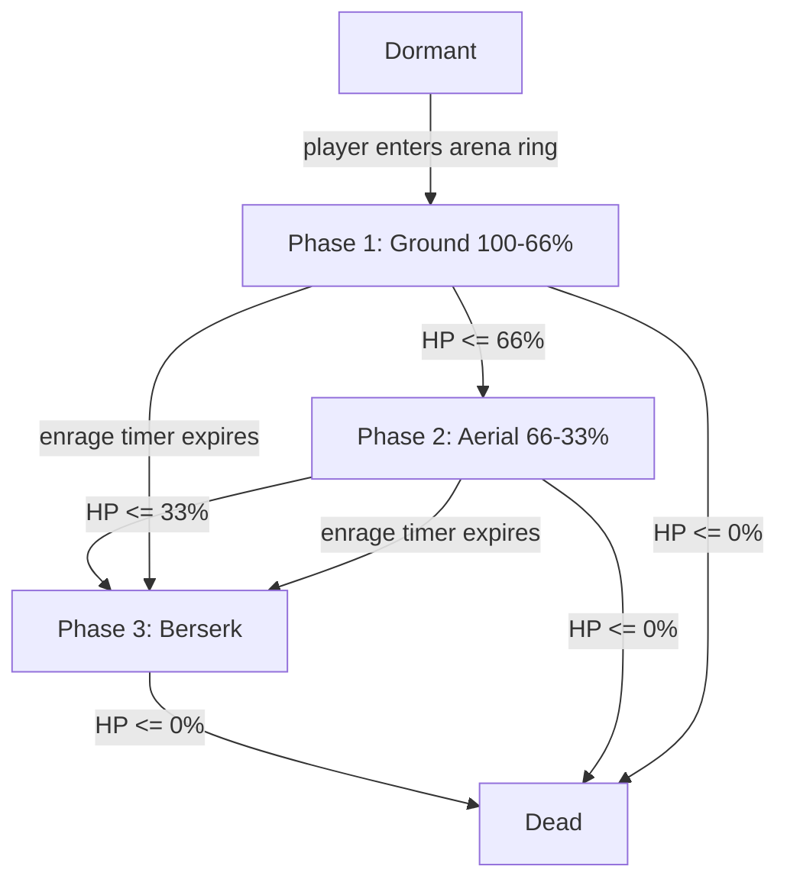
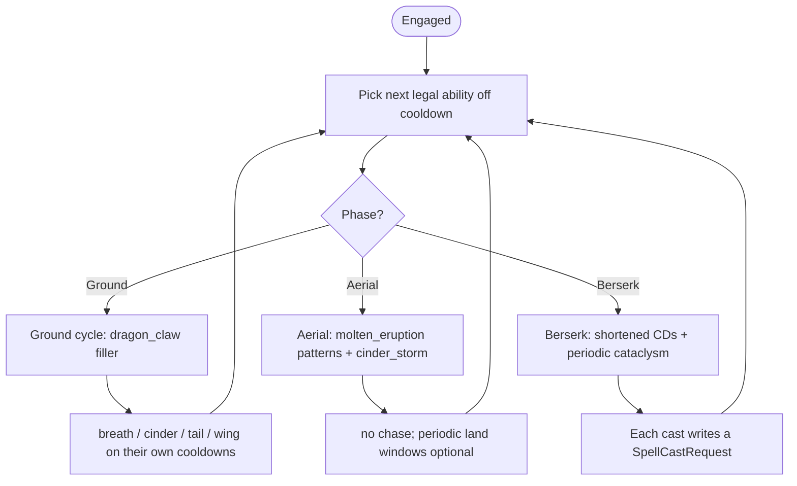

# Plan: Boss — Vermithrax, the Ashen Drake (Dragon)

A complex AoE-focused dragon boss with HP phases, berserk enrage, a threat-based
target-selection AI, and a red arena trigger zone that starts the encounter.
Every spell has a fully specified telegraph → impact → linger animation.

## Goal

Add a single, replayable boss encounter to the game that demonstrates the full
depth of the existing combat systems (cast-time, channeling, AoE regions, crowd
control, stat modifiers, threat) without inventing new frameworks.

Concrete deliverables:

1. A new `Boss` entity (dragon) spawned server-side, fully replicated.
2. A **red trigger zone** in the scene. A player stepping into it aggros the
   boss and starts the encounter.
3. A **threat table** + smart target selection (highest threat, farthest,
   densest cluster).
4. **HP phases** (Ground → Aerial → Berserk) with distinct ability sets.
5. A **berserk enrage** (low-HP trigger + hard timer).
6. A roster of **mostly-AoE dragon spells**, each under
   `src/spells/dragon_enemy/<spell>/`, with telegraphs and a coherent rotation.
7. Client presentation: arena ring, dragon mesh, phase banner, boss health bar.

Fantasy: **Vermithrax, the Ashen Drake** — an ancient fire dragon sleeping in a
circular ash arena. Walking into the red ring wakes it.

---

## Current Architecture (relevant recap)

Grounded in the actual code, so the plan slots in cleanly.

| Concept | Location | Why it matters for the boss |
|---|---|---|
| New entity recipe | `src/plugins/entity/<name>/{mod,components,spawn,systems}.rs` | Boss follows the exact `Enemy` plugin layout. |
| `EntityDefinition` trait | `entity/definition.rs` + `spawn.rs` (`spawn_entity::<T>()`) | Gives the boss `GameEntityBundle`, stats, `Replicate`, `EntityKind::Hostile` for free. |
| `EntityKind::Hostile` | `entity/components.rs` | Already exists and the doc comment literally mentions "boss". |
| Server spawn at startup | `network/server.rs` `spawn_demo_enemy` | Where the boss is spawned (server-only). |
| Spell trait + registry | `plugins/spells/context.rs` (`Spell`), `registry.rs` (`SpellRegistry`), `systems.rs::register_builtin_spells` | Boss abilities are normal `Spell` impls in `src/spells/dragon_enemy/<name>/`. |
| Cast pipeline | `systems.rs::process_cast_requests` → `advance_cast_progress` → `fire_spell` | Boss AI just emits `SpellCastRequest` messages, exactly like `enemy_auto_cast_attack`. |
| Generic AoE regions | `plugins/spells/aoe.rs` (`AoeRegion` + `update_aoe_regions`) + `AoeEffect`/`AoeSpawnRequest` | All boss AoE reuses this; no new AoE engine needed. |
| Crowd control | `plugins/crowd_control/` (`CrowdControlKind::Stun`, `ApplyCrowdControlEvent`) | Tail Sweep / Wing Buffet knockbacks model as short Stun or as a future Knockback kind. |
| Stat modifiers | `stats::events::ApplyStatModifierEvent` | Used for berserk (attack power + cast speed) and slow debuffs. |
| Replicated components | `network/protocol.rs` (`ProtocolPlugin`) | New boss components (`BossPhase`, `BossArena`) must be registered here with `.replicate()`. |
| Spell visuals | `network/protocol.rs` `SpellVisualEffect { spell_id, start, end }` + `plugins/spells/effects.rs` (`spawn_spell_visuals`) | Each boss spell adds a match arm + a `visual.rs`. |
| Visual lifecycle pattern | `spells/meteorite/visual.rs`, `spells/stun_field/visual.rs` | Marker component + `spawn(...)` + `animate(...)` registered in `effects::client_effect_systems`. |
| Cast telegraph | `SpellCastProgress` (replicated) + `plugins/spells/cast_bar.rs` | Reused to draw the breath-cone fill during CastTime. |
| Threat accrual | `stats::events::DamageEvent { target, source, amount }` | Boss threat is accrued by listening to damage **taken** by the boss. |

### Two constraints the boss forces us to confront

1. **Hotbar only has Q/W/E.** `process_cast_requests` rejects any spell not in
   the caster's `SpellHotbar` (`hotbar.contains(&request.spell_id)`). The dragon
   has 6+ abilities. See **D6** for the minimal, surgical fix.
2. **AoE regions are circles only.** There is no cone/persistent-cone primitive.
   The dragon's breath is a cone, so we model it as a CastTime that does instant
   cone damage on fire (filtering `potential_targets` by angle), with a client
   cone telegraph drawn during the cast. See **D4**.

### Spells live under `src/spells/dragon_enemy/`

To keep the dragon's kit grouped (it is one encounter, not seven unrelated
spells), all boss abilities live in a single parent module:

```
src/spells/dragon_enemy/
├── mod.rs                          # pub mod for each ability + re-exports
├── dragon_claw/{definition.rs,mod.rs,visual.rs}
├── tail_sweep/{definition.rs,mod.rs,visual.rs}
├── searing_breath/{definition.rs,mod.rs,visual.rs}
├── cinder_storm/{definition.rs,mod.rs,visual.rs}
├── wing_buffet/{definition.rs,mod.rs,visual.rs}
├── molten_eruption/{definition.rs,mod.rs,visual.rs}
└── cataclysm/{definition.rs,mod.rs,visual.rs}
```

`src/spells/mod.rs` declares `pub mod dragon_enemy;`. The registry references
them as `crate::spells::dragon_enemy::searing_breath::SearingBreathSpell`, etc.

---

## Design Decisions

### D1. The boss is a first-class entity (`Boss`), not a special-cased `Enemy`

Create `src/plugins/entity/boss/` mirroring `enemy/`. A `Boss` marker component
distinguishes it; all AI runs in `boss/systems.rs` gated by `has_server`. This
keeps the generic `Enemy` respawn/AI untouched and lets the boss carry its own
components (`BossPhase`, `BossArena`, `ThreatTable`, `BossSpellbook`).

The boss does **not** use the enemy respawn loop: on death it stays dead and
emits a `BossDefeatedEvent` (future: loot/portal). Respawn is out of scope for
v1; a manual reset command or server restart re-engages it.

### D2. The arena trigger is a replicated component on the boss, rendered as a red ring

The "red point you walk into" is the **arena ring** centered on the boss's
`SpawnPoint`. We store it once in a replicated `BossArena { center, radius,
is_engaged }` component. The server transitions the boss `Dormant → Engaged`
when any player crosses the radius; the client reads the replicated component
to draw a pulsing red ring that fades when `is_engaged` becomes true.

This avoids a second trigger entity and keeps the encounter anchored to the
boss spawn, matching `create-a-new-plugin.md`'s "one plugin = one entity".

If we later want the trigger decoupled from the boss position (e.g., a corridor
entrance), we can split it into a dedicated `BossArenaTrigger` entity later.

### D3. Threat table + 3 target-selection strategies

`ThreatTable` maps `Entity → f32` and is accrued by a server system that reads
`DamageEvent` whose `target` is the boss (adding `source`'s `amount`). This
requires **no change to the damage pipeline** — it's a passive listener, like
`mark_dead_entities`.

Target selection helpers (pure functions on the table + player positions):

- `highest_threat()` — main target for the breath, chase, and auto-attacks.
- `farthest_target()` — for "pull the backline" abilities (optional Phase 3).
- `densest_cluster(n)` — returns the centroid of the `n` most clustered living
  players (nearest-pair / smallest bounding circle heuristic). Used by **Cinder
  Storm** to punish stacking.

Threat decays slowly over time and on player death (dead players drop off). A
taunt-style multiplier is out of scope (no tank role yet).

### D4. Searing Breath is a CastTime + instant cone damage (no new AoE shape)

The generic `AoeRegion` is a circle. Adding a cone primitive would touch shared
AoE code. Instead:

- **Searing Breath** is `CastKind::CastTime` (1.5s). During the cast the client
  renders a red cone filling up in the boss's `LookDirection` (aimed at the
  highest-threat target at cast start), driven by the replicated
  `SpellCastProgress`.
- On fire, `cast()` filters `potential_targets` by **range** and **angle** to
  the boss's facing and emits direct `DamageEvent`s. No region entity needed.

This matches the existing instant-emit pattern (`AttackSpell`, `RayOfLight`).

### D5. Phases are an HP-gated state machine, with an enrage timer as a safety net



- **Phase 1 — Ground (100% → 66%):** dragon grounded, chases main threat, cycles
  breath / cinder storm / tail sweep / wing buffet.
- **Phase 2 — Aerial (66% → 33%):** dragon "takes flight" (visual: elevated
  emissive mesh, does not chase on the ground). Spams **Molten Eruption**
  patterns across the arena + Cinder Storm. Grounded melee abilities disabled.
- **Phase 3 — Berserk (33% → 0%):** hard enrage. Cast speed + attack power up
  (stat modifier). Unlocks **Cataclysm**. All cooldowns shortened.
- **Enrage timer:** if the fight exceeds `BERSERK_TIMER_SECONDS` (e.g. 180s)
  while engaged, force `Berserk` regardless of HP. Prevents stalemate.

Transitions are computed in a server system on `Changed<VitalStats>` (HP
thresholds) + a per-boss combat timer; they write the replicated `BossPhase`
component so the client can show a phase banner and restyle the boss bar.

### D6. Bypass the 3-slot hotbar with a `BossSpellbook` (minimal, surgical)

`SpellHotbar` only holds Q/W/E and `process_cast_requests` enforces membership.
Rather than reshaping the shared hotbar (which would ripple into the player
spellbook UI and replication), add a boss-only component:

```rust
#[derive(Component, Debug, Clone, Reflect, Default)]
#[reflect(Component)]
pub struct BossSpellbook {
    pub spells: Vec<SpellId>,
}
```

In `process_cast_requests`, relax the membership check to:

> spell is castable if `hotbar.contains(spell)` **or** the caster has a
> `BossSpellbook` that `contains(spell)`.

This is a ~3-line change in one shared system and a new component; it does not
disturb players or the hotbar UI. Cooldowns still apply via the shared
`SpellCooldowns`, so the boss respects its own per-spell cooldowns.

**Alternative considered (rejected for v1):** generalize `SpellHotbar` into an
arbitrary spell set. Cleaner long-term but higher blast radius — deferred.

### D7. Berserk applies the existing stat-modifier pipeline

On entering Phase 3, a server system emits an `ApplyStatModifierEvent` on the
boss: `+attack_power`, `+movement_speed` (Phase 1 only; Phase 3 is aerial so
speed is moot, but it future-proofs), and a notional "cast haste" (if/when cast
speed becomes a modifier; until then, simulate by shortening cooldowns in the AI
scheduler via a `BerserkHaste` flag). No new stat system is required for v1.

### D8. Mostly AoE, per the brief; one single-target filler

The kit is AoE-dominant. The only single-target ability is `Dragon Claw`, a
short-cooldown auto-attack on the main threat target used to keep melee
pressure and generate threat cadence between AoE casts.

### D9. Death does not auto-respawn the boss

The generic `schedule_enemy_respawn` + `enemy_respawn` systems are filtered to
`With<Enemy>`, so a `Boss` is never touched by them. On death the boss enters
`EntityState::Dead` (handled by the shared `mark_dead_entities`) and stays. A
`BossDefeatedEvent` is emitted for future hooks (UI banner, loot, respawn
button). Manual re-engage: restart server, or a future admin command.

---

## The Dragon's Kit

All numbers are starting tuning values; they live as `const`s on each spell
struct (matching `MeteoriteSpell`/`StunFieldSpell` conventions) so they are
trivial to balance.

### Abilities overview

| # | Spell ID | Cast model | Shape | Targeting | Effect | Why it's here |
|---|---|---|---|---|---|---|
| 1 | `dragon_claw` | Instant | Single | Highest threat | Moderate damage | Melee filler / threat cadence between AoE (D8). |
| 2 | `tail_sweep` | Instant | Self cone (rear arc) | Exclude facing | Small damage + 0.6s Stun | Punishes melee stacking behind the dragon. |
| 3 | `searing_breath` | CastTime 1.5s | Front cone (D4) | Aimed at highest threat | Heavy damage | The iconic dragon breath; the marquee telegraph. |
| 4 | `cinder_storm` | CastTime 2.0s | 2 delayed ground circles | Densest cluster of 2+ players (D3) | Heavy damage per circle | Spread mechanic; uses `emit_aoe_with_delay` like Meteorite. |
| 5 | `wing_buffet` | Instant | Expanding ring (self, ExcludeCaster) | Everyone in radius | Knockback + moderate damage | Repositioning pressure; pushes melee out. |
| 6 | `molten_eruption` | CastTime 1.0s → multi-circle | N delayed circles across arena | Arena pattern (grid/random) | Heavy damage per circle | Phase 2 "fill the arena with fire" while aerial. |
| 7 | `cataclysm` | Channeling | Arena-wide pulsing circle | Everyone | Ramping heavy damage per tick | Phase 3 berserk check: kill the boss or die. |

### How each maps to existing systems

- **dragon_claw / searing_breath / tail_sweep:** direct `emit_damage` after
  filtering `potential_targets` (range + angle). No `AoeRegion`.
- **cinder_storm / molten_eruption:** `ctx.emit_aoe_with_delay(center, radius,
  delay, spell_id, AoeEffect::Damage { .., targeting: ExcludeCaster })`. The
  generic `update_aoe_regions` applies the hit after the delay. Two circles for
  cinder storm, N for molten eruption (looped `emit_aoe_with_delay` calls).
- **wing_buffet:** short-lived `AoeRegion` with
  `AoeEffect::CrowdControl { kind: Stun, duration: 0.4, once_per_entity: true }`
  to model the knockback flinch (a true Knockback CC kind is future work).
- **cataclysm:** channeling spell; each tick emits an arena-wide
  `AoeEffect::Damage` region with `once_per_entity: true` so each tick hits
  once. Damage ramps with elapsed channel time.

### Rotation / Sequence

A scheduler system (`boss/systems.rs::run_boss_rotation`) holds a per-boss
`BossRotationState { next_ability_index, last_cast_seconds, phase_lockout }`
and picks the next castable ability (off cooldown + legal for the current
phase) each fixed tick, writing a `SpellCastRequest` when ready.



**Ground rotation (Phase 1)** — repeating priority list, each entry gated by its
cooldown:

1. `searing_breath` (highest threat) — every 8s.
2. `cinder_storm` (densest cluster) — every 12s.
3. `wing_buffet` — every 16s.
4. `tail_sweep` — every 10s (only if ≥2 melee in rear arc, else skip).
5. `dragon_claw` — filler whenever nothing else is ready and main target in melee range.

**Aerial rotation (Phase 2)** — `molten_eruption` every 6s (pattern alternates:
cross, ring, random clusters), `cinder_storm` every 10s. No breath/tail/wing.

**Berserk rotation (Phase 3)** — all Phase 1 abilities at 60% cooldown, plus
`cataclysm` channeled for 5s every 20s. Damage ramps each phase.

---

## Spell Animation Specifications (per ability)

Each spell's `visual.rs` follows the established pattern: a marker component
per visual layer, a `spawn(...)` function that creates the render entities with
`SpellVisual`, and an `animate(...)` system registered in
`effects::client_effect_systems` alongside the existing spell animators.

Every animation below is fully specified so an implementation pass needs no
further design decisions: meshes, exact colors (sRGB + linear emissive),
durations, easing, transform behaviors, and particle/secondary layers. All
durations are in seconds. "Y offset" is added to the world position to avoid
z-fighting with the ground plane (matches the `+0.05` convention in Meteorite).

Color reference (reused constants, defined once in
`dragon_enemy/mod.rs` so every visual stays consistent):

| Name | sRGB base color | Linear emissive |
|---|---|---|
| `ASH_RED` (warnings) | `(0.95, 0.10, 0.10)` | `(0.60, 0.05, 0.05)` |
| `FIRE_ORANGE` (impacts) | `(1.00, 0.45, 0.05)` | `(0.95, 0.40, 0.05)` |
| `EMBER_YELLOW` (core hot) | `(1.00, 0.85, 0.25)` | `(1.00, 0.70, 0.20)` |
| `SMOKE_GRAY` (aftermath) | `(0.25, 0.20, 0.18)` | `(0.05, 0.04, 0.04)` |
| `DUST_TAN` (wing buffet) | `(0.80, 0.70, 0.55)` | `(0.15, 0.13, 0.10)` |

All telegraph materials use `AlphaMode::Blend`. All impact materials use
`AlphaMode::Opaque` unless they must fade (then `Blend`).

---

### 1. `dragon_claw` — Instant melee slash

**Damage/contract:** single target, highest threat, melee range (≤3.0).
**Animation budget:** 0.35s total. No telegraph (instant), only a hit flash.

**Layers**

- `ClawSlashVisual` — a thin curved arc in front of the dragon.
  - Mesh: `Torus` minor radius `0.05`, major radius `1.2`, scaled to an arc by
    setting `scale.z = 0.25` (flattens the torus into a sliver).
  - Material: `EMBER_YELLOW`, emissive `EMBER_YELLOW`, `AlphaMode::Blend`,
    base alpha `0.85`.
  - Position: `caster_position + facing * 1.5 + Vec3::Y * 1.0`.
  - Rotation: aligned to `caster_look_direction`.
  - Lifetime: `0.35s`.
  - Behavior:
    - `t ∈ [0, 0.10]`: scale from `0.0` → `1.0` (`ease_out_cubic`), sweep
      rotation +30° around Y.
    - `t ∈ [0.10, 0.35]`: alpha `0.85` → `0.0` (`ease_in_cubic`); rotation
      continues sweeping another +60°.
  - Despawn at `t ≥ 0.35`.

- `ClawImpactSpark` (secondary) — 3 tiny spheres flung forward.
  - Mesh: `Sphere(0.08)`, material `EMBER_YELLOW`.
  - Spawn at slash origin, random velocities `±0.5` in XZ, gravity `-9.8 Y`.
  - Lifetime `0.3s`, shrink to `0.0`.

**Sound hook (future):** short sharp "shing" at `t = 0`.

---

### 2. `tail_sweep` — Instant rear cone + Stun

**Damage/contract:** rear 180° arc, range `6.0`, small damage + 0.6s Stun.
**Animation budget:** 0.5s. No telegraph (instant).

**Layers**

- `TailSweepDustRing` — a flat half-ring expanding behind the dragon.
  - Mesh: `Cylinder(Torus would be ideal)` — use `Torus` major `1.0` minor
    `0.3`, rotated flat (XZ plane), positioned at
    `caster_position - facing * 1.5 + Vec3::Y * 0.1`.
  - Material: `DUST_TAN`, emissive `DUST_TAN`, `AlphaMode::Blend`, alpha `0.6`.
  - Lifetime `0.5s`.
  - Behavior:
    - `t ∈ [0, 0.20]`: scale `0.2` → `1.0` (`ease_out_quad`) — sweep grows.
    - `t ∈ [0.20, 0.50]`: alpha `0.6` → `0.0` linear; scale holds.
  - Despawn at `t ≥ 0.50`.

- `TailSweepShockwave` (secondary) — a second, wider, fainter ring trailing the
  first.
  - Same mesh, scaled `1.3×`, alpha `0.25`, delayed start `0.08s`, lifetime
    `0.42s`, same fade.

- `DustParticles` (secondary) — 6 small `Sphere(0.06)` puffs rising behind the
  dragon, `SMOKE_GRAY`, drifting up `+1.5 Y/s`, lifetime `0.6s`.

**Sound hook (future):** low "whoosh" + gravel scrape.

---

### 3. `searing_breath` — CastTime 1.5s front cone (the marquee)

**Damage/contract:** front cone, range `14.0`, half-angle cos `0.6` (~53°),
heavy damage on fire (no region).
**Animation budget:** telegraph 1.5s (during cast) + impact 0.6s + linger 0.8s.

The visual is driven by two replicated inputs:
- `SpellVisualEffect { start = caster_position, end = caster_position + facing * RANGE }`
  emitted when the cast **fires** (used to spawn the impact layer).
- The cast-bar system already animates the fill; the cone telegraph below is
  spawned by the client **on receiving `SpellCastProgress`** for this
  `caster_network_id` + `spell_id`, and removed on `SpellCastEnded`.

**Layer A — Cone telegraph (during cast, 1.5s)**

- `BreathConeTelegraph` — a translucent red cone filling up.
  - Mesh: a custom cone built from `Cone { radius: 5.0, height: 14.0 }` (the
    half-angle ≈ 53° maps to `radius = height * tan(53°) ≈ 14.0 * 1.33`; clamp
    to `5.0` for a tighter, more readable telegraph — tunable). Lay it on its
    side: rotate `-90°` around X so the apex points toward `end` and the base
    faces forward.
  - Position: apex at dragon mouth = `caster_position + facing * 1.5 + Vec3::Y * 1.2`.
  - Material: `ASH_RED`, emissive `ASH_RED`, `AlphaMode::Blend`, alpha `0.30`.
  - Behavior tied to cast progress `p ∈ [0, 1]` (read from `SpellCastProgress.elapsed / required`):
    - **Length grows** with `p`: scale.z from `0.05` → `1.0` (`ease_out_cubic`)
      so the cone "extends" as the cast charges.
    - **Alpha pulses**: `0.30 + sin(t * 18.0) * 0.06` for urgency.
    - In the final `0.25s` of the cast, alpha ramps `0.30` → `0.55` and emissive
      lerps toward `FIRE_ORANGE` (the cone "heats up" right before fire).
  - Despawn on `SpellCastEnded` (interrupted) or hand off to Layer B (fired).

**Layer B — Mouth glow (during cast, 1.5s)**

- `BreathMouthCharge` — a small bright sphere at the dragon's mouth.
  - Mesh: `Sphere(0.25)`.
  - Material: emissive `EMBER_YELLOW`, base color `EMBER_YELLOW` alpha `0.0`
    (pure glow).
  - Position: same mouth anchor as Layer A apex.
  - Behavior: scale `0.2` → `1.0` (`ease_in_cubic`) over the full cast; in the
    final `0.25s`, scale spikes to `1.5` and emissive intensity doubles.

**Layer C — Fire impact (on fire, 0.6s)**

Spawned by `spawn(...)` when the `SpellVisualEffect` arrives (server confirms
the cast fired).

- `BreathFireCone` — the actual fire.
  - Same cone mesh as Layer A, same orientation/position.
  - Material: `FIRE_ORANGE` base alpha `0.85`, emissive `FIRE_ORANGE`,
    `AlphaMode::Blend`.
  - Behavior:
    - `t ∈ [0, 0.10]`: scale.z `0.3` → `1.0` (`ease_out_cubic`) — fire bursts out.
    - `t ∈ [0.10, 0.45]`: hold full size, alpha `0.85` → `0.55`, add
      `sin(t * 30.0) * 0.05` flicker on emissive.
    - `t ∈ [0.45, 0.60]`: alpha `0.55` → `0.0` (`ease_in_cubic`).
  - Despawn at `t ≥ 0.60`.

- `BreathEmbers` (secondary) — 20 small `Sphere(0.06)` particles streaming
  forward along `facing`.
  - Material: `EMBER_YELLOW`, emissive.
  - Velocity: `facing * (6..10) + random(±2.0 XZ)`, gravity `-3.0 Y`, lifetime
    `0.5s`, shrink to `0`.

**Layer D — Smoke linger (0.8s)**

- `BreathSmoke` — a flattened blob at the cone's mid-point fading out.
  - Mesh: `Sphere(2.0)` scaled `(1.5, 0.4, 1.5)`.
  - Material: `SMOKE_GRAY`, alpha `0.4` → `0.0` linear, drifts up `+0.5 Y/s`.
  - Lifetime `0.8s`.

**Sound hook (future):** deep inhale during cast (Layer A), roaring exhale on
fire (Layer C).

---

### 4. `cinder_storm` — CastTime 2.0s, 2 delayed ground circles

**Damage/contract:** 2 delayed circles on the densest 2-player cluster, radius
`3.0`, impact delay `1.5s`, heavy damage per circle.
**Animation budget:** cast telegraph 0.5s + per-circle warning 1.5s + impact 0.5s.

Because there are two circles, the `SpellVisualEffect.start` carries the
**centroid** and `.end` carries nothing special; each circle visual is spawned
as a child by reading the centroid. The actual per-target positions come from
the AoE regions themselves, so the client can also spawn the warning circles by
listening for the replicated `AoeRegion` entities (preferred — keeps visuals
tied to authoritative circles). Implementation choice: spawn from
`SpellVisualEffect` at the centroid for the cast bar/rear-up telegraph, and
spawn per-circle warnings from a system that watches `AoeRegion` with
`spell_id == "cinder_storm"` (single source of truth for positions).

**Layer A — Dragon rear-up (during cast, 2.0s)**

- `CinderRearUp` — a brief vertical bob on the dragon mesh (handled in
  `dragon_visual.rs`, not a separate spawn). The dragon's local mesh transform
  Y offset goes `0.0` → `+1.5` → `0.0` over the 2s cast (`ease_in_out_cubic`).
  Only active while a `SpellCastProgress` for `cinder_storm` exists.

**Layer B — Ground warning circles (per circle, 1.5s)**

- `CinderWarningVisual` — identical technique to Meteorite warning.
  - Mesh: `Cylinder(radius = AREA_RADIUS, height = 0.05)`.
  - Material: `ASH_RED`, emissive `ASH_RED`, `AlphaMode::Blend`, alpha `0.45`.
  - Position: circle center + `Vec3::Y * 0.05`.
  - Behavior (duration = impact delay `1.5s`):
    - Pulse: scale `(1 + sin(t * 8.0) * 0.04, 1, 1 + sin(t * 8.0) * 0.04)`.
    - Final `0.3s`: alpha ramps `0.45` → `0.75`, emissive lerps to `FIRE_ORANGE`.
  - Despawn at impact.

**Layer C — Fire pillar impact (per circle, 0.5s)**

- `CinderPillarVisual` — a vertical fire column erupting upward.
  - Mesh: `Cylinder(radius = AREA_RADIUS, height = 4.0)`, positioned so its
    base is at the circle center: `center + Vec3::Y * 2.0`.
  - Material: `FIRE_ORANGE`, emissive `FIRE_ORANGE`, `AlphaMode::Blend`.
  - Behavior:
    - `t ∈ [0, 0.10]`: scale.y `0.0` → `1.0` (`ease_out_cubic`) — erupts up.
    - `t ∈ [0.10, 0.35]`: hold; alpha `0.85` → `0.6`; flicker emissive.
    - `t ∈ [0.35, 0.50]`: alpha `0.6` → `0.0`, scale.y `1.0` → `1.2`.
  - Despawn at `t ≥ 0.50`.

- `CinderEmbers` (secondary) — 15 `Sphere(0.07)` particles, `EMBER_YELLOW`,
  spawned at pillar base, velocity up `(4..7) Y + random(±1.5 XZ)`, gravity
  `-6.0 Y`, lifetime `0.7s`, shrink to `0`.

**Sound hook (future):** rising whistling during warning, "whump" per pillar.

---

### 5. `wing_buffet` — Instant expanding ring + knockback (Stun 0.4s)

**Damage/contract:** expanding ring from the dragon, radius grows to `10.0`,
moderate damage + 0.4s Stun to everyone hit.
**Animation budget:** 0.45s. No telegraph (instant).

**Layers**

- `WingBuffetShockwave` — a flat expanding torus.
  - Mesh: `Torus { major: 1.0, minor: 0.4 }` laid flat (XZ plane).
  - Material: `DUST_TAN`, emissive `DUST_TAN`, `AlphaMode::Blend`, alpha `0.7`.
  - Position: `caster_position + Vec3::Y * 0.3`.
  - Lifetime `0.45s`.
  - Behavior (`R_MAX = 10.0`):
    - Scale: `radius` grows `0.5` → `R_MAX` linearly over `0.40s`; thickness
      (minor) stays visually constant by scaling minor inversely, or just let
      it stretch (acceptable). Recommended: scale major via
      `Transform::scale.x/z`, keep `.y = 1`.
    - Alpha: `0.7` → `0.0` linear over the full lifetime.
  - Despawn at `t ≥ 0.45`.

- `WingBuffetSecondWave` (secondary) — a second torus, delayed `0.08s`, scaled
  `1.2×`, alpha `0.35`, lifetime `0.37s`, same expansion.

- `FeatherShards` (secondary) — 8 elongated `Cuboid(0.05, 0.4, 0.05)` shards
  fanned radially outward, `DUST_TAN`, velocity radial `8.0`, gravity `-4.0 Y`,
  lifetime `0.4s`, spin on travel axis.

**Sound hook (future):** heavy wing-beat "whump", low-frequency boom.

---

### 6. `molten_eruption` — CastTime 1.0s, N delayed circles (Phase 2)

**Damage/contract:** Phase 2 only. CastTime `1.0s`, then `N = 6` delayed circles
(radius `2.5`, impact delay staggered `0.15s` apart, total window `0.9s`) placed
in an alternating pattern across the arena (cross → ring → random clusters).
**Animation budget:** cast telegraph 1.0s + per-circle warning `0.9s` + impact `0.4s`.

**Layer A — Dragon ascent glow (during cast, 1.0s)**

- `MoltenChannelGlow` — a bright disc under the dragon.
  - Mesh: `Cylinder(radius = 4.0, height = 0.05)`.
  - Material: `FIRE_ORANGE`, emissive `FIRE_ORANGE`, alpha grows `0.0` → `0.6`.
  - Position: under the dragon.
  - Behavior: alpha pulses faster as cast nears end (`sin(t * (8 + 12*p))`).
  - Despawn on cast fire.

**Layer B — Ground warning circles (per circle, staggered)**

Same as Cinder Storm's `CinderWarningVisual` but with a shorter, snappier pulse
(`sin(t * 14.0)`) and radius `2.5`. Stagger spawn times by `0.15s` per circle so
they "ripple" out from the pattern center.

**Layer C — Mini fire pillars (per circle, 0.4s)**

Same as `CinderPillarVisual` but height `2.5`, faster erupt (`0.06s`), fewer
embers (`8`). The whole field of pillars should look like the arena is boiling.

**Pattern variation** (driven by an index in `BossRotationState`, picked at cast
time and encoded into the `AoeSpawnRequest` centers):

- **Cross:** 6 circles along arena X and Z axes through the center.
- **Ring:** 6 circles evenly spaced on a ring of radius `arena.radius * 0.7`.
- **Clusters:** 3 pairs at random cluster centroids of living players.

**Sound hook (future):** continuous low rumble during cast, staggered "crack"
per pillar.

---

### 7. `cataclysm` — Channeling, arena-wide ramping (Phase 3)

**Damage/contract:** Phase 3 only. Channeling `5.0s`, tick interval `0.5s`,
arena-wide circle (radius = `arena.radius`), each tick heavy damage that ramps
with channel progress (`damage * (1 + 0.4 * p)`).
**Animation budget:** pre-channel 0.4s + channel 5.0s + final detonation 0.8s.

**Layer A — Arena darken (pre-channel + channel, 5.4s)**

- `CataclysmTint` — a giant translucent disc covering the arena.
  - Mesh: `Cylinder(radius = arena.radius, height = 0.03)`.
  - Material: deep red `(0.4, 0.0, 0.0)`, emissive `(0.3, 0.0, 0.0)`,
    `AlphaMode::Blend`.
  - Position: arena center + `Vec3::Y * 0.06`.
  - Behavior:
    - `t ∈ [0, 0.4]` (pre-channel): alpha `0.0` → `0.35` (`ease_out_cubic`).
    - During channel: alpha pulses `0.35 + sin(t * 4.0) * 0.05`; color lerps
      slowly from deep red toward `FIRE_ORANGE` as `p → 1` (arena "heats up").
    - On channel end, hand to Layer C.
  - This layer persists across ticks (one entity for the whole channel).

**Layer B — Crack embers (during channel, periodic)**

- Every `0.5s` (aligned with damage ticks), spawn `CataclysmCracks`:
  - 5 `Sphere(0.1)`, `EMBER_YELLOW`, at random points inside the arena, velocity
    up `(2..4) Y`, gravity `-5.0 Y`, lifetime `0.6s`. The density of cracks
    increases with `p` (spawn count = `4 + floor(p * 6)`).

**Layer C — Final detonation (on channel end, 0.8s)**

- `CataclysmBurst` — the arena-wide flash.
  - Mesh: same giant disc.
  - Material: `FIRE_ORANGE`, emissive `EMBER_YELLOW`, alpha `0.0` → `0.85` in
    `0.1s`, then `0.85` → `0.0` over `0.7s` (`ease_in_cubic`).
  - Scale: `1.0` → `1.15` over the burst.
  - Plus a vertical column: `Cylinder(radius = arena.radius, height = 10.0)`
    rising from the arena, alpha `0.6` → `0.0` over `0.8s`.

**Sound hook (future):** escalating drone during channel, massive boom at end.

---

## Boss & Arena Visuals (non-spell)

### Arena trigger ring (`boss/arena_visual.rs`)

- `BossArenaRing` — a pulsing red ring shown while `!BossArena.is_engaged`.
  - Mesh: `Torus { major = BossArena.radius, minor = 0.3 }` laid flat.
  - Material: `ASH_RED`, emissive `ASH_RED`, `AlphaMode::Blend`, alpha `0.5`.
  - Position: `BossArena.center + Vec3::Y * 0.1`.
  - Behavior while dormant: pulse `scale = 1 + sin(t * 3.0) * 0.02`; alpha
    `0.5 + sin(t * 3.0) * 0.1`. Optional slow rotation for life.
  - On engage (`is_engaged` flips true, detected via `Changed<BossArena>` or a
    `BossEngagedEvent`): fade alpha `0.5` → `0.0` over `0.6s`, then despawn.
  - Inside the ring, a faint floor tint disc (`Cylinder`) in the same red at
    alpha `0.12` to read as "ground you should not stand on until ready".

### Dragon body (`boss/dragon_visual.rs`)

The boss gets a larger, more menacing presentation than the default cuboid. For
v1 (no real model assets yet), it is a composite of primitives that reads as a
dragon silhouette from gameplay distance:

- **Body:** `Cuboid(3.0, 2.0, 5.0)`, color ashen red `(0.55, 0.05, 0.05)`,
  emissive `(0.20, 0.02, 0.02)` so it glows menacingly.
- **Head:** `Cuboid(1.5, 1.5, 1.5)` offset `+Z * 3.2 + Y * 1.0`.
- **Wings (2):** flattened `Cuboid(4.0, 0.2, 2.5)` offset `±X * 2.5 + Y * 1.5`,
  angled outward. In Phase 2 they spread (rotation `0°` → `20°`); in Phase 3
  they flap (continuous `sin(t * 4.0) * 10°`).
- **Eyes (2):** tiny `Sphere(0.12)` emissive `EMBER_YELLOW` on the head; in
  Berserk they switch to bright white `(1.0, 0.9, 0.7)`.

Idle/phase behaviors:

- **Dormant:** slow breathing bob `Transform.translation.y += sin(t * 1.5) * 0.1`.
- **Ground (Phase 1):** bob continues; `LookDirection` rotates the whole body to
  face the main threat (handled by reading the replicated `LookDirection`).
- **Aerial (Phase 2):** whole composite rises `Transform.translation.y += 4.0`
  over `0.8s` (`ease_in_out_cubic`) and holds; wings spread; a shadow disc
  (`Cylinder` dark, alpha `0.3`) stays on the ground beneath for grounding.
- **Berserk (Phase 3):** aura — a pulsing `Sphere` shell around the body,
  `FIRE_ORANGE` alpha `0.15`, scale `1.0 + sin(t * 6.0) * 0.05`; eyes go white;
  body emissive doubles.
- **Dead:** composite falls: `translation.y` → `0` and rotation tips `-80°` on
  X over `1.0s`; emissive fades to `0` over `2.0s`; stays as a corpse.

### Phase banner & boss bar (`ui/boss_bar/`)

- **Boss bar:** top-center, full HP bar reading the boss's replicated
  `VitalStats`. Color shifts per `BossPhase`: Ground = ash red, Aerial = orange,
  Berserk = pulsing yellow/red. Enrage timer shown as a thin bar under the HP
  bar when engaged, turning red in the final 30s.
- **Phase banner:** a 2s center-screen text popup on each transition:
  - Engage: `"VERMITHRAX AWAKENS"`
  - Aerial: `"PHASE 2 — TAKE FLIGHT"`
  - Berserk: `"BERSERK!"`
  - Defeat: `"VERMITHRAX FALLS"`
- **Cast bar above dragon:** reuse `cast_bar.rs` (already world-space, generic).

---

## Data Model

### `src/plugins/entity/boss/components.rs`

```rust
use bevy::prelude::*;
use std::collections::HashMap;

use crate::network::protocol::Position;
use crate::plugins::spells::SpellId;

/// Marker for the dragon boss. Server-authoritative AI.
#[derive(Component, Debug, Default, Clone, Copy)]
pub struct Boss;

/// Encounter phase. Replicated so the client can render a phase banner and
/// restyle the boss bar. Transitions are server-decided (HP thresholds + timer).
#[derive(
    Component, Debug, Clone, Copy, Reflect, Serialize, Deserialize, PartialEq, Eq, Default,
)]
#[reflect(Component)]
pub enum BossPhase {
    #[default]
    Dormant,
    Ground,
    Aerial,
    Berserk,
    Dead,
}

/// Arena trigger ring. `center` is fixed at spawn; `is_engaged` flips to true
/// the first time a player enters the radius and never resets in v1.
/// Replicated so the client draws the red ring.
#[derive(Component, Debug, Clone, Reflect, Serialize, Deserialize)]
#[reflect(Component)]
pub struct BossArena {
    pub center: Vec3,
    pub radius: f32,
    pub is_engaged: bool,
}

/// Threat accrued by players damaging the boss. Server-only (not replicated).
#[derive(Component, Debug, Default)]
pub struct ThreatTable {
    pub entries: HashMap<Entity, f32>,
}

/// Boss ability set, bypassing the 3-slot player hotbar (see D6). Replicated
/// is unnecessary (server-only AI); kept local.
#[derive(Component, Debug, Clone, Reflect, Default)]
#[reflect(Component)]
pub struct BossSpellbook {
    pub spells: Vec<SpellId>,
}

/// Per-boss scheduler state for the rotation. Server-only.
#[derive(Component, Debug, Default)]
pub struct BossRotationState {
    pub combat_seconds: f32,
    /// Index into the current phase's priority list.
    pub priority_cursor: usize,
    /// Wall-clock seconds since the encounter started (for the enrage timer).
    pub engaged_seconds: f32,
}
```

### `src/plugins/entity/boss/spawn.rs`

```rust
impl EntityDefinition for Boss {
    fn name() -> &'static str { "Boss" }

    fn bundle() -> impl Bundle {
        (
            Boss,
            BossPhase::Dormant,
            BossArena { center: Self::initial_position(), radius: 12.0, is_engaged: false },
            ThreatTable::default(),
            BossSpellbook { spells: Boss::SPELLS.iter().map(|s| SpellId::new(*s)).collect() },
            BossRotationState::default(),
            SpellCooldowns::default(),
        )
    }

    fn initial_position() -> Vec3 { Vec3::new(0.0, 0.0, -12.0) }
    fn initial_color() -> Color { Color::srgb(0.55, 0.05, 0.05) } // ashen red
    fn stats() -> StatsBundleData { crate::stats::defaults::boss_defaults() }
    fn entity_kind() -> EntityKind { EntityKind::Hostile }
}
```

`Boss::SPELLS` is a `&'static [&'static str]` listing all seven ability IDs.

### `src/stats/defaults.rs`

Add `boss_defaults()` next to `enemy_defaults()`:

```rust
pub fn boss_defaults() -> StatsBundleData {
    StatsBundleData {
        movement: MovementStats { speed: 0.0 },        // Phase 1 chase handled by AI step size
        combat: CombatStats { attack_power: 28.0, armor: 30.0 },
        vital: VitalStats {
            current_health: 6000.0,
            max_health: 6000.0,
            max_mana: 0.0,
            mana_regeneration: 0.0,
        },
    }
}
```

### `src/spells/dragon_enemy/mod.rs`

```rust
//! Vermithrax, the Ashen Drake — boss ability kit.

pub mod cataclysm;
pub mod cinder_storm;
pub mod dragon_claw;
pub mod molten_eruption;
pub mod searing_breath;
pub mod tail_sweep;
pub mod wing_buffet;

// Shared color constants for consistent visuals across the kit.
use bevy::color::palettes::css; // or hand-rolled LinearRgba consts

/// Warning red for ground telegraphs.
pub const ASH_RED: LinearRgba = LinearRgba::rgb(0.60, 0.05, 0.05);
/// Fire orange for impacts.
pub const FIRE_ORANGE: LinearRgba = LinearRgba::rgb(0.95, 0.40, 0.05);
/// Hot ember yellow for cores/sparks.
pub const EMBER_YELLOW: LinearRgba = LinearRgba::rgb(1.00, 0.70, 0.20);
/// Residual smoke after fire fades.
pub const SMOKE_GRAY: LinearRgba = LinearRgba::rgb(0.05, 0.04, 0.04);
/// Dusty tan for wing buffet shockwaves.
pub const DUST_TAN: LinearRgba = LinearRgba::rgb(0.15, 0.13, 0.10);
```

Each ability `definition.rs` follows the existing `MeteoriteSpell` shape. The
marquee example (cone, D4):

```rust
// src/spells/dragon_enemy/searing_breath/definition.rs
pub struct SearingBreathSpell;

impl SearingBreathSpell {
    pub const ID: &'static str = "searing_breath";
    pub const COOLDOWN_SECONDS: f32 = 8.0;
    pub const CAST_TIME_SECONDS: f32 = 1.5;
    pub const RANGE: f32 = 14.0;
    pub const HALF_ANGLE_COS: f32 = 0.6;   // ~53° half-angle cone
    pub const DAMAGE: f32 = 55.0;
}

impl Spell for SearingBreathSpell {
    fn id(&self) -> SpellId { SpellId::new(Self::ID) }
    fn display_name(&self) -> &'static str { "Searing Breath" }
    fn config(&self) -> SpellConfig {
        SpellConfig::ranged_aoe(Self::COOLDOWN_SECONDS, Self::RANGE, Self::RANGE)
            .with_cast_time(Self::CAST_TIME_SECONDS)
    }
    fn cast(&self, ctx: &mut SpellCastContext) {
        let facing = ctx.caster_look_direction.normalize_or_zero();
        for (target, pos) in ctx.potential_targets {
            if target == ctx.caster { continue; }
            let to = (pos - ctx.caster_position).normalize_or_zero();
            if to.dot(facing) < Self::HALF_ANGLE_COS { continue; }   // outside cone
            if ctx.caster_position.distance(pos) > Self::RANGE { continue; }
            ctx.emit_damage(*target, Self::DAMAGE);
        }
        ctx.emit_visual(Self::ID, ctx.caster_position, facing * Self::RANGE);
    }
}
```

`cinder_storm` example (uses densest-cluster selection + delayed circles):

```rust
fn cast(&self, ctx: &mut SpellCastContext) {
    let cluster = densest_cluster(ctx.potential_targets, 2);     // from boss/target_select.rs
    for (_, pos) in &cluster {
        ctx.emit_aoe_with_delay(
            *pos,
            Self::AREA_RADIUS,
            Self::IMPACT_DELAY_SECONDS,
            Self::IMPACT_DELAY_SECONDS,
            Self::ID,
            AoeEffect::Damage { amount: Self::DAMAGE, targeting: AoeTargeting::ExcludeCaster },
        );
    }
    // visual center = cluster centroid
    let centroid = cluster.iter().map(|(_, p)| *p).sum::<Vec3>() / cluster.len().max(1) as f32;
    ctx.emit_visual(Self::ID, centroid, centroid);
}
```

### Replication additions (`src/network/protocol.rs`, `ProtocolPlugin::build`)

```rust
app.component::<crate::plugins::entity::boss::components::BossPhase>().replicate();
app.component::<crate::plugins::entity::boss::components::BossArena>().replicate();
app.component::<crate::plugins::entity::boss::components::Boss>().replicate();
```

`VitalStats`, `EntityState`, `Position`, `EntityColor`, `EntityKind` are already
replicated, so the boss bar and HP sync for free.

### Shared cast-pipeline tweak (`plugins/spells/systems.rs::process_cast_requests`)

Replace the membership guard:

```rust
// before:
if !hotbar.contains(&request.spell_id) { warn!(...); continue; }

// after:
let in_spellbook = boss_spellbook
    .map(|b| b.spells.iter().any(|s| s == &request.spell_id))
    .unwrap_or(false);
if !hotbar.contains(&request.spell_id) && !in_spellbook { warn!(...); continue; }
```

This requires fetching `Option<&BossSpellbook>` in the `casters` query.

### Visual dispatcher additions (`plugins/spells/effects.rs`)

New match arms in `spawn_spell_visuals` for every boss spell ID, and their
`animate` systems chained into `client_effect_systems`:

```rust
"dragon_claw"   => crate::spells::dragon_enemy::dragon_claw::visual::spawn(...),
"tail_sweep"    => crate::spells::dragon_enemy::tail_sweep::visual::spawn(...),
"searing_breath"=> crate::spells::dragon_enemy::searing_breath::visual::spawn(...),
"cinder_storm"  => crate::spells::dragon_enemy::cinder_storm::visual::spawn(...),
"wing_buffet"   => crate::spells::dragon_enemy::wing_buffet::visual::spawn(...),
"molten_eruption"=> crate::spells::dragon_enemy::molten_eruption::visual::spawn(...),
"cataclysm"     => crate::spells::dragon_enemy::cataclysm::visual::spawn(...),
```

---

## Implementation Phases

### Phase 0 — Foundations (no behavior yet)

1. Create `src/plugins/entity/boss/{mod,components,spawn,systems}.rs` and
   register `BossPlugin` in `entity/mod.rs`.
2. Add `boss_defaults()` to `stats/defaults.rs`.
3. Create `src/spells/dragon_enemy/mod.rs` (empty ability modules come later).
4. Spawn the boss in `network/server.rs` startup (`spawn_boss` alongside
   `spawn_demo_enemy`).
5. Register `BossPhase`, `BossArena`, `Boss` for replication in `ProtocolPlugin`.
6. **Validate:** `cargo run -- server` spawns a (dormant, immobile) dragon that
     replicates to clients; `cargo run -- client` shows it as a red cuboid at
     the arena center.

### Phase 1 — Arena trigger + threat (the "red point")

1. `boss/systems.rs::boss_aggro_check`: each fixed tick, if `!is_engaged` and a
   living player is within `BossArena.radius` of `BossArena.center`, set
   `is_engaged = true`, `BossPhase = Ground`, reset `engaged_seconds`.
2. `boss/systems.rs::accrue_threat`: read `DamageEvent` reader; for events where
   `target` is a `Boss`, add `amount` to `ThreatTable[source]`.
3. Client: `boss/arena_visual.rs` draws the pulsing red ring per the spec above
   while `!is_engaged`, fading on engage.
4. **Validate:** walk a player into the ring; boss engages (visible via phase
     change / a debug log); damaging the boss grows the threat table.

### Phase 2 — Core AI scaffolding (target selection + rotation driver)

1. `boss/target_select.rs`: pure helpers `highest_threat`, `farthest_target`,
   `densest_cluster`, plus `main_target(&ThreatTable, &players)`.
2. `boss/systems.rs::run_boss_rotation`: per-boss scheduler that, when engaged
   and not currently casting (`Without<CastProgress>`), picks the next legal
   ability and writes a `SpellCastRequest` with `target_entity`/`target_position`
   resolved from the threat table.
3. Implement only `dragon_claw` first (definition + full visual per spec) to
   prove the loop end-to-end.
4. Apply the **D6** hotbar bypass in `process_cast_requests`.
5. **Validate:** engaged boss chases the main threat and casts `dragon_claw` on
     cooldown; switching who deals damage switches the target; slash visual plays.

### Phase 3 — Phase machine + berserk

1. `boss/systems.rs::update_boss_phase`: on `Changed<VitalStats>` compute HP%,
   transition `Ground → Aerial` at 66%, `→ Berserk` at 33%. Increment
   `engaged_seconds` each tick; force `Berserk` at `BERSERK_TIMER_SECONDS`.
   On death set `BossPhase::Dead` and emit `BossDefeatedEvent`.
2. Gate the rotation per phase (ability allow-lists + cooldown multipliers).
3. On entering `Berserk`, emit the `ApplyStatModifierEvent` buff (D7).
4. **Validate:** debug-damage the boss down and observe phase transitions and
     the berserk banner; let the timer expire to confirm forced berserk.

### Phase 4 — Ability roster (one PR-able slice per ability)

Implement + register each spell in `register_builtin_spells` (under
`crate::spells::dragon_enemy::...`), add it to `Boss::SPELLS`, and implement
the full animation spec. Suggested order (lowest visual risk first):

1. `dragon_claw` (instant, single-target) — done in Phase 2.
2. `wing_buffet` (instant ring, Stun flinch) — expanding torus + shards.
3. `tail_sweep` (instant rear cone) — dust half-ring + shockwave.
4. `cinder_storm` (CastTime, 2 delayed circles, cluster targeting) — first real
   telegraphed AoE: rear-up + warnings + fire pillars.
5. `searing_breath` (CastTime cone + client cone telegraph) — the marquee.
6. `molten_eruption` (Phase 2 multi-circle patterns) — staggered ripple field.
7. `cataclysm` (Phase 3 channeling, arena-wide ramp) — darken + cracks + burst.

Each adds:
- `src/spells/dragon_enemy/<name>/{definition.rs,mod.rs,visual.rs}`,
- a match arm in `plugins/spells/effects.rs::spawn_spell_visuals`,
- an animate system registered in `effects::client_effect_systems`.

### Phase 5 — Client presentation polish

1. `boss/dragon_visual.rs`: composite dragon mesh + idle bob + aerial elevation
   + berserk aura + death collapse (per spec).
2. Boss health bar UI (`ui/boss_bar/`): top bar + enrage timer + phase banner
   per spec.
3. Engage/defeat stingers (optional, if audio exists).
4. **Validate:** full encounter run in host-client; confirm telegraphs, phase
     banners, berserk ramp, and death collapse.

---

## File-by-File Change Summary

**New files**

```
src/plugins/entity/boss/
├── mod.rs                 # BossPlugin
├── components.rs          # Boss, BossPhase, BossArena, ThreatTable, BossSpellbook, BossRotationState
├── spawn.rs               # impl EntityDefinition for Boss + Boss::SPELLS
├── systems.rs             # aggro, threat, phase, rotation systems (server)
├── target_select.rs       # pure target-selection helpers
├── arena_visual.rs        # client: pulsing red trigger ring
└── dragon_visual.rs       # client: dragon composite mesh + phase behaviors

src/spells/dragon_enemy/
├── mod.rs                 # pub mods + shared color constants
├── dragon_claw/{definition.rs,mod.rs,visual.rs}
├── tail_sweep/{definition.rs,mod.rs,visual.rs}
├── searing_breath/{definition.rs,mod.rs,visual.rs}
├── cinder_storm/{definition.rs,mod.rs,visual.rs}
├── wing_buffet/{definition.rs,mod.rs,visual.rs}
├── molten_eruption/{definition.rs,mod.rs,visual.rs}
└── cataclysm/{definition.rs,mod.rs,visual.rs}

src/ui/boss_bar/{mod.rs, ...}      # boss HP bar + enrage timer + phase banner (client)
```

**Edited files**

| File | Change |
|---|---|
| `src/plugins/entity/mod.rs` | `pub mod boss;` + `app.add_plugins(boss::BossPlugin);` |
| `src/network/server.rs` | `spawn_boss` startup system alongside `spawn_demo_enemy`. |
| `src/network/protocol.rs` | Register `Boss`, `BossPhase`, `BossArena` for replication. |
| `src/stats/defaults.rs` | Add `boss_defaults()`. |
| `src/spells/mod.rs` | `pub mod dragon_enemy;` |
| `src/plugins/spells/systems.rs` | D6 hotbar bypass in `process_cast_requests`; register new spells in `register_builtin_spells`. |
| `src/plugins/spells/effects.rs` | New match arms in `spawn_spell_visuals`; register animate systems. |

---

## Suggested Implementation Order

1. **Phase 0** → boss spawns dormant and replicates.
2. **Phase 1** → arena ring + engage + threat accrual.
3. **Phase 2** → target selection + rotation driver, prove with `dragon_claw`.
4. **Phase 3** → phase machine + berserk.
5. **Phase 4** → abilities in the listed order, each with its full animation spec.
6. **Phase 5** → dragon mesh, boss bar, banner.

Each phase is independently shippable and testable.

---

## Validation Strategy

- **Unit (pure logic):**
  - `target_select.rs`: `densest_cluster` picks the right pair; `highest_threat`
    resolves ties deterministically.
  - `SearingBreathSpell` cone filter: targets inside/outside angle boundary.
  - `BossPhase` transitions at exact HP thresholds (66.0% / 33.0%).
- **Integration (Bevy `App`):**
  - `boss_aggro_check` flips `is_engaged` only when a player is inside the ring.
  - `accrue_threat` adds threat from `DamageEvent`s on the boss.
  - `update_boss_phase` forces `Berserk` when `engaged_seconds` exceeds the timer.
- **Manual (host-client):**
  - Walk into the ring → engage; deal damage → threat swaps target; burn boss to
    66/33% → phase transitions + banner; idle 180s → forced berserk; kill boss
    → `Dead`, stays dead. Visually confirm every spell's telegraph/impact/linger.
- **Lints/build:** `cargo clippy -- -D warnings` and `cargo test` must pass at
  every phase boundary.

---

## Open Questions

1. **Knockback vs Stun for Wing Buffet.** The CC framework only has `Stun` today.
   Model the buffet flinch as a 0.4s Stun (cheap, ships now), or add a new
   `CrowdControlKind::Knockback` (richer, more work). **Recommendation:** Stun
   for v1; add Knockback as a follow-up.
2. **Phase 2 "flight".** Pure visual elevation, or also make the boss untargetable
   by melee? **Recommendation:** visual-only for v1 (keep it hittable so the
   fight doesn't stall); true untargetability can come with a tank role.
3. **Respawn/re-engage.** Stay-dead on defeat (v1) — confirm this is acceptable,
   or wire a respawn timer / arena-reset command now.
4. **Cast-haste for berserk.** If cast speed is not yet a stat modifier, simulate
   haste via cooldown multipliers in the rotation. Confirm this is fine before
   adding a real haste stat.
5. **Arena placement.** Centered on the boss spawn at `Vec3(0, 0, -12)` with
   radius 12. Confirm the coordinates fit the base scene, or pick a dedicated
   boss arena scene.
6. **Cone mesh asset vs primitive.** Searing Breath uses a `Cone` primitive
   rotated on its side. If the half-angle doesn't read well at gameplay
   distance, swap to a hand-built wedge mesh — confirm acceptable before building
   a custom mesh.
