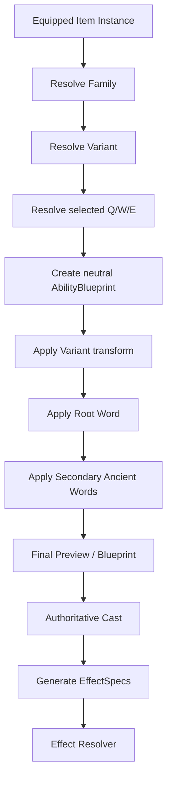

# Plan: Root Ancient Words, Weapon Families, Variants, Armor Inscriptions, and Resonance

**Status:** planned  
**Repository baseline:** `alessandrobrunoh/Eivar-Online` `main` at `98b1bfbc7054d2af997c0783b35301a2fcf2712d`  
**Primary scope:** replace the current Essence + Modifier + AncientWord per-slot model with the new weapon-wide Root Ancient Word model; make secondary Ancient Words a single universal vocabulary; introduce weapon families and gameplay-changing variants; make Ultimate selectable from a family pool; extend the same Root Word idea independently to Helmet / Armor / Shoes; add Resonance as character progression; preserve server authority and shared rule execution.

---

## 1. Goal

The current implementation is already close to a composable ability system:

- `BaseAbility` represents the physical gesture/delivery.
- `Essence` decides what the gesture manifests.
- `Modifier` transforms numerical ability parameters.
- `AncientWord` post-processes the manifestation.
- `WeaponInscriptions` stores independent Primary/Secondary/Ultimate inscriptions.
- `WeaponAbilities` already supports multiple Primary and Secondary choices.
- `resolve.rs` composes everything through the shared `SpellCastContext`.
- inscriptions and ability selections live on `ItemInstance`, so two physical copies of the same weapon can differ.

The new game design should simplify the player-facing language while preserving the useful composability.

Old model:

```text
Weapon
  -> BaseAbility
      -> Essence
      -> Modifier(s)
      -> AncientWord
```

Target model:

```text
Weapon Family
  -> Weapon Variant
      -> selected BaseAbility for Q
      -> selected BaseAbility for W
      -> selected BaseAbility for E

Weapon Instance
  -> ONE Root Ancient Word for the whole weapon
  -> Q Secondary Ancient Words
  -> W Secondary Ancient Words
  -> E Secondary Ancient Words
```

Armor receives the same Root Word concept independently:

```text
Helmet -> own Root Word -> armor-slot ability
Chest  -> own Root Word -> armor-slot ability
Shoes  -> own Root Word -> armor-slot ability
```

The core design rule is:

> **Weapon family defines the combat vocabulary. Weapon variant defines how that vocabulary is executed. Root Ancient Word defines the power identity of the whole item. Base Ability defines the physical/visual shape of an action. Secondary Ancient Words refine how an action behaves.**

---

## 2. Non-goals

This plan does not:

- implement the complete final weapon catalogue;
- choose every final Root Word;
- lock final balance values;
- introduce talent trees, gems, passive trees, subclasses, or more socket systems;
- make every weapon equally good at every role;
- make all Root Words legal on all weapon families;
- move authoritative rules to Bevy;
- replace SpacetimeDB;
- trust client-provided derived ability data;
- require one bespoke fixed Ultimate for every physical weapon variant.

The first implementation should create a framework in which new content can be added without changing architecture.

---

## 3. Repository constraints that must remain true

The authoritative world runs in `crates/stdb-module`. Shared deterministic rules must remain in the Bevy-free gameplay/domain layer so client prediction/preview and the SpacetimeDB server can consume the same logic.

Target ownership:

```text
crates/content
    concrete Root Words, Ancient Words, Base Abilities,
    weapon families, variants, and physical items

crates/gameplay
    IDs, traits/data definitions, validation, composition,
    formulas, compatibility, deterministic transforms

crates/stdb-module
    authoritative mutable state, reducers, tick execution,
    persistence and replication

client / presentation
    inspect UI, inscription UI, targeting previews,
    VFX, icons, labels
```

Any rule that decides whether a build is legal belongs in shared code and must also be invoked by the authoritative reducer.

---

## 4. Current model to replace

### 4.1 Per-slot inscription

Today:

```rust
pub struct Inscription {
    pub essence: Option<EssenceId>,
    pub modifiers: Vec<ModifierId>,
    pub ancient_word: Option<AncientWordId>,
}

pub struct WeaponInscriptions {
    pub primary: Inscription,
    pub secondary: Inscription,
    pub ultimate: Inscription,
}
```

That permits Q, W, and E to independently choose different Essences. The new design explicitly does not want that because the weapon must have one readable identity.

Target:

```rust
pub struct AbilityInscription {
    pub secondary_words: Vec<AncientWordId>,
}

pub struct WeaponInscription {
    pub root_word: Option<RootWordId>,
    pub primary: AbilityInscription,
    pub secondary: AbilityInscription,
    pub ultimate: AbilityInscription,
}
```

Do not store the Root Word three times. One field makes contradictory Q/W/E identities impossible by construction.

### 4.2 `Essence` -> Root Word

The current `Essence` abstraction already owns much of the correct behavior:

- manifestation;
- default targeting;
- visual theme;
- rune cost;
- stable registry identity.

Therefore migrate the responsibility instead of deleting and recreating it:

```text
Essence -> RootWord
```

The important semantic change is **scope**: one Root Word is attached to the whole item.

### 4.3 `Modifier` + `AncientWord` -> one Ancient Word vocabulary

The current internal split is useful for execution order but unnecessary for players:

- `Modifier` mutates `AbilityParams` before manifestation.
- `AncientWord` runs after manifestation.

Player-facing concepts such as `Amplia`, `Persisto`, `Catena`, `Eco`, `Perfora`, and `Celeris` should all be **Ancient Words**.

Do not force all words into one runtime hook. Use one type with multiple phases:

```rust
pub trait AncientWord: Send + Sync + 'static {
    fn id(&self) -> AncientWordId;
    fn metadata(&self) -> &AncientWordMetadata;

    fn transform_blueprint(&self, _blueprint: &mut AbilityBlueprint) {}
    fn transform_effects(&self, _effects: &mut EffectBundle) {}
    fn post_process(&self, _ctx: &mut ResolutionContext) {}
}
```

Examples:

```text
Amplia   -> geometry/area phase
Celeris  -> cast-timing phase
Perfora  -> projectile behavior
Persisto -> duration/effect phase
Catena   -> targeting/propagation phase
Echo     -> repeat/post-process phase
Detona   -> status interaction / stack-consumption phase
```

One vocabulary, multiple internal hooks.

---

## 5. Final terminology

Recommended player-facing terms:

- Weapon Family
- Weapon Variant
- Base Ability
- Ancient Word
- Root Word / Root Ancient Word
- Resonance

Recommended code IDs:

```rust
WeaponFamilyId
WeaponVariantId
AbilityId
RootWordId
AncientWordId
StatusId
```

Long-term remove `EssenceId` and `ModifierId` from the canonical public gameplay model.

A short migration alias is acceptable:

```rust
#[deprecated]
pub type EssenceId = RootWordId;
```

but do not permanently support both vocabularies.

---

## 6. Root Word

### 6.1 One Root Word per item

Examples:

```text
Long Bow + Nature
Long Bow + Fire
Echo Staff + Curse
Conduit Staff + Stone
```

The Root Word applies to every selected Q/W/E ability.

### 6.2 Responsibilities

A Root Word may define:

- domain tags;
- preferred relationship targeting;
- neutral Potency conversion into effects;
- status/effect payloads;
- visual/audio theme;
- compatible item kinds/families;
- role hints for UI;
- Resonance category;
- rune cost/complexity.

Conceptual metadata:

```rust
pub struct RootWordMetadata {
    pub id: RootWordId,
    pub display_name: &'static str,
    pub tags: RootWordTags,
    pub rune_cost: u32,
    pub compatible_item_kinds: RootWordItemKinds,
    pub visual_theme: RootWordVisualTheme,
}
```

### 6.3 Root Word is not a class

Do not encode:

```text
Nature = healer
Fire   = DPS
Stone  = tank
```

Instead:

```text
Nature = life / growth / regeneration / roots / propagation
Fire   = pressure / combustion / burn / burst
Curse  = decay / stacks / debuffs / detonation
Stone  = stability / barriers / impact / protection
```

The family determines how those concepts are delivered.

Examples:

```text
Nature + Bow    -> ranged heal/support
Nature + Staff  -> caster heal/support
Nature + Sword  -> melee sustain/battle support
Nature + Hammer -> protection/control support
```

---

## 7. Base Ability remains neutral

Base Abilities represent spatial/temporal actions rather than roles/elements.

Good primitives:

```text
Projectile
Strike
Thrust
Wave
Zone
Burst
Channel
Link
Mark
Barrier
Dash
Aura
Nova
Collapse
Storm
```

Avoid defining everything as:

```text
Fireball
Holy Heal
Frost Arrow
Nature Explosion
```

when it can be composed as:

```text
Projectile + Fire
Projectile + Nature
Projectile + Frost
Zone + Nature
```

A family can give a flavorful display label, but the underlying gameplay primitive should stay reusable.

---

## 8. Rename `power` to `potency`

Current `AbilityParams::power` is close to the desired concept but sounds damage-specific.

Target:

```rust
pub struct AbilityParams {
    pub potency: f32,
    pub area: f32,
    pub range: f32,
    pub cast_time: f32,
    pub cooldown: f32,
    pub energy_cost: f32,
}
```

Authoring:

```rust
#[base_ability(
    id = "arcane_orb",
    name = "Arcane Orb",
    tags = [Ranged, Projectile, SingleTarget, RepeatCompatible],
    range = 22.0,
    geometry = projectile(speed = 24.0),
    potency = 220.0,
    cast_time = 0.25,
    cooldown = 2.5,
    energy_cost = 10.0,
    animation = "staff_thrust",
    impact_vfx = "arcane_orb_impact",
)]
pub struct ArcaneOrb;
```

`potency` means neutral effect intensity/budget.

```text
Arcane Orb potency 220
+ Fire   -> damage + Burn
+ Nature -> heal + Rejuvenation
+ Curse  -> lower direct damage + Curse stack
+ Stone  -> protection/control depending on allowed manifestation
```

---

## 9. Ability Blueprint layer

The current resolver goes quickly from `BaseAbility` + modifiers to emitted events. The new system needs a composable intermediate blueprint.

```text
BaseAbility
-> AbilityBlueprint
-> WeaponVariant transform
-> RootWord transform
-> Secondary Ancient Words
-> Final Blueprint
-> Cast/Impact
-> EffectSpecs
```

Suggested shape:

```rust
pub struct AbilityBlueprint {
    pub ability_id: AbilityId,
    pub tags: AbilityTags,
    pub geometry: AbilityGeometry,
    pub targeting: TargetingProfile,
    pub cast: CastProfile,
    pub params: AbilityParams,
    pub projectile: Option<ProjectileProfile>,
    pub area: Option<AreaProfile>,
    pub repeat: RepeatProfile,
    pub presentation: AbilityPresentationHints,
}
```

It must be plain deterministic shared data so client preview and server resolution can use the same logic.

---

## 10. Secondary Ancient Words

### 10.1 One universal registry

There are no separate Q/W/E word types.

```rust
pub struct AncientWordMetadata {
    pub id: AncientWordId,
    pub display_name: &'static str,
    pub required_tags: AbilityTags,
    pub forbidden_tags: AbilityTags,
    pub exclusive_group: Option<WordGroupId>,
    pub rune_cost: u32,
    pub phase: AncientWordPhase,
    pub visual_priority: WordVisualPriority,
}
```

Example semantics:

```text
Amplia
requires: Area
result: larger radius
tradeoff: lower potency or greater cast/resource cost

Perfora
requires: Projectile
result: penetrates valid targets
tradeoff: effectiveness falls after penetration

Catena
requires: Targeted/Projectile
result: jumps to nearby targets
tradeoff: decreasing effectiveness per hop

Persisto
requires: PersistentCompatible
result: longer duration
tradeoff: lower tick potency

Echo
requires: EchoCompatible
result: reduced delayed repetition
tradeoff: repeat effectiveness cap; no recursive Echo
```

### 10.2 Duplicate prevention

Default invariant:

```text
same AncientWordId cannot appear twice on one ability
```

Reject `Amplia + Amplia + Amplia`.

If ranks are ever wanted, model them explicitly rather than by duplicate entries.

### 10.3 Slot limits

Recommended Alpha defaults:

```text
Q / Primary   -> max 2 secondary words
W / Secondary -> max 2 secondary words
E / Ultimate  -> max 1 secondary word
```

Put these in policy data:

```rust
pub struct InscriptionSlotPolicy {
    pub max_secondary_words: u8,
}
```

Ultimate intentionally gets fewer words because it already carries the largest combat/ZvZ impact.

---

## 11. Weapon Family

The family owns the general Base Ability pools.

```rust
pub struct WeaponFamilyDefinition {
    pub id: WeaponFamilyId,
    pub display_name: &'static str,
    pub primary_pool: &'static [AbilityId],
    pub secondary_pool: &'static [AbilityId],
    pub ultimate_pool: &'static [AbilityId],
    pub tags: WeaponFamilyTags,
}
```

Example Staff:

```text
Q pool:
- Projectile
- Channel
- Mark
- Link

W pool:
- Zone
- Barrier
- Wave
- Link

E pool:
- Nova
- Storm
- Domain
- Collapse
- Grand Channel
```

The pool defines the opponent's expected possibility space and therefore protects PvP readability.

---

## 12. Make Ultimate selectable

Current:

```rust
pub struct WeaponAbilities {
    pub primary: Vec<AbilityId>,
    pub secondary: Vec<AbilityId>,
    pub ultimate: AbilityId,
}
```

Target:

```rust
pub struct WeaponAbilities {
    pub primary: Vec<AbilityId>,
    pub secondary: Vec<AbilityId>,
    pub ultimate: Vec<AbilityId>,
}

pub struct AbilitySelection {
    pub primary: Option<AbilityId>,
    pub secondary: Option<AbilityId>,
    pub ultimate: Option<AbilityId>,
}
```

Invariant:

```text
Primary >= 1
Secondary >= 1
Ultimate >= 1
```

All slots use the same fallback algorithm:

1. selected ID if still valid;
2. otherwise first offered ID.

This removes the current Ultimate special case.

---

## 13. Weapon Variant

### 13.1 Avoid stat-only variants

A variant should not be merely:

```text
Quick Staff: +30% cast speed, -15% potency
Heavy Staff: -30% cast speed, +20% potency
```

Those can be item stats, but they are not strong enough to define weapon identity.

### 13.2 Variant = signature execution rule

Conceptual interface:

```rust
pub trait WeaponVariant {
    fn id(&self) -> WeaponVariantId;
    fn family(&self) -> WeaponFamilyId;
    fn transform_blueprint(
        &self,
        slot: AbilitySlot,
        blueprint: &mut AbilityBlueprint,
    );
}
```

Runtime mechanics may use explicit variant state.

### 13.3 Staff examples

#### Conduit Staff — Charge

```text
tap -> baseline cast
hold -> Charge I -> II -> III
```

Charge can increase potency/range/area according to ability tags while increasing exposure and interrupt risk.

#### Quick Staff — Flow

Consecutive casts build Flow. Throughput rises while per-cast budget or resource efficiency compensates. This creates spell weaving rather than simply changing `cast_time`.

#### Echo Staff — Echo

Eligible casts produce a delayed reduced repeat. Must explicitly prohibit recursive Echo-of-Echo.

#### Focus Staff — Focus Target

A chosen target becomes more efficient for single-target actions. AoE/general output can be weaker.

#### Spatial Staff — Remote Origin

Places an authoritative casting anchor. Eligible abilities originate from the anchor. Server defines exact range checks.

#### Ritual Staff — Setup

Rewards pre-placement, ritual nodes, or persistent preparation rather than only `+duration`.

---

## 14. Variant runtime state

Do not build a giant generalized state system before implementing real variants.

For the first two variants, identify actual state requirements.

Potential conceptual model:

```rust
pub enum WeaponVariantState {
    None,
    Charge { started_at_tick: u64 },
    Flow { stacks: u8, expires_at: GameTime },
    Focus { target: Option<EntityId> },
    Anchor { entity: Option<EntityId> },
    Momentum { stacks: u8, expires_at: GameTime },
}
```

If SATS/client bindings make a large enum awkward, use a dedicated authoritative variant-state table with simple named fields only after the first mechanics prove what is needed.

---

## 15. Other family examples

### Bow

```text
Longbow  -> Draw / charge
Shortbow -> Momentum / rapid cadence
Recurve  -> Ricochet behavior
Siege Bow -> Anchor stance / high reach
```

The difference must be mechanical, not just “short = fast, long = slow.”

### Sword

```text
Duelist Blade -> combo/follow-up windows
Greatsword    -> momentum / broad commitment
Twin Blades   -> alternating follow-ups
Runeblade     -> store/release one eligible manifestation
```

Visual shapes such as katana/machete should not automatically become separate gameplay variants unless they genuinely change the rules.

---

## 16. Item definition target

Separate family, variant, and physical/tier item.

Conceptual authoring:

```rust
#[item(
    id = "conduit_staff_t4",
    name = "Conduit Staff",
    category = Weapon,
    slot = Weapon,
    weapon_family = Staff,
    weapon_variant = Conduit,
    rune_profile(capacity = 8, stability = 0.96),
)]
pub struct ConduitStaffT4;
```

Family supplies Base Ability pools.

Variant supplies execution mechanics.

Physical item supplies:

- tier / item power;
- passive stat bonuses;
- rune capacity/stability;
- craft data;
- assets/presentation;
- family and variant references.

Avoid duplicating the full ability pool for every tier copy of the same family/variant.

---

## 17. RuneProfile migration

Current:

```rust
pub struct RuneProfile {
    pub capacity: u32,
    pub stability: f32,
    pub affinity: Option<EssenceId>,
}
```

Target initial version:

```rust
pub struct RuneProfile {
    pub capacity: u32,
    pub stability: f32,
}
```

The old item affinity discount is not the same concept as player Resonance.

If item-specific Root Word affinity is later useful, name it explicitly and keep it separate from character Resonance.

---

## 18. Armor inscriptions

### 18.1 Independent Root Words

Helmet/Chest/Shoes do **not** inherit the weapon Root Word.

Example:

```text
Weapon: Nature
Helmet: Presage
Chest: Stone
Shoes: Wind
```

This is a deliberate major build axis.

### 18.2 Slot responsibilities

Keep armor versatile but readable.

```text
Weapon -> main damage/heal/control rotation
Helmet -> utility, cleanse, anti-CC, vision, precise debuff tools
Chest  -> mitigation, barriers, sustain, retaliation, protection
Shoes  -> movement, dodge, sprint, engage, disengage, reposition
```

A Nature Shoes ability may heal lightly through movement, but Shoes should not become a second full healing weapon rotation.

### 18.3 Item inscription ownership

Current `ItemInstance` only has optional `WeaponInscriptions`.

Generalize without forcing Boots into a Q/W/E-shaped struct.

Candidate:

```rust
pub enum ItemInscription {
    Weapon(WeaponInscription),
    Armor(ArmorInscription),
}

pub struct ArmorInscription {
    pub root_word: Option<RootWordId>,
    pub secondary_words: Vec<AncientWordId>,
}
```

If SATS enum payloads create poor generated bindings, use explicit optional named row fields at the SpacetimeDB boundary instead.

---

## 19. Resonance

### 19.1 Meaning

Resonance is character mastery/affinity with a Root Word, not weapon mastery.

```text
Nature Resonance 82
Fire Resonance   47
Curse Resonance  31
```

A player can be a “Nature main” while changing weapon family.

### 19.2 Persistence

Resonance is persistent character state and belongs in SpacetimeDB persistent tables, not on the item.

Suggested conceptual table:

```rust
pub struct ResonanceRow {
    pub identity: Identity,
    pub root_word_id: String,
    pub xp: u64,
    pub level: u16,
}
```

Use a stable key/index strategy supported by the exact SpacetimeDB version in the repository.

### 19.3 Rewards

Avoid making Resonance mostly raw Item Power, or players become trapped by past progression.

Recommended rewards:

- modest vertical Potency/IP bonus;
- Ancient Word unlocks;
- advanced combinations;
- inscription capacity milestones;
- cosmetic VFX;
- titles/prestige;
- forging dependencies;
- sidegrades.

Design target: mostly horizontal breadth, smaller vertical advantage.

---

## 20. Knowledge progression

Current `KnownGlyphs` stores Essences, Modifiers, and Ancient Words separately.

Target:

```rust
pub struct KnownAncientLanguage {
    pub root_words: HashSet<RootWordId>,
    pub ancient_words: HashSet<AncientWordId>,
    pub base_abilities: HashSet<AbilityId>, // optional design choice
}
```

Potential progression pillars:

```text
Ancient Language
-> what forms/words can be inscribed

Resonance
-> how deeply a Root Word is mastered

Forging Knowledge
-> which weapon variants can be constructed
```

Keep these concepts separate even if all three are discovered through exploration.

---

## 21. Forging/variant discovery

Weapon variants are ideal crafting/exploration rewards.

Example:

```text
ANCIENT SCHEMATIC DISCOVERED: ECHO STAFF
The core can retain a weakened copy of the previous manifestation.
```

Do not encode the variant itself as an Ancient Word; it changes the weapon execution layer, not the inscription language layer.

---

## 22. Validation

Use structured errors.

```rust
pub enum BuildValidationError {
    UnknownWeaponFamily(WeaponFamilyId),
    UnknownWeaponVariant(WeaponVariantId),
    VariantFamilyMismatch { /* ... */ },

    UnknownBaseAbility(AbilityId),
    AbilityNotOfferedForSlot { /* ... */ },

    MissingRootWord,
    UnknownRootWord(RootWordId),
    RootWordIncompatibleWithItem { /* ... */ },
    RootWordNotKnown(RootWordId),

    UnknownAncientWord(AncientWordId),
    AncientWordNotKnown(AncientWordId),
    AncientWordIncompatible { /* ... */ },
    DuplicateAncientWord(AncientWordId),
    AncientWordConflict { /* ... */ },

    TooManySecondaryWords {
        slot: AbilitySlot,
        max: u8,
        actual: u8,
    },

    CapacityExceeded {
        cost: u32,
        capacity: u32,
    },
}
```

Reducers/UI can then explain the exact problem.

---

## 23. Compatibility system

Use tags wherever possible.

```text
Projectile BaseAbility tags:
Ranged, Projectile, SingleTarget, RepeatCompatible

Perfora requires Projectile
Amplia requires Area
Echo requires EchoCompatible
```

Root compatibility can depend on:

- family tags;
- BaseAbility tags;
- item slot category.

Avoid ID-specific generic code such as:

```rust
if ability.id() == "arcane_orb" { ... }
```

---

## 24. Power budget and trade-offs

Words/variants should mostly redistribute power.

Examples:

```text
Amplia:
+35% radius
-10% potency

Catena:
+2 hops
70% then 50% effectiveness

Echo:
repeat at 40% effectiveness
no recursive repeat

Persisto:
+50% duration
-20% tick potency

Quick variant:
higher throughput
lower per-cast budget

Conduit Charge:
higher peak
higher cast exposure
```

Do not make every secondary word a free numerical upgrade.

---

## 25. Resolution order

Target shared pipeline:



Recommended conceptual order:

1. Base Ability creates neutral geometry/timing/Potency.
2. Variant changes execution semantics.
3. Root Word constructs manifestation identity/payload.
4. Secondary words refine it.
5. final cast creates effects.

---

## 26. Deterministic word ordering

Word transforms may be non-commutative.

Use semantic phases rather than user ordering for Alpha:

```text
Geometry
Timing
Targeting
Payload
PostProcess
```

Within one phase sort by stable AncientWordId or a declared stable priority.

Do not let insertion/registry/hash iteration order change gameplay.

---

## 27. Macro authoring

Macros should generate stable metadata/boilerplate, not become a giant gameplay DSL.

Suggested direction:

```rust
#[root_word(
    id = "nature",
    name = "Nature",
    rune_cost = 2,
    color = (0.25, 0.80, 0.30),
    tags = [Life, Growth, Regeneration],
)]
pub struct Nature;
```

```rust
#[ancient_word(
    id = "amplia",
    name = "Amplia",
    rune_cost = 2,
    requires = [Area],
    phase = Geometry,
    exclusive_group = "area_scale",
)]
pub struct Amplia;
```

Complex behavior remains normal Rust trait implementations.

---

## 28. Proc-macro migration

Primary current macro crate:

```text
crates/bevymmo-props-macro/src/lib.rs
```

Tasks:

1. add `#[root_word]`;
2. optionally retain `#[essence]` as a temporary migration wrapper;
3. deprecate/remove `#[modifier]` after content migration;
4. expand `#[ancient_word]` metadata for phases, tag sets, conflicts;
5. migrate `#[base_ability] power` -> `potency`;
6. permit `ultimate = [A, B, C]` in item/family authoring;
7. add family/variant references;
8. emit compile-time errors for empty ability pools where possible;
9. add proc-macro compile tests.

Use a staged migration rather than breaking every content module in the first commit unless intentionally doing one atomic refactor.

---

## 29. SpacetimeDB row migration

Current row mirrors:

```text
InscriptionRow:
  essence
  modifiers
  ancient_word

WeaponInscriptionsRow:
  primary
  secondary
  ultimate

AbilitySelectionRow:
  primary
  secondary
```

Target:

```rust
pub struct AbilityInscriptionRow {
    pub secondary_words: Vec<String>,
}

pub struct WeaponInscriptionRow {
    pub root_word: Option<String>,
    pub primary: AbilityInscriptionRow,
    pub secondary: AbilityInscriptionRow,
    pub ultimate: AbilityInscriptionRow,
}

pub struct AbilitySelectionRow {
    pub primary: Option<String>,
    pub secondary: Option<String>,
    pub ultimate: Option<String>,
}
```

For armor use an armor-specific mirror rather than fake Q/W/E fields.

Before choosing a SATS enum for item inscription kinds, verify generated client-binding ergonomics. Named optional structs may be safer.

---

## 30. Known-language table migration

Current persistent table stores:

```text
essences
modifiers
ancient_words
```

Target:

```text
root_words
ancient_words
base_abilities? // only if globally learned
```

Development migration if old characters are preserved:

```text
old essence IDs -> RootWord IDs
old modifier IDs -> AncientWord IDs
old AncientWord IDs -> AncientWord IDs
```

Detect ID collisions before writing migrated data.

---

## 31. Reducer changes

Every authoritative reducer that changes an inscription/selection must:

1. map caller identity;
2. resolve item instance owned by caller;
3. resolve item family/variant;
4. validate Root Word exists and is known;
5. validate Root Word compatibility;
6. validate selected Base Ability belongs to the correct family/slot pool;
7. validate secondary word knowledge;
8. validate tags/conflicts/duplicates;
9. validate slot word count;
10. validate rune capacity;
11. persist only IDs/selections;
12. derive all final Potency/geometry/effects server-side.

Never accept client-provided “final damage,” “final radius,” “charge power,” or similar derived values.

---

## 32. Rune capacity

Keep shared weapon rune capacity.

```text
Root Word cost
+ Q words
+ W words
+ E words
<= Weapon RuneProfile.capacity
```

Root cost is charged once.

Armor gets its own per-item capacity.

Do not create one global capacity pool across all equipped pieces.

---

## 33. Stability

`RuneProfile.stability` is currently reserved. Preserve it but do not invent random miscast mechanics.

Potential future deterministic uses:

- overload threshold;
- advanced word-combination limit;
- efficiency curve;
- crafting-quality constraint.

For competitive PvP/ZvZ, random spell failure should not be the default interpretation.

---

## 34. Inspect/readability contract

Top-level inspect should immediately communicate:

```text
Weapon Family + Variant
Root Word
Resonance
role hint
Q/W/E Base Abilities
secondary words
Helmet Root Word
Chest Root Word
Shoes Root Word
```

Example:

```text
AELIN
Longbow — Draw Variant
Nature
Resonance 82
Healer / Support

Q Projectile  [Catena] [Bloom]
W Mark        [Persisto] [Root]
E Zone        [Amplia]

Helmet: Presage
Chest: Stone
Shoes: Wind
```

Role labels should be inferred descriptors, not hard classes.

---

## 35. PvP/ZvZ visual hierarchy

Each layer owns one visual responsibility:

```text
Weapon/Variant -> silhouette and cadence
Base Ability   -> spatial shape/telegraph
Root Word      -> dominant visual/audio language
Secondary Word -> small behavioral hint
```

`Zone + Curse + Amplia + Persisto` must look like **one large persistent Curse Zone**, not four unrelated VFX systems.

Presentation metadata can include priority:

```text
Cosmetic
Minor
Important
Critical
```

Gameplay must never depend on visual priority.

---

## 36. Client preview

Preserve the current valuable pattern in `resolve_slot_preview`: preview and authoritative cast share rule resolution.

Target preview should expose:

- selected Base Ability;
- variant execution rule;
- Root Word;
- secondary word transforms;
- final geometry/range;
- cast time;
- targeting mode;
- resource cost;
- cooldown;
- presentation hints.

It should not mutate health/statuses.

---

## 37. Suggested module layout

```text
crates/gameplay/src/abilities/
├── base_ability.rs
├── blueprint.rs
├── root_word.rs
├── ancient_word.rs
├── inscription.rs
├── known_language.rs
├── resolve.rs
├── slot.rs
├── weapon_family.rs
├── weapon_variant.rs
└── resonance.rs

crates/content/src/
├── abilities/
├── root_words/
├── ancient_words/
├── weapon_families/
├── weapon_variants/
└── items/
```

Do not create empty directory architecture for hypothetical content. Add modules as concrete content appears.

---

## 38. File-by-file migration map

### `crates/gameplay/src/abilities/base_ability.rs`

- rename `power` -> `potency`;
- expand tags;
- introduce/produce `AbilityBlueprint`;
- preserve shared geometry functions;
- remove Essence-specific wording;
- eventually remove special `stun_seconds()` in favor of generic effects.

### `crates/gameplay/src/abilities/essence.rs`

- evolve into `root_word.rs`;
- rename IDs/registry/traits;
- preserve visual theme idea;
- migrate direct manifestation toward blueprint/effect transformation.

### `crates/gameplay/src/abilities/modifier.rs`

- port concrete Modifier content into Ancient Words;
- remove registry after all call sites migrate.

### `crates/gameplay/src/abilities/ancient_word.rs`

- add transformation phases;
- support tag sets/conflict groups;
- deterministic ordering;
- universal player-facing word type.

### `crates/gameplay/src/abilities/inscription.rs`

- Root Word at weapon level;
- `secondary_words` instead of modifier + one post word;
- per-slot count validation;
- new capacity calculation.

### `crates/gameplay/src/abilities/known_glyphs.rs`

- migrate to root + ancient word vocabulary;
- optionally include learned Base Abilities.

### `crates/gameplay/src/abilities/weapon_abilities.rs`

- Ultimate becomes a pool;
- selection includes Ultimate;
- later pools can move to family definition.

### `crates/gameplay/src/abilities/resolve.rs`

Replace:

```text
Base -> Modifiers -> Essence -> AncientWord
```

with:

```text
Base -> Variant -> Root -> AncientWords -> EffectSpecs
```

Preserve one shared preview path.

### `crates/content/src/essences/*`

Migrate to `root_words/*`.

### `crates/content/src/modifiers/*`

Migrate to `ancient_words/*`.

### `crates/content/src/items/magic_staff/mod.rs`

Turn the current reference item into a family/variant proof; remove old Fire affinity semantics unless explicitly retained as separate item affinity.

### `crates/stdb-module/src/rows.rs`

- new inscription mirrors;
- Ultimate selection;
- armor inscription mirrors;
- known language conversions.

### `crates/stdb-module/src/tables.rs`

- migrate known glyph vocabulary;
- add persistent Resonance table;
- only add runtime variant state after first real variant needs it.

---

## 39. Implementation phases

### Phase 0 — Characterization tests

Freeze current critical behavior:

- `ItemInstance` owns independent inscriptions;
- invalid IDs do not panic;
- selection fallback works;
- preview/server params match;
- capacity rejects invalid builds;
- unknown glyph blocks cast as designed;
- Arcane Orb + Fire + Expand behavior has coverage.

### Phase 1 — Blueprint + neutral Potency

1. Add `AbilityBlueprint`.
2. Add `potency` while temporarily supporting old macro `power` if needed.
3. Route preview through blueprint.
4. Adapt old Essence/Modifier behavior onto blueprint.
5. Define transformation phases.

**Exit:** old content behaves the same through new intermediate representation.

### Phase 2 — Root Word

1. Add RootWord IDs/registry/definition.
2. Port `FuocoEssence` as Fire Root Word.
3. Store Root Word once on weapon inscription.
4. Update cost/validation.
5. Update SATS rows/bindings.
6. Update inscription UI data.

**Exit:** Q/W/E share one Root Word.

### Phase 3 — Unified secondary Ancient Words

1. Expand AncientWord hooks/phases.
2. Port `EspandereModifier` first.
3. Port every Modifier.
4. Remove ModifierRegistry from resolver.
5. Collapse known modifier/word sets.
6. Add duplicate/conflict/count checks.

**Exit:** no separate player-facing Modifier concept.

### Phase 4 — Selectable Ultimate

1. Ultimate pool vector.
2. Ultimate in AbilitySelection.
3. row/bindings migration.
4. reducer/UI update.
5. at least two Ultimate Base Abilities for Staff.

**Exit:** Q/W/E share one generic selection path.

### Phase 5 — Weapon Family

1. Add `WeaponFamilyDefinition`.
2. Move shared Staff pools into family.
3. Item references family.
4. validate family membership.
5. inspect exposes family.

### Phase 6 — First two variants

Implement only:

1. Conduit Staff / Charge.
2. Echo Staff / Echo.

Use these to discover actual runtime-state needs.

**Exit:** same Q/W/E + Root Word genuinely plays differently on both variants.

### Phase 7 — Armor Root Words

1. generalize item inscription ownership;
2. add Root Words to Helmet/Armor/Shoes;
3. define slot compatibility themes;
4. one content item per slot;
5. authoritative reducers/UI.

### Phase 8 — Resonance

1. add Resonance model/formula;
2. persistent SpacetimeDB state;
3. XP/level API;
4. inspect display;
5. initial unlock milestones;
6. small/configurable combat-power contribution.

### Phase 9 — Remove compatibility layer

Delete legacy:

- Essence types/registry;
- Modifier types/registry;
- old inscription fields;
- old known-glyph vectors;
- deprecated macro syntax.

---

## 40. Test matrix

### Domain

- one Root Word applies to Q/W/E;
- unknown Root Word rejected;
- Root Word incompatible with item rejected;
- duplicate secondary word rejected;
- required tag rejected/accepted correctly;
- exclusive word conflict;
- Q=2/W=2/E=1 policy;
- capacity cost correct;
- Root cost charged once;
- deterministic word transform order;
- Ultimate selection/default fallback;
- stale selection falls back after content change;
- variant-family mismatch rejected.

### Variant

Conduit:

- tap baseline;
- charge clamped;
- server derives charge amount;
- interruption rules;
- deterministic curve.

Echo:

- eligible ability echoes;
- ineligible does not;
- no recursion;
- source attribution preserved.

### SpacetimeDB

- non-owner cannot edit item;
- unknown IDs rejected;
- rows round-trip;
- item inscriptions survive inventory/equipment moves;
- Resonance persists reconnect;
- runtime variant state cleans on republish/death as defined.

### Client

- inspect Root Word prominent;
- Q/W/E selection correct;
- armor roots displayed;
- preview geometry matches authoritative geometry;
- incompatible words disabled;
- Ultimate selection UI works.

---

## 41. Performance / ZvZ notes

Do not resolve static registries every frame for every entity.

Potential cache invalidation events:

- equipment change;
- inscription change;
- ability selection change;
- relevant Resonance change;
- variant state change only when it changes static blueprint portions.

A later `BuildFingerprint` may help:

```rust
pub struct BuildFingerprint {
    pub item_instance_id: ItemInstanceId,
    pub variant: WeaponVariantId,
    pub root_word: RootWordId,
    pub primary: AbilityId,
    pub secondary: AbilityId,
    pub ultimate: AbilityId,
    pub secondary_word_hash: u64,
}
```

Do not add a sophisticated cache before profiling shows it matters.

---

## 42. Backward compatibility strategy

Recommended short migration window:

```text
A. new structures + adapters
B. migrate concrete content
C. migrate/reset development persisted data
D. remove adapters
```

Do not maintain permanent parallel Essence and RootWord systems.

---

## 43. Intentionally open design decisions

The architecture should support without blocking implementation:

1. final player-facing name for Root Word;
2. whether an item can be used with no Root Word;
3. exact armor secondary-word count;
4. whether Base Abilities are globally learned discoveries;
5. Resonance XP curve;
6. Resonance -> Item Power contribution;
7. family restrictions per Root Word;
8. whether variant knowledge gates crafting, equipping, or both;
9. final Rune Stability meaning.

---

## 44. Recommended Alpha content slice

Families:

- Staff
- Bow

Variants:

- Conduit Staff
- Echo Staff
- Longbow
- Momentum/Shortbow

Root Words:

- Nature
- Fire
- Curse

Base Abilities:

- Projectile
- Zone
- Link
- Mark
- Nova
- Collapse

Secondary Ancient Words:

- Amplia
- Persisto
- Catena
- Perfora
- Echo
- Celeris

Armor:

- one Helmet;
- one Chest;
- one Shoes;
- all supporting independent Root Words.

This small matrix already proves healer Bow, healer Staff, Fire artillery, Curse debuffer, multiple variant mechanics, inspect readability, armor utility, and ZvZ telegraphs.

---

## 45. Definition of done

- [ ] Essence is no longer a separate player-facing/domain content category.
- [ ] Modifier is no longer a separate player-facing/domain content category.
- [ ] one Root Word is stored once per weapon.
- [ ] Q/W/E all derive manifestation from that same Root Word.
- [ ] secondary Ancient Words use one registry and compatibility model.
- [ ] duplicate secondary words are rejected.
- [ ] Q/W/E word limits are data-driven.
- [ ] Ultimate can be selected from multiple family options.
- [ ] Weapon Family is explicit.
- [ ] Weapon Variant is explicit.
- [ ] at least two variants change gameplay through distinct mechanics, not only stats.
- [ ] armor pieces can carry independent Root Words.
- [ ] armor Root Words respect slot responsibility.
- [ ] Resonance persists per character + Root Word.
- [ ] Base Ability uses neutral `potency` instead of `power`.
- [ ] preview and authoritative cast share blueprint resolution.
- [ ] SpacetimeDB reducers validate all loadout changes.
- [ ] no client-provided derived values are trusted.
- [ ] inspect can present variant + Root Word + Q/W/E at a glance.
- [ ] legacy data is migrated or deliberately reset.
- [ ] old Essence/Modifier compatibility code is removed after migration.

---

## 46. Final mental model

A complete weapon should be explainable in one compact line:

```text
Echo Staff / Nature / Projectile – Link – Nova
```

then refined:

```text
Q Projectile + Catena + Bloom
W Link       + Persisto
E Nova       + Amplia
```

The physical weapon tells the player **how** they cast.

The Root Word tells everyone **what kind of power** they are using.

The Base Abilities tell everyone **what spatial actions** to expect.

The secondary Ancient Words create build depth without destroying readability.
