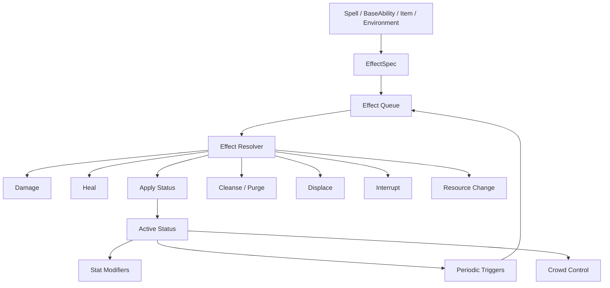

# Plan: Unified Effect, Status, Crowd Control, Stacking, Cleanse, Damage, Healing, and Entity Stats Architecture

**Status:** planned  
**Repository baseline:** `alessandrobrunoh/Eivar-Online` `main` at `98b1bfbc7054d2af997c0783b35301a2fcf2712d`  
**Primary scope:** replace the current partially separate damage/heal/stat-modifier/periodic/crowd-control paths with one semantic Effect model; keep runtime storage specialized where useful; define deterministic stacking and source ownership; expand entity stats for Armor/Resistance/Pierce/CC; introduce Cleanse/Purge/Displacement rules; make the system composable enough for Root Words and Ancient Words without turning `#[spell]` into an unmaintainable macro DSL.

---

## 1. Core decision: unify around `Effect`, not `Buff/Debuff`

The idea of treating everything through one system is correct, but Damage and Heal should not be fake zero-duration Buffs/Debuffs.

Use **Effect** as the universal semantic command.

```text
Effect
├── Instant
│   ├── Damage
│   ├── Heal
│   ├── Resource Change
│   ├── Displacement
│   ├── Interrupt
│   ├── Cleanse
│   └── Purge
│
└── Persistent Status
    ├── Buff
    ├── Debuff
    ├── DoT
    ├── HoT
    ├── Shield
    ├── Slow
    ├── Root
    ├── Stun
    ├── Silence
    └── Stat Modifier
```

`Buff` and `Debuff` become tags/disposition metadata on persistent statuses.

This gives one combat vocabulary without creating meaningless runtime objects such as `DamageDebuff { duration: 0 }`.

---

## 2. Why this matches the current repository

The current implementation already contains several pieces of the target model.

Domain/shared code currently has:

- `DamageEvent`;
- `HealEvent`;
- `ApplyStatModifierEvent`;
- `ModifierEffect::Stat`;
- `ModifierEffect::HealOverTime`;
- `ModifierEffect::DamageOverTime`;
- `CrowdControlState` / `CrowdControlKind`;
- `SpellCastContext.pending_damage`;
- `pending_healing`;
- `pending_modifiers`;
- `AoeEffect::Damage`;
- `AoeEffect::Heal`;
- `AoeEffect::ApplyModifier`;
- `AoeEffect::CrowdControl`.

SpacetimeDB already has specialized runtime tables:

- `entity_stats`;
- `stat_modifier`;
- `periodic_effect`;
- `crowd_control`;
- `damage_event`;
- `projectile`;
- `aoe_region`.

`crates/stdb-module/src/sim/combat.rs` already centralizes major verbs such as damage, healing, stat modifiers, and periodic ticks.

Therefore the refactor should **converge existing systems behind one shared semantic API**, not blindly rewrite all runtime storage.

---

## 3. Unified semantics do not require one giant DB table

Do not interpret “one Effect System” as:

```text
one SpacetimeDB `effect` table containing every damage, buff, heal,
knockback, DoT, stat modifier, etc.
```

That would be inefficient and make the tick walk irrelevant data.

The target is:

```text
ONE semantic model
        |
        v
EffectResolver
        |
        +--> direct EntityStats mutation for Damage/Heal
        +--> Active Status state
        +--> stat modifier execution data
        +--> periodic scheduling data
        +--> CC gating state
        +--> displacement/movement
```

Specialized storage can remain when its query/update pattern is genuinely different.

The unification belongs in **definitions, rules, stacking, attribution, and resolution**.

---

## 4. High-level pipeline



A Burn tick emits a normal Damage Effect.

A Rejuvenation tick emits a normal Heal Effect.

No second damage/healing implementation exists for DoTs/HoTs.

---

## 5. `EffectSpec`

Introduce shared effect descriptions.

Conceptual starting type:

```rust
pub enum EffectSpec {
    Damage(DamageEffect),
    Heal(HealEffect),
    ApplyStatus(ApplyStatusEffect),
    RemoveStatus(RemoveStatusEffect),
    Cleanse(CleanseEffect),
    Purge(PurgeEffect),
    Resource(ResourceEffect),
    Displace(DisplacementEffect),
    Interrupt(InterruptEffect),
}
```

Only add variants when concrete content requires them.

Likely later additions:

- Revive;
- explicit Threat;
- Spawn entity/trap;
- shield-specific operation if a Status payload proves insufficient.

---

## 6. Effect context and attribution

Every effect must carry enough source context for authoritative attribution.

```rust
pub struct EffectContext {
    pub source: Option<EntityId>,
    pub original_caster: Option<EntityId>,
    pub target: EntityId,
    pub ability_id: Option<AbilityId>,
    pub root_word: Option<RootWordId>,
    pub tags: EffectTags,
}
```

Potential distinction:

- `source`: current entity/object generating the effect;
- `original_caster`: owner when an intermediate projectile/trap/summon exists.

At minimum retain enough data for:

- kill credit;
- assist credit;
- threat;
- combat recap;
- stack ownership;
- dispel/cleanse source rules;
- “consume your own Curse stacks.”

---

## 7. Effect tags

Tags connect generic mechanics without status-ID hardcoding.

Recommended taxonomy:

```text
Disposition
- Buff
- Debuff

Output
- Damage
- Healing
- Shield

Damage/Domain
- Physical
- Fire
- Curse
- Bleed
- Frost
- Nature

Periodic
- DoT
- HoT

Defense
- Armor
- Resistance

Control
- Slow
- Root
- Stun
- Silence
- Interrupt
- Knockback
- Pull
- Displacement

Utility
- Cleanse
- Purge
```

Use a compact bitflag/typed representation in hot shared code if the set is bounded.

Do not parse `Vec<String>` tags every tick.

---

## 8. Static definition vs runtime instance

### 8.1 `StatusDefinition`

Static content:

```rust
pub struct StatusDefinition {
    pub id: StatusId,
    pub display_name: &'static str,
    pub tags: EffectTags,
    pub duration: DurationPolicy,
    pub stacking: StackPolicy,
    pub stack_scope: StackScope,
    pub max_stacks: u16,
    pub refresh: RefreshPolicy,
    pub dispel: DispelPolicy,
    pub exclusive_group: Option<EffectGroupId>,
    pub stat_modifiers: &'static [StatModifierSpec],
    pub periodic: Option<PeriodicSpec>,
    pub control: Option<ControlSpec>,
    pub presentation: StatusPresentation,
}
```

### 8.2 `ActiveStatus`

Runtime state:

```rust
pub struct ActiveStatus {
    pub instance_id: StatusInstanceId,
    pub status_id: StatusId,
    pub target: EntityId,
    pub source: Option<EntityId>,
    pub stacks: u16,
    pub applied_at: GameTime,
    pub expires_at: Option<GameTime>,
    pub potency: f32,
}
```

Shared-stack statuses need source contribution data instead of losing attribution.

---

## 9. Stacking cannot have one universal rule

The question:

> If two Curse players apply Curse I, do we have two Curse I, one Curse II, or only one Curse I?

must be answered by the **status definition**.

Add two independent dimensions.

### 9.1 Stack policy

```rust
pub enum StackPolicy {
    None,
    Refresh,
    AddStacks,
    Strongest,
    Replace,
    Independent,
}
```

### 9.2 Stack scope

```rust
pub enum StackScope {
    Global,
    PerSource,
}
```

This allows the engine to express different MMO mechanics without special code.

---

## 10. Refresh policy

Stack count and duration refresh are separate decisions.

```rust
pub enum RefreshPolicy {
    None,
    RefreshAll,
    RefreshNewStackOnly,
    Extend,
}
```

Examples:

```text
Curse:
AddStacks + Global + RefreshAll

Bleed:
AddStacks + PerSource + RefreshNewStackOnly

Slow:
Strongest + Global

Nature HoT:
Independent/PerSource or AddStacks/PerSource
```

---

## 11. Dispel policy

Also separate removal behavior.

```rust
pub enum DispelPolicy {
    NotDispellable,
    RemoveWholeStatus,
    RemoveStacks { count: u16 },
    ByTier(CleanseTier),
}
```

Example:

```text
Curse IV
basic cleanse removes 2 stacks
-> Curse II
```

A stronger Purify may remove the whole effect if design permits it.

---

## 12. Recommended Curse model

For player readability, show one aggregate status:

```text
Curse III
```

not three UI rows of `Curse I`.

Recommended initial policy:

```text
StackPolicy  = AddStacks
Presentation = Global aggregate
MaxStacks    = 4 (example; balance later)
Refresh      = explicit, likely RefreshAll for initial prototype
```

The server should still preserve contributors.

Conceptual:

```rust
pub struct StackContribution {
    pub source: Option<EntityId>,
    pub stacks: u16,
    pub oldest_applied_at: GameTime,
}
```

Example:

```text
UI: Curse IV

Server:
Alice -> 2
Bob   -> 1
Cara  -> 1
```

---

## 13. Curse detonation ownership

Recommended default:

> A caster consumes only the Curse stacks they own.

Example:

```text
Alice: 2
Bob:   2
Total: Curse IV
```

Bob detonates:

```text
Bob's 2 stacks consumed
Alice's 2 remain
UI -> Curse II
```

Advantages:

- players cannot steal another player's setup;
- attribution is clean;
- rotations remain individually understandable;
- less griefing;
- scales better to ZvZ.

An explicit ability can opt into:

```rust
ConsumePolicy::AnySource
ConsumePolicy::AllSources
```

for deliberate group-combo mechanics.

---

## 14. Recommended default stack behavior by effect

| Effect | Suggested default |
|---|---|
| Curse | aggregate visible stacks + source contribution tracking |
| Slow | strongest only |
| Armor Reduction | strongest within exclusive group |
| Resistance Reduction | strongest within exclusive group |
| Bleed | per-source stacks |
| Burn | global capped stacks **or** strongest; balance decision |
| Rejuvenation / Nature HoT | per-source initially |
| Shield | definition-specific: independent/strongest/replace |
| Stun | non-additive duration + CC DR/Resolve |
| Root | non-additive duration + CC DR/Resolve |

The engine must support each without separate subsystem code.

---

## 15. Slow

Default:

```text
StackPolicy = Strongest
StackScope  = Global
```

```text
Slow 20%
Slow 35%
Slow 15%
-> 35%
```

Do not add percentages by default.

Define a minimum ordinary movement floor, e.g. configurable around 30–40% of baseline.

If movement must become zero, use Root.

A useful implementation choice is to retain weaker Slow candidates so the next strongest can resume when the current strongest expires.

---

## 16. Armor/Resistance Reduction

Simplest Alpha:

```text
all Armor Reduction effects are Strongest in one group
all Resistance Reduction effects are Strongest in one group
```

Potential later expansion:

```text
MinorArmorReduction
MajorArmorReduction
```

Strongest Minor + strongest Major may coexist.

Do not allow arbitrary `-20 -20 -20 -20` stacking unless explicitly designed.

---

## 17. Bleed

Good candidate:

```text
StackPolicy = AddStacks
StackScope  = PerSource
```

Alice can maintain Bleed III while Bob maintains Bleed II.

The normal combat UI may aggregate to `Bleed x5`, while server/debug/inspect retains ownership.

---

## 18. Burn

Build the engine to support both likely balance models.

### Option A — global capped stacks

```text
AddStacks + Global + max 3
```

Good for group readability.

### Option B — strongest only

Good if Fire pressure should not scale linearly with the number of Fire players.

Avoid making every Fire player create a fully independent uncapped Burn in ZvZ before stress/balance tests.

---

## 19. Nature HoT

Recommended first approach: per-source.

```text
Alice Rejuvenation III
Bob Rejuvenation II
```

UI may aggregate, but an Alice `Bloom` consumes Alice's own stacks by default.

This mirrors Curse ownership and avoids cross-healer griefing.

---

## 20. Exclusive groups

Introduce stable group IDs.

```rust
pub struct EffectGroupId(/* stable ID */);
```

Examples:

```text
major_armor_reduction
major_resistance_reduction
movement_slow
incoming_healing_reduction
```

Policy must be deterministic when equal-potency candidates compete.

For Alpha prefer strongest/replacement behavior over complex suppression unless weaker effects need to resume after stronger expiry.

---

## 21. Deterministic resolution ordering

SpacetimeDB simulation cannot depend on HashMap iteration or incidental table ordering.

Define effect queue order explicitly.

Suggested stable dimensions:

1. originating action sequence;
2. emitted EffectSpec index;
3. target EntityId;
4. stable source EntityId tie-break when necessary.

For `Strongest` equal-potency ties, define a deterministic policy such as newest application, then source ID.

Document it in unit tests.

---

## 22. Bounded Effect Queue

Do not allow arbitrary recursive effect calls.

Use a queue:

```rust
VecDeque<QueuedEffect>
```

Pseudo-flow:

```text
push initial effects

while queue not empty:
    pop effect
    resolve effect
    enqueue legitimate follow-up effects
```

Add guards:

- maximum effect count per originating action;
- maximum chain hops;
- maximum Echo depth (normally 1);
- no Echo-of-Echo by default;
- periodic status cannot produce infinite zero-delay loop;
- bounded catch-up ticks.

This becomes essential once Ancient Words generate follow-up effects.

---

## 23. Damage is instant

Use:

```rust
EffectSpec::Damage(DamageEffect {
    amount,
    damage_type,
    penetration,
    tags,
})
```

Pipeline:

```text
target validation
-> outgoing damage modifiers
-> incoming vulnerability/reduction
-> target Defense reductions
-> attacker/per-hit Pierce
-> mitigation
-> shields
-> health
-> death
-> threat
-> combat-number/log event
```

Damage never enters `ActiveStatus` unless a separate status is also applied.

---

## 24. Heal is instant

Use:

```rust
EffectSpec::Heal(HealEffect {
    amount,
    tags,
})
```

Pipeline:

```text
target validation
-> outgoing healing modifiers
-> incoming HealingReceived/anti-heal
-> effective MaxHealth clamp
-> current Health
-> combat event
```

Normal Heal does not resurrect.

A future revive is a distinct effect.

---

## 25. Periodic effects reuse instant resolution

Burn definition:

```text
interval 1.0s
on tick -> Damage(Fire)
```

Nature Rejuvenation:

```text
interval 0.5/1.0s
on tick -> Heal
```

Therefore DoT/HoT automatically uses the same:

- defense rules;
- shield rules;
- healing reduction;
- death handling;
- threat;
- combat events.

---

## 26. Stats vocabulary

Use explicit names rather than overly thematic top-level stat names.

### Resources

```text
CurrentHealth
MaxHealth
CurrentEnergy / CurrentMana
MaxEnergy / MaxMana
HealthRegen
EnergyRegen / ManaRegen
```

Choose `Energy` or `Mana` as one canonical game term.

### Defense

```text
Armor
Resistance
```

### Output

```text
Potency
DamageDone
HealingDone
```

### Speed

```text
MoveSpeed
AttackSpeed
CastSpeed
CooldownRate
```

### Penetration

```text
ArmorPierce
ResistancePierce
```

### Control

```text
CrowdControlResistance
CrowdControlDuration
Stability
DisplacementPower
```

Potential later:

```text
HealingReceived
DamageReceived
ShieldPower
```

Only add stats when concrete mechanics need them.

---

## 27. Hybrid typed stat architecture

Current runtime components (`MovementStats`, `CombatStats`, `VitalStats`) are ergonomic and query-friendly, but generic Effect modifiers benefit from a stable `StatId` vocabulary.

Recommended hybrid:

```rust
pub enum StatId {
    MaxHealth,
    MaxEnergy,
    HealthRegen,
    EnergyRegen,
    Potency,
    Armor,
    Resistance,
    MoveSpeed,
    AttackSpeed,
    CastSpeed,
    CooldownRate,
    ArmorPierce,
    ResistancePierce,
    CrowdControlResistance,
    CrowdControlDuration,
    Stability,
    DisplacementPower,
    DamageDone,
    HealingDone,
}
```

Keep a concrete compact snapshot/row and centralized typed getter/setter access.

Do not use strings for hot-domain stat resolution.

At the SpacetimeDB boundary, use whichever SATS representation gives reliable generated bindings.

---

## 28. Proposed effective stat snapshot

Conceptual:

```rust
pub struct EntityStatsSnapshot {
    pub max_health: f32,
    pub health_regen: f32,
    pub max_energy: f32,
    pub energy_regen: f32,

    pub potency: f32,
    pub damage_done: f32,
    pub healing_done: f32,

    pub armor: f32,
    pub resistance: f32,

    pub move_speed: f32,
    pub attack_speed: f32,
    pub cast_speed: f32,
    pub cooldown_rate: f32,

    pub armor_pierce: f32,
    pub resistance_pierce: f32,

    pub crowd_control_resistance: f32,
    pub crowd_control_duration: f32,
    pub stability: f32,
    pub displacement_power: f32,
}
```

Current Health/Energy are mutable resources, not ordinary stat modifiers.

---

## 29. Base vs effective stats

Preserve the current good distinction:

```text
player_stats -> persistent base
entity_stats -> runtime effective
```

Effective value derives from:

```text
base stats
+ equipment passives
+ Resonance contribution if any
+ permanent build passives
+ active status modifiers
```

Never persist a buffed effective snapshot as new base character stats.

---

## 30. Dirty stat recomputation

Do not recompute all stats for all entities every tick.

Mark an entity dirty when:

- equipment changes;
- passive build/root changes;
- stat-modifying status is added;
- such status expires;
- Cleanse/Purge removes it;
- Resonance changes and contributes stats.

Deduplicate touched EntityIds and rebuild once.

The current combat server already follows this idea when expired modifiers return touched entities; generalize it.

---

## 31. Stat modifier operations

Current operations are Add/Multiply/Override. Make percentage semantics explicit.

Recommended:

```rust
pub enum StatModifierOp {
    FlatAdd,
    PercentAdd,
    Multiply,
    Override,
}
```

Evaluation order:

```text
Base
-> Flat Add
-> additive-percent bucket
-> multiplicative modifiers
-> Override if applicable
-> stat-specific clamps
```

Never let modifier insertion order accidentally affect the result.

---

## 32. Armor and Resistance

Initial defense mapping:

```text
Physical damage -> Armor
Fire/Frost/Curse/magical damage -> Resistance
True damage -> neither
```

Do not permanently equate Root Word with DamageType; a Root Word could produce physical/utility effects.

DamageEffect declares DamageType.

---

## 33. Mitigation formula

Current armor already uses a diminishing-return shape.

Generalize:

```text
Mitigation = Defense / (Defense + K)
FinalDamage = RawDamage * (1 - Mitigation)
```

`K` is a balancing constant or later tier-scaled parameter.

Initial safe rules:

- clamp Defense >= 0;
- finite checks;
- optional mitigation cap only if gameplay needs it.

---

## 34. Armor Reduction vs Armor Pierce

These are intentionally different.

### Armor Reduction

Persistent target Debuff.

Everyone benefits.

```text
Armor 1000
-20% Armor Reduction
-> 800 before attack-specific Pierce
```

### Armor Pierce

Attacker stat or per-hit property.

Only that attacker/hit benefits.

```text
Target effective Armor after reduction = 800
Attacker ArmorPierce = 25%
-> this hit resolves against 600 Armor
```

Same design for Resistance.

---

## 35. Defense evaluation order

Recommended:

```text
Base Defense
-> equipment/passive bonuses
-> active Defense buffs
-> % Defense Reduction
-> flat Defense Reduction (only if implemented)
-> attacker % Pierce
-> attacker flat Pierce (only if implemented)
-> clamp
-> mitigation formula
```

Do not implement flat layers in Alpha unless content requires them.

---

## 36. Per-hit Pierce

An ability can add temporary/per-hit penetration without changing the attacker's persistent stat.

```rust
pub struct DamageEffect {
    pub amount: f32,
    pub damage_type: DamageType,
    pub armor_pierce_bonus: f32,
    pub resistance_pierce_bonus: f32,
}
```

Combine attacker stat + ability bonus through one documented formula and cap.

---

## 37. Max Health reduction / Shrink Health

Model as a persistent Debuff on MaxHealth, not direct damage.

```text
MaxHealth 5000
Shrink 20%
-> effective MaxHealth 4000
```

When applied:

```text
CurrentHealth = min(CurrentHealth, new MaxHealth)
```

When removed:

```text
MaxHealth returns to 5000
CurrentHealth remains at its existing value
```

Removal never heals automatically.

Add a configurable PvP cap such as 25–35% total reduction; exact value is balance work.

Prefer preventing ordinary MaxHealth debuffs from reducing MaxHealth to zero.

---

## 38. Healing reduction

Use an incoming healing modifier such as:

```text
HealingReceived
```

Example:

```text
Mortal Wound -> -25% HealingReceived
```

Use Strongest/exclusive groups so several players cannot casually stack it to -100%.

Do not model anti-heal as negative damage or a special Heal implementation branch per status.

---

## 39. Shields

Recommended as persistent Statuses with absorb runtime state.

```rust
pub struct ShieldState {
    pub status_instance_id: StatusInstanceId,
    pub remaining_absorb: f32,
    pub max_absorb: f32,
}
```

Damage flow:

```text
mitigated damage
-> shield absorption priority
-> remaining damage to Health
```

Shield stacking is definition-specific:

- independent;
- strongest;
- replace;
- shared pool.

Do not impose one global rule.

---

## 40. Crowd Control taxonomy

Initial useful set:

```text
Slow
Root
Stun
Silence
Knockback
Pull
Interrupt
```

Potential later:

```text
Fear
Disarm
Taunt
Blind
Knockup
```

Do not implement genre completeness before the core seven work.

---

## 41. Move CC into Effect/Status semantics

Current separate `CrowdControlState` can be gradually replaced as the canonical semantic model.

Target:

```text
Slow -> Status + MoveSpeed/effective slow rule
Root -> Status + voluntary movement gate
Stun -> Status + movement/cast gate
Silence -> Status + ability-tag gate
Knockback -> instant Displacement Effect
Pull -> instant Displacement Effect
Interrupt -> instant Cast Effect
```

Not all CC must be represented by identical storage to share one Effect vocabulary.

---

## 42. Root vs Anchor

Define clearly:

### Root

Prevents voluntary movement.

Rooted entities may still be:

- Knockbacked;
- Pulled;
- moved by scripted forced motion.

### Anchor

Prevents displacement.

Anchor is a separate immunity/control state.

This creates clear counterplay and avoids conflating “cannot walk” with “cannot be moved.”

---

## 43. Stun

Stun should explicitly block:

- movement;
- ability activation;
- normal casting;
- channel continuation.

Stun should explicitly Interrupt current CastTime/Channel according to the chosen rules.

Do not rely on another side effect to cancel casts.

---

## 44. Silence

Silence should block a defined ability tag rather than “all actions.”

Example:

```text
blocks abilities tagged SpellCast
allows movement
may allow basic physical actions
```

If all abilities are technically spells and there is no useful distinction yet, delay Silence until ability tags make it meaningful.

---

## 45. Interrupt

Interrupt is an instant effect:

```text
if target has eligible CastState
-> cancel it
-> optional brief lockout
```

It is not a zero-duration Stun.

Useful for countering Conduit/Channel mechanics while allowing immediate recovery.

---

## 46. Knockback and Pull

Model as authoritative deterministic Displacement Effects.

```rust
pub enum DisplacementKind {
    Knockback,
    Pull,
}

pub struct DisplacementEffect {
    pub kind: DisplacementKind,
    pub direction: DisplacementDirection,
    pub base_distance: f32,
    pub speed: f32,
}
```

Resolver reads:

```text
source DisplacementPower
target Stability
Anchor/Unstoppable/immunity status
world collision
```

Do not use uncontrolled rigid-body physics as combat authority.

---

## 47. Stability

`Stability` means resistance to forced displacement.

Conceptual scaling:

```text
final distance = base distance * displacement_factor(power, stability)
```

Prefer a smooth curve to raw subtraction.

Example family:

```text
factor = Power / (Power + Stability)
```

then remap/clamp to the desired gameplay range.

Bosses can have high Stability or explicit displacement immunity.

---

## 48. Crowd Control Resistance

Add:

```text
CrowdControlResistance
```

It reduces CC **duration**.

```text
Stun 2.0s
CC Resistance 30%
-> 1.4s
```

Use a cap below full immunity for normal stats.

Specific immunities are status/tag based.

---

## 49. Crowd Control Duration

If control builds need offensive scaling:

```text
CrowdControlDuration
```

Example:

```text
base 1.0s
caster +20%
target 25% resistance
-> 0.90s
```

Do not name this vague stat simply `Control`.

---

## 50. Diminishing returns / Resolve

For large ZvZ, CC Resistance alone does not stop multiple players from chaining hard CC forever.

Implement a target-side **Resolve** model before serious large-scale PvP balancing.

Initial example:

```text
first hard CC -> 100%
second in window -> 60%
third -> 30%
next -> temporary hard-CC immunity
```

Then reset/decay after a period without hard CC.

Conceptual runtime:

```rust
pub struct ResolveState {
    pub tier: u8,
    pub expires_at: GameTime,
    pub immunity_until: Option<GameTime>,
}
```

Only selected hard-CC tags should contribute. Normal Slow should not automatically consume Resolve.

---

## 51. Unstoppable

Unstoppable is a Buff with immunity filters.

Example:

```text
blocks:
- Stun
- Root
- Knockback
- Pull

still allows:
- Slow
- Burn
- Curse
- Armor Reduction
```

Do not implement `Unstoppable = immune to all Debuffs`.

---

## 52. Cleanse

Cleanse is an instant Effect that removes matching persistent Debuffs.

Conceptual:

```rust
pub struct CleanseEffect {
    pub filter: EffectFilter,
    pub max_statuses: u16,
    pub max_stacks: Option<u16>,
    pub selection: CleanseSelection,
}
```

Example:

```text
remove up to 2 Debuff statuses
exclude Uncleanseable
```

The generic resolver performs filtering/removal.

The spell should not know every removable status ID.

---

## 53. Cleanse tiers

Potential:

```rust
pub enum CleanseTier {
    Minor,
    Major,
    HardControl,
}
```

Basic Cleanse may remove:

- Slow;
- Armor/Resistance Reduction;
- normal DoT;
- Healing Reduction.

Purify/CC Break may remove:

- Root;
- Stun;
- Silence.

A hard-CC break may optionally grant a tiny CC immunity window to prevent immediate reapplication.

---

## 54. Purge

Purge uses the same filter engine but targets positive statuses on an enemy.

```text
require Buff
remove up to N
exclude Unpurgeable
```

This is why Buff/Debuff should be tags rather than separate engines.

---

## 55. `EffectFilter`

Conceptual:

```rust
pub struct EffectFilter {
    pub require_all: EffectTags,
    pub require_any: EffectTags,
    pub exclude: EffectTags,
    pub source: SourceFilter,
    pub max_tier: Option<CleanseTier>,
}
```

Avoid hardcoding lists like:

```rust
if status_id == "slow" || status_id == "burn" || ...
```

---

## 56. Status source ownership

Every status should retain source when meaningful.

Needed for:

- Curse/Bleed/HoT ownership;
- Cleanse filters;
- assists;
- threat;
- combat recap;
- “remove my debuffs”;
- stack consumption.

Environmental effects use `None`.

---

## 57. Source lifetime policy

Explicitly define whether a status survives source death/despawn.

```rust
pub enum SourceLifetimePolicy {
    Independent,
    RemoveWhenSourceDies,
    RemoveWhenSourceDespawns,
}
```

Default DoT/HoT recommendation: independent until normal expiry.

A Link/tether may instead require source presence.

---

## 58. Resource effects

External resource changes can use:

```rust
EffectSpec::Resource {
    resource: Energy,
    delta: value,
}
```

Normal spell cast cost should still be validated/spent as part of cast initiation, not emitted as an arbitrary target effect.

Use Resource Effect for drains/restores and similar mechanics.

---

## 59. Spell authoring philosophy

Current macro style is concise:

```rust
#[spell(
    id = "fireball",
    name = "Fireball",
    cooldown = 10.0,
    targeting = SingleEntity,
    range = 15.0,
)]
pub struct FireballSpell;
```

Keep it concise.

Do **not** evolve it into:

```rust
#[spell(
    damage = ...,
    slow = ...,
    armor_reduction = ...,
    knockback = ...,
    cleanse = ...,
    dot = ...,
    hot = ...,
    shield = ...,
    ...
)]
```

The macro should own stable metadata and boilerplate; normal Rust builds EffectSpecs.

---

## 60. Example static spell authoring

```rust
#[spell(
    id = "fireball",
    name = "Fireball",
    cooldown = 10.0,
    targeting = SingleEntity,
    range = 15.0,
)]
pub struct FireballSpell;

impl SpellEffect for FireballSpell {
    fn build_effects(&self, ctx: &SpellBuildContext, out: &mut EffectBundle) {
        out.push(EffectSpec::damage(/* ... */));
        out.push(EffectSpec::apply_status(StatusId::new("burn"), /* ... */));
    }
}
```

Composable weapon Base Abilities should receive most payload behavior from Root Words instead of static spell implementations.

---

## 61. Base Ability authoring

Target:

```rust
#[base_ability(
    id = "arcane_orb",
    name = "Arcane Orb",
    tags = [Ranged, Projectile, SingleTarget, RepeatCompatible],
    range = 22.0,
    geometry = projectile(speed = 24.0),
    potency = 220.0,
    cast_time = 0.25,
    cooldown = 2.5,
    energy_cost = 10.0,
    animation = "staff_thrust",
    impact_vfx = "arcane_orb_impact",
)]
pub struct ArcaneOrb;
```

No hardcoded Damage/Heal/Burn in the neutral definition.

---

## 62. Root Word -> Effects

Example Fire:

```text
Projectile Potency 220
-> Damage(Fire)
-> ApplyStatus(Burn)
```

Nature:

```text
-> Heal
-> ApplyStatus(Rejuvenation)
```

Curse:

```text
-> lower direct Damage(Curse)
-> ApplyStatus(Curse +1)
```

The generic Effect System does not know “Fire means Burn.” That remains content behavior.

---

## 63. Ancient Words transform Effect data

Examples:

```text
Amplia   -> area geometry
Perfora  -> projectile traversal
Catena   -> propagation
Persisto -> status duration
Echo     -> reduced repeat bundle
Detona   -> consume matching stacks and create payoff effect
```

EffectSpecs need to remain data-like until application so these transformations are possible.

---

## 64. Remove `stun_seconds()` special casing

Current BaseAbility has a dedicated Stun field/hook.

Long-term replace it with:

```text
ApplyStatus(Stun)
```

Otherwise future mechanics will force:

```text
root_seconds
slow_percent
silence_seconds
knockback_distance
...
```

into BaseAbility, defeating the generic system.

---

## 65. AoE effect unification

Current `AoeEffect` has specialized variants.

Target:

```rust
pub struct AoeSpawnRequest {
    pub center: Vec3,
    pub radius: f32,
    pub shape: AoeShape,
    pub duration_seconds: f32,
    pub initial_delay_seconds: f32,
    pub targeting: TargetFilter,
    pub once_per_entity: bool,
    pub effects: EffectBundle,
}
```

When a target is affected:

```text
instantiate EffectBundle for target
-> enqueue Effects
```

AoE code should not care whether the payload is Heal, Curse, Slow, Armor Break, or Stun.

---

## 66. Projectile effect unification

Current projectile request/table carries damage directly.

Target conceptual request:

```rust
pub struct ProjectileSpawnRequest {
    pub target: Option<EntityId>,
    pub target_position: Option<Vec3>,
    pub speed: f32,
    pub hit_radius: f32,
    pub effects_on_hit: EffectBundle,
}
```

Then the same projectile geometry can:

- damage;
- heal;
- apply Curse;
- apply Root;
- grant Shield;
- combine effects.

This is essential for `Bow + Nature` style builds.

---

## 67. Relationship targeting

Generalize targeting toward explicit relationships:

```rust
pub enum RelationshipFilter {
    Any,
    SelfOnly,
    Allies,
    Enemies,
    AlliesIncludingSelf,
    EnemiesExcludingSelf,
}
```

Root Word can provide default intent, while Base Ability/content can restrict it.

Server validates relationships authoritatively once faction/party/guild combat rules exist.

Do not permanently assume “not caster = enemy.”

---

## 68. Runtime storage recommendation

For the first migration, keep specialized tables where useful:

```text
entity_stats
stat_modifier
periodic_effect
crowd_control
damage_event
```

but create/manage them through EffectResolver.

A later semantic `active_status` row can own status identity while specialized child execution rows remain optimized.

Recommended direction:

```text
active_status
    id
    target
    status_id
    primary_source
    stacks
    remaining
    total
    potency

status_contribution
    status_instance_id
    source
    stacks

stat_modifier
    ...
    origin_status_instance_id

periodic_effect
    ...
    origin_status_instance_id

resolve_state
    target
    tier
    ...
```

Do not commit to all tables before the first status migration is benchmarked.

---

## 69. Status ownership of modifiers/periodics

A generic status must own all execution state it creates.

When a status is removed/cleansed/expires:

- owned stat modifiers are removed;
- owned periodic schedules are removed;
- effective stats are marked dirty;
- status view is updated;
- no orphan rows remain.

Therefore specialized rows should carry `origin_status_instance_id` if a generic active-status layer is introduced.

---

## 70. What should replicate

Clients need:

- effective stats required by UI/prediction;
- current Health/Energy;
- important active status IDs;
- stacks;
- remaining/total duration;
- relevant source IDs;
- cast state;
- authoritative positions/displacement result;
- presentation combat events;
- VFX event metadata.

Clients do not need:

- internal Effect queue;
- dirty-stat sets;
- every Curse contributor for every distant entity;
- server-only calculation intermediates.

Consider aggregated public status views if contributor bookkeeping becomes large.

---

## 71. Tick ordering

Document one authoritative order.

Recommended conceptual sequence:

```text
1. expire timed statuses/modifiers
2. expire/decay Resolve and temporary immunity
3. recompute entities dirtied by expirations
4. process due periodic triggers -> Effect queue
5. advance casts/channels
6. advance projectiles
7. advance AoE regions
8. resolve queued Effects deterministically
9. recompute stats dirtied by newly changed statuses
10. settle deaths
11. update dependent AI/threat state
12. resource regeneration / respawn according to global tick contract
```

Reconcile this with the actual global game-tick order before coding.

Important invariants:

- expired Armor buff cannot mitigate after expiry;
- periodic lethal tick kills deterministically;
- same-tick application/removal order is tested;
- newly applied stat debuff affects later queued hits according to one documented rule.

---

## 72. Timing model

Current runtime uses float countdowns and correctly catches up missed periodic ticks with a loop.

Keep that initially if it is stable.

Potential later improvement:

```text
applied_at
expires_at
next_tick_at
```

using authoritative game time/timestamps.

Do not combine a full timing rewrite with the first Effect migration unless necessary.

If retaining countdowns:

- finite validation;
- bounded dt;
- bounded catch-up tick count;
- deterministic ordering.

---

## 73. Combat presentation event

Current `damage_event` also represents healing with a boolean.

Later consider a clearer ephemeral name:

```text
CombatOutcomeEvent
```

with kind:

```text
Damage
Heal
Shield
```

This is presentation data, not authoritative combat state.

Renaming is optional for the first phase.

---

## 74. Death and MaxHealth shrink

Recommended rules:

- normal Damage is the primary kill path;
- ordinary MaxHealth shrink cannot reduce MaxHealth below a safe floor;
- applying shrink clamps CurrentHealth down but does not create additional hidden damage;
- removing shrink does not heal;
- DoT can kill normally through Damage Effect.

Avoid deaths caused by an unrelated stat recomputation unless explicitly intended.

---

## 75. Bosses and control

Do not make bosses simply immune to all control mechanics.

Use:

- high Stability;
- CC Resistance;
- specific immunity tags.

Later add a Stagger system:

```text
hard CC applied to boss
-> contributes Stagger
-> threshold reached
-> short Staggered state
```

This preserves support/control build value in PvE.

---

## 76. Immunities

Use generic blocked tags:

```rust
pub struct EffectImmunity {
    pub blocked_tags: EffectTags,
}
```

Examples:

```text
Boss:
immune Knockback
80% CC Resistance

Unstoppable:
immune Stun, Root, Knockback, Pull
```

Avoid target-kind checks scattered through every effect implementation.

---

## 77. Static Status macro

A `#[status]` macro can be useful for stable metadata.

Example:

```rust
#[status(
    id = "curse",
    name = "Curse",
    tags = [Debuff, Curse],
    duration = 6.0,
    stack = AddStacks,
    scope = Global,
    max_stacks = 4,
    refresh = RefreshAll,
    dispel = Stack,
)]
pub struct Curse;
```

Keep complex behavior in normal Rust trait implementations.

Do not make the attribute grammar encode all possible conditional combat logic.

---

## 78. Effect/Status registry

Static definitions live in a registry built once.

```rust
pub struct StatusRegistry {
    definitions: HashMap<StatusId, ArcStatusDefinition>,
}
```

Runtime rows store stable IDs plus instance state.

Never persist `Arc<dyn Status>`.

Registry startup should reject duplicate IDs.

---

## 79. ID stability

Effect/status IDs are persistence/network contracts.

Rules:

- stable lowercase IDs;
- display name can change without ID change;
- removed ID is never reused for unrelated content;
- temporary migration aliases may map old IDs;
- duplicate IDs fail during registry initialization/tests.

---

## 80. Unified authoritative server API

Target public semantic API:

```rust
pub fn resolve_effect(
    ctx: &ReducerContext,
    effect: QueuedEffect,
    queue: &mut EffectQueue,
) -> EffectOutcome
```

and:

```rust
pub fn resolve_effect_bundle(/* ... */)
```

Only resolver-owned code decides:

- mitigation;
- Pierce;
- shield absorption;
- status stacking;
- Cleanse/Purge;
- CC Resistance;
- Resolve;
- source attribution;
- death.

Call sites describe intent, not final results.

---

## 81. `SpellCastContext` migration

Current separate pending vectors:

```text
pending_damage
pending_healing
pending_modifiers
pending_projectiles
pending_aoes
```

Target:

```rust
pub struct SpellCastContext<'a> {
    /* targeting/context */
    pub pending_effects: EffectBundle,
    pub pending_projectiles: Vec<ProjectileSpawnRequest>,
    pub pending_aoes: Vec<AoeSpawnRequest>,
    pub pending_visuals: Vec<SpellVisualEffect>,
}
```

Projectile/AoE requests carry their own EffectBundles.

---

## 82. Item effect migration

Current item effects include passive stat bonus and instant heal.

Target distinction:

```text
Item passive -> static/equipment StatModifier
Item on-use  -> EffectBundle
```

A potion's instant heal routes through `EffectSpec::Heal`.

Equipment passive stats are not Cleanse-able because they are not ActiveStatus Debuffs/Buffs.

---

## 83. Modifier origin

If stat modifiers remain specialized rows, add origin metadata.

Conceptually:

```text
origin kind:
- Equipment
- Status
- Aura
- System
```

A status-derived modifier should reference the originating status instance.

Cleanse removes the status and therefore all owned modifiers, never item stats.

---

## 84. ZvZ performance rules

Avoid:

- one row per identical global stack when aggregate state is enough;
- global stat recomputation each tick;
- string parsing in hot loops;
- broadcasting detailed contributor maps for every status to everyone;
- scanning every entity for every effect;
- unbounded chain/echo/repeat;
- creating ActiveStatus for instant Damage/Heal.

Prefer:

- aggregate stacks;
- indexed target queries;
- compact enums/bitflags;
- dirty recomputation;
- specialized periodic scheduling;
- bounded Effect queue;
- public aggregated status views.

---

## 85. Index requirements

Runtime queries must efficiently answer:

```text
all statuses on target
status by target + StatusId
source contributions for a status
all modifiers on target
periodic execution rows on target / due rows
```

Use supported SpacetimeDB indexes selectively; every index has write/memory cost.

Start with target indexes and profile under synthetic ZvZ load.

---

## 86. Cleanse algorithm

Pseudo-code:

```text
input target/filter/budget

1. read active statuses on target
2. filter by tags/tier/dispellable/source
3. deterministic sort by cleanse priority
4. consume cleanse budget:
   - remove stacks or whole status
   - update contributors
   - remove owned periodic/modifier state
   - mark target stats dirty if needed
   - emit status-change view/event
5. recompute effective stats once
```

Possible default priority:

```text
HardCC > MajorDebuff > DoT > MinorDebuff
```

Make priority definition-driven if content needs more control.

---

## 87. Purge algorithm

Same generic algorithm, with filter requiring `Buff`.

This reuse is a major architectural goal.

---

## 88. Displacement collision

Authoritative flow:

```text
requested vector
-> scale using DisplacementPower/Stability
-> validate immunity/Anchor
-> sweep/step against blocking world geometry
-> clamp at collision
-> write authoritative position
-> update spatial cell index
```

Do not teleport through walls and expect client collision to fix it.

---

## 89. Forced movement vs casting

Define explicit interaction:

```text
Stun -> interrupts CastTime/Channel
Explicit Interrupt -> interrupts eligible cast
Knockback/Pull -> configurable cast interruption, likely yes for CastTime
Root -> does not automatically interrupt unless definition says so
```

Introduce:

```rust
pub enum CastInterruptReason {
    Movement,
    CrowdControl,
    Displacement,
    ExplicitInterrupt,
    TargetInvalid,
    Death,
}
```

Useful for UI, logs, and variant mechanics.

---

## 90. Same-tick examples that must be specified

### Two Curse applications

```text
A applies +1
B applies +1
-> Curse II
```

### Apply -> Cleanse -> Apply

```text
Curse +1
Cleanse
Curse +1
-> Curse I
```

### Multiple Slow

```text
20%
40%
30%
-> 40%
```

If the 40% expires, decide whether 30% resumes. Recommended: retain candidates and recompute strongest.

### Armor Break then Damage

If Armor Break is resolved earlier in the same queue, the later hit should use the reduced Armor if that is the declared same-tick semantic.

Unit-test the order.

---

## 91. Stats player UI

Expose understandable final values:

```text
Health
Armor
Resistance
Potency
Move Speed
Cast Speed
Cooldown Rate
Armor Pierce
Resistance Pierce
CC Resistance
Stability
```

Advanced tooltip may explain contributing modifiers.

Do not expose raw `ModifierOp::Multiply(0.85)` as player-facing text.

---

## 92. Status presentation

Every StatusDefinition should provide presentation metadata:

```rust
pub struct StatusPresentation {
    pub icon: &'static str,
    pub short_name: &'static str,
    pub visibility: StatusVisibility,
    pub importance: StatusImportance,
}
```

Importance:

```text
Minor
Normal
Important
Critical
```

ZvZ client can reduce minor ally information while retaining major CC/debuff/Ultimate states.

---

## 93. Combat recap readiness

Preserve:

- source EntityId;
- AbilityId;
- RootWordId;
- StatusId;
- final applied amount.

This enables future death recap:

```text
Curse Detonation 1242
Strike            634
Burn              382

Active at death:
Curse IV
Armor -18%
MaxHealth -10%
```

Do not implement full recap in the core Effect refactor, but do not throw attribution away.

---

## 94. File-by-file migration map

### `crates/gameplay/src/stats/events.rs`

- introduce/adapt to shared Effect types;
- `DamageEvent` -> Damage Effect adapter;
- `HealEvent` -> Heal Effect adapter;
- `ApplyStatModifierEvent` -> ApplyStatus/modifier path;
- migrate DoT/HoT definitions to PeriodicSpec.

### `crates/gameplay/src/stats/modifiers.rs`

- keep generic stat modifier representation;
- add origin status identity if generic statuses are introduced;
- remove DoT/HoT variants after periodic migration.

### `crates/gameplay/src/stats/components.rs`

Add/rename:

- Resistance;
- Potency instead of attack-only Power model;
- Armor/Resistance Pierce;
- CastSpeed/CooldownRate;
- CC Resistance/Duration;
- Stability/DisplacementPower.

Implement hybrid `StatId` access.

### `crates/gameplay/src/stats/formulas.rs`

Centralize:

- Armor/Resistance mitigation;
- Pierce;
- CC duration;
- displacement scaling;
- stat clamps/order.

### `crates/gameplay/src/crowd_control/components.rs`

Gradually retire it as a separate semantic authority.

- Slow/Root/Stun/Silence -> Status definitions;
- Knockback/Pull/Interrupt -> instant Effects;
- gating reads resolved active control state/tags.

### `crates/gameplay/src/spells/context.rs`

- replace separate pending damage/heal/modifier vectors with EffectBundle;
- make projectile/AoE payload generic.

### `crates/gameplay/src/items/effects.rs`

- passive stats use shared stat vocabulary;
- consumable InstantHeal routes through Heal Effect.

### `crates/stdb-module/src/sim/combat.rs`

Evolve current `apply_damage`, `apply_healing`, `apply_modifier`, `apply_periodic` behind EffectResolver.

Keep optimized internal helpers if useful, but external callers should not duplicate formulas.

### `crates/stdb-module/src/sim/crowd_control.rs`

Move application/expiry to Status/Resolve architecture.

### `crates/stdb-module/src/sim/spells.rs`

Resolve generated EffectBundles from spell/ability impacts.

### `crates/stdb-module/src/tables.rs`

- expand StatsRow-related effective data;
- introduce active status/contributor/Resolve rows as implementation requires;
- preserve specialized tables where measured useful.

### `crates/stdb-module/src/rows.rs`

Update domain <-> SATS conversions for new stat vocabulary and inscription/effect structures.

---

## 95. Incremental implementation phases

### Phase 0 — Characterization tests

Freeze current behavior:

- armor mitigation;
- healing clamp;
- death;
- stat modifier expiration;
- periodic refresh/ticks;
- Stun refresh;
- cast interruption;
- AoE damage/heal;
- projectile damage;
- equipment stat recomputation.

### Phase 1 — EffectSpec and instant resolver

1. add EffectSpec/EffectContext/EffectBundle/EffectOutcome;
2. adapt current DamageEvent/HealEvent;
3. route damage/heal through EffectResolver;
4. keep old call sites working through adapters.

**Exit:** one semantic instant resolution path, no behavior regression.

### Phase 2 — Generic projectile/AoE payload

1. projectile carries EffectBundle rather than only damage;
2. AoE carries EffectBundle rather than specialized Damage/Heal/CC variants;
3. test a healing projectile as proof.

**Exit:** geometry transport no longer assumes output type.

### Phase 3 — Status definitions/lifecycle

Add:

- StatusId;
- StatusDefinition;
- StatusRegistry;
- ActiveStatus;
- StackPolicy;
- StackScope;
- RefreshPolicy;
- DispelPolicy;
- ExclusiveGroup.

Implement one simple Buff and one Debuff.

### Phase 4 — Periodic status triggers

Implement Burn and Rejuvenation.

Periodic tick enqueues Damage/Heal Effects.

Migrate current periodic call sites.

### Phase 5 — Generic stat-modifying statuses

1. status owns modifier rows/state;
2. dirty recompute;
3. equipment passives remain non-cleanseable;
4. remove legacy temporary modifier application paths where redundant.

### Phase 6 — Stacking/source ownership

Implement:

- Global AddStacks;
- PerSource AddStacks;
- Strongest;
- Refresh;
- contributor tracking.

Reference content:

- Curse;
- Slow;
- Bleed.

### Phase 7 — Cleanse/Purge

Implement EffectFilter and:

- basic Cleanse;
- hard-CC Purify;
- Purge.

Test stack removal and status-owned cleanup.

### Phase 8 — Expanded stat model

Add:

```text
Resistance
Potency
ArmorPierce
ResistancePierce
CastSpeed
CooldownRate
CrowdControlResistance
CrowdControlDuration
Stability
DisplacementPower
```

Update defaults, StatsRow, DB conversions, generated client bindings, UI.

### Phase 9 — CC migration

Move:

- Slow;
- Root;
- Stun;
- Silence

to statuses.

Add:

- Interrupt;
- Knockback;
- Pull;
- Anchor;
- Unstoppable.

### Phase 10 — Resolve/CC diminishing returns

Add chain-hard-CC protection and test reset timing under 20 Hz simulation.

### Phase 11 — Delete legacy paths

Only after migration, remove:

- old duplicate Damage/Heal dispatch path;
- old ModifierEffect DoT/HoT variants;
- old separate CC semantic state where unused;
- direct projectile damage field;
- specialized AoE effect variants.

---

## 96. Required tests

### Effect resolver

- Damage applies correct defense.
- Heal clamps to effective MaxHealth.
- dead-target rules.
- source attribution.
- shield ordering.
- invalid target is safe/no panic.

### Defense/Pierce

- Physical uses Armor.
- magical uses Resistance.
- Armor Reduction helps multiple attackers.
- Pierce affects only owner/hit.
- reduction-before-Pierce order.
- defense clamp/finite behavior.

### Stacking

- Global AddStacks.
- PerSource AddStacks.
- Strongest.
- Replace.
- Refresh.
- Independent.
- max-stack cap.
- refresh policies.
- equal-potency tie-break.

### Curse

- two casters aggregate UI stack count.
- contributors retained.
- own-stack Detonate.
- explicit consume-all mechanic.
- Cleanse stack count.

### Slow

- strongest wins.
- weaker candidate resumes if retained.
- minimum speed floor.
- cleanse.

### Periodic

- missed tick catch-up bounded.
- refresh does not unintentionally skip a tick.
- Burn uses normal Damage resolver.
- Rejuvenation uses normal Heal resolver.
- attribution preserved.

### Crowd Control

- Root blocks voluntary movement.
- Root does not prevent Knockback by default.
- Anchor prevents displacement.
- Stun interrupts cast.
- Silence gates intended ability tags.
- Interrupt is not Stun.
- Unstoppable filters only specified tags.
- CC Resistance formula.
- Resolve progression/reset.

### Displacement

- Stability reduces distance.
- collision clamps displacement.
- spatial grid cell updates.
- Anchor/immunity handling.
- zero vector/NaN safety.

### Cleanse/Purge

- tag filter.
- uncleanseable exclusion.
- tier restrictions.
- status limit.
- stack removal.
- stat recompute.
- periodic/modifier ownership cleanup.
- Buff purge uses same generic filter engine.

### SpacetimeDB

- row round-trip.
- deterministic same-tick order.
- reconnect replication.
- runtime state reset on module init/republish as intended.
- death/respawn clears transient state.
- no orphan modifier/periodic rows.

---

## 97. Synthetic performance scenarios

Do not guess final player capacity; instrument and measure.

### Scenario A — 100 entities

- 5 active statuses/entity;
- 2 periodic statuses/entity;
- one stat-changing status/entity.

### Scenario B — 200 entities

- 10 statuses/entity;
- frequent overlapping AoE application.

### Scenario C — 100v100 ZvZ

- 20 simultaneous AoEs;
- Curse aggregate stacks;
- strongest Slow;
- Fire periodic pressure;
- Nature HoTs;
- several Cleanse/Purge actions;
- hard CC/Resolve.

Measure:

```text
tick time
table reads/writes
active status rows
contribution rows
periodic rows
Effect queue depth
stat recomputes
replication volume
```

Use measurements to decide whether generic ActiveStatus storage needs denormalization.

---

## 98. Observability

Add dev counters:

```text
effects_resolved_per_tick
effects_dropped_invalid_target
statuses_applied
statuses_refreshed
statuses_replaced
statuses_cleansed
periodic_ticks
stat_recomputes
max_effect_queue_depth
displacements
```

Do not emit one production log line per effect.

---

## 99. Developer inspect/debug view

Useful internal diagnostics:

```text
Entity 412

Stats:
Armor base/effective
Resistance base/effective
Potency
Armor/Resistance Pierce
CC Resistance
Stability

Statuses:
Curse x3 [Alice x2, Bob x1]
Slow 35% [Bob]
Rejuvenation x2 [Cara]
Stone Guard

Resolved modifiers:
...
```

This is especially valuable when combinations become complex.

---

## 100. Content validation

At registry startup reject/warn on:

- duplicate IDs;
- non-finite values;
- negative invalid duration;
- periodic interval <= 0;
- max stacks == 0;
- impossible tag sets;
- unknown StatId;
- recursive trigger cycles not explicitly allowed;
- invalid exclusive group metadata;
- incompatible Cleanse tier/configuration.

Fail early during development rather than corrupting live authoritative state.

---

## 101. Numerical safety

Authoritative code must prevent:

```text
NaN
Infinity
negative tick interval
invalid percentages
negative cast/status duration
```

One malformed Ancient Word should never write NaN into `entity_stats`.

Use constructors/validation and debug assertions where appropriate.

---

## 102. Death/respawn cleanup

Create one authoritative helper such as:

```text
clear_transient_combat_state(entity)
```

Recommended on death/respawn remove:

- normal Buffs/Debuffs;
- DoT/HoT;
- shields;
- CC;
- Resolve;
- temporary variant state.

Then recompute effective stats from base + equipment.

Do not leave stale periodic/modifier rows on corpses.

---

## 103. Server authority

Client may predict/present:

- targeting preview;
- cast bar;
- local VFX;
- responsive movement/interpolation.

Client does not decide:

- final Damage;
- Heal amount;
- stack count;
- Cleanse result;
- Pierce/mitigation;
- CC duration;
- Knockback final position;
- status expiry;
- Resolve state.

SpacetimeDB is authoritative for all final combat state.

---

## 104. Definition of done

- [ ] Damage and Heal are instant Effects, not zero-duration fake statuses.
- [ ] periodic statuses emit the same Damage/Heal Effects.
- [ ] spells/Base Abilities can emit one generic EffectBundle.
- [ ] projectiles carry generic on-hit EffectBundles.
- [ ] AoE regions carry generic EffectBundles.
- [ ] statuses have static definitions + runtime instances.
- [ ] stacking is configurable by policy and scope.
- [ ] shared stacks retain source contributions.
- [ ] Curse default Detonate can consume only owner stacks.
- [ ] Slow uses Strongest semantics by default.
- [ ] Armor Reduction and Armor Pierce are separate concepts.
- [ ] Armor and Resistance both exist.
- [ ] Pierce applies only to the relevant attacker/hit.
- [ ] Cleanse uses tags/filters instead of ID hardcoding.
- [ ] Purge reuses the same filtering engine.
- [ ] Stun/Root/Slow/Silence use shared status semantics.
- [ ] Knockback/Pull/Interrupt are instant Effects.
- [ ] Root and Anchor are distinct.
- [ ] Stability affects displacement.
- [ ] CC Resistance affects duration.
- [ ] hard-CC Resolve/DR exists before serious ZvZ testing.
- [ ] status removal cleans owned stat/periodic state.
- [ ] effective stats use dirty recomputation.
- [ ] player/mob/boss/dummy use the same Effect/Stats rules.
- [ ] server remains authoritative.
- [ ] specialized tables are kept/replaced based on measured needs.
- [ ] legacy duplicate effect paths are removed after migration.

---

## 105. Final mental model

Content authors should think:

```text
Base Ability:
"deliver something this way"

Root Word:
"this is what the something is"

Ancient Words:
"change how it behaves"

Effect System:
"apply the consequences consistently"

Stats:
"what source and target are capable of right now"

Status System:
"what persistent state currently modifies them"
```

Nature example:

```text
Arcane Orb
Potency 220
Projectile

+ Nature
  -> Heal
  -> Rejuvenation

+ Catena
  -> propagate

+ Persisto
  -> longer Rejuvenation

impact
  -> EffectResolver::Heal
  -> EffectResolver::ApplyStatus(Rejuvenation)

Rejuvenation tick
  -> EffectResolver::Heal
```

Curse example:

```text
Arcane Orb
+ Curse
  -> Curse damage
  -> Curse +1

+ Perfora
  -> pass through additional target

later Detonate
  -> consume caster-owned Curse stacks
  -> EffectResolver::Damage
```

The Root Word does not implement a second Armor formula.

Burn does not implement a second damage engine.

Rejuvenation does not implement a second healing engine.

Cleanse does not know every Debuff by name.

That is the target architecture: **one semantic vocabulary, one authoritative resolution path, and specialized runtime storage only where it materially improves the simulation.**
