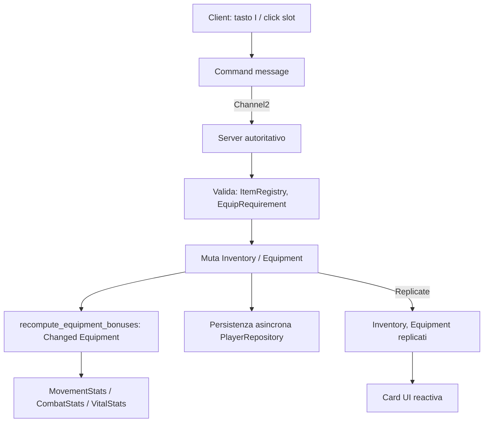
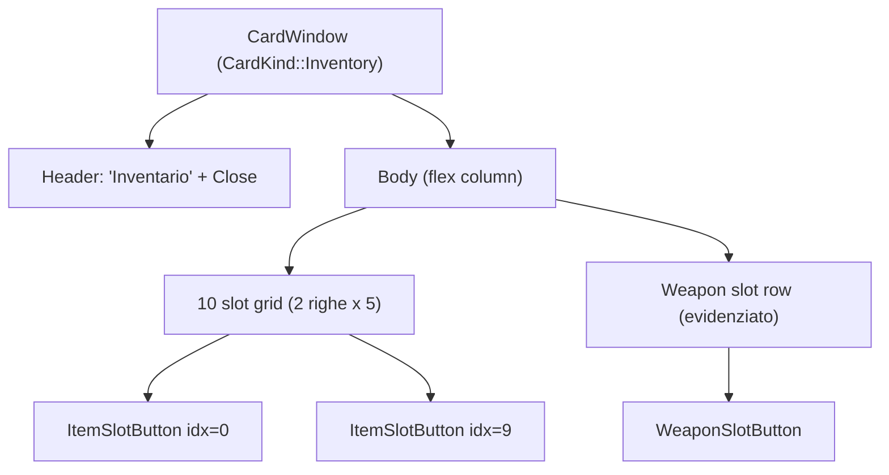

# Inventario, Items e UI Card riutilizzabile

## Goal Description

Implementare un sistema di **Inventario** apribile con `I`, composto da:

- Una **Card** (pannello modulare standard) con ~10 slot rettangolari generici + 1 **slot speciale per arma**.
- Un sistema di **Items** modellato come le `Spell` (`SpellId` / `SpellRegistry` / `Spell` trait): `ItemId` / `ItemRegistry` / `Item` trait.
- Interazione: cliccare un item nello slot apre una **Card di dettaglio** con stats e un pulsante **Equip / Unequip**.
- Equipaggiare un'arma (es. "Spada 1") applica effetti permanenti (es. `+1000 MaxHealth`) finché resta equipaggiata.

L'obiettivo secondario — ma strategicamente il più importante — è creare un **`Card` component UI riutilizzabile** che diventi lo standard per tutti i pannelli modulari futuri (inventario, spellbook, character sheet, tradeskill, ...).

## User Review Required

> [!IMPORTANT]
> Decisioni di design da confermare **prima dell'implementazione**:
>
> 1. **Stack degli item**: gli slot generici supportano `ItemStack { item_id, count }` (es. pozioni x50) o sono 1 item = 1 slot? Il piano assume **stack supportato** (`Option<ItemStack>`), con `max_stack` per-tipo. Se si vuole 1:1, si semplifica in `Option<ItemId>`.
> 2. **Griglia fissa vs espandibile**: 10 slot fissi (più semplice, persistenza stabile) o inventario espandibile (zaini, slots sbloccabili)? Il piano assume **10 fissi + 1 weapon**.
> 3. **Equip slot unico**: per ora solo 1 weapon slot. Voleremo prevedere già `EquipmentSlots { weapon, helmet, chest, ... }` anche se compilato solo `weapon`? Il piano propone **`Equipment` con un enum `EquipSlot`** così è estensibile senza migration future.
> 4. **Persistenza allo startup o solo su change**: il piano propone load-on-join (come `player_hotbar`) e save su ogni operazione autoritativa.

---

## Design Patterns

| Pattern | Dove | Perché |
|---|---|---|
| **Registry + Strategy** | `ItemRegistry` + `Item` trait | Specchia `SpellRegistry`/`Spell`. Aggiungere un item = nuovo tipo che implementa `Item`, nessuna modifica al core. |
| **Command** | `EquipItemCommand`, `MoveItemCommand`, `DropItemCommand` (network) | Il client non muta MAI stato autoritativo. Invia un command, il server valida + applica + replica. |
| **Builder** | `CardBuilder` (UI) | Costruire gerarchie `Node` di Bevy UI è verboso; il builder centralizza stile, padding, header/footer e tiene il call site leggibile. |
| **Observer / Reactive** | `recompute_equipment_bonuses` su `Changed<Equipment>` | Quando l'equip cambia, le stat derivate si ricalcolano da sole. Nessun codice "applica bonus" disperso nei comandi. |
| **Composition over inheritance** | `ItemEffect` enum composto in `Vec<ItemEffect>` | Un item può combinare `StatBonus` + `ProcOnHit` + `Aura`. Nessuna gerarchia `class WeaponItem : Item`, `class PotionItem : Item`. |
| **Specification (validator)** | `EquipRequirement` (livello, classe, ... futuro) | Server-side: una lista di regole riusabili. Per ora vuota, ma il hook c'è. |
| **DTO separation** | `StatsBundleData` già esistente | Base stats (DB) + equipment bonus (transient) → stats effettivi replicati. La composizione è già nel codebase. |

### Anti-pattern da evitare

- ❌ Client che muta `Inventory` / `Equipment` direttamente (anche per "ottimismo locale"): viola il principio server-authoritative del repo. Replicare `SpellHotbar` fa già la conciliazione.
- ❌ Mettere `Item` trait implementation dentro `bevymmo_shared`: il trait sì, le implementazioni concrete in `bevymmo_server` o `bins/game` (come `spells_impl` già separato da `spells`).
- ❌ `unwrap()` / `expect` sui lookup di rete. Usare early-return con `let Some(...) else { return };`.

---

## Architettura ad alto livello



**Regola d'oro** (gia valida per Spells/Hotbar): il client invia richieste e legge stato replicato. **Mai** mutare `Inventory`/`Equipment` sul client come sorgente di verità.

---

## Struttura file/codice proposta

### Shared (data + contracts) — `crates/shared/src/items/`

Specchia esattamente `crates/shared/src/spells/`.

```
crates/shared/src/items/
├── mod.rs           # pub mod + re-exports (pub use ...)
├── registry.rs      # ItemId, ItemRegistry  (copia di SpellRegistry)
├── definition.rs    # Item trait + ItemConfig + ItemCategory + ItemRarity
├── effects.rs       # ItemEffect enum + helper di composizione
├── components.rs    # ItemStack, Inventory, EquipSlot, Equipment
└── events.rs        # EquipItemCommand, UnequipItemCommand, MoveItemCommand
```

#### [NEW] `items/registry.rs`

Copia puntuale di `spells/registry.rs`:

```rust
#[derive(Debug, Clone, PartialEq, Eq, Hash, Serialize, Deserialize)]
pub struct ItemId(pub(crate) Cow<'static, str>);

#[derive(Resource, Default)]
pub struct ItemRegistry {
    items: HashMap<ItemId, Arc<dyn Item>>,
}

impl ItemRegistry {
    pub fn register(&mut self, item: Arc<dyn Item>);
    pub fn get(&self, id: &ItemId) -> Option<Arc<dyn Item>>;
    pub fn contains(&self, id: &ItemId) -> bool;
    /// Deterministica per la UI (come SpellRegistry::sorted_spells).
    pub fn sorted_items(&self) -> Vec<(ItemId, Arc<dyn Item>)>;
}
```

#### [NEW] `items/definition.rs`

Specchio di `spells/context.rs::Spell`:

```rust
/// Categoria narrativa, usata da UI e regole di equip.
#[derive(Debug, Clone, Copy, PartialEq, Eq, Serialize, Deserialize)]
pub enum ItemCategory {
    Weapon,
    Armor,
    Consumable,
    Material,
    Quest,
}

/// Rarità, puramente visiva per ora (colorazione del bordo slot).
#[derive(Debug, Clone, Copy, PartialEq, Eq, Serialize, Deserialize)]
pub enum ItemRarity {
    Common,
    Uncommon,
    Rare,
    Epic,
    Legendary,
}

/// Metadati statici condivisi da tutti gli item.
#[derive(Debug, Clone)]
pub struct ItemConfig {
    pub display_name: Cow<'static, str>,
    pub description: Cow<'static, str>,
    pub category: ItemCategory,
    pub rarity: ItemRarity,
    /// 1 = non impilabile; >1 = massimo stack in uno slot.
    pub max_stack: u32,
    /// Slot in cui questo item può andare (None = solo inventario).
    pub equippable_into: Option<EquipSlot>,
    /// Peso futuro (per encumbrance). 0 per ora.
    pub weight: f32,
}

/// Contratto che ogni item implementa.
///
/// # Example
/// ```ignore
/// let sword = IronSword::new();
/// registry.register(Arc::new(sword));
/// ```
pub trait Item: Send + Sync + 'static {
    fn id(&self) -> ItemId;
    fn config(&self) -> &ItemConfig;
    fn display_name(&self) -> &str { &self.config().display_name }
    fn effects(&self) -> &[ItemEffect];
    /// Requirements per equip (livello, classe). Vuoto = sempre equipabile.
    fn equip_requirements(&self) -> &[EquipRequirement] { &[] }
}
```

#### [NEW] `items/effects.rs`

Riutilizza lo **stesso** `StatField` / `ModifierOp` già esistente in `crates/shared/src/stats/events.rs` (zero duplicazione):

```rust
use crate::stats::events::{ModifierOp, StatField};

/// Effetto permanente applicato finché l'item è equipaggiato,
/// o effetto istantaneo se l'item è un consumable.
#[derive(Debug, Clone, PartialEq, Serialize, Deserialize)]
pub enum ItemEffect {
    /// Bonus stat permanente mentre equipaggiato (es. Spada 1: +1000 MaxHealth).
    StatBonus { field: StatField, op: ModifierOp, value: f32 },
    /// Curativo istantaneo (consumable). Riservato al futuro.
    InstantHeal { amount: f32 },
    // Future estensioni: ProcOnHit, Aura, OnUse ...
}
```

#### [NEW] `items/components.rs`

```rust
/// Slot dedicato (estensibile: oggi solo Weapon, domani Helmet/Chest/...).
#[derive(Debug, Clone, Copy, Serialize, Deserialize, PartialEq, Eq, Hash)]
pub enum EquipSlot {
    Weapon,
    // Helmet, Chest, Boots, Ring, ...  (vuoti per ora, già pronti)
}

#[derive(Debug, Clone, PartialEq, Serialize, Deserialize)]
pub struct ItemStack {
    pub item_id: ItemId,
    pub count: u32,
}

/// Inventario generico: 10 slot rettangolari, opzionalmente occupati.
///
/// La capacità (10) è costante: aggiungere/togliere slot richiede migration.
#[derive(Component, Debug, Clone, Default, Serialize, Deserialize, PartialEq)]
pub struct Inventory {
    pub slots: [Option<ItemStack>; INVENTORY_CAPACITY],
}

pub const INVENTORY_CAPACITY: usize = 10;

/// Equipaggiamento corrente. Replicato.
#[derive(Component, Debug, Clone, Default, Serialize, Deserialize, PartialEq)]
pub struct Equipment {
    pub weapon: Option<ItemId>,
    // helmet, chest, ... default None
}
```

`Inventory::slots` come array `[Option<_>; 10]` rende il layout deterministico e la UI stabile (slot 7 è sempre slot 7). Per evitare il `Default` su array grandi, 10 è ok; se cresce, passare a `Vec<Option<_>>` con capacità fissa.

#### [NEW] `items/events.rs` (network commands)

```rust
#[derive(Serialize, Deserialize, Clone, Debug, PartialEq)]
pub struct EquipItemCommand { pub slot_index: u8 }

#[derive(Serialize, Deserialize, Clone, Debug, PartialEq)]
pub struct UnequipItemCommand { pub slot: EquipSlot }

#[derive(Serialize, Deserialize, Clone, Debug, PartialEq)]
pub struct MoveItemCommand { pub from: u8, pub to: u8 }

#[derive(Serialize, Deserialize, Clone, Debug, PartialEq)]
pub struct DropItemCommand { pub slot_index: u8, pub count: u32 }
```

#### [MODIFY] `crates/shared/src/lib.rs` / `paths.rs`

Esportare il nuovo modulo `items` accanto a `spells`.

#### [MODIFY] `crates/shared/src/network/protocol.rs`

- Registrare i 4 nuovi message come `ClientToServer` su `Channel2` (stesso canale di `UpdateHotbarSlotRequest`).
- Replicare i componenti:
  ```rust
  app.component::<Inventory>().replicate().predict();
  app.component::<Equipment>().replicate().predict();
  ```
- `EquipSlot` deve derivare `Hash` (già fatto) per poter essere usato in `Changed<Equipment>`.

### Implementazioni concrete — `crates/shared/src/items_impl/`

Specchio di `crates/shared/src/spells_impl/` (separare contract da impl è già convenzione del repo).

```
crates/shared/src/items_impl/
├── mod.rs
└── iron_sword.rs       # "Spada 1" — +1000 MaxHealth
```

#### [NEW] `items_impl/iron_sword.rs`

```rust
use std::borrow::Cow;
use std::sync::Arc;
use bevymmo_shared::items::{EquipSlot, Item, ItemConfig, ItemEffect, ItemId};
use bevymmo_shared::stats::events::{ModifierOp, StatField};

pub struct IronSword {
    config: ItemConfig,
    effects: Vec<ItemEffect>,
}

impl IronSword {
    pub fn new() -> Self {
        Self {
            config: ItemConfig {
                display_name: Cow::Borrowed("Spada 1"),
                description: Cow::Borrowed("Una spada robusta che rafforza il portatore."),
                category: ItemCategory::Weapon,
                rarity: ItemRarity::Uncommon,
                max_stack: 1,
                equippable_into: Some(EquipSlot::Weapon),
                weight: 0.0,
            },
            effects: vec![ItemEffect::StatBonus {
                field: StatField::MaxHealth,
                op: ModifierOp::Add,
                value: 1000.0,
            }],
        }
    }
}

impl Item for IronSword {
    fn id(&self) -> ItemId { ItemId::new("iron_sword") }
    fn config(&self) -> &ItemConfig { &self.config }
    fn effects(&self) -> &[ItemEffect] { &self.effects }
}
```

> Nota: per il primo item usiamo `bevymmo_shared::items_impl` invece di `server`, così il client può mostrare nome/descrizione/effects nella UI senza round-trip. Solo l'**applicazione** degli effetti è server-side.

### Server autoritativo — `crates/server/src/items/`

```
crates/server/src/items/
├── mod.rs        # ItemPlugin: registra sistemi has_server
├── systems.rs    # handle_equip, handle_unequip, handle_move, handle_drop
└── bonuses.rs    # recompute_equipment_bonuses (Changed<Equipment>)
```

#### [NEW] `items/systems.rs`

Pattern da seguire: copia di `server/src/spells/systems.rs` e `network/server.rs::handle_update_hotbar_slot_requests`.

Ogni handler:

1. Legge il command dal `MessageManager` / `MessageSender` connesso al peer.
2. Risolve il player entity dal `PeerId`.
3. **Valida** contro `ItemRegistry` + `equip_requirements()`.
4. Muta `Inventory` / `Equipment` autoritativamente.
5. Persiste in async via `PersistenceRuntime` + `PlayerRepository` (come fa già `save_hotbar`).

#### [NEW] `items/bonuses.rs`

Sistema reattivo, il cuore del "ti da 1000 HP quando equipaggi":

```rust
/// Quando `Equipment` cambia, ricalcola il delta rispetto al bonus applicato
/// in precedenza e aggiorna le stat effettive replicate.
pub fn recompute_equipment_bonuses(
    mut players: Query<
        (&Equipment, &mut CombatStats, &mut VitalStats, &mut MovementStats, &mut AppliedEquipmentBonus),
        Changed<Equipment>,
    >,
    registry: Res<ItemRegistry>,
) {
    for (equipment, mut combat, mut vital, mut movement, mut applied) in &mut players {
        // 1. Rimuovi il bonus applicato in precedenza (revert).
        revert_bonus(&mut combat, &mut vital, &mut movement, &applied);
        // 2. Ricalcola nuovo bonus sommando gli effects di tutti gli item equipaggiati.
        let new_bonus = compute_bonus(equipment, &registry);
        // 3. Applica il nuovo bonus.
        apply_bonus(&mut combat, &mut vital, &mut movement, &new_bonus);
        // 4. Ricorda cosa hai applicato per poterlo revertire al prossimo cambio.
        applied.0 = new_bonus;
        // 5. clamp_health per gestire shrink di max_health.
        vital.clamp_health();
    }
}
```

**Perché revert + apply e non ricomputare da base**: le stat base vivono nel DB e sono la sorgente di verità assoluta. Aggiungere `AppliedEquipmentBonus` come componente transient ci permette di sottrarre solo ciò che avevamo aggiunto senza dover ricaricare da DB. È il pattern più semplice che rimane corretto anche con equip rapidi.

`AppliedEquipmentBonus` **non è replicato**: il client vede le stat post-bonus replicate normalmente.

### Persistenza — `crates/server/src/persistence/`

#### [NEW] `entity/player_inventory.rs`

SeaORM entity. Pattern identico a `entity/player_hotbar.rs`:

```rust
#[derive(Clone, Debug, PartialEq, DeriveEntityModel)]
#[sea_orm(table_name = "player_inventory")]
pub struct Model {
    #[sea_orm(primary_key, auto_increment = false)]
    pub player_id: Uuid,
    /// JSON array di 10 `{"item_id": "...", "count": N} | null`.
    /// Scelto JSON per non dover fare una tabella riga-per-slot
    /// (10 righe per player) e mantenere l'atomicità dell'update.
    pub slots_json: String,
    pub updated_at: DateTime,
}
```

**Scelta JSON vs tabella normalizzata**:
- JSON = 1 riga per player, update atomico, semplice. Buono per 10 slot.
- Tabella `player_inventory_items(player_id, slot_index, item_id, count)` = più flessibile per slot espandibili e query (es. "chi ha la spada X?"), ma più complessa.

Per ora **JSON** (corrisponde alla natura "array fisso" di `Inventory`). Se servono query cross-player, si migra dopo.

#### [NEW] `entity/player_equipment.rs`

```rust
#[derive(Clone, Debug, PartialEq, DeriveEntityModel)]
#[sea_orm(table_name = "player_equipment")]
pub struct Model {
    #[sea_orm(primary_key, auto_increment = false)]
    pub player_id: Uuid,
    pub weapon: Option<String>,
    pub updated_at: DateTime,
}
```

#### [NEW] `migrations/m20260807_000007_create_player_inventory_and_equipment.rs`

Crea le due tabelle con FK `player_id → players.id ON DELETE CASCADE`. Segue lo stile di `m20260806_000006_create_player_hotbar.rs`.

#### [MODIFY] `migrations/mod.rs`

Registrare la nuova migration dopo `000006`.

#### [MODIFY] `repository/player.rs`

- Aggiungere `load_inventory`, `save_inventory`, `load_or_create_default_inventory`.
- Stesso per `Equipment`.
- Estendere `PersistedPlayerSnapshot` con `inventory: Inventory` ed `equipment: Equipment`.
- Aggiornare il flusso di load-on-join e save-on-snapshot esattamente come già fatto per `SpellHotbar`.

### Client — nessuna logica di gameplay

Il client deve solo:
- leggere `Inventory` / `Equipment` replicati;
- inviare i 4 command su `Channel2`;
- renderizzare la Card.

Nessuna validazione client-side. Il server scarta silenziosamente richieste invalide (con `log::warn!` come fa `handle_update_hotbar_slot_requests`).

---

## Componente UI Card riutilizzabile (richiesta esplicita)

Questo è il deliverable architetturale più importante: oggi ogni pannello (`spellbook`, `pause_menu`, `settings`, ...) si costruisce il proprio `Node` tree duplicando header/padding/close button. Creare un **`Card` standard** ora permette di rifattorizzare retroattivamente e di usarlo per inventario, character sheet, trade, etc.

### [NEW] `crates/presentation/src/ui/card/`

```
crates/presentation/src/ui/card/
├── mod.rs          # CardPlugin (registra sistemi di interazione globali)
├── components.rs   # CardWindow, CardHeader, CardBody, CardFooter, CloseCardButton
├── builder.rs      # CardBuilder (Builder pattern)
└── systems.rs      # close_card_on_button, close_card_on_esc
```

#### `components.rs`

```rust
/// Marker del pannello radice. Una Card = un `CardWindow`.
#[derive(Component)]
pub struct CardWindow {
    /// Identifica quale tipo di card è (per debug, ESC mirato, focus mgmt).
    pub kind: CardKind,
}

#[derive(Debug, Clone, Copy, PartialEq, Eq)]
pub enum CardKind {
    Inventory,
    ItemDetail,
    Spellbook,
    CharacterSheet,
    Settings,
    Generic,
}

#[derive(Component)]
pub struct CardHeader;

#[derive(Component)]
pub struct CardBody;

#[derive(Component)]
pub struct CardFooter;

#[derive(Component)]
pub struct CloseCardButton {
    pub kind: CardKind,
}
```

#### `builder.rs` — il cuore del riuso

```rust
/// Builder per una Card standard.
///
/// Tutti i pannelli futuri passano per qui invece di costruire
/// `Node` a mano. Garantisce header/footer/padding/tema uniformi.
///
/// # Example
/// ```ignore
/// CardBuilder::new(CardKind::Inventory, "Inventario")
///     .width(Val::Px(720.0))
///     .height(Val::Px(480.0))
///     .with_body(|body| {
///         // spawn figli custom
///     })
///     .with_footer(|footer| { /* pulsanti azione */ })
///     .spawn(&mut commands, &theme);
/// ```
pub struct CardBuilder<'a> {
    kind: CardKind,
    title: Cow<'a, str>,
    width: Val,
    height: Val,
    body: Box<dyn FnOnce(&mut ChildSpawnerCommands) + 'a>,
    footer: Option<Box<dyn FnOnce(&mut ChildSpawnerCommands) + 'a>>,
    closeable: bool,
}

impl<'a> CardBuilder<'a> {
    pub fn new(kind: CardKind, title: impl Into<Cow<'a, str>>) -> Self { /* ... */ }
    pub fn width(mut self, v: Val) -> Self { self.width = v; self }
    pub fn height(mut self, v: Val) -> Self { self.height = v; self }
    pub fn with_body<F>(mut self, f: F) -> Self
        where F: FnOnce(&mut ChildSpawnerCommands) + 'a { self.body = Box::new(f); self }
    pub fn with_footer<F>(mut self, f: F) -> Self
        where F: FnOnce(&mut ChildSpawnerCommands) + 'a { self.footer = Some(Box::new(f)); self }
    pub fn closeable(mut self, closeable: bool) -> Self { self.closeable = closeable; self }
    pub fn spawn(self, commands: &mut Commands<'_, '_>, theme: &UiTheme) -> Entity { /* ... */ }
}
```

Il builder:
- genera il `Node` radice con `CardWindow { kind }`, centrato assoluto, `BackgroundColor(theme.panel_bg)`;
- aggiunge header con `title` + (opzionale) close button con `CloseCardButton { kind }`;
- delega al chiamante body e footer;
- applica padding/font-size dal tema (nessun hardcoding).

#### `systems.rs`

```rust
/// Click su CloseCardButton → despawn del CardWindow padre.
pub fn close_card_on_button(
    interactions: Query<(&Interaction, &CloseCardButton, Entity), Changed<Interaction>>,
    parents: Query<&Parent>,
    mut commands: Commands,
) { /* traversal up fino a CardWindow, despawn */ }

/// ESC chiude l'ultima Card aperta (LIFO su z-order).
/// Per ora chiude tutte le card di tipo != None. Migliorabile in futuro.
pub fn close_card_on_esc(
    keys: Res<ButtonInput<KeyCode>>,
    cards: Query<Entity, With<CardWindow>>,
    mut commands: Commands,
) {
    if keys.just_pressed(KeyCode::Escape) {
        for entity in cards.iter() { commands.entity(entity).despawn(); }
    }
}
```

#### [MODIFY] `crates/presentation/src/ui/plugin.rs`

```rust
app.add_plugins(card::CardPlugin);
```

### Retrofit (consigliato, non obbligatorio nel primo PR)

Dopo aver verificato che l'inventario funziona, rifattorizzare `ui/spellbook` per usare `CardBuilder`. Questo validae il riuso. Lasciarlo come follow-up separato per non gonfiare il PR.

---

## UI Inventario — `crates/presentation/src/ui/inventory/`

```
crates/presentation/src/ui/inventory/
├── mod.rs          # InventoryUiPlugin
├── components.rs   # marker UI: InventoryWindow, ItemSlotButton, EquipButton, UnequipButton, WeaponSlotButton, ItemDetailCard
├── systems.rs      # toggle, build, handle_clicks, refresh_visuals
└── detail.rs       # spawn della Card di dettaglio item (costruita con CardBuilder)
```

#### `mod.rs`

```rust
#[derive(Resource, Default)]
pub struct InventoryUiState {
    pub is_open: bool,
    /// Slot index (0..10) o EquipSlot attualmente selezionato per il detail.
    pub selected: Option<InventorySelection>,
}

pub enum InventorySelection { Slot(u8), Weapon }

pub struct InventoryUiPlugin;

impl Plugin for InventoryUiPlugin {
    fn build(&self, app: &mut App) {
        app.init_resource::<InventoryUiState>();
        app.add_systems(Update, (
            systems::toggle_inventory,           // tasto I
            systems::rebuild_inventory_if_dirty, // spawn/despawn CardWindow principale
            systems::refresh_slot_visuals,       // update colori/testi senza rebuild
            systems::handle_slot_clicks,         // apri detail card
            systems::handle_detail_actions,      // equip/unequip/drop
        ).chain().run_if(has_client).run_if(in_gameplay_or_paused));
    }
}
```

#### Layout (gestione CardBuilder)



Quando l'utente clicca `ItemSlotButton { index }`:
1. `InventoryUiState.selected = Some(InventorySelection::Slot(index))`.
2. `detail.rs::spawn_item_detail_card` apre una seconda `CardWindow (CardKind::ItemDetail)` con `CardBuilder`:
   - Header: nome item dal `ItemRegistry`.
   - Body: descrizione + lista `ItemEffect` formattati (es. "+1000 Max Health").
   - Footer: pulsanti **Equip** (se `equippable_into.is_some()`) + **Drop** + **Close**.
3. Se l'item nello slot è già quello equipaggiato nel weapon slot, il pulsante diventa **Unequip**.

#### Refresh senza rebuild

Come `update_spellbook_ui` già fa per le label della hotbar, usare una query su `ItemSlotButton` per aggiornare testo/colore in-place quando `Inventory` cambia, invece di despawnare tutto. Il rebuild completo avviene solo su open/close.

#### Apertura con I

`toggle_inventory` è il gemello di `toggle_spellbook` (che usa `K`). Stesso pattern:
- `keys.just_pressed(KeyCode::KeyI)` flip `is_open`;
- despawn `CardWindow(CardKind::Inventory)` e `CardWindow(CardKind::ItemDetail)` quando si chiude;
- impedire overlap con `SpellbookUiState` se necessario (mutua esclusione: aprire l'inventario chiude lo spellbook).

---

## Sequenza di implementazione (consigliata)

Ordine per ridurre risk e validare presto:

1. **Card UI** (`ui/card/`) — senza logica di gameplay. PR standalone. Valida il riuso sullo spellbook retrofit.
2. **Shared data** (`items/`, `items_impl/iron_sword.rs`) — tipi + registry + 1 item. Test unitari su `ItemRegistry`.
3. **Network protocol** — registra command + replica componenti. Compila, ma nessun handler.
4. **Server handlers** (`items/systems.rs`, `items/bonuses.rs`) + **persistenza** (entity + migration + repository). Test con `host-client`.
5. **UI inventario** (`ui/inventory/`) sopra `CardBuilder`.
6. **Item detail card** (equip/unequip flow end-to-end).
7. **Retrofit spellbook** con `CardBuilder` (follow-up separato).

---

## Verification Plan

### Automated

```bash
cargo test
cargo clippy -- -D warnings
```

Test mirati da aggiungere:
- `ItemRegistry::register` + `get` + `sorted_items` determinismo.
- `IronSword::effects()` contiene `+1000 MaxHealth`.
- `recompute_equipment_bonuses`: equip → vital.max_health += 1000; unequip → -= 1000; clamp rispettato.
- Repository: `load_or_create_default_inventory` ritorna 10 slot vuoti per nuovo player.
- Migration: su DB pulito le tabelle `player_inventory` e `player_equipment` esistono.

### Manual

```bash
docker compose up -d
cargo run -- host-client
```

1. Entra in gioco.
2. Premi `I`: si apre la Card Inventario con 10 slot vuoti + weapon slot vuoto.
3. (Setup test) spawnare `iron_sword` in `Inventory.slots[0]` via comando/debug.
4. Clicca lo slot 0: si apre la Card dettaglio con "Spada 1", "+1000 Max Health", pulsante **Equip**.
5. Clicca Equip: weapon slot si popola, `VitalStats.max_health` sale di 1000, HUD HP bar si aggiorna.
6. Riapri dettaglio: il pulsante è ora **Unequip**.
7. Clicca Unequip: max_health torna al valore base.
8. Premi `I` di nuovo: chiude. Premi `Esc`: chiude tutte le card.
9. Disconnetti/riconnetti: inventario ed equipment persistono.

---

## Domande aperte per Alessandro

1. **Stack**: confermi `ItemStack { count }` o preferisci 1 item = 1 slot per ora?
2. **Equip multi-slot**: confermi `Equipment { weapon, /* helmet, chest预留 */ }` anche se ora solo weapon?
3. **Persistenza JSON**: ok memorizzare i 10 slot come JSON in una riga, o preferisci tabella normalizzata?
4. **Mutua esclusione UI**: aprire l'inventario deve chiudere spellbook (e viceversa), o possono coesistere?
5. **Primo PR**: confermi l'ordine "Card UI per primo, standalone" come da sequenza proposta, o vuoi fare tutto in un unico PR grande?
6. **Drop a terra**: il command `DropItemCommand` è nel piano ma la sua semantica (spawn di un'entità world pickup) non lo è. Lo rimandiamo a un secondo momento?
