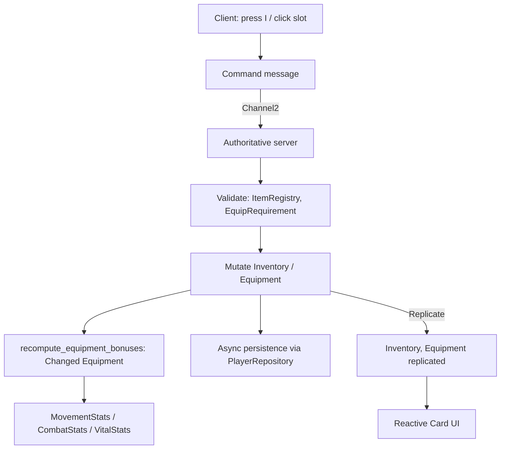
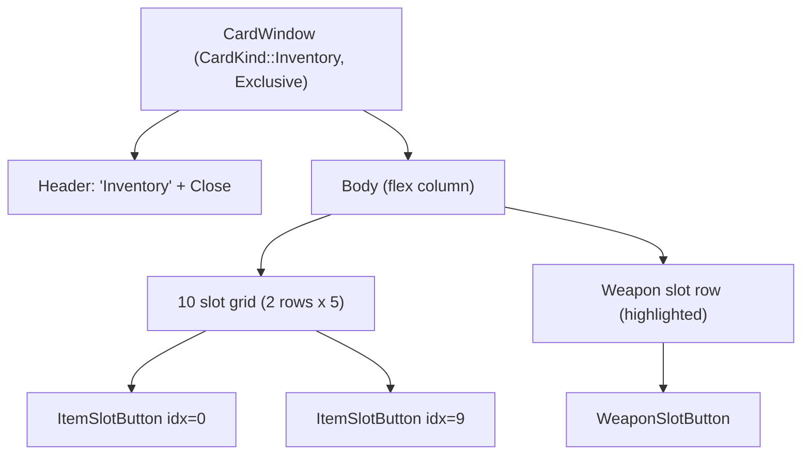

# Inventory, Items and Reusable UI Card

## Goal Description

Implement an **Inventory** system, opened with the `I` key, composed of:

- A **Card** (modular standard panel) with ~10 generic rectangular slots + 1 **special weapon slot**.
- An **Items** system modeled after `Spell` (`SpellId` / `SpellRegistry` / `Spell` trait): `ItemId` / `ItemRegistry` / `Item` trait.
- Interaction: clicking an item in a slot opens a **detail Card** showing stats and an **Equip / Unequip** button.
- Equipping a weapon (e.g. "Spada 1") applies permanent effects (e.g. `+1000 MaxHealth`) for as long as it stays equipped.

The secondary goal — strategically the most important — is to build a **reusable `Card` UI component** that becomes the standard for every future modular panel (inventory, spellbook, character sheet, tradeskill, ...).

## Decisions Confirmed

> Resolved upfront based on the author's review. These are no longer open questions.

1. **Stacking**: NOT supported for now. **1 item = 1 slot.** `Inventory.slots` becomes `[Option<ItemId>; INVENTORY_CAPACITY]`. No `ItemStack` struct, no `count` field. `max_stack` is dropped from `ItemConfig` (we can reintroduce it later via a migration).
2. **Multi-slot equipment**: `Equipment { weapon, /* helmet, chest, ... */ }` is the long-term shape even though only `weapon` is populated for now. Reserved fields are commented placeholders.
3. **Persistence**: MUST persist to the database. Both `Inventory` and `Equipment` get their own tables and SeaORM entities. Same async-save pattern as `player_hotbar`.
4. **Card exclusivity flag**: each `Card` declares an `exclusivity_policy`:
   - `Exclusive` → opening it closes every other open Card (and vice-versa, the previously-exclusive card is replaced);
   - `Coexist` → can be opened alongside other cards (e.g. the item-detail card coexisting with the inventory card).
   This replaces the old "mutual exclusion" question: instead of hardcoding pairs, every card states its own behavior.
5. **First PR**: confirmed. PR 1 = **Card UI component only**, standalone, no gameplay. The inventory itself lands in a later PR.
6. **Drop on the ground**: deferred. `DropItemCommand` is NOT included in this plan. It will be its own follow-up when world-pickup entities exist.

---

## Design Patterns

| Pattern | Where | Why |
|---|---|---|
| **Registry + Strategy** | `ItemRegistry` + `Item` trait | Mirrors `SpellRegistry`/`Spell`. Adding an item = new type implementing `Item`, no core change. |
| **Command** | `EquipItemCommand`, `UnequipItemCommand`, `MoveItemCommand` (network) | The client NEVER mutates authoritative state. It sends a command; the server validates + applies + replicates. |
| **Builder** | `CardBuilder` (UI) | Building Bevy UI `Node` hierarchies is verbose; the builder centralizes style, padding, header/footer, exclusivity, and keeps the call site readable. |
| **Observer / Reactive** | `recompute_equipment_bonuses` on `Changed<Equipment>` | When equipment changes, derived stats recompute themselves. No "apply bonus" code scattered across command handlers. |
| **Composition over inheritance** | `ItemEffect` enum composed in `Vec<ItemEffect>` | An item can combine `StatBonus` + `ProcOnHit` + `Aura`. No `class WeaponItem : Item`, `class PotionItem : Item`. |
| **Specification (validator)** | `EquipRequirement` (level, class, ... future) | Server-side: a reusable list of rules. Empty for now, but the hook is in place. |
| **Policy Object** | `CardExclusivityPolicy` enum on `CardWindow` | Each card declares whether it is `Exclusive` or `Coexist`. The close-others system reads this instead of hardcoded pairs. |
| **DTO separation** | `StatsBundleData` already exists | Base stats (DB) + equipment bonus (transient) → effective replicated stats. Composition is already in the codebase. |

### Anti-patterns to avoid

- ❌ Client mutating `Inventory` / `Equipment` directly (even "optimistic"): violates the repo's server-authoritative principle. Replicating `SpellHotbar` already does reconciliation for free; do the same here.
- ❌ Putting the `Item` trait implementation inside `bevymmo_shared` proper: the trait lives in `shared`, concrete implementations live in `items_impl/` (mirroring the existing `spells_impl` / `spells` split).
- ❌ `unwrap()` / `expect` on network lookups. Use early returns with `let Some(...) else { return };`.
- ❌ Hardcoding "inventory closes spellbook" in two places. Use the `CardExclusivityPolicy` on the card itself.

---

## High-Level Architecture



**Golden rule** (already true for Spells/Hotbar): the client sends requests and reads replicated state. It NEVER mutates `Inventory`/`Equipment` as the source of truth.

---

## Proposed File / Code Structure

### Shared (data + contracts) — `crates/shared/src/items/`

Mirrors `crates/shared/src/spells/` exactly.

```
crates/shared/src/items/
├── mod.rs           # pub mod + re-exports (pub use ...)
├── registry.rs      # ItemId, ItemRegistry   (copy of SpellRegistry)
├── definition.rs    # Item trait + ItemConfig + ItemCategory + ItemRarity
├── effects.rs       # ItemEffect enum + composition helpers
├── components.rs    # EquipSlot, Inventory, Equipment
└── events.rs        # EquipItemCommand, UnequipItemCommand, MoveItemCommand
```

#### [NEW] `items/registry.rs`

Line-for-line copy of `spells/registry.rs`:

```rust
#[derive(Debug, Clone, PartialEq, Eq, Hash, Serialize, Deserialize)]
pub struct ItemId(pub(crate) Cow<'static, str>);

impl ItemId {
    pub fn new(id: impl Into<Cow<'static, str>>) -> Self { Self(id.into()) }
    pub fn as_str(&self) -> &str { &self.0 }
}

#[derive(Resource, Default)]
pub struct ItemRegistry {
    items: HashMap<ItemId, Arc<dyn Item>>,
}

impl ItemRegistry {
    pub fn register(&mut self, item: Arc<dyn Item>);
    pub fn get(&self, id: &ItemId) -> Option<Arc<dyn Item>>;
    pub fn contains(&self, id: &ItemId) -> bool;
    /// Deterministic order for UI (mirrors SpellRegistry::sorted_spells).
    pub fn sorted_items(&self) -> Vec<(ItemId, Arc<dyn Item>)>;
}
```

#### [NEW] `items/definition.rs`

Mirror of `spells/context.rs::Spell`:

```rust
/// Narrative category, used by UI and equip rules.
#[derive(Debug, Clone, Copy, PartialEq, Eq, Serialize, Deserialize)]
pub enum ItemCategory {
    Weapon,
    Armor,
    Consumable,
    Material,
    Quest,
}

/// Rarity, purely cosmetic for now (slot border color).
#[derive(Debug, Clone, Copy, PartialEq, Eq, Serialize, Deserialize)]
pub enum ItemRarity {
    Common,
    Uncommon,
    Rare,
    Epic,
    Legendary,
}

/// Static metadata shared by all items.
///
/// `max_stack` is intentionally absent: 1 item = 1 slot (decision #1).
/// It can be reintroduced later without breaking the schema.
#[derive(Debug, Clone)]
pub struct ItemConfig {
    pub display_name: Cow<'static, str>,
    pub description: Cow<'static, str>,
    pub category: ItemCategory,
    pub rarity: ItemRarity,
    /// Slot this item can be equipped into (None = inventory-only).
    pub equippable_into: Option<EquipSlot>,
    /// Reserved for future encumbrance. 0 for now.
    pub weight: f32,
}

/// Contract every item implements.
///
/// # Example
/// ```ignore
/// let sword = IronSword::new();
/// registry.register(Arc::new(sword));
/// ```
pub trait Item: Send + Sync + 'static {
    fn id(&self) -> ItemId;
    fn config(&self) -> &ItemConfig;
    fn display_name(&self) -> &str { &self.config().display_name }
    fn effects(&self) -> &[ItemEffect];
    /// Equip requirements (level, class). Empty = always equippable.
    fn equip_requirements(&self) -> &[EquipRequirement] { &[] }
}
```

#### [NEW] `items/effects.rs`

Reuses the **same** `StatField` / `ModifierOp` already defined in `crates/shared/src/stats/events.rs` (zero duplication):

```rust
use crate::stats::events::{ModifierOp, StatField};

/// Effect applied while the item is equipped, or instant for consumables.
#[derive(Debug, Clone, PartialEq, Serialize, Deserialize)]
pub enum ItemEffect {
    /// Permanent stat bonus while equipped (e.g. "Spada 1": +1000 MaxHealth).
    StatBonus { field: StatField, op: ModifierOp, value: f32 },
    /// Instant heal (consumable). Reserved for the future.
    InstantHeal { amount: f32 },
    // Future extensions: ProcOnHit, Aura, OnUse ...
}
```

#### [NEW] `items/components.rs`

```rust
/// Dedicated equipment slot (extensible: today only Weapon, tomorrow Helmet/Chest/...).
#[derive(Debug, Clone, Copy, Serialize, Deserialize, PartialEq, Eq, Hash)]
pub enum EquipSlot {
    Weapon,
    // Helmet, Chest, Boots, Ring, ...  (empty for now, ready to extend)
}

pub const INVENTORY_CAPACITY: usize = 10;

/// Generic inventory: 10 rectangular slots, optionally occupied.
/// Decision #1: 1 item = 1 slot. No count, no ItemStack.
///
/// The capacity (10) is constant: adding/removing slots requires a migration.
#[derive(Component, Debug, Clone, Default, Serialize, Deserialize, PartialEq)]
pub struct Inventory {
    pub slots: [Option<ItemId>; INVENTORY_CAPACITY],
}

/// Current equipment. Replicated.
#[derive(Component, Debug, Clone, Default, Serialize, Deserialize, PartialEq)]
pub struct Equipment {
    pub weapon: Option<ItemId>,
    // helmet, chest, ... default None (decision #2: multi-slot-ready shape)
}
```

`Inventory::slots` as a `[Option<_>; 10]` array keeps the layout deterministic and the UI stable (slot 7 is always slot 7). If capacity grows past ~16 in the future, switch to `Vec<Option<_>>` with a fixed capacity.

#### [NEW] `items/events.rs` (network commands)

```rust
#[derive(Serialize, Deserialize, Clone, Debug, PartialEq)]
pub struct EquipItemCommand { pub slot_index: u8 }

#[derive(Serialize, Deserialize, Clone, Debug, PartialEq)]
pub struct UnequipItemCommand { pub slot: EquipSlot }

#[derive(Serialize, Deserialize, Clone, Debug, PartialEq)]
pub struct MoveItemCommand { pub from: u8, pub to: u8 }
```

`DropItemCommand` is intentionally omitted (decision #6: deferred).

#### [MODIFY] `crates/shared/src/lib.rs` / `paths.rs`

Export the new `items` module alongside `spells`.

#### [MODIFY] `crates/shared/src/network/protocol.rs`

- Register the 3 new messages as `ClientToServer` on `Channel2` (same channel as `UpdateHotbarSlotRequest`).
- Replicate the components:
  ```rust
  app.component::<Inventory>().replicate().predict();
  app.component::<Equipment>().replicate().predict();
  ```
- `EquipSlot` already derives `Hash`, so it can be used in `Changed<Equipment>`.

### Concrete implementations — `crates/shared/src/items_impl/`

Mirrors `crates/shared/src/spells_impl/` (separating contracts from implementations is already a repo convention).

```
crates/shared/src/items_impl/
├── mod.rs
└── iron_sword.rs       # "Spada 1" — +1000 MaxHealth
```

#### [NEW] `items_impl/iron_sword.rs`

```rust
use std::borrow::Cow;
use bevymmo_shared::items::{
    definition::{ItemCategory, ItemConfig, ItemRarity},
    effects::ItemEffect,
    components::EquipSlot,
    registry::{Item, ItemId},
};
use bevymmo_shared::stats::events::{ModifierOp, StatField};

pub struct IronSword {
    config: ItemConfig,
    effects: Vec<ItemEffect>,
}

impl IronSword {
    pub fn new() -> Self {
        Self {
            config: ItemConfig {
                display_name: Cow::Borrowed("Spada 1"),
                description: Cow::Borrowed("A sturdy sword that strengthens its wielder."),
                category: ItemCategory::Weapon,
                rarity: ItemRarity::Uncommon,
                equippable_into: Some(EquipSlot::Weapon),
                weight: 0.0,
            },
            effects: vec![ItemEffect::StatBonus {
                field: StatField::MaxHealth,
                op: ModifierOp::Add,
                value: 1000.0,
            }],
        }
    }
}

impl Default for IronSword {
    fn default() -> Self { Self::new() }
}

impl Item for IronSword {
    fn id(&self) -> ItemId { ItemId::new("iron_sword") }
    fn config(&self) -> &ItemConfig { &self.config }
    fn effects(&self) -> &[ItemEffect] { &self.effects }
}
```

> Note: the first item lives in `bevymmo_shared::items_impl` rather than `server`, so the client can render name/description/effects in the UI without a round-trip. Only the **application** of effects is server-side.

### Authoritative server — `crates/server/src/items/`

```
crates/server/src/items/
├── mod.rs        # ItemPlugin: registers has_server systems
├── systems.rs    # handle_equip, handle_unequip, handle_move
└── bonuses.rs    # recompute_equipment_bonuses (Changed<Equipment>)
```

#### [NEW] `items/systems.rs`

Pattern to follow: copy of `server/src/spells/systems.rs` and `network/server.rs::handle_update_hotbar_slot_requests`.

Each handler:

1. Reads the command from the `MessageManager` / `MessageSender` bound to the peer.
2. Resolves the player entity from the `PeerId`.
3. **Validates** against `ItemRegistry` + `equip_requirements()`.
4. Mutates `Inventory` / `Equipment` authoritatively.
5. Persists asynchronously via `PersistenceRuntime` + `PlayerRepository` (exactly like `save_hotbar` already does).

#### [NEW] `items/bonuses.rs`

Reactive system — the heart of "you get +1000 HP while equipped":

```rust
/// When `Equipment` changes, recompute the delta against the previously
/// applied bonus and update the effective replicated stats.
pub fn recompute_equipment_bonuses(
    mut players: Query<
        (&Equipment, &mut CombatStats, &mut VitalStats, &mut MovementStats,
         &mut AppliedEquipmentBonus),
        Changed<Equipment>,
    >,
    registry: Res<ItemRegistry>,
) {
    for (equipment, mut combat, mut vital, mut movement, mut applied) in &mut players {
        // 1. Revert the previously applied bonus.
        revert_bonus(&mut combat, &mut vital, &mut movement, &applied);
        // 2. Recompute the new bonus by summing effects of all equipped items.
        let new_bonus = compute_bonus(equipment, &registry);
        // 3. Apply the new bonus.
        apply_bonus(&mut combat, &mut vital, &mut movement, &new_bonus);
        // 4. Remember what was applied so we can revert it on the next change.
        applied.0 = new_bonus;
        // 5. clamp_health to handle shrinking max_health.
        vital.clamp_health();
    }
}
```

**Why revert + apply instead of recomputing from base**: base stats live in the DB and are the absolute source of truth. Adding `AppliedEquipmentBonus` as a transient component lets us subtract only what we previously added, without reloading from the DB. It is the simplest pattern that stays correct under rapid equip/unequip.

`AppliedEquipmentBonus` is **not replicated**: the client sees the post-bonus stats replicated normally.

### Persistence — `crates/server/src/persistence/`

Decision #3: full database persistence, two new tables.

#### [NEW] `entity/player_inventory.rs`

SeaORM entity. Same pattern as `entity/player_hotbar.rs`:

```rust
#[derive(Clone, Debug, PartialEq, DeriveEntityModel)]
#[sea_orm(table_name = "player_inventory")]
pub struct Model {
    #[sea_orm(primary_key, auto_increment = false)]
    pub player_id: Uuid,
    /// JSON array of 10 entries: either null or {"id": "..."}.
    /// JSON is chosen because the schema is a fixed-size array:
    /// one row per player, atomic update, no joins.
    pub slots_json: String,
    pub updated_at: DateTime,
}
```

**Why JSON, not a normalized table**: with a fixed 10-slot layout, one row per player gives atomic updates and trivial load/save. A normalized `player_inventory_items(player_id, slot_index, item_id)` table would only pay off if slots were expandable or if we needed cross-player queries ("who owns the iron sword?"). Neither is needed now; we can migrate later if it becomes necessary.

#### [NEW] `entity/player_equipment.rs`

```rust
#[derive(Clone, Debug, PartialEq, DeriveEntityModel)]
#[sea_orm(table_name = "player_equipment")]
pub struct Model {
    #[sea_orm(primary_key, auto_increment = false)]
    pub player_id: Uuid,
    pub weapon: Option<String>,
    // helmet, chest, ... added by future migrations.
    pub updated_at: DateTime,
}
```

#### [NEW] `migrations/m20260807_000007_create_player_inventory_and_equipment.rs`

Creates both tables with FK `player_id -> players.id ON DELETE CASCADE`. Follows the style of `m20260806_000006_create_player_hotbar.rs`.

#### [MODIFY] `migrations/mod.rs`

Register the new migration after `000006`.

#### [MODIFY] `repository/player.rs`

- Add `load_inventory`, `save_inventory`, `load_or_create_default_inventory` (returns 10 empty slots for a new player).
- Same for `Equipment`.
- Extend `PersistedPlayerSnapshot` with `inventory: Inventory` and `equipment: Equipment`.
- Update the load-on-join and save-on-snapshot flows exactly as already done for `SpellHotbar`.

### Client — no gameplay logic

The client only:
- reads replicated `Inventory` / `Equipment`;
- sends the 3 commands on `Channel2`;
- renders the Card.

No client-side validation. The server silently drops invalid requests (with `log::warn!`, like `handle_update_hotbar_slot_requests` already does).

---

## Reusable UI Card Component (explicit request)

This is the most important architectural deliverable: today every panel (`spellbook`, `pause_menu`, `settings`, ...) builds its own `Node` tree, duplicating header / padding / close button. Building a **standard `Card`** now lets us refactor the existing panels and use it for inventory, character sheet, trade, etc.

### [NEW] `crates/presentation/src/ui/card/`

```
crates/presentation/src/ui/card/
├── mod.rs          # CardPlugin (registers global interaction systems)
├── components.rs   # CardWindow, CardHeader, CardBody, CardFooter, CloseCardButton, CardExclusivityPolicy
├── builder.rs      # CardBuilder (Builder pattern)
└── systems.rs      # close_card_on_button, close_card_on_esc, enforce_exclusivity
```

#### `components.rs` — including decision #4 (exclusivity policy)

```rust
/// Marker for the root panel. One Card = one `CardWindow`.
#[derive(Component)]
pub struct CardWindow {
    pub kind: CardKind,
    /// Decision #4: how this card interacts with other open cards.
    pub exclusivity: CardExclusivityPolicy,
}

#[derive(Debug, Clone, Copy, PartialEq, Eq)]
pub enum CardKind {
    Inventory,
    ItemDetail,
    Spellbook,
    CharacterSheet,
    Settings,
    Generic,
}

/// Policy Object (Design Pattern): every card declares its own behavior,
/// instead of hardcoding "inventory closes spellbook" in two places.
#[derive(Debug, Clone, Copy, PartialEq, Eq, Default)]
pub enum CardExclusivityPolicy {
    /// Opening this card closes every other currently open card,
    /// and any later `Exclusive` card will replace this one.
    #[default]
    Exclusive,
    /// Can be opened alongside other cards (e.g. the item-detail card
    /// next to the inventory card).
    Coexist,
}

#[derive(Component)]
pub struct CardHeader;

#[derive(Component)]
pub struct CardBody;

#[derive(Component)]
pub struct CardFooter;

#[derive(Component)]
pub struct CloseCardButton {
    pub kind: CardKind,
}
```

#### `builder.rs` — the heart of reuse

```rust
/// Builder for a standard Card.
///
/// All future panels go through here instead of building `Node` trees
/// by hand. Guarantees uniform header/footer/padding/theme and a single
/// place to evolve the look-and-feel.
///
/// # Example
/// ```ignore
/// CardBuilder::new(CardKind::Inventory, "Inventory")
///     .width(Val::Px(720.0))
///     .height(Val::Px(480.0))
///     .exclusivity(CardExclusivityPolicy::Exclusive)
///     .with_body(|body| {
///         // custom children
///     })
///     .with_footer(|footer| { /* action buttons */ })
///     .spawn(&mut commands, &theme);
/// ```
pub struct CardBuilder<'a> {
    kind: CardKind,
    title: Cow<'a, str>,
    width: Val,
    height: Val,
    exclusivity: CardExclusivityPolicy,
    closeable: bool,
    body: Box<dyn FnOnce(&mut ChildSpawnerCommands) + 'a>,
    footer: Option<Box<dyn FnOnce(&mut ChildSpawnerCommands) + 'a>>,
}

impl<'a> CardBuilder<'a> {
    pub fn new(kind: CardKind, title: impl Into<Cow<'a, str>>) -> Self { /* ... */ }
    pub fn width(mut self, v: Val) -> Self { self.width = v; self }
    pub fn height(mut self, v: Val) -> Self { self.height = v; self }
    pub fn exclusivity(mut self, p: CardExclusivityPolicy) -> Self { self.exclusivity = p; self }
    pub fn closeable(mut self, closeable: bool) -> Self { self.closeable = closeable; self }
    pub fn with_body<F>(mut self, f: F) -> Self
        where F: FnOnce(&mut ChildSpawnerCommands) + 'a { self.body = Box::new(f); self }
    pub fn with_footer<F>(mut self, f: F) -> Self
        where F: FnOnce(&mut ChildSpawnerCommands) + 'a { self.footer = Some(Box::new(f)); self }
    pub fn spawn(self, commands: &mut Commands<'_, '_>, theme: &UiTheme) -> Entity { /* ... */ }
}
```

The builder:
- spawns the root `Node` with `CardWindow { kind, exclusivity }`, absolute-centered, `BackgroundColor(theme.panel_bg)`;
- adds a header with the `title` + (optional) close button carrying `CloseCardButton { kind }`;
- delegates body and footer to the caller;
- applies padding/font-size from the theme (no hardcoding).

#### `systems.rs` — global card behavior

```rust
/// Click on a CloseCardButton -> despawn the owning CardWindow.
pub fn close_card_on_button(
    interactions: Query<(&Interaction, &CloseCardButton), Changed<Interaction>>,
    parents: Query<&Parent>,
    cards: Query<Entity, With<CardWindow>>,
    mut commands: Commands,
) { /* walk up to the CardWindow ancestor, despawn */ }

/// ESC closes every open card (LIFO z-order is a future refinement).
pub fn close_card_on_esc(
    keys: Res<ButtonInput<KeyCode>>,
    cards: Query<Entity, With<CardWindow>>,
    mut commands: Commands,
) {
    if keys.just_pressed(KeyCode::Escape) {
        for entity in cards.iter() { commands.entity(entity).despawn(); }
    }
}

/// Decision #4: enforce exclusivity.
/// When a new `Exclusive` CardWindow is spawned, despawn every other card
/// that is NOT `Coexist`. `Coexist` cards (like ItemDetail) stay open.
/// Runs every frame; cheap because the card set is tiny.
pub fn enforce_card_exclusivity(
    cards: Query<(Entity, &CardWindow), Added<CardWindow>>,
    all_cards: Query<(Entity, &CardWindow)>,
    mut commands: Commands,
) {
    for (new_entity, new_window) in cards.iter() {
        if new_window.exclusivity != CardExclusivityPolicy::Exclusive {
            continue;
        }
        for (other_entity, other_window) in all_cards.iter() {
            if other_entity == new_entity { continue; }
            if other_window.exclusivity == CardExclusivityPolicy::Coexist { continue; }
            commands.entity(other_entity).despawn();
        }
    }
}
```

**Concrete consequences**:
- Inventory card = `Exclusive` -> opening it closes the spellbook (if the spellbook is also `Exclusive`).
- Item-detail card = `Coexist` -> it can float next to the inventory card.
- Spellbook card = `Exclusive` -> opening it closes the inventory.

This removes the need for any "if inventory.is_open { close spellbook }" logic sprinkled across plugins.

#### [MODIFY] `crates/presentation/src/ui/plugin.rs`

```rust
app.add_plugins(card::CardPlugin);
```

### Retrofit (recommended, in a separate follow-up PR)

After the inventory works end-to-end, refactor `ui/spellbook` to use `CardBuilder`. This validates reuse. Kept as a separate follow-up so the first PR stays small.

---

## Inventory UI — `crates/presentation/src/ui/inventory/`

```
crates/presentation/src/ui/inventory/
├── mod.rs          # InventoryUiPlugin
├── components.rs   # UI markers: InventoryWindow, ItemSlotButton, WeaponSlotButton, EquipButton, UnequipButton, ItemDetailCard
├── systems.rs      # toggle, build, handle_clicks, refresh_visuals
└── detail.rs       # spawns the item-detail Card (built via CardBuilder)
```

#### `mod.rs`

```rust
#[derive(Resource, Default)]
pub struct InventoryUiState {
    pub is_open: bool,
    /// Slot index (0..10) or EquipSlot currently selected for the detail card.
    pub selected: Option<InventorySelection>,
}

pub enum InventorySelection { Slot(u8), Weapon }

pub struct InventoryUiPlugin;

impl Plugin for InventoryUiPlugin {
    fn build(&self, app: &mut App) {
        app.init_resource::<InventoryUiState>();
        app.add_systems(Update, (
            systems::toggle_inventory,           // I key
            systems::rebuild_inventory_if_dirty, // spawn/despawn main CardWindow
            systems::refresh_slot_visuals,       // update colors/text without rebuild
            systems::handle_slot_clicks,         // open detail card
            systems::handle_detail_actions,      // equip/unequip
        ).chain().run_if(has_client).run_if(in_gameplay_or_paused));
    }
}
```

#### Layout (built on top of CardBuilder)



When the user clicks `ItemSlotButton { index }`:

1. `InventoryUiState.selected = Some(InventorySelection::Slot(index))`.
2. `detail.rs::spawn_item_detail_card` opens a second `CardWindow (CardKind::ItemDetail, Coexist)` via `CardBuilder`:
   - Header: item name from `ItemRegistry`.
   - Body: description + formatted list of `ItemEffect` (e.g. "+1000 Max Health").
   - Footer: **Equip** button (if `equippable_into.is_some()`) + **Close** button.
3. If the item in the slot is already the one equipped in the weapon slot, the button becomes **Unequip**.

The `Coexist` policy is what allows this detail card to stay open alongside the inventory card without either closing the other.

#### Refresh without rebuild

Just like `update_spellbook_ui` does for hotbar labels, use a query on `ItemSlotButton` to update text/color in place when `Inventory` changes, instead of despawning everything. Full rebuild happens only on open/close.

#### Opening with I

`toggle_inventory` is the twin of `toggle_spellbook` (which uses `K`). Same pattern:
- `keys.just_pressed(KeyCode::KeyI)` flips `is_open`;
- on close, despawn `CardWindow(CardKind::Inventory)` and any `CardWindow(CardKind::ItemDetail)`;
- exclusivity with the spellbook is handled automatically by `enforce_card_exclusivity` (decision #4), so no manual cross-plugin wiring is needed.

---

## Implementation Sequence (recommended)

Order chosen to reduce risk and validate early:

1. **Card UI** (`ui/card/`) — no gameplay logic. Standalone PR. Validates reuse on a throwaway test card before the inventory exists.
2. **Shared data** (`items/`, `items_impl/iron_sword.rs`) — types + registry + 1 item. Unit tests on `ItemRegistry`.
3. **Network protocol** — register commands + replicate components. Compiles, but no handler yet.
4. **Server handlers** (`items/systems.rs`, `items/bonuses.rs`) + **persistence** (entity + migration + repository). Test with `host-client`.
5. **Inventory UI** (`ui/inventory/`) on top of `CardBuilder`.
6. **Item-detail card** (equip/unequip flow end-to-end).
7. **Spellbook retrofit** with `CardBuilder` (separate follow-up).

Decision #5 confirms: **PR 1 = Card UI component only.**

---

## Verification Plan

### Automated

```bash
cargo test
cargo clippy -- -D warnings
```

Targeted tests to add:
- `ItemRegistry::register` + `get` + `sorted_items` determinism.
- `IronSword::effects()` contains `+1000 MaxHealth`.
- `recompute_equipment_bonuses`: equip -> `vital.max_health += 1000`; unequip -> `-= 1000`; clamp respected.
- Repository: `load_or_create_default_inventory` returns 10 empty slots for a new player.
- Migration: on a clean DB the `player_inventory` and `player_equipment` tables exist.
- `enforce_card_exclusivity`: spawning an `Exclusive` card despawns existing non-`Coexist` cards; `Coexist` cards survive.

### Manual

```bash
docker compose up -d
cargo run -- host-client
```

1. Enter the game.
2. Press `I`: the Inventory Card opens with 10 empty slots + empty weapon slot.
3. (Test setup) spawn `iron_sword` into `Inventory.slots[0]` via a debug command.
4. Click slot 0: a detail card opens with "Spada 1", "+1000 Max Health", and an **Equip** button. Verify the inventory card stays open (Coexist).
5. Click Equip: the weapon slot populates, `VitalStats.max_health` increases by 1000, the HUD HP bar updates.
6. Reopen the detail: the button is now **Unequip**.
7. Click Unequip: `max_health` returns to the base value.
8. Press `I` again: closes. Press `Esc`: closes every card.
9. Open the spellbook (`K`) while the inventory is open: the spellbook replaces the inventory (both are `Exclusive`).
10. Disconnect/reconnect: inventory and equipment persist.

---

## Open Questions for Alessandro

All six original questions are resolved. Remaining follow-ups (not blocking):

- World-pickup entities for `DropItemCommand` (deferred per decision #6).
- Stacking support (`ItemStack { count }`) if consumables ever need it (deferred per decision #1).
- Cross-player inventory queries (would justify migrating from JSON to a normalized table).
