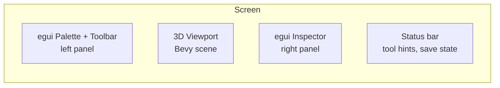
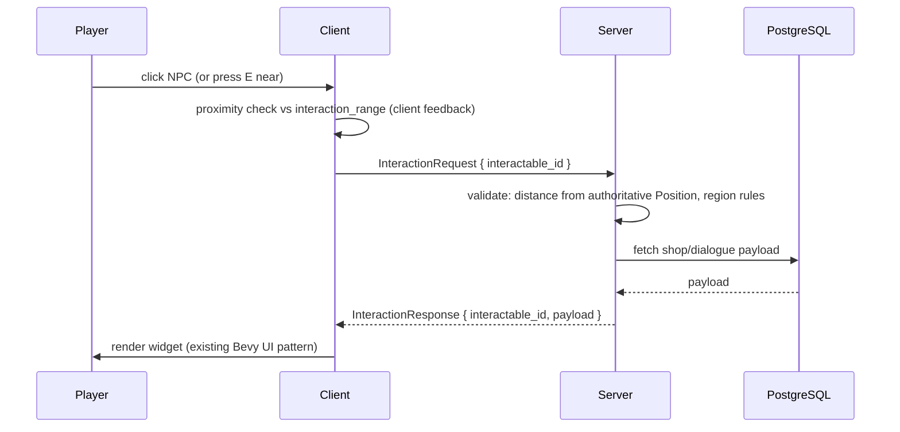

# Plan: Map Editor & World System (data-driven levels for an isometric MMO)

**Status**: Draft — design only, no code yet.
**Scope**: A Bevy-based in-game map editor (`cargo run -- editor`) that produces data-driven `.ron` maps consumed by the headless server (gameplay only) and the client (rendering + interactions). Includes the full world data model, the editor UX, and the server/client consumption paths. Depends on `plans/workspace-crate-split.md` (crates: `bevymmo_shared`, `bevymmo_server`, `bevymmo_client`, `bevymmo_presentation`, `bevymmo_editor`).

---

## Goal

Build a minimal but complete map editor and world pipeline for a large isometric 3D MMO (Albion-like):

1. **Editor** (Bevy + `bevymmo_editor`, UI via `bevy_egui`): place/select/manipulate props, spawn points, regions, triggers, interactables; save to `.ron`.
2. **World data model** (`bevymmo_shared::world`): engine-agnostic `MapManifest` — no Bevy components, no asset paths, only ids + data. This is the contract between editor, server, and client.
3. **Server consumption** (`bevymmo_server::world`): reads the manifest at startup, spawns entities from `spawn_points`, keeps a spatial collision grid, and evaluates `regions`/`triggers`. The server **never loads meshes**.
4. **Client consumption** (`bevymmo_client::world::asset_registry` + `bevymmo_presentation`): maps `kind` strings to asset paths, spawns `SceneRoot` visuals, handles hover/click interactions.

**Non-goals**:
- No tile-based movement grid (movement stays free/continuous as today, `Position(Vec3)`).
- No terrain heightmap sculpting in v1. **Terrain is flat (y = 0) by decision**: elevated/raised structures (platforms, buildings on stilts, stairs) are authored as props with `translation.y > 0` and blocking collision. "Walking on top of platforms" (walkable heights / multiple flat levels / heightmap) is explicitly deferred to a future plan.
- No undo/redo system, no multi-select, no undo stack in v1 (listed as future work).
- The game UI (`ui/`) is **not** rewritten: it stays Bevy UI native. `bevy_egui` is used **only** inside the editor.

---

## Design decisions

### D1. The map file is data, not a Bevy scene

The `.ron` manifest contains only serializable data structures with `id`s and `kind` strings. Reasons:

- The server reads it without instantiating meshes/materials (stays headless and light).
- Assets can be swapped by changing one registry entry (`kind "tree_oak" -> "models/tree_oak.glb"`), never by editing every map.
- Maps can be diffed, versioned, and (later) chunked into multiple files.
- Persistence (a player moved a prop, destroyed a rock) only needs `prop_id + new_transform`, matching the existing PostgreSQL layer.

### D2. Editor = `AppMode::Editor` in the game binary

`cargo run -- editor` starts the fat binary with `bevymmo_presentation` (camera, renderer) + `bevymmo_editor` plugins, and **no** network plugins. A separate `bins/editor` can be split out later if startup diverges (open question).

### D3. `bevy_egui` only for editor chrome

Palette, inspector, toolbar, save/dialog panels are egui immediate-mode. The 3D viewport is Bevy scene rendering. No Bevy UI in the editor, and no egui in the game client.

### D4. Selection/picking via `bevy_mod_picking`, manipulation via `TransformGizmoPlugin` (built-in Bevy 0.19)

- `bevy_mod_picking` handles mouse → entity raycast for selecting placed props (backend: `RaycastPick`; it integrates with `bevy_egui` so clicks on panels don't fall through).
- **`TransformGizmoPlugin`** (built-in since Bevy 0.19) provides the translate/rotate/scale handles (T/R/S modes). Mark the camera with `TransformGizmoCamera` and the selected entity with `TransformGizmoFocus`; mode is controlled via `TransformGizmoMode` resource, snapping via `TransformGizmoSettings`. The plugin is intentionally decoupled from input, so the editor controls when `TransformGizmoFocus` is applied (only on selection). The external crate `bevy_transform_gizmo` is **no longer needed**.
- Placement raycasts to the ground plane (y = 0) — same math already used in `network/client.rs` for spell targeting.

### D5. Server validates interactions; client presents them

The interaction flow is three levels (from `plans/map-editor.md` conversation):

1. **Client-only**: proximity check (`interaction_range`) → show "Press E" prompt.
2. **Client sends**: `InteractionRequest { interactable_id }` over Lightyear.
3. **Server validates** (distance from authoritative `Position`, region rules) → responds with `InteractionResponse` payload (shop items, dialogue). Client renders the resulting UI (existing Bevy UI widgets).

### D6. Regions and triggers are server-authoritative

`Region`/`Trigger` shapes live in the manifest; the server evaluates them against authoritative `Position`. The client receives region membership only as replicated flags/UI feedback (e.g. safe-zone banner). No client-side authority for zone rules.

### D6b. Collision is a custom shared `CollisionGrid`, not a physics engine (decision)

Player movement is server-authoritative with client prediction. For prediction to match the server, **both sides must derive the exact same blocking result from the same data**. Therefore:

- A pure-data `CollisionGrid` lives in `bevymmo_shared::world` (spatial hash over the manifest props' `CollisionShape`s).
- The server builds one copy and validates every authoritative movement against it.
- The client builds an identical copy from the same manifest and uses it for prediction.
- No rigidbody engine (`avian3d`/`bevy_rapier3d`) in v1: it would force byte-exact simulation lockstep between client and server and is expensive for 100+ entities. Physics is a later, separate decision (knockback, pushable objects, physical projectiles).

### D6c. Elevated structures are props, not terrain (decision)

Authoring a raised platform, a rooftop, or a building on stilts = placing a `Prop` with `translation.y > 0` and a blocking `CollisionShape`. The ground stays flat at y = 0. "Walking on top of" these structures requires walkable heights (flat levels or heightmap) and is explicitly out of scope for this plan.

### D7. World module layout in `shared`

```text
bevymmo_shared::world
├── manifest.rs      # MapManifest + all section structs (pure serde)
├── shapes.rs        # CollisionShape, RegionShape, TriggerShape (pure math)
├── loader.rs        # MapLoader: read/write .ron + validation (duplicate ids, bounds)
└── ids.rs           # id generation + validation helpers
```

No systems, no plugins, no `AssetServer` — only data + pure functions. This guarantees the module compiles on the server.

---

## World data model (the contract)

### `MapManifest`

```rust
/// A single authored map. This is the complete contract between the
/// editor, the server, and the client: everything each side needs is here.
#[derive(Serialize, Deserialize, Clone, Debug, PartialEq)]
pub struct MapManifest {
    /// Format version; loader rejects unknown versions with a clear error.
    pub version: u32,
    /// Stable map id used for DB keys and save files ("starting_city").
    pub map_id: String,
    /// Author-facing display name.
    pub display_name: String,
    /// World size in world units (x/z). Outside bounds is not part of the map.
    pub bounds: MapBounds,
    /// Static visual props (trees, houses, rocks, ...).
    pub props: Vec<Prop>,
    /// Server spawn definitions (NPCs, enemies, player starts).
    pub spawn_points: Vec<SpawnPoint>,
    /// Server-authoritative rule zones (safe/PvP/city).
    pub regions: Vec<Region>,
    /// Volume-triggered events ("enter arena -> start boss encounter").
    pub triggers: Vec<Trigger>,
    /// Player-clickable objects (NPCs, chests, doors).
    pub interactables: Vec<Interactable>,
    /// Server-side resource nodes (ore veins, trees that can be harvested).
    pub resource_nodes: Vec<ResourceNode>,
    /// Ambient effects (light, sound, particles) — client visual only.
    pub effects: Vec<Effect>,
}

#[derive(Serialize, Deserialize, Clone, Copy, Debug, PartialEq)]
pub struct MapBounds {
    pub min_x: f32,
    pub max_x: f32,
    pub min_z: f32,
    pub max_z: f32,
}
```

### `Prop` — the answer to "size, position, rotation, colors, assets"

```rust
/// Static object placed in the world.
///
/// Note: `kind` is a logical type ("tree_oak"), never a file path. The
/// client resolves it through its asset registry; the server only uses
/// `collision`. This decouples content from code.
#[derive(Serialize, Deserialize, Clone, Debug, PartialEq)]
pub struct Prop {
    /// Stable unique id within the map. Used for persistence overrides
    /// (a prop destroyed at runtime) and for editor selection.
    pub id: String,
    /// Logical asset type.
    pub kind: String,
    /// Full spatial transform.
    pub transform: TransformData,
    /// Optional color tint. When present, the client multiplies the base
    /// material color. Absent -> asset default colors.
    pub tint: Option<[f32; 3]>, // linear RGB 0..1
    /// Optional server-side collision shape. None -> walkable/passable.
    pub collision: Option<CollisionShape>,
    /// Optional server-side push/pass flags for future physics.
    pub blocks_movement: bool,
}

/// Euler-based transform — far more intuitive than Quat for an editor,
/// converted to Quat at consumption time.
#[derive(Serialize, Deserialize, Clone, Copy, Debug, PartialEq)]
pub struct TransformData {
    pub translation: [f32; 3],
    /// Rotation in degrees (YXZ order), matching editor conventions.
    pub rotation_deg: [f32; 3],
    /// Non-uniform scale allowed.
    pub scale: [f32; 3],
}

impl TransformData {
    /// Identity transform at a given position.
    pub fn at(x: f32, y: f32, z: f32) -> Self {
        Self {
            translation: [x, y, z],
            rotation_deg: [0.0, 0.0, 0.0],
            scale: [1.0, 1.0, 1.0],
        }
    }
}

/// Server-side collision primitives. Chosen to be cheap to test against
/// an entity position (no convex hulls in v1).
#[derive(Serialize, Deserialize, Clone, Copy, Debug, PartialEq)]
pub enum CollisionShape {
    Cylinder { radius: f32, height: f32 },
    Box { half_extents: [f32; 3] },
    Sphere { radius: f32 },
}

impl CollisionShape {
    /// Conservative distance from a point to the shape surface (x/z plane).
    /// Returns None when the point is inside the shape.
    pub fn distance_to_point(&self, transform: &TransformData, point: [f32; 3]) -> Option<f32> {
        // pure math; implemented in bevymmo_shared::world::shapes
        let _ = (transform, point);
        None // placeholder for the slice-0 implementation
    }
}
```

### `SpawnPoint`

```rust
/// Server-side spawn definition. The server turns this into a real
/// gameplay entity at startup (or on demand for players).
#[derive(Serialize, Deserialize, Clone, Debug, PartialEq)]
pub struct SpawnPoint {
    pub id: String,
    /// Which entity definition to instantiate. Player spawns use
    /// `kind = "player_start"` (handled specially on connect).
    pub kind: String,
    /// World position.
    pub position: [f32; 3],
    /// Facing direction in degrees (yaw).
    pub yaw_deg: f32,
    /// Optional respawn settings (enemies that respawn).
    pub respawn: Option<RespawnConfig>,
}

#[derive(Serialize, Deserialize, Clone, Copy, Debug, PartialEq)]
pub struct RespawnConfig {
    pub delay_seconds: f32,
    /// 0 = unlimited respawns.
    pub max_respawns: u32,
}
```

### `Region` (safe/PvP/city zones)

```rust
/// Server-authoritative rule zone.
#[derive(Serialize, Deserialize, Clone, Debug, PartialEq)]
pub struct Region {
    pub id: String,
    pub name: String,
    pub shape: RegionShape,
    pub rules: RegionRules,
}

#[derive(Serialize, Deserialize, Clone, Copy, Debug, PartialEq)]
pub enum RegionShape {
    Circle { center: [f32; 3], radius: f32 },
    Rect { min_x: f32, min_z: f32, max_x: f32, max_z: f32 },
    /// Later: polygon, path corridor.
}

#[derive(Serialize, Deserialize, Clone, Copy, Debug, PartialEq)]
pub enum RegionRules {
    Safe,            // no PvP, no hostile NPC aggro
    Pvp,             // open PvP
    City,            // like Safe + respawn point + no mounts later
    Dungeon,         // instance-like rules (future)
    Arena,           // forced encounter, no escape (boss arena)
}
```

### `Trigger`

```rust
/// Volume that fires an event when an entity enters it (server-side).
#[derive(Serialize, Deserialize, Clone, Debug, PartialEq)]
pub struct Trigger {
    pub id: String,
    pub shape: TriggerShape,
    /// Server event name consumed by gameplay systems
    /// (e.g. "start_dragon_encounter").
    pub event: String,
    /// Fire once per entity until they leave and re-enter.
    pub once_per_entity: bool,
}

#[derive(Serialize, Deserialize, Clone, Copy, Debug, PartialEq)]
pub enum TriggerShape {
    Cylinder { center: [f32; 3], radius: f32, height: f32 },
    Box { center: [f32; 3], half_extents: [f32; 3] },
}
```

### `Interactable`

```rust
/// Client-visible, server-validated click target.
#[derive(Serialize, Deserialize, Clone, Debug, PartialEq)]
pub struct Interactable {
    pub id: String,
    pub display_name: String,
    /// Which interaction the server should open when validated.
    pub interaction: InteractionKind,
    /// Distance within which the player may interact (client prompt
    /// AND server re-validation).
    pub interaction_range: f32,
    /// World position (usually near a prop or spawn point).
    pub position: [f32; 3],
}

#[derive(Serialize, Deserialize, Clone, Debug, PartialEq)]
pub enum InteractionKind {
    /// Opens a shop with the given id (server pulls items from DB).
    Shop(String),
    /// Dialogue tree id.
    Dialogue(String),
    /// Generic gate to any future interaction plugin.
    Custom(String),
}
```

### `ResourceNode` and `Effect`

```rust
/// Harvestable node (server-side: health/gather state; client-side: visual).
#[derive(Serialize, Deserialize, Clone, Debug, PartialEq)]
pub struct ResourceNode {
    pub id: String,
    pub kind: String,           // "ore_copper", "tree_pine"
    pub position: [f32; 3],
    pub health: f32,
    /// After depletion, respawn with this delay.
    pub respawn_seconds: f32,
}

/// Ambient visual/audio effect (client-only).
#[derive(Serialize, Deserialize, Clone, Debug, PartialEq)]
pub struct Effect {
    pub id: String,
    pub kind: String,           // "torch", "fire", "fountain"
    pub position: [f32; 3],
    /// Optional parameters, resolved client-side by the effect registry.
    pub params: std::collections::BTreeMap<String, f32>,
}
```

### Example manifest

```ron
MapManifest(
    version: 1,
    map_id: "starting_city",
    display_name: "Starting City",
    bounds: MapBounds(min_x: -100.0, max_x: 100.0, min_z: -100.0, max_z: 100.0),
    props: [
        Prop(
            id: "tree_001",
            kind: "tree_oak",
            transform: TransformData(translation: [10.0, 0.0, 5.0], rotation_deg: [0.0, 45.0, 0.0], scale: [1.0, 1.0, 1.0]),
            tint: None,
            collision: Some(Cylinder(radius: 0.5, height: 4.0)),
            blocks_movement: true,
        ),
    ],
    spawn_points: [
        SpawnPoint(id: "player_spawn", kind: "player_start", position: [0.0, 0.0, 0.0], yaw_deg: 0.0, respawn: None),
    ],
    regions: [
        Region(id: "city_safe", name: "City Safe Zone", shape: Rect(min_x: -50.0, min_z: -50.0, max_x: 50.0, max_z: 50.0), rules: City),
    ],
    triggers: [
        Trigger(id: "arena_enter", shape: Cylinder(center: [80.0, 0.0, 80.0], radius: 8.0, height: 10.0), event: "start_dragon_encounter", once_per_entity: true),
    ],
    interactables: [
        Interactable(id: "blacksmith", display_name: "Old Blacksmith", interaction: Shop("blacksmith_shop"), interaction_range: 2.5, position: [12.0, 0.0, 8.0]),
    ],
    resource_nodes: [
        ResourceNode(id: "copper_1", kind: "ore_copper", position: [20.0, 0.0, 30.0], health: 100.0, respawn_seconds: 120.0),
    ],
    effects: [
        Effect(id: "city_torch_1", kind: "torch", position: [5.0, 0.0, 5.0], params: { "intensity": 1.0 }),
    ],
)
```

---

## Editor UX & architecture (`bevymmo_editor`)

### Screen layout



| Panel | Content |
|---|---|
| **Toolbar (left-top)** | Tool buttons: Select (V), Place (B), Region (R), Trigger (T), Interactable (I), Erase (X); Save (Ctrl+S), Load, New |
| **Palette (left)** | Scrollable list of `kind`s grouped by category (vegetation, buildings, props, npcs) — driven by a `PaletteEntry` list loaded from a `.ron` catalog |
| **Viewport (center)** | Bevy 3D camera (orbit around origin, WASD/QE + RMB look, scroll dolly); placed props rendered as `SceneRoot` |
| **Inspector (right)** | Selected object's editable fields (transform drag-values, tint color picker, collision params) |
| **Status bar (bottom)** | Active tool, unsaved-changes indicator, snap settings, errors from `loader::validate` |

### Tools (`tools.rs`)

```rust
pub enum EditorTool {
    Select,        // pick + manipulate (gizmo)
    Place,         // click ground -> spawn current palette kind
    Erase,         // click prop -> remove
    PlaceSpawn,    // click ground -> SpawnPoint (kind from a small sub-palette)
    DrawRegion,    // click-drag -> Region rect/circle
    DrawTrigger,   // click-drag -> Trigger cylinder/box
    PlaceInteractable,
    PlaceResource,
    PlaceEffect,
}
```

### Placement flow (click -> object)

1. `bevy_mod_picking` provides `Pointer<Click>` events on entities; for placement we raycast the ground plane.
2. Editor camera transform + `viewport_to_world` → ray (same pattern as `network/client.rs::cast_spells_on_key`).
3. Intersect ray with `Plane3d::new(Vec3::Y, 0.0)` → ground point snapped to `snap_translation` (default 1.0).
4. Spawn an editor entity with `PropData` (the manifest struct) + `EditorMarker` + optional `SceneRoot` preview (if the palette has an asset path for the kind).
5. Editor entities are **not** game entities: they carry `EditorMarker`, and the renderer for them is editor-only.

### Selection + manipulation flow

1. Click on an entity with `EditorMarker` (or click empty space to deselect).
2. `Selected(Entity)` resource updated; gizmo attaches to that entity (`bevy_transform_gizmo`).
3. Gizmo delta → `PropData.transform` update (round-trip: gizmo mutates `Transform`, inspector reads/writes `PropData`; a sync system keeps both in lockstep — one is authoritative, decide in slice 3: **gizmo writes Transform → sync system copies into PropData**, inspector writes PropData → sync copies into Transform).
4. `Ctrl+S` → `io::save_map` serializes `MapManifest` from all `PropData` entities + resource data.

### Camera (`camera.rs`)

- Orbit camera: focus point + yaw/pitch/distance; RMB drag orbits, scroll dolly, F frames the selection, middle-drag pans.
- Editor-specific marker `EditorCamera` so it never conflicts with `GameCamera`.

---

## Client consumption (`bevymmo_client::world` + `bevymmo_presentation`)

### Asset registry (`bevymmo_client::world::asset_registry.rs`)

```rust
/// Maps a logical `kind` to an asset path + optional default collision.
/// Client-only: the server never sees these paths.
pub struct AssetRegistry {
    entries: std::collections::HashMap<String, AssetEntry>,
}

pub struct AssetEntry {
    pub scene_path: String,     // "models/vegetation/tree_oak.glb"
    pub default_scale: f32,
    /// Editor palette category.
    pub category: String,
    pub display_name: String,
}
```

- Loaded from `assets/catalog.ron` (authored once, shared with the editor palette).
- Unmatched kinds fall back to a visible placeholder mesh (pink box) and log a warning — the map never silently renders nothing.

### Spawning props (presentation)

```rust
/// For each `PropData` in the world (client-side copy of the manifest),
/// spawn a SceneRoot once the asset is known.
fn spawn_prop_visuals(
    mut commands: Commands,
    asset_server: Res<AssetServer>,
    registry: Res<AssetRegistry>,
    props: Query<(Entity, &PropData), Without<PropVisual>>,
) {
    for (entity, prop) in props.iter() {
        let Some(entry) = registry.entries.get(&prop.kind) else {
            warn!("unknown kind {:?}", prop.kind);
            continue;
        };
        commands.entity(entity).insert((
            Name::new(prop.id.clone()),
            SceneRoot(asset_server.load(entry.scene_path.as_str())),
            Transform::from_translation(Vec3::from(prop.transform.translation))
                .with_rotation(Quat::from_euler(
                    EulerRot::YXZ,
                    prop.transform.rotation_deg[1].to_radians(),
                    prop.transform.rotation_deg[0].to_radians(),
                    prop.transform.rotation_deg[2].to_radians(),
                ))
                .with_scale(Vec3::from(prop.transform.scale)),
            PropVisual, // marker: visuals attached
        ));
        // tint applied in a follow-up system that walks children materials
    }
}
```

### Load path (client)

```text
assets/maps/starting_city.ron
   -> bevymmo_shared::world::loader::load_map  (validate)
   -> MapManifest resource (client copy)
   -> spawn_prop_visuals (SceneRoot per prop)
   -> spawn Interactable markers + prompts (ui)
```

### Interaction flow (client+server)



**Lightyear messages** (registered in `bevymmo_shared::network::protocol`):

```rust
#[derive(Message, Serialize, Deserialize, Clone, Debug)]
pub struct InteractionRequest {
    pub interactable_id: String,
}

#[derive(Message, Serialize, Deserialize, Clone, Debug)]
pub struct InteractionResponse {
    pub interactable_id: String,
    pub payload: InteractionPayload,
}

#[derive(Serialize, Deserialize, Clone, Debug)]
pub enum InteractionPayload {
    Shop { items: Vec<ShopItemView> },
    Dialogue { text: String, options: Vec<String> },
    Noop,
}
```

The server keeps a `WorldInteractions` resource built from the manifest (`interactables` indexed by id). Validation uses the authoritative `Position` of the requester — the client's proximity check is purely cosmetic.

---

## Server consumption (`bevymmo_server::world`)

### Startup path

```text
assets/maps/starting_city.ron
   -> bevymmo_shared::world::loader::load_map (validate)
   -> WorldData resource (MapManifest)
   -> WorldRegions resource   (regions indexed by id)
   -> WorldTriggers resource  (triggers indexed by id)
   -> WorldInteractions resource (interactables indexed by id)
   -> CollisionGrid resource  (props with collision, spatial hash)
   -> spawn spawn_points -> spawn_entity::<T>() for enemy/npc kinds
```

### Spatial collision grid (`bevymmo_shared::world::collision`)

```rust
/// Uniform grid over the map; each cell holds prop ids. O(1) neighbor lookup
/// when the movement system asks "can the player move to (x,z)?".
///
/// Pure data + pure functions: the server builds one copy for authoritative
/// validation and the client builds an identical copy for prediction from the
/// same manifest (see decision D6b).
pub struct CollisionGrid {
    cell_size: f32,
    cells: std::collections::HashMap<IVec2, Vec<String>>,
}

impl CollisionGrid {
    /// Build from manifest props that have a collision shape.
    pub fn build(manifest: &MapManifest) -> Self { /* ... */ }

    /// Returns true when an axis-aligned point (radius padded) intersects
    /// any blocking prop shape.
    pub fn is_blocked(&self, shapes: &IndexedShapes, point: [f32; 3], radius: f32) -> bool { /* ... */ }
}
```

- Lives in `bevymmo_shared::world` (NOT in `server`): the client prediction path needs the same grid.
- The movement system (`bevymmo_server` player simulation) queries `is_blocked` before committing a new authoritative `Position`.
- Region evaluation (`in_region(pos) -> Vec<RegionRules>`) runs server-side and feeds PvP/aggro gating.

### Trigger system

```rust
/// FixedUpdate, server-only: for each entity, find triggers whose shape
/// contains its Position; emit the trigger event (once per entity when
/// configured); track "inside" state in a TriggerOccupancy resource.
fn evaluate_triggers(
    mut commands: Commands,
    world_triggers: Res<WorldTriggers>,
    mut occupancy: ResMut<TriggerOccupancy>,
    entities: Query<(Entity, &Position)>,
) {
    // pure containment tests from bevymmo_shared::world::shapes
}
```

The boss arena (existing `boss-dragon.md` plan) becomes one `Trigger` + one `Region(Arena)` in the manifest instead of hard-coded coordinates.

---

## Bevy ecosystem crate selection (verified candidates)

> **Compatibility note**: Bevy 0.19 is recent. For every crate below, verify the exact version against Bevy 0.19 at implementation time (`cargo add --dry-run` or the crate's docs). Versions listed are the current line at plan time; adjust to whatever tracks 0.19.

### Editor tooling (`bevymmo_editor`)

| Crate | Purpose | Notes |
|---|---|---|
| `bevy_egui` | Inspector, palette, toolbar, dialogs (immediate-mode) | De-facto standard; integrates with bevy window; **must** run its context before picking so panels eat their own clicks |
| `bevy_mod_picking` | Mouse → 3D entity selection, hover, drag | Backends: `raycast` (simple) or `bevy_mod_raycast`; supports `bevy_egui` interaction blocking |
| `TransformGizmoPlugin` (**built-in Bevy 0.19**) | Translate/rotate/scale handles (T/R/S) | Native, no external crate needed. Camera needs `TransformGizmoCamera`; selected entity gets `TransformGizmoFocus`; `TransformGizmoMode` / `TransformGizmoSettings` resources for mode and snapping. Replaces the old `bevy_transform_gizmo` crate. |
| `InfiniteGridPlugin` (**built-in Bevy 0.19**) | Infinite ground grid in the editor viewport | Fullscreen shader — no aliasing or Moiré patterns. `app.add_plugins(InfiniteGridPlugin)` + `commands.spawn(InfiniteGrid)`. Replaces manual Gizmos grid lines. |
| `bevy_mod_raycast` | Low-level ray vs mesh/plane queries | Alternative picking backend; also used for ground-plane placement |

### Physics & collision (`bevymmo_server` + future)

| Crate | Purpose | Notes |
|---|---|---|
| `avian3d` | Physics (successor of bevy_rapier): kinematic bodies, raycasts, sensors | Use only when real physics (knockback, rigidbodies) is needed; for v1 the `CollisionGrid` is cheaper and sufficient |
| `bevy_rapier3d` | Alternative physics binding | More battle-tested; heavier dependency graph |

### World & content

| Crate | Purpose | Notes |
|---|---|---|
| `bevy_common_assets` | Asset loaders for custom formats (`.ron` via `RonAssetPlugin`) | Used to load `MapManifest` + `catalog.ron` through Bevy's asset server with hot-reload |
| `bevy_asset_loader` | Typed load states + loading screens | Optional; useful when the client must wait for catalog + map before entering game |
| `noisy_bevy` / `noise` | Shader-based / CPU noise for procedural terrain | Future heightmap slice; `noise` (pure Rust) works server-side too |
| `bevy_ecs_tilemap` / `bevy_tilemap` | 2D tilemap rendering | **Not needed**: movement is free-form, not tile-based |

### Input & gameplay

| Crate | Purpose | Notes |
|---|---|---|
| `leafwing-input-manager` | Declarative action mapping, rebinding UI | Optional upgrade over the existing `key_mapping.rs`; not required for v1 |
| `bevy_mod_outline` | Outline highlight for selection/targets | Nice for editor selection + game target frame |
| `bevy_hanabi` | GPU particles (fireballs, torches, effects) | For `Effect` kinds later; heavy but the standard choice |
| `bevy_kira_audio` | Advanced audio playback | For `Effect` ambient sounds later; `bevy_audio` (built-in) is enough for v1 |

### Debugging & inspection

| Crate | Purpose | Notes |
|---|---|---|
| `bevy-inspector-egui` | Runtime ECS inspector/editor | Great for debugging systems; **not** the editor itself |
| `bevy_dev_tools` | FPS overlay, remote server, entity debugger (built-in Bevy) | Ships with Bevy; enable in dev only |
| `bevy_prototype_debug_lines` / `bevy_debug_lines` | Debug lines (draw region/trigger shapes in the editor viewport) | Very useful: draw region bounds, trigger volumes, collision shapes as wireframes |
| Built-in `Gizmos` + **Text Gizmos** (Bevy 0.19) | World-space text labels for dev/editor use | `gizmos.text_2d(...)` / `gizmos.text_3d(...)` — zero-setup, stroke font, ASCII only. Use to label prop ids, spawn points, region names directly in the 3D viewport. No external crate needed. |

### Serialization & tooling (workspace-wide)

| Crate | Purpose | Notes |
|---|---|---|
| `serde` + `ron` | Manifest serialization | Already in the project; add `ron` explicitly to `shared` |
| `uuid` | Ids | Already present |
| `cargo-machete` | Unused dependency linter | CI helper |
| `cargo-hakari` | Workspace dep unification | Only if workspace build times become an issue |

**Recommended install order**: slice 1 (editor shell): `bevy_egui`, `bevy_mod_picking`, `InfiniteGridPlugin` (built-in). Slice 3 (manipulation): `TransformGizmoPlugin` (built-in). Slice 4 (region/trigger visualization): built-in `Gizmos` + Text Gizmos for labels, `bevy_mod_outline` if needed.

---

## Implementation slices

### Slice 0 — `bevymmo_shared::world` data model + loader

**Value**: the contract exists and is tested before any editor or consumption code.

**Path**:

- `crates/shared/src/world/{mod.rs,manifest.rs,shapes.rs,loader.rs,ids.rs}` with the structs above.
- `loader.rs`: `load_map(path) -> Result<MapManifest, MapLoadError>`; `validate(&MapManifest) -> Result<(), Vec<String>>` checking: version == 1, non-empty `map_id`, bounds sane, **unique ids within each section**, `kind` non-empty, transform scale non-zero.
- `MapLoadError` with contextual wrapping (per project rules: never swallow, always contextualize).
- Unit tests: serialize→deserialize roundtrip, validation failures (duplicate ids, bad version, zero scale), `CollisionShape::distance_to_point` math for all three shapes.
- `Cargo.toml` for `shared` gains `ron = { workspace = true }`.

**Acceptance criteria**:

- [ ] `cargo test -p bevymmo_shared` green.
- [ ] Roundtrip test passes for the example manifest.
- [ ] Validation returns all violations, not just the first.
- [ ] No `bevy` runtime dependencies beyond `bevy_color` (none added for the math).

**Verification**: `cargo test -p bevymmo_shared`, `cargo clippy -p bevymmo_shared -- -D warnings`.

---

### Slice 1 — Editor shell (`AppMode::Editor`, camera, egui, palette)

**Value**: a windowed app with orbit camera and egui panels; nothing to save yet.

**Path** (depends on crate-split Slice 6 having created the `editor` crate stub):

- `crates/editor/src/{mod.rs,camera.rs,tools.rs,palette.rs}`.
- `AppMode::Editor` in `bins/game` CLI; `bins/game` adds `EditorPlugin` when the `editor` feature is on.
- `EditorPlugin` registers: `EditorCamera` orbit camera system, `EditorTool` resource (default `Select`), egui `EditorUi` plugin (palette + status bar + toolbar), `InfiniteGridPlugin`, and **no** network plugins.
- Palette data from `assets/catalog.ron` (loaded via `bevy_common_assets::RonAssetPlugin`).
- Editor world: spawn nothing; show a flat ground plane (reuse pattern from `scenes/base` but owned by the editor) + **`InfiniteGrid`** component (fullscreen shader, no aliasing — replaces manual Gizmos grid lines).

**Acceptance criteria**:

- [ ] `cargo run -- editor` opens a window: 3D viewport with orbit camera, left palette (from catalog), status bar, tool buttons.
- [ ] Palette lists all catalog kinds grouped by category.
- [ ] Clicking a palette kind sets the active tool to `Place` with that kind (no placement yet).
- [ ] Editor never initializes Lightyear client/server.
- [ ] `cargo run -- server|client|host-client` unaffected.

**Verification**: visual smoke, `cargo test`, `cargo clippy -- -D warnings`.

---

### Slice 2 — Placement + selection (raycast, preview, `PropData`)

**Value**: the editor can create real props in the world and select them.

**Path**:

- `placement.rs`: ground-plane raycast (editor camera), snap, spawn editor entity `(PropData, EditorMarker, Transform, SceneRoot-or-placeholder-mesh, PropVisual)`.
- `selection.rs`: `bevy_mod_picking` `Pointer<Click>` → `Selected(Entity)` resource; esc clears; hover highlight (outline or emissive tint).
- Placeholder mesh for kinds without an asset (pink cube) so layout work is possible before models exist.
- Delete key removes the selected prop entity.

**Acceptance criteria**:

- [ ] With `Place` active + a kind chosen, clicking the ground spawns a prop at the snapped point.
- [ ] Clicking a prop selects it (visual highlight); clicking empty space deselects.
- [ ] `Delete` removes the selected prop.
- [ ] Placeholder mesh appears for unknown kinds; real `SceneRoot` when the catalog has an asset for the kind.

**Verification**: visual smoke; unit tests for snap math and ground raycast.

---

### Slice 3 — Manipulation (gizmo + inspector + tint)

**Value**: transforms, colors, and collisions become editable.

**Path**:

- `gizmo.rs`: add `TransformGizmoPlugin` (built-in Bevy 0.19); tag the selected entity with `TransformGizmoFocus`; remove the tag on deselect. T/R/S mode managed via `TransformGizmoMode` resource. Snap configured via `TransformGizmoSettings`.
- Sync system (single source of truth, decided in D-detail: **gizmo writes `Transform` → sync into `PropData`; inspector writes `PropData` → sync into `Transform`**; run in that order each frame to avoid fights).
- `inspector.rs` (egui right panel): drag-values for translation/rotation/scale (degrees), color picker for `tint`, collision shape editor (type dropdown + radius/extents fields), `blocks_movement` checkbox.
- `io.rs` stub: `save_map`/`load_map` wired to `Ctrl+S`/`Ctrl+O` but manifest assembly not yet complete (slices 4).

**Acceptance criteria**:

- [ ] Selected prop can be translated/rotated/scaled with gizmo; inspector values update live.
- [ ] Inspector edits move the 3D object live; rotation shown/edited in degrees.
- [ ] Tint (when set) applies to the spawned scene's materials (children walk).
- [ ] Collision shape edit updates the wireframe debug draw.

**Verification**: visual smoke; unit test for the sync system (gizmo→PropData and inspector→Transform).

---

### Slice 4 — Full manifest assembly + save/load

**Value**: the editor produces the actual map file the server and client will read.

**Path**:

- `io.rs`: assemble `MapManifest` from all `PropData` entities + resource collections (spawn points, regions, triggers, interactables, resources, effects — spawned by their tools with their own data components).
- Tools for each section (`PlaceSpawn`, `DrawRegion`, `DrawTrigger`, `PlaceInteractable`, `PlaceResource`, `PlaceEffect`): each spawns an entity carrying the section-specific manifest struct + `EditorMarker`; inspector edits them; region/trigger shapes drawn with `Gizmos`.
- **Text Gizmos** (`gizmos.text_2d` / `gizmos.text_3d`, built-in Bevy 0.19): label each entity with its `id` directly in the 3D viewport (prop ids, spawn point names, region names). ASCII only — strictly dev/editor use.
- `loader::validate` runs on save; errors surface in the status bar, save is blocked until valid.
- `New map` dialog (map_id, display_name, bounds).

**Acceptance criteria**:

- [ ] Author a map: props, one spawn point, one region, one trigger, one interactable, save → valid `.ron`.
- [ ] Load the same file → identical manifest (roundtrip through the editor).
- [ ] Invalid maps (duplicate id, missing kind) fail to save with a clear message.
- [ ] Wireframe overlays show region/trigger volumes.

**Verification**: roundtrip test through `io.rs`; visual smoke; validate errors surfaced in status bar.

---

### Slice 5 — Client consumption (asset registry + prop rendering + map load)

**Value**: the game client renders an authored map.

**Path** (`bevymmo_client` + `bevymmo_presentation`):

- `bevymmo_client::world::asset_registry` (`AssetRegistry`, catalog loader).
- `bevymmo_presentation::world::spawn_prop_visuals` + tint system + `PropVisual` marker.
- Map load on `GameScreen::InGame`: `load_map("assets/maps/<selected>.ron")` → `MapManifest` resource → spawn props; cleanup on leaving game (mirror `renderer::cleanup_entity_render` behavior).
- Replace the static `Plane3d` ground in `scenes/base` with a ground sized from `MapBounds` (still a single plane; chunked terrain is a later slice).

**Acceptance criteria**:

- [ ] Client loads `starting_city.ron`; every prop appears at the right transform with the right model/tint.
- [ ] Unknown kind renders the placeholder + warning log (visible once).
- [ ] Leaving to menu despawns prop visuals; re-entering respawns them.
- [ ] Server unchanged in this slice (still spawns its demo entities as today).

**Verification**: visual smoke with host-client; `cargo test`.

---

### Slice 6 — Server consumption (spawn points, regions, collision grid, triggers)

**Value**: the authored map is authoritative gameplay, replacing hard-coded demo spawns.

**Path** (`bevymmo_shared::world` for the grid; `bevymmo_server::world` for the systems):

- `WorldData`, `WorldRegions`, `WorldTriggers`, `WorldInteractions` resources built at startup from the manifest.
- `CollisionGrid` (in `shared`) built once at startup; movement system validates blocked destinations against it. Client prediction uses an identical grid (decision D6b).
- `spawn_from_manifest`: for each `SpawnPoint` with a registered `EntityDefinition` kind, `spawn_entity::<T>()`; `player_start` reserved for connect-time player spawns.
- `evaluate_triggers` (FixedUpdate): containment → emit `TriggerEvent`; `once_per_entity` honored via `TriggerOccupancy`.
- Migrate the boss arena from hard-coded coordinates to a manifest `Trigger` + `Region(Arena)` (entry points exist; the boss plan itself is separate).
- Elevated structures (props with `y > 0`) get blocking shapes; since the ground is flat, they simply act as walls/pillars for movement in v1 (walking on top is future work, decision D6c).

**Acceptance criteria**:

- [ ] Server loads the map at startup; enemies/NPCs spawn from manifest positions.
- [ ] Player movement stops at blocking props (grid query).
- [ ] Entering the arena trigger emits the trigger event; region rules resolvable by position.
- [ ] Server process never touches `AssetServer`/meshes (assert via no `bevy/render` dependency in `bevymmo_server`).

**Verification**: server smoke with two clients; unit tests for `CollisionGrid::is_blocked` and trigger containment.

---

### Slice 7 — Interactions (client prompt + server validation + UI)

**Value**: clickable NPCs/chests with the client→server→client round trip.

**Path**:

- Register `InteractionRequest`/`InteractionResponse` messages + channels in `bevymmo_shared::network::protocol`.
- Server: `handle_interaction_request` validates distance/region, returns payload (shop items from DB via existing persistence, or dialogue placeholder).
- Client: proximity prompt ("Press E"), send request, render response in a Bevy UI widget (follows the existing `ui/` pattern — new `ui/interaction/` folder in `bevymmo_presentation`).

**Acceptance criteria**:

- [ ] Walking near an interactable shows the prompt; pressing E opens the widget; far away → nothing.
- [ ] Server rejects out-of-range requests (client spoof test: crafted request without proximity → rejected).
- [ ] Shop payload round-trips from DB to UI.

**Verification**: two-client smoke; spoof test; `cargo test`.

---

### Slice 8 — Polish + chunking groundwork (optional scope gate)

**Value**: maps get large without collapsing.

- Per-zone files: `maps/<map_id>/zone_<x>_<z>.ron` referenced by `maps/<map_id>/world.ron` (one `MapManifest` per zone; a `WorldIndex` lists zones). All previous slices operate on single-file maps; this slice only introduces the index + loader changes.
- Save-as-chunked in the editor; streaming (load/unload on player position) is a separate future plan.

**Acceptance criteria**:

- [ ] Single-file maps still load (backward compatible).
- [ ] A 3-zone test map loads, renders, and runs server gameplay across zones.

---

## Validation strategy

| Level | Command | When |
|---|---|---|
| Shared world | `cargo test -p bevymmo_shared` | every slice |
| Workspace | `cargo test --workspace` | every slice |
| Lint | `cargo clippy --workspace -- -D warnings` | every slice |
| Format | `cargo fmt --check` | every slice |
| Editor smoke | `cargo run -- editor` + author/save/reload cycle | slice 1+ |
| Client smoke | host-client renders authored map | slice 5+ |
| Server smoke | two clients vs server with authored map | slice 6+ |
| Spoof test | crafted `InteractionRequest` from distance | slice 7 |

---

## Risks & mitigations

| Risk | Mitigation |
|---|---|
| Bevy 0.19 crate lag (`bevy_egui`, picking) | Verify `bevy_egui` + `bevy_mod_picking` versions first in Slice 1; fallback for picking: `bevy_mod_raycast`. Transform gizmo and grid are now **built-in** (no external crate lag risk). |
| `bevy_egui` swallows viewport clicks | Configure `bevy_mod_picking` interaction blocking with egui context (standard integration) |
| Manifest grows unmaintainably | `version` field + validation; per-zone files in Slice 8 |
| Server accidentally loading assets | `bevymmo_server` has no `bevy/render` feature; CI `cargo tree` check from crate-split plan |
| Gizmo ↔ inspector feedback loop | Single source of truth + ordered sync systems (Slice 3) |
| Duplicated prop/entity state between editor ECS and manifest | Editor entities carry `PropData` directly (no separate manifest copy); manifest is assembled at save |

---

## Resolved decisions (confirmed by project owner)

| # | Question | Decision |
|---|---|---|
| 1 | Heightmap vs flat | **Flat ground (y = 0) for v1.** Elevated/raised structures are authored as props with `y > 0` + blocking collision (decision D6c). Walkable heights (levels or heightmap) is a separate future plan. |
| 2 | Collision approach | **Custom `CollisionGrid` in `shared`**, identical copy on server (validation) and client (prediction). No `avian3d`/physics in v1 (decision D6b). |
| 3 | Map size | Single-file `.ron` per map for now; per-zone files in Slice 8 keep backward compatibility (10k props/zone budget). |
| 4 | Editor binary | **`cargo run -- editor`** — mode in the fat game binary, feature-gated; matches `plans/workspace-crate-split.md` decision. |
| 5 | Interaction scope | Shop + dialogue implemented; `InteractionKind::Custom` stubbed (registered but no payload handler yet). |
| 6 | Catalog | **One shared `catalog.ron`** for both editor palette and runtime registry; client ignores editor-only fields. |

## Open questions (still pending)

None blocking: Slice 1 (editor shell) may start immediately after the crate-split reaches its Slice 6 (editor stub).

---

## Notes for the implementer

- `CollisionGrid` must live in `bevymmo_shared::world` because both `bevymmo_server` (validation) and the client prediction path need it — putting it in `server` would force a forbidden `client → server` dependency (see D1 in `plans/workspace-crate-split.md`).
