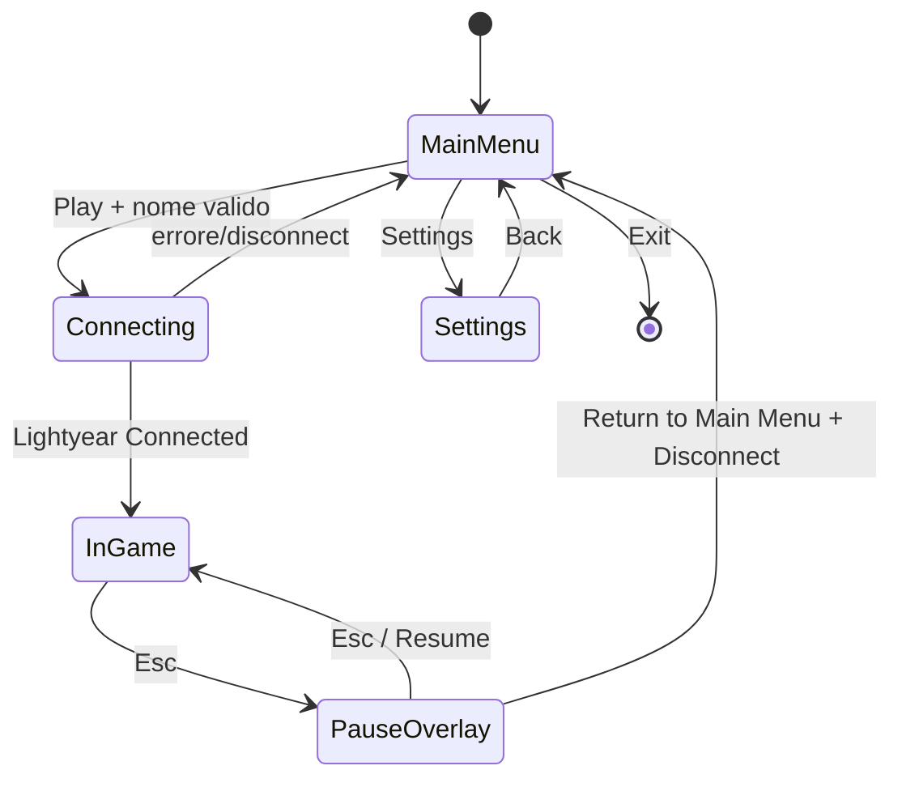

# Piano: menu, join nominativo, settings e pause overlay

**Stato**: implementazione completata; runtime smoke test client/server da eseguire dopo il termine della build Cargo in corso.

## Goal

Il client parte disconnesso nel menu principale, invia un nome valido al server solo dopo `Play`, e può tornare al menu da un pause overlay senza fermare la simulazione remota.

## Decisioni confermate

- Nome: trim, 3–16 caratteri; fallback `Player <peer_id>` solo se il server riceve un valore invalido.
- Il server valida il nome e resta autorevole su `PlayerName`.
- Il menu sparisce soltanto dopo l’evento di connessione Lightyear.
- Settings: schermata vuota con titolo e `Back`.
- `Exit`: invia `AppExit`.
- `Esc`: mostra/nasconde il pause overlay; non modifica `Time`, FixedUpdate o rete.
- `Return to Main Menu`: invia disconnect, torna immediatamente al menu; gli altri player continuano a muoversi.
- Anche `host-client` parte dal menu e connette solo dopo Play.

## Stato e confini



- `GameScreen`: stato UI locale (`MainMenu`, `Settings`, `Connecting`, `InGame`, `Paused`).
- `ConnectionIntent`: resource locale con il nome già validato, consumata dal sistema che crea il client Lightyear.
- `JoinRequest`: messaggio affidabile client → server, contenente il nome. Il server crea il player **solo** dopo ricezione/validazione.
- Scene/renderer/UI di gameplay sono abilitati per `InGame` e `Paused`; menu/settings hanno la propria UI/scena.

## Slice 1 — UI foundation e stato schermata

**Value**: il giocatore naviga menu/settings senza rete.

**Path**: avvio client -> `MainMenu` -> click Settings/Back/Exit.

**Acceptance criteria**:

- [ ] `GameScreen` governa visibilità delle UI senza despawn continui.
- [ ] Main menu mostra titolo, input nome, Play, Settings, Exit.
- [ ] Settings mostra titolo e Back.
- [ ] Esiste un componente riusabile `UiButton` con `UiButtonAction`.
- [ ] Esiste un componente `TextInput` focalizzabile e modificabile da tastiera.
- [ ] Exit emette `AppExit`.

**RED**: test di transizione `MainMenu <-> Settings`, validazione nome e mapping azione pulsante -> stato.

**GREEN**: plugin `main_menu`, `settings`, componenti UI condivisi, scene menu minimale.

**Verifica**: `cargo test`, `cargo check`, smoke test menu senza server.

## Slice 2 — connessione differita e join con nome

**Value**: Play connette solo quando il nome è valido e il player replicato usa quel nome.

**Path**: Play -> `ConnectionIntent` -> crea `Client`/UDP -> Connected -> `JoinRequest(name)` -> server valida -> spawna player -> `InGame`.

**Acceptance criteria**:

- [ ] Nessuna socket client viene creata durante MainMenu/Settings.
- [ ] Play disabilitato o ignorato per nome invalido; UI espone errore 3–16 caratteri.
- [ ] `Connecting` resta visibile fino a `Connected`.
- [ ] Il server non spawna un player al solo handshake: attende `JoinRequest`.
- [ ] Il player usa il nome validato server-side e lo scoreboard/entity bar lo mostrano.
- [ ] Timeout/disconnect prima del join torna al MainMenu con messaggio d’errore.

**RED**: test puro `validate_player_name`; test ECS server per join valido/invalido; test client per nessun `Client` prima del trigger Play.

**GREEN**: messaggio client→server, factory differita del client, lifecycle connection/join.

**Verifica**: server + due client: nessun player prima di Play, nomi distinti dopo Play.

## Slice 3 — scene di gioco e transizione post-connessione

**Value**: il giocatore entra nel mondo soltanto dopo connessione e può vedere altri player.

**Path**: `Connected` + join completato -> `InGame` -> game scene + renderer + UI in-world.

**Acceptance criteria**:

- [ ] Menu/settings non mostrano camera/terrain/UI floating di gameplay.
- [ ] Entrando InGame appare una sola game scene/camera.
- [ ] I player remoti e le loro EntityBar restano visibili e aggiornati.
- [ ] Tornando al menu si puliscono solo entità locali di presentation, non il server.

**RED**: test di transizione scene state; test idempotenza setup/cleanup scene.

**GREEN**: scene lifecycle guidato da `GameScreen`.

**Verifica**: smoke test con due client, enter/leave/re-enter.

## Slice 4 — pause overlay non bloccante e disconnect

**Value**: Esc apre un menu locale mentre il mondo continua; Return to Main Menu disconnette in modo pulito.

**Path**: InGame -> Esc -> Paused -> Resume oppure Return -> Disconnect -> MainMenu.

**Acceptance criteria**:

- [ ] `Esc` non usa `Time::pause`, non disabilita FixedUpdate e non ferma replica/rendering.
- [ ] Pause overlay mostra `Resume` e `Return to Main Menu`.
- [ ] Resume torna a InGame senza ricreare client o player.
- [ ] Return richiede disconnect Lightyear, rimuove client/presentation locale e visualizza MainMenu.
- [ ] Il server riceve la disconnessione e gli altri client continuano a simulare e vedere il mondo.

**RED**: test transizioni `InGame <-> Paused`, test intent disconnect e cleanup locale.

**GREEN**: `PauseMenuPlugin`, azioni button e lifecycle disconnect.

**Verifica**: tre processi (server, client A, client B); A lascia, B continua a muovere/vedere il proprio player.

## File target

```text
src/
├── game_state.rs                   # GameScreen, ConnectionIntent, validazione nome
├── network/
│   ├── client.rs                   # client creato/disconnesso su intent
│   ├── server.rs                   # player creato dopo JoinRequest
│   └── protocol.rs                  # JoinRequest e direzioni message
├── scenes/
│   ├── menu/
│   └── base/
└── ui/
    ├── components/
    │   ├── button.rs
    │   └── text_input.rs
    ├── main_menu/
    ├── settings/
    └── pause_menu/
```

## Quality gate per slice

1. Test RED/GREEN per logica pura e lifecycle ECS.
2. `cargo fmt --check`, `cargo test`, `cargo check`.
3. Smoke test manuale della flow corrispondente.
4. Nessun commit senza approvazione esplicita.
