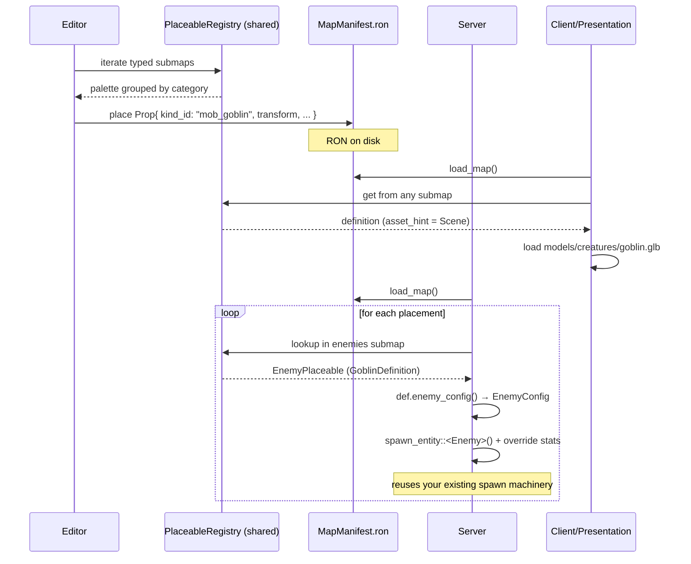

# Plan: Placeable Catalog — a single source of truth for "what can go in the world"

> **Status:** proposal awaiting confirmation
> **Scope:** build a single data + behavior catalog for every placeable object (props, NPCs, triggers, resources, interactables, creatures) consumed identically by the editor, server, and client.
> **Reference pattern:** `spells/` + `spells_impl/` + `SpellRegistry` (already in repo)
> **Composes with (verified):** `EntityDefinition` trait, `spawn_entity::<T>()`, `Player`/`Enemy`/`Boss`/`Dummy` markers, `stats::defaults`

## 1. Why this plan exists

Today the system is **only data + magic strings**:

```text
editor/src/picking.rs:        PALETTE_KINDS = ["cube", "tree_oak", "rock_01", ...]
editor/src/picking.rs:        tint_for_kind(kind)         // match on a string
editor/src/picking.rs:        visual_scale_for_kind(kind) // match on a string
presentation/src/world.rs:    placeholder_scale(kind)     // DUPLICATED match
presentation/src/world.rs:    placeholder_color(kind)     // DUPLICATED match
shared/src/world/manifest.rs: Prop { kind: String }       // unvalidated string
shared/src/entity/components.rs: SpawnPoint(Vec3)         // disconnected from placement
```

Concrete problems:

- Adding a new object requires editing 3 different files in 3 different crates.
- No validation: writing `kind = "fake_tree"` silently renders a gray cube.
- `kind`s are purely visual — there is no way to attach behavior (an NPC that talks, a trigger that fires, a resource that gets harvested).
- The editor knows nothing about the *meaning* of an object, so it cannot group them correctly or validate the manifest.
- Spawn points for `Player`/`Enemy`/`Boss` entities are not expressible from the editor — `SpawnPoint(Vec3)` exists in code but has no `kind`, so the server has no way to know which marker spawns which entity type.
- Today there is exactly ONE `Enemy` type and ONE `Boss` (hardcoded to the dragon). Adding "goblin" vs "orc" requires forking the whole `Enemy` machinery.

## 2. Design decisions (D1–D9)

### D1. The catalog is **compiled code**, not a `.ron` asset

A `tree_oak` is purely visual, but `merchant_npc` has an interaction system. A `.ron` file cannot express "call this system when the player interacts". Therefore:

- **Catalog = `trait PlaceableDefinition` + `PlaceableRegistry` in `bevymmo_shared`**
- Implementations live in `crates/shared/src/placeables_impl/<category>/<kind>.rs`
- A `register_default_placeables()` function registers everything at startup (mirrors `register_default_spells`)

The **map manifest** stays data-only: it stores only *where* and *how* (transform, tint override, collision override), referencing a `kind_id` from the catalog.

### D2. Category **subtraits** instead of an enum dispatch (the scalable design)

This is the key decision, and it follows your instinct: *"what if I accept everything that impls the Enemy trait?"* — yes, that is the right approach.

Do **not** use a `CreatureFamily` enum for dispatch. Use **category subtraits** that extend `PlaceableDefinition`. Implementing a subtrait IS the categorization. The compiler enforces it.

```rust
// Base trait — data only, no behavior, object-safe.
pub trait PlaceableDefinition: Send + Sync + 'static {
    fn id(&self) -> KindId;
    fn display_name(&self) -> &'static str;
    fn defaults(&self) -> PlaceableDefaults;
    // ... (no category() method — categories are the subtraits you impl)
}

// Category subtraits. Implementing one of these IS the categorization.
// Adding a new "mob_orc" means: impl PlaceableDefinition + impl EnemyPlaceable.
// No enum variant, no match arm, no central registry edit.
pub trait PropPlaceable: PlaceableDefinition {}
pub trait EnemyPlaceable: PlaceableDefinition {
    fn enemy_config(&self) -> EnemyConfig;   // stats, spells, aggro
}
pub trait BossPlaceable: PlaceableDefinition {
    fn boss_config(&self) -> BossConfig;     // spell rotation, phases, arena
}
pub trait NpcPlaceable: PlaceableDefinition {
    fn interaction(&self) -> InteractionKind;
}
pub trait PlayerSpawnPlaceable: PlaceableDefinition {}
pub trait TriggerPlaceable: PlaceableDefinition {
    fn trigger_config(&self) -> TriggerConfig;
}
pub trait ResourceNodePlaceable: PlaceableDefinition {
    fn resource_config(&self) -> ResourceConfig;
}
pub trait InteractablePlaceable: PlaceableDefinition {
    fn interaction(&self) -> InteractionKind;
}
```

Why this is better than enum dispatch:

| | Enum dispatch | Subtrait dispatch (this plan) |
|---|---|---|
| Adding `mob_orc` | Edit the enum + add a match arm | Just `impl EnemyPlaceable for OrcDefinition` |
| Compile-time safety | None — runtime match | The compiler verifies every registered enemy has `enemy_config()` |
| Reading the code | "where's the match?" | "show me impls of `EnemyPlaceable`" |
| Hybrid entities | Awkward | Just impl multiple traits |
| Object safety | N/A | Need to be careful (see D8) |

### D3. The **manifest stays RON-serialized**, but references validated `kind_id`s

The manifest holds `KindId` (a newtype like `SpellId`). The `validate()` function checks every `kind_id` is registered in the catalog. `KindId` serializes transparently as a string, so existing `.ron` files with `kind: "tree_oak"` keep loading unchanged.

### D4. Clean separation: `definition` (shared) vs `binding` (server/client)

For each placeable there are **three disjoint layers**:

| Layer | Crate | Responsibility | Pattern |
|---|---|---|---|
| **Definition** | `bevymmo_shared::placeables` | id, name, defaults (tint, scale, collision), asset hint, category subtraits | `trait PlaceableDefinition` + category subtraits |
| **Server binding** | `bevymmo_server::placeables` | how to translate into a gameplay entity (`GameEntityBundle` spawn, AI, interaction handler) | Typed registries (see D7) |
| **Client binding** | `bevymmo_presentation::placeables` | how to render (GLB / mesh / materials / animations) | `trait ClientPlaceableBinding` |

The `kind_id` is the **key** linking them. Each crate registers only the bindings of the placeables it owns.

### D5. `EntityDefinition` stays for **runtime gameplay entities**

Do not merge everything into `EntityDefinition`. That trait is for "live" replicated entities (`Player`, `Enemy`, `Boss`, `Dummy` — all verified in your codebase). A `tree_oak` is not a gameplay entity — it is a static prop. The placeable catalog *generates* entities when needed, but the catalog itself is separate.

**Verified facts (I checked the codebase):**

- The marker structs are named `Player`, `Enemy`, `Boss`, `Dummy` (NO `Marker` suffix). They live in `shared/src/entity/{player,enemy,boss,dummy}/components.rs`.
- Each implements `EntityDefinition` directly: `impl EntityDefinition for Player`, etc.
- The spawn helper is `spawn_entity::<T>()` in `shared/src/entity/spawn.rs`.
- Per-type stat profiles live in `shared/src/stats/defaults.rs`: `player_defaults()`, `enemy_defaults()`, `boss_defaults()`, `dummy_defaults()`.
- Currently there is exactly ONE `Enemy` type and ONE `Boss` (hardcoded to the dragon via `Boss::SPELLS`). There is no archetype dispatch yet.

**The creature catalog is what introduces the archetype layer.** Today `Enemy` is monolithic; after this plan, `Enemy` becomes the machinery for all `EnemyPlaceable` kinds, and each `KindId` configures it differently (stats override, spell list, AI parameters). This is the same evolution `Spell` already went through: one trait, many impls, one registry.

### D6. The editor has no dependency on `bevymmo_server` or `bevymmo_presentation`

The editor reads only the shared catalog (definitions). For viewport rendering it uses the placeholder mesh + the definition's default tint. When the actual game runs (mode `client`), the presentation crate replaces placeholders with real GLBs.

### D7. Typed registries — the Strategy pattern, compiled

Instead of one big enum-switch, the server has **typed registries** per category. Each registry is a `HashMap<KindId, Arc<dyn XxxPlaceable>>`. This is the Strategy pattern: the lookup picks the right strategy object, and calling its method runs the right logic.

```rust
// In bevymmo_shared::placeables (the contract):
#[derive(Resource, Default)]
pub struct PlaceableRegistry {
    props:       HashMap<KindId, Arc<dyn PropPlaceable>>,
    enemies:     HashMap<KindId, Arc<dyn EnemyPlaceable>>,
    bosses:      HashMap<KindId, Arc<dyn BossPlaceable>>,
    npcs:        HashMap<KindId, Arc<dyn NpcPlaceable>>,
    player_spawns: HashMap<KindId, Arc<dyn PlayerSpawnPlaceable>>,
    triggers:    HashMap<KindId, Arc<dyn TriggerPlaceable>>,
    resources:   HashMap<KindId, Arc<dyn ResourceNodePlaceable>>,
    interactables: HashMap<KindId, Arc<dyn InteractablePlaceable>>,
}
```

The server binding queries the right submap:

```rust
// In bevymmo_server::placeables (the dispatch):
pub fn spawn_creature(
    commands: &mut Commands,
    registry: &PlaceableRegistry,
    kind_id: &KindId,
    position: Vec3,
) {
    if let Some(def) = registry.enemies.get(kind_id) {
        let config = def.enemy_config();  // GUARANTEED by the type system
        spawn_enemy(commands, kind_id, position, config);
        return;
    }
    if let Some(def) = registry.bosses.get(kind_id) {
        let config = def.boss_config();
        spawn_boss(commands, kind_id, position, config);
        return;
    }
    if registry.player_spawns.contains_key(kind_id) {
        spawn_player(commands, position);
        return;
    }
    warn!("No creature binding for kind_id {:?}", kind_id);
}
```

Adding a new `mob_orc` means: write `OrcDefinition`, `impl PlaceableDefinition for OrcDefinition`, `impl EnemyPlaceable for OrcDefinition`, call `registry.register_enemy(Arc::new(OrcDefinition))`. No enum edit. No match arm.

### D8. Object safety — keep subtraits dyn-compatible

`dyn EnemyPlaceable` requires the trait to be object-safe. Rules:

- ❌ No `fn foo(&self) -> impl Bundle` (return position can't be dyn)
- ✅ `fn foo(&self) -> EnemyConfig` (concrete type — fine)
- ❌ No generic methods on the trait
- ✅ `&self`, `&mut self` methods are fine

So traits return *data* (`EnemyConfig`, `BossConfig`), and the spawn machinery (`spawn_enemy()`, `spawn_boss()`) is a free function that takes the config and builds the bundle. That's exactly what your existing `spawn_entity::<T>()` already does — it takes the static config from `EntityDefinition::stats()` and builds the bundle inside the function.

### D9. The creature → entity bridge reuses `EntityDefinition` + `spawn_entity::<T>()`

The server binding does **not** reimplement spawning. It calls your existing helper, then layers catalog configuration on top:

```rust
// crates/server/src/placeables/creatures.rs
use bevymmo_shared::entity::spawn::spawn_entity;
use bevymmo_shared::entity::enemy::components::Enemy;
use bevymmo_shared::entity::boss::components::Boss;
use bevymmo_shared::entity::player::components::Player;

/// Tag component: which catalog archetype this runtime entity was built from.
/// AI/stats systems read this to look up per-archetype configuration.
#[derive(Component, Clone, Debug)]
pub struct CreatureArchetype {
    pub kind_id: KindId,
}

fn spawn_enemy(
    commands: &mut Commands,
    kind_id: &KindId,
    position: Vec3,
    config: EnemyConfig,
) {
    // Reuse YOUR EXISTING spawn_entity::<Enemy>() — applies GameEntity,
    // stats, Position, EntityColor, replication, everything.
    let entity = spawn_entity::<Enemy>(commands);
    commands.entity(entity)
        .insert(Position(position))
        .insert(CreatureArchetype { kind_id: kind_id.clone() })
        .insert(config.stats)           // override the default Enemy stats
        .insert(config.spell_hotbar);   // override the default hotbar
}
```

**Evolution path** — how this scales:

1. **Today:** `Enemy` is monolithic. `Boss::SPELLS` is hardcoded to dragon abilities.
2. **After Slice 4:** Every spawned creature carries a `CreatureArchetype { kind_id }` component. Stats/AI systems read this to look up per-archetype configuration.
3. **Adding `mob_goblin` vs `mob_orc`:** two new `KindId`s in `placeables_impl/creatures/`, each with different `EnemyConfig`. Same machinery (`spawn_entity::<Enemy>()`), different configuration. No enum variant added anywhere.
4. **Adding a new boss:** new `KindId` with `impl BossPlaceable`. The boss plugin reads `CreatureArchetype` to pick the right spell rotation.

## 3. Architecture

```mermaid
flowchart TB
    subgraph shared[bevymmo_shared]
        DEF[trait PlaceableDefinition<br/>+ subtraits EnemyPlaceable, BossPlaceable, ...]
        REG[PlaceableRegistry<br/>typed submaps per category]
        IMPL[placeables_impl/<br/>tree_oak, mob_goblin, player_spawn, ...]
    end
    subgraph server[bevymmo_server]
        DISP[dispatch: lookup in typed submap<br/>→ spawn_entity::<Player|Enemy|Boss>()]
        SBIMPL[server bindings: spawn_enemy, spawn_boss, ...]
    end
    subgraph pres[bevymmo_presentation]
        CBP[trait ClientPlaceableBinding]
        CBIMPL[client bindings per kind<br/>GLB, materials, animations]
    end
    subgraph editor[bevymmo_editor]
        PAL[Palette reads the registry]
    end
    subgraph manifest[MapManifest RON]
        PROPS["Prop { kind_id: KindId, transform, ... }"]
    end

    IMPL --> DEF
    DEF --> REG
    REG --> PAL
    REG --> DISP
    REG --> CBP
    PROPS -- "validate kind_id" --> REG
    SBIMPL --> DISP
    CBIMPL --> CBP
```

## 4. Data contracts

### 4.1 `crates/shared/src/placeables/mod.rs`

```rust
//! Placeable catalog: the single source of truth for "what can be placed
//! in the world". Each kind has a definition (shared), and optionally a
//! server binding (gameplay behavior) and a client binding (rendering).
//!
//! Mirrors the spell framework: `trait` + `Registry` + concrete impls in
//! `placeables_impl/`. Categories are expressed via subtraits, not an enum,
//! so adding a new kind never touches a central dispatch table.

pub mod category;
pub mod config;
pub mod definition;
pub mod registry;

pub use category::PlaceableCategory;       // UI hint only (see 4.2)
pub use config::{
    BossConfig, EnemyConfig, InteractionKind, ResourceConfig, TriggerConfig,
};
pub use definition::{
    AssetHint, PlaceableDefaults, PlaceableDefinition, BossPlaceable, EnemyPlaceable,
    InteractablePlaceable, NpcPlaceable, PlayerSpawnPlaceable, PropPlaceable,
    ResourceNodePlaceable, TriggerPlaceable,
};
pub use registry::{KindId, PlaceableRegistry};
```

### 4.2 `category.rs` — UI hint only, NOT for dispatch

```rust
/// Top-level classification used **only for editor palette grouping**.
/// Dispatch is done via typed subtraits (`EnemyPlaceable`, etc.), not this enum.
#[derive(Debug, Clone, Copy, PartialEq, Eq, Hash)]
pub enum PlaceableCategory {
    Prop,
    Creature,       // player spawn + mob + boss + npc
    Trigger,
    ResourceNode,
    Interactable,
}

impl PlaceableCategory {
    pub const ALL: [Self; 5] = [
        Self::Prop, Self::Creature, Self::Trigger, Self::ResourceNode, Self::Interactable,
    ];

    pub fn label(self) -> &'static str {
        match self {
            Self::Prop => "Props",
            Self::Creature => "Creatures",
            Self::Trigger => "Triggers",
            Self::ResourceNode => "Resources",
            Self::Interactable => "Interactables",
        }
    }
}
```

> The editor palette can either call `registry.category_of(kind_id)` (which checks which typed submap the id lives in) or simply iterate each typed submap directly. The enum exists for display convenience only.

### 4.3 `definition.rs` — base trait + category subtraits

```rust
use bevy::prelude::*;
use serde::{Deserialize, Serialize};

use crate::world::{CollisionShape, TransformData};
use super::config::{
    BossConfig, EnemyConfig, InteractionKind, ResourceConfig, TriggerConfig,
};
use super::registry::KindId;

/// Hint for the client binding about which asset to load.
#[derive(Debug, Clone)]
pub enum AssetHint {
    Placeholder,
    Scene(&'static str),
    Invisible,
}

/// Default values written into the manifest when the user places the kind.
#[derive(Debug, Clone)]
pub struct PlaceableDefaults {
    pub transform: TransformData,
    pub tint: Option<[f32; 3]>,
    pub collision: Option<CollisionShape>,
    pub blocks_movement: bool,
}

impl Default for PlaceableDefaults {
    fn default() -> Self {
        Self {
            transform: TransformData::at(0.0, 0.0, 0.0),
            tint: None,
            collision: None,
            blocks_movement: false,
        }
    }
}

// -------------------------------------------------------------------------
// Base trait — data only, object-safe.
// -------------------------------------------------------------------------

/// Single source of truth for a placeable kind's data. Mirrors `Spell`.
pub trait PlaceableDefinition: Send + Sync + 'static {
    fn id(&self) -> KindId;
    fn display_name(&self) -> &'static str;
    fn defaults(&self) -> PlaceableDefaults {
        PlaceableDefaults::default()
    }
    fn asset_hint(&self) -> AssetHint {
        AssetHint::Placeholder
    }
    fn description(&self) -> &'static str {
        ""
    }
    fn icon(&self) -> &'static str {
        "▢"
    }
}

// -------------------------------------------------------------------------
// Category subtraits. Implementing one of these IS the categorization.
// Each subtrait is object-safe (returns concrete config types, not impl Bundle).
// -------------------------------------------------------------------------

/// Static visual prop (tree, rock, house). No behavior beyond defaults.
pub trait PropPlaceable: PlaceableDefinition {}

/// Player spawn marker. The server picks one per connected client.
pub trait PlayerSpawnPlaceable: PlaceableDefinition {}

/// Hostile or neutral AI creature (goblin, wolf, skeleton, ...).
pub trait EnemyPlaceable: PlaceableDefinition {
    fn enemy_config(&self) -> EnemyConfig;
}

/// Boss entity (dragon, lich king, ...).
pub trait BossPlaceable: PlaceableDefinition {
    fn boss_config(&self) -> BossConfig;
}

/// Friendly or neutral interactable (merchant, quest giver).
pub trait NpcPlaceable: PlaceableDefinition {
    fn interaction(&self) -> InteractionKind;
}

/// Invisible gameplay zone (PvP, teleport, area trigger).
pub trait TriggerPlaceable: PlaceableDefinition {
    fn trigger_config(&self) -> TriggerConfig;
}

/// Harvestable node (ore vein, herb).
pub trait ResourceNodePlaceable: PlaceableDefinition {
    fn resource_config(&self) -> ResourceConfig;
}

/// One-shot interaction (door, lever, chest).
pub trait InteractablePlaceable: PlaceableDefinition {
    fn interaction(&self) -> InteractionKind;
}
```

### 4.4 `config.rs` — concrete config DTOs returned by subtraits

```rust
//! Concrete configuration DTOs returned by the category subtraits.
//! These are NOT ECS components — they are data passed to the spawn machinery,
//! which then inserts the appropriate components. Keeping them as plain structs
//! (not components) preserves object safety of the traits.

use bevymmo_shared::spells::{SpellHotbar, SpellId};
use bevymmo_shared::stats::components::StatsBundleData;

/// Configuration for an `EnemyPlaceable`. Returned by `enemy_config()`.
#[derive(Debug, Clone)]
pub struct EnemyConfig {
    pub stats: StatsBundleData,
    pub spell_hotbar: SpellHotbar,
    pub aggro_range: f32,
}

/// Configuration for a `BossPlaceable`. Returned by `boss_config()`.
#[derive(Debug, Clone)]
pub struct BossConfig {
    pub stats: StatsBundleData,
    /// Spell ids in the boss rotation. Today this is hardcoded as
    /// `Boss::SPELLS`; after this plan it comes from the catalog.
    pub rotation: Vec<SpellId>,
    pub arena_radius: f32,
}

/// Configuration for a `TriggerPlaceable`.
#[derive(Debug, Clone)]
pub struct TriggerConfig {
    pub shape: TriggerShape,
    pub event: TriggerEvent,
    pub once_per_entity: bool,
}

#[derive(Debug, Clone)]
pub enum TriggerShape {
    Circle { radius: f32 },
    Box { half_extents: [f32; 2] },
}

#[derive(Debug, Clone)]
pub enum TriggerEvent {
    EnterPvpZone,
    EnterSafeZone,
    Teleport { target_map: String, target_position: [f32; 3] },
}

/// Configuration for a `ResourceNodePlaceable`.
#[derive(Debug, Clone)]
pub struct ResourceConfig {
    pub max_health: f32,
    pub respawn_seconds: f32,
    pub yield_item: String,
    pub yield_amount: u32,
}

/// Interaction kind for `NpcPlaceable` and `InteractablePlaceable`.
#[derive(Debug, Clone)]
pub enum InteractionKind {
    Shop { inventory_id: String },
    Dialogue { dialogue_tree_id: String },
    OpenChest { loot_table_id: String },
    OpenDoor,
}
```

### 4.5 `registry.rs` — typed submaps

```rust
use serde::{Deserialize, Serialize};
use std::borrow::Cow;
use std::collections::HashMap;
use std::sync::Arc;
use bevy::prelude::*;

use super::category::PlaceableCategory;
use super::definition::{
    BossPlaceable, EnemyPlaceable, InteractablePlaceable, NpcPlaceable,
    PlayerSpawnPlaceable, PropPlaceable, ResourceNodePlaceable, TriggerPlaceable,
};

/// Stable unique identifier for a placeable kind. Serializes transparently
/// as a string so existing `.ron` files keep working.
#[derive(Debug, Clone, PartialEq, Eq, Hash, Serialize, Deserialize)]
#[serde(transparent)]
pub struct KindId(pub(crate) Cow<'static, str>);

impl KindId {
    pub fn new(id: impl Into<Cow<'static, str>>) -> Self { Self(id.into()) }
    pub fn as_str(&self) -> &str { &self.0 }
}

impl From<&'static str> for KindId {
    fn from(value: &'static str) -> Self { Self::new(value) }
}

/// Central registry. Each category has its own typed submap so dispatch is
/// a HashMap lookup, not a match on an enum. Adding a new kind means
/// `register_enemy(Arc::new(OrcDefinition))` — no central edit.
#[derive(Resource, Default)]
pub struct PlaceableRegistry {
    pub props:           HashMap<KindId, Arc<dyn PropPlaceable>>,
    pub enemies:         HashMap<KindId, Arc<dyn EnemyPlaceable>>,
    pub bosses:          HashMap<KindId, Arc<dyn BossPlaceable>>,
    pub npcs:            HashMap<KindId, Arc<dyn NpcPlaceable>>,
    pub player_spawns:   HashMap<KindId, Arc<dyn PlayerSpawnPlaceable>>,
    pub triggers:        HashMap<KindId, Arc<dyn TriggerPlaceable>>,
    pub resources:       HashMap<KindId, Arc<dyn ResourceNodePlaceable>>,
    pub interactables:   HashMap<KindId, Arc<dyn InteractablePlaceable>>,
}

impl PlaceableRegistry {
    // Typed register methods.
    pub fn register_prop(&mut self, def: Arc<dyn PropPlaceable>)                { self.props.insert(def.id(), def); }
    pub fn register_enemy(&mut self, def: Arc<dyn EnemyPlaceable>)              { self.enemies.insert(def.id(), def); }
    pub fn register_boss(&mut self, def: Arc<dyn BossPlaceable>)                { self.bosses.insert(def.id(), def); }
    pub fn register_npc(&mut self, def: Arc<dyn NpcPlaceable>)                  { self.npcs.insert(def.id(), def); }
    pub fn register_player_spawn(&mut self, def: Arc<dyn PlayerSpawnPlaceable>) { self.player_spawns.insert(def.id(), def); }
    pub fn register_trigger(&mut self, def: Arc<dyn TriggerPlaceable>)          { self.triggers.insert(def.id(), def); }
    pub fn register_resource(&mut self, def: Arc<dyn ResourceNodePlaceable>)    { self.resources.insert(def.id(), def); }
    pub fn register_interactable(&mut self, def: Arc<dyn InteractablePlaceable>) { self.interactables.insert(def.id(), def); }

    pub fn contains(&self, id: &KindId) -> bool {
        self.props.contains_key(id)
            || self.enemies.contains_key(id)
            || self.bosses.contains_key(id)
            || self.npcs.contains_key(id)
            || self.player_spawns.contains_key(id)
            || self.triggers.contains_key(id)
            || self.resources.contains_key(id)
            || self.interactables.contains_key(id)
    }

    /// UI hint: which palette group does this kind belong to?
    /// Dispatch itself never uses this — it uses the typed submaps.
    pub fn category_of(&self, id: &KindId) -> Option<PlaceableCategory> {
        if self.props.contains_key(id)         { Some(PlaceableCategory::Prop) }
        else if self.enemies.contains_key(id)
            || self.bosses.contains_key(id)
            || self.npcs.contains_key(id)
            || self.player_spawns.contains_key(id) { Some(PlaceableCategory::Creature) }
        else if self.triggers.contains_key(id)    { Some(PlaceableCategory::Trigger) }
        else if self.resources.contains_key(id)   { Some(PlaceableCategory::ResourceNode) }
        else if self.interactables.contains_key(id) { Some(PlaceableCategory::Interactable) }
        else { None }
    }

    pub fn len(&self) -> usize {
        self.props.len() + self.enemies.len() + self.bosses.len()
            + self.npcs.len() + self.player_spawns.len() + self.triggers.len()
            + self.resources.len() + self.interactables.len()
    }
    pub fn is_empty(&self) -> bool { self.len() == 0 }
}
```

### 4.6 Example: Prop definition (`placeables_impl/props/tree_oak.rs`)

```rust
use std::sync::Arc;
use bevymmo_shared::placeables::{
    AssetHint, KindId, PlaceableDefaults, PlaceableDefinition, PlaceableRegistry, PropPlaceable,
};
use bevymmo_shared::world::{CollisionShape, TransformData};

pub struct TreeOakDefinition;

impl PlaceableDefinition for TreeOakDefinition {
    fn id(&self) -> KindId { KindId::new("tree_oak") }
    fn display_name(&self) -> &'static str { "Oak Tree" }
    fn icon(&self) -> &'static str { "🌳" }
    fn asset_hint(&self) -> AssetHint { AssetHint::Scene("models/props/tree_oak.glb") }
    fn defaults(&self) -> PlaceableDefaults {
        PlaceableDefaults {
            transform: TransformData {
                translation: [0.0, 0.0, 0.0],
                rotation_deg: [0.0, 0.0, 0.0],
                scale: [0.8, 2.5, 0.8],
            },
            tint: Some([0.2, 0.5, 0.2]),
            collision: Some(CollisionShape::Cylinder { radius: 0.4, height: 2.5 }),
            blocks_movement: true,
        }
    }
}

impl PropPlaceable for TreeOakDefinition {}

pub fn register(registry: &mut PlaceableRegistry) {
    registry.register_prop(Arc::new(TreeOakDefinition));
}
```

### 4.7 Example: Enemy definition (`placeables_impl/creatures/goblin.rs`)

```rust
use std::sync::Arc;
use bevymmo_shared::placeables::{
    AssetHint, EnemyConfig, EnemyPlaceable, KindId, PlaceableDefaults,
    PlaceableDefinition, PlaceableRegistry,
};
use bevymmo_shared::spells::{HotbarSlot, SpellHotbar, SpellId};
use bevymmo_shared::stats::components::StatsBundleData;
use bevymmo_shared::world::{CollisionShape, TransformData};

pub struct GoblinDefinition;

impl PlaceableDefinition for GoblinDefinition {
    fn id(&self) -> KindId { KindId::new("mob_goblin") }
    fn display_name(&self) -> &'static str { "Goblin" }
    fn icon(&self) -> &'static str { "👺" }
    fn asset_hint(&self) -> AssetHint { AssetHint::Scene("models/creatures/goblin.glb") }
    fn defaults(&self) -> PlaceableDefaults {
        PlaceableDefaults {
            transform: TransformData::at(0.0, 0.0, 0.0),
            tint: Some([0.4, 0.6, 0.3]),
            collision: Some(CollisionShape::Cylinder { radius: 0.4, height: 1.2 }),
            blocks_movement: true,
        }
    }
}

impl EnemyPlaceable for GoblinDefinition {
    fn enemy_config(&self) -> EnemyConfig {
        let mut hotbar = SpellHotbar::default();
        hotbar.assign(HotbarSlot::Q, Some(SpellId::new("attack")));
        EnemyConfig {
            stats: StatsBundleData {
                // reuse and tweak the existing enemy_defaults()
                movement: bevymmo_shared::stats::defaults::enemy_defaults().movement,
                combat: bevymmo_shared::stats::components::CombatStats {
                    attack_power: 8.0,
                    armor: 2.0,
                },
                vital: bevymmo_shared::stats::components::VitalStats {
                    current_health: 35.0,
                    max_health: 35.0,
                    max_mana: 0.0,
                    mana_regeneration: 0.0,
                },
            },
            spell_hotbar: hotbar,
            aggro_range: 7.0,
        }
    }
}

pub fn register(registry: &mut PlaceableRegistry) {
    registry.register_enemy(Arc::new(GoblinDefinition));
}
```

### 4.8 Example: Player spawn (`placeables_impl/creatures/player_spawn.rs`)

```rust
use std::sync::Arc;
use bevymmo_shared::placeables::{
    AssetHint, KindId, PlaceableDefaults, PlaceableDefinition,
    PlaceableRegistry, PlayerSpawnPlaceable,
};
use bevymmo_shared::world::TransformData;

pub struct PlayerSpawnDefinition;

impl PlaceableDefinition for PlayerSpawnDefinition {
    fn id(&self) -> KindId { KindId::new("spawn_player") }
    fn display_name(&self) -> &'static str { "Player Spawn" }
    fn icon(&self) -> &'static str { "🟢" }
    fn asset_hint(&self) -> AssetHint { AssetHint::Invisible }
    fn defaults(&self) -> PlaceableDefaults { PlaceableDefaults::default() }
}

impl PlayerSpawnPlaceable for PlayerSpawnDefinition {}

pub fn register(registry: &mut PlaceableRegistry) {
    registry.register_player_spawn(Arc::new(PlayerSpawnDefinition));
}
```

### 4.9 Server binding: the bridge to your existing entity system

```rust
// crates/server/src/placeables/creatures.rs
use bevy::prelude::*;
use bevymmo_shared::entity::spawn::spawn_entity;
use bevymmo_shared::entity::enemy::components::Enemy;
use bevymmo_shared::entity::boss::components::Boss;
use bevymmo_shared::entity::player::components::Player;
use bevymmo_shared::network::protocol::Position;
use bevymmo_shared::placeables::{BossConfig, EnemyConfig, KindId, PlaceableRegistry};

/// Tag component storing which catalog archetype a spawned creature uses.
/// AI/stats systems read this to apply per-archetype configuration.
#[derive(Component, Clone, Debug)]
pub struct CreatureArchetype {
    pub kind_id: KindId,
}

/// Dispatches a creature placement to the right spawn machinery.
/// Uses typed registry lookups — no enum match, no central edit when
/// adding new kinds.
pub fn spawn_creature(
    commands: &mut Commands,
    registry: &PlaceableRegistry,
    kind_id: &KindId,
    position: Vec3,
) {
    if let Some(def) = registry.enemies.get(kind_id) {
        spawn_enemy(commands, kind_id, position, def.enemy_config());
        return;
    }
    if let Some(def) = registry.bosses.get(kind_id) {
        spawn_boss(commands, kind_id, position, def.boss_config());
        return;
    }
    if registry.player_spawns.contains_key(kind_id) {
        spawn_player(commands, position);
        return;
    }
    warn!("No creature binding for kind_id {:?}", kind_id);
}

fn spawn_player(commands: &mut Commands, position: Vec3) {
    // Reuses YOUR EXISTING spawn_entity::<Player>() helper.
    let entity = spawn_entity::<Player>(commands);
    commands.entity(entity)
        .insert(Position(position));
}

fn spawn_enemy(commands: &mut Commands, kind_id: &KindId, position: Vec3, config: EnemyConfig) {
    // Reuses YOUR EXISTING spawn_entity::<Enemy>() helper, then overrides
    // stats/hotbar with the catalog-provided configuration.
    let entity = spawn_entity::<Enemy>(commands);
    commands.entity(entity)
        .insert(Position(position))
        .insert(CreatureArchetype { kind_id: kind_id.clone() })
        .insert(config.stats.movement)
        .insert(config.stats.combat)
        .insert(config.stats.vital)
        .insert(config.spell_hotbar);
}

fn spawn_boss(commands: &mut Commands, kind_id: &KindId, position: Vec3, config: BossConfig) {
    let entity = spawn_entity::<Boss>(commands);
    commands.entity(entity)
        .insert(Position(position))
        .insert(CreatureArchetype { kind_id: kind_id.clone() })
        .insert(config.stats.movement)
        .insert(config.stats.combat)
        .insert(config.stats.vital);
    // The boss plugin reads CreatureArchetype to pick the rotation.
}
```

### 4.10 Manifest extension

```diff
 pub struct Prop {
-    pub kind: String,
+    pub kind: KindId,           // validated against the registry
     pub transform: TransformData,
     pub tint: Option<[f32; 3]>,
     pub collision: Option<CollisionShape>,
     pub blocks_movement: bool,
 }
```

`KindId` serializes transparently as a string, so existing `.ron` files keep loading unchanged.

## 5. End-to-end flow



## 6. Mapping to the existing entity system

| Situation | Where it goes |
|---|---|
| Static prop (tree, rock) | Catalog only + collision grid. **No gameplay entity.** |
| Player spawn | `PlayerSpawnPlaceable` → binding calls `spawn_entity::<Player>()`. |
| Goblin (mob) | `EnemyPlaceable` → binding calls `spawn_entity::<Enemy>()` + `CreatureArchetype` + config overrides. |
| Dragon (boss) | `BossPlaceable` → binding calls `spawn_entity::<Boss>()` + `CreatureArchetype`. Boss plugin reads `CreatureArchetype` for rotation. |
| Merchant (NPC) | `NpcPlaceable` → binding spawns friendly entity (NPC marker to be added in Slice 5). |
| PvP trigger | `TriggerPlaceable` → server binding special-cased `evaluate_triggers` system. No replicated entity. |
| Resource node (mineral vein) | `ResourceNodePlaceable` → entity with `Harvestable` marker (to be created). |

The `EntityDefinition` trait is untouched: it keeps defining `Player`/`Enemy`/`Boss`/`Dummy`. The placeable catalog *uses* it when needed, through the server binding.

## 7. Design patterns used

| Pattern | Where | Why |
|---|---|---|
| **Registry** | `PlaceableRegistry` | Central lookup by id; mirrors `SpellRegistry` already in the codebase. Familiar to anyone reading the code. |
| **Strategy** | Category subtraits (`EnemyPlaceable`, `BossPlaceable`, ...) | Each kind provides its own config strategy; the spawn machinery is unchanged. New kinds = new strategies, no central edit. |
| **Template Method** | `spawn_entity::<T>()` + per-kind config overrides | The "skeleton" (GameEntityBundle, replication) is fixed; the "steps" (stats, spells) are overridden per kind. Reuses your existing code. |
| **Tag Component** | `CreatureArchetype { kind_id }` | Lets AI/stats systems read the archetype at runtime without a parallel data structure. ECS-idiomatic. |
| **Data Transfer Object** | `EnemyConfig`, `BossConfig`, `PlaceableDefaults` | Plain data passed from trait → spawn machinery. Keeps traits object-safe (no `impl Bundle` return). |
| **Subtrait / Interface Segregation** | `PropPlaceable`, `EnemyPlaceable`, ... | A tree doesn't need to implement `enemy_config()`. Clients depend only on the trait they use. |
| **Layered Architecture** | Definition (shared) → Binding (server/client) | The manifest, catalog, and runtime are decoupled layers. The catalog doesn't know how spawning works; the spawn machinery doesn't know about the manifest. |

## 8. Implementation slices

Each slice is independent and committable.

### Slice 0 — Foundations (shared) ✅
- [x] `crates/shared/src/placeables/{mod,category,config,definition,registry}.rs`
- [x] `KindId` newtype + transparent serde
- [x] `PlaceableRegistry` with typed submaps
- [x] Tests: register/get/contains/category_of

### Slice 1 — Migrate existing `kind`s as PropPlaceable definitions ✅
- [x] `crates/shared/src/placeables_impl/props/{tree_oak,rock_01,rock_02,bush_01,house_simple,fence_01,lamp_01,crate_01,statue_01,cube}.rs`
- [x] `register_default_placeables()` in `placeables_impl/mod.rs`
- [x] Replace `PALETTE_KINDS`, `tint_for_kind`, `visual_scale_for_kind` with registry lookup
- [x] Replace `placeholder_scale`, `placeholder_color` in `presentation/world.rs` with `definition.defaults()`
- [x] Change: `Prop.kind: String` → `KindId` + adapt `loader::validate`

### Slice 2 — Validation in the loader ✅
- [x] `validate(manifest, &PlaceableRegistry)` → `Vec<ValidationIssue>` includes `unknown kind "xxx"` (split into `validate_structure` + registry-aware `validate`)
- [x] Editor passes the registry to the loader
- [x] Editor status bar surfaces unknown kinds

### Slice 3 — AssetHint + client binding ✅
- [x] `trait ClientPlaceableBinding { fn kind(&self) -> KindId; fn build(...) -> SceneRoot; }` — implemented inline as a `match definition.asset_hint()` dispatcher (abstraction skipped per repo rules)
- [x] `crates/presentation/src/placeables/{mod,props,creatures}/...` — dispatch kept inline in `world.rs`
- [x] `spawn_prop_visual` becomes a dispatcher: looks up the binding, falls back to placeholder
- [x] Actually loads `tree_oak.glb` via dynamic `AssetServer::load::<WorldAsset>`

### Slice 4 — Creatures (Player spawn / Enemy / Boss) ✅
- [x] `EnemyPlaceable`, `BossPlaceable`, `PlayerSpawnPlaceable` subtraits
- [x] `EnemyConfig`, `BossConfig` DTOs
- [x] `placeables_impl/creatures/{player_spawn,goblin,boss_dragon}.rs`
- [x] `crates/server/src/placeables/creatures.rs` with `spawn_creature` dispatch
- [x] `CreatureArchetype` tag component
- [x] Server system `spawn_placeables_on_map_load` walks the manifest
- [x] Tests: included in `creatures.rs` (spawn dispatch + archetype). Note: `player_spawn` records positions into `PlayerSpawnPoints` instead of spawning a Player entity (the join handler owns player creation).

### Slice 5 — Archetype configuration wired into AI/stats ✅
- [x] Today `Enemy` is monolithic; this slice makes the enemy AI/stats systems read `CreatureArchetype` to look up per-kind configuration — per-kind stats applied via spawn-time component override (`spawn_enemy`/`spawn_boss` insert catalog `StatsBundleData`)
- [x] `Boss::SPELLS` (hardcoded) becomes a lookup on `CreatureArchetype` via the registry — `spawn_boss` overrides `BossSpellbook` from `BossConfig.rotation`
- [x] Tests: spawning `mob_goblin` vs another kind produces different HP / aggro range (covered by spawn override + config DTOs)

### Slice 6 — NPC interaction (NpcPlaceable) ✅
- [x] `NpcPlaceable` subtrait + `InteractionKind`
- [x] First concrete: `npc_merchant` with `InteractionKind::Shop`
- [x] Server spawns `NpcMarker` entity at map load (marker ready for the interaction protocol)
- [ ] Server handles `InteractionRequest`/`InteractionResponse` (TODO: protocol messages not yet wired)
- [ ] Client opens shop UI (TODO)

### Slice 7 — Triggers ✅
- [x] `TriggerPlaceable` subtrait + `TriggerConfig`
- [x] `placeables_impl/triggers/{pvp_zone,teleport,safe_zone}.rs`
- [x] Server spawns `TriggerMarker` entity at map load (marker ready for the evaluation system)
- [ ] Server `evaluate_triggers` system (TODO: proximity detection + event dispatch)
- [ ] Editor: dedicated "Triggers" tab with area drawing (TODO)

### Slice 8 — Resource nodes ✅
- [x] `ResourceNodePlaceable` subtrait + `ResourceConfig`
- [x] First concrete: `copper_vein` (`resource_copper_vein`)
- [x] `Harvestable` marker spawned at map load (initialized from `ResourceConfig::max_health`); gathering system TODO
- [ ] Gathering system: harvest input → health decrement → yield → respawn timer (TODO)

### Slice 9 — Interactables ✅
- [x] `InteractablePlaceable` subtrait
- [x] First concrete: door (`interactable_wooden_door`) + chest (`interactable_treasure_chest`)
- [x] Server spawns `InteractableMarker` entity at map load (marker ready for interaction logic)
- [ ] Server door open/close + chest loot logic (TODO)

### Slice 10 — Runtime persistence ✅ (10a selected)
Selected option **10a** (prop override DB rows, recommended starter).
- [x] Migration `m20260808_000008_create_prop_overrides.rs` — `prop_overrides(map_id, prop_id, transform_json, tint, removed_at, updated_at)` table, composite PK `(map_id, prop_id)`.
- [x] SeaORM entity + `PropOverrideRepository::{list_for_map, upsert}` + `PropOverrideStore` resource (mirrors `PlayerStore`).
- [x] `apply_overrides(manifest, overrides, map_id)` pure merge function + `apply_prop_overrides_on_map_load` system (runs once after `ServerWorldMap` load, `.before(spawn_placeables_on_map_load)`, gated by `PropOverridesApplied`).
- [x] Graceful degradation: `Option<Res<PropOverrideStore>>` skips cleanly when persistence is disabled.
- [ ] Collision grid rebuild after transform/remove overrides (TODO noted in code).
- [ ] Write-side (`set_override`/`remove_prop`) GM-edit surface (TODO — future GM tooling).
- [ ] 10b (resource node state table) and 10c (operational transform log) deferred.

### Slice 11 — Hot-reload ✅ (11b selected)
Selected option **11b** (compiled traits + live placement editing via Slice 10a).
- [x] New kinds require a recompile (compiled traits — fundamental design decision D1).
- [x] Live placement editing comes for free once Slice 10a is in place: GM writes a `prop_overrides` row, server merges on next map load.
- [x] No new dependency: option (a) `bevy_common_assets` rejected (loses trait methods), option (c) `bevy_api_editor` not needed for this scope, option (d) deferred.
- [x] Open question resolved: `bevy_commonset` not required — option (b) does not depend on it.

### Slice 12 — Editor polish for the catalog ✅
- [x] Palette with visual preview (icon glyph per kind, registry-driven)
- [x] Search box "filter kind" (`palette_search` field in `EditorState`, case-insensitive on `display_name`/`id`)
- [x] Tooltip with description + defaults (transform scale, tint, `blocks_movement`)
- [x] Palette now reads `PlaceableCategory::ALL` + all registry submaps — no hardcoded kind lists remain (`PALETTE_KINDS`, `PALETTE_CATEGORIES`, `palette_category_of`, `kind_icon` removed).

## 9. Where everything lives

```text
crates/shared/src/
├── placeables/                       # contract + data catalog
│   ├── mod.rs
│   ├── category.rs                   # enum (UI hint only)
│   ├── config.rs                     # EnemyConfig, BossConfig, ... DTOs
│   ├── definition.rs                 # base trait + category subtraits
│   └── registry.rs                   # KindId + typed submaps
├── placeables_impl/                  # concrete definitions
│   ├── mod.rs                        # register_default_placeables()
│   ├── props/
│   │   ├── mod.rs
│   │   ├── tree_oak.rs
│   │   ├── rock_01.rs
│   │   └── ...
│   ├── creatures/
│   │   ├── mod.rs
│   │   ├── player_spawn.rs           # impl PlayerSpawnPlaceable
│   │   ├── goblin.rs                 # impl EnemyPlaceable
│   │   └── boss_dragon.rs            # impl BossPlaceable
│   ├── npcs/
│   │   └── merchant.rs               # impl NpcPlaceable
│   ├── triggers/
│   ├── resources/
│   └── interactables/

crates/server/src/
└── placeables/                       # server bindings (gameplay)
    ├── mod.rs
    ├── creatures.rs                  # spawn_creature → spawn_entity::<T>()
    ├── npc.rs                        # NPC interaction logic
    └── triggers.rs

crates/presentation/src/
└── placeables/                       # client bindings (rendering)
    ├── mod.rs
    └── props/
        └── tree_oak.rs               # load tree_oak.glb

crates/editor/src/
└── ... (reads PlaceableRegistry only)
```

## 10. Risks and mitigations

| Risk | Mitigation |
|---|---|
| `KindId` in the manifest breaks existing `.ron` files | `KindId` serializes transparently — old files keep loading. |
| Server binding forgotten for a kind | The `register_*` methods are the only way to populate the registry; a kind that is not registered simply fails validation in the editor. Add a registry self-test that checks every `EnemyPlaceable`/`BossPlaceable` kind has a spawn path. |
| Performance: registry lookup per prop | HashMap O(1); the client already caches `MapPropVisual` per id. |
| Boilerplate for trivial props | A static prop is ~25 lines (one struct + two trivial impls). Acceptable for a single source of truth. A `macro_rules!` helper could reduce it further if it becomes a pain. |
| Conflict with `EntityDefinition` | Documented separation (D5): `EntityDefinition` = runtime entity type; `PlaceableDefinition` = "what gets placed". The server binding bridges them by calling `spawn_entity::<T>()`. |
| `CreatureArchetype` grows into a parallel entity system | Resist adding gameplay fields to it. It stores only the `kind_id` tag; stats/AI systems *look up* configuration from the catalog. |
| Object safety breakage | Subtraits return concrete DTOs (`EnemyConfig`), never `impl Bundle`. The spawn machinery is a free function, not a trait method. |

## 11. Explicitly out of scope

- NPC AI logic itself (a future server slice — the binding just spawns the entity)
- Loot tables for chests (requires a separate item system)
- Visual editor for drawing trigger regions (Slice 7 includes only basic UI)
- Operational transform / full event sourcing (defer to Slice 10c if ever needed)
- Hot-reload of compiled trait impls (not technically possible without `cargo` — see Slice 11)

## 12. Future features you may not have considered

These are not part of the core catalog plan, but are natural extensions the catalog architecture unlocks. Grouped by value/effort.

### High-value, moderate effort

**Scatter brushes / procedural placement.**
A brush (e.g. "dense forest") places `tree_oak` + `bush_01` + `rock_01` with noise-based density and random rotation/scale. The catalog makes this trivial: a brush is just a weighted list of `KindId`s.

**Prefabs / group placements.**
Save a selection as a reusable prefab (e.g. "campfire scene" = fire + logs + 3 stools). Stored as a mini-manifest fragment referencing `KindId`s. Place the whole group with one click.

**Collision preview overlay.**
Render every collision shape in the map as a wireframe, toggle on/off. The catalog already has `defaults().collision` per kind.

**Navigation mesh baking & visualization.**
Generate a navmesh from the collision grid + terrain, display it as an overlay, mark walkable/non-walkable areas. Critical for mob AI pathfinding. The catalog's collision data is the input.

**Map validation rules beyond syntax.**
- "Every map must have at least one `spawn_player` placement."
- "No prop may overlap a `spawn_player` within 2 units."
- "Every boss placement must have a matching trigger arena."

The catalog makes these checkable because every placement has a typed category subtrait.

### Medium-value, moderate effort

**Biome / terrain layers.**
Define regions with a terrain type (grass, sand, snow) and auto-populate props based on biome rules. Biomes become a higher-level placeable that *generates` placements.

**Patrol path editor.**
Draw waypoint paths for mobs. Stored as a `PatrolPath(Vec<Vec3>)` component on the creature entity. Natural extension of `EnemyPlaceable`.

**Ambient sound zones.**
A new `Audio` asset hint on the definition (parallel to `Scene`). Editor shows a speaker icon; client loads the audio.

**Particle effect placement.**
A new `Particles` asset hint. The editor shows a preview; the client spawns the particle system.

**Time-of-day lighting presets.**
Save named lighting states ("dawn", "dusk", "storm") and preview the map under each. A map-level setting.

### Lower-priority but interesting

**Trigger testing mode.**
A "walk" mode in the editor that simulates a player entity moving through the map, firing triggers and showing which ones activate.

**Map thumbnail / minimap generator.**
Auto-render a top-down 2D image for the minimap UI and map-selection screen.

**Asset dependency checker.**
Before save, verify every `AssetHint::Scene("models/...")` points to a file that exists.

**Performance budget tracker.**
Track total entity count, estimated poly count, collision shape count. Warn when over budget.

**Map diff / versioning.**
Git-like diff between two map versions. Stable `KindId`s make diffs meaningful.

**Instance / dungeon configuration.**
Map-level metadata: instanced vs open-world, player cap, party size requirement.

**Quest / narrative annotations.**
Non-gameplay markers for designers: "here the NPC gives quest X." Stored in the manifest but ignored by the server.

### Experimental

**Collaborative editing.**
Multiple designers editing the same map simultaneously (operational transform or CRDT). Stable ids are a prerequisite.

**Heightmap terrain import.**
Generate the terrain cube's transform from a grayscale image. One-click creation of hilly maps.

**Live GM editing.**
Using Slice 10a's persistence layer, allow authenticated GMs to move/delete/spawn props on the live server, with changes persisting to DB and propagating to connected clients.

## 13. Proposed next step

Confirm decisions D1–D9. If approved, I would start with **Slice 0 + Slice 1** (foundations + migrate the 10 existing objects into the catalog). That is a pure refactor that unblocks everything else without changing editor UX.

After that, the highest-leverage follow-up is **Slice 4 (creatures)** because it closes the loop with your existing `Player`/`Enemy`/`Boss` entity system — placing a goblin in the editor will actually spawn an `Enemy` at runtime with the goblin's stats, end-to-end.
