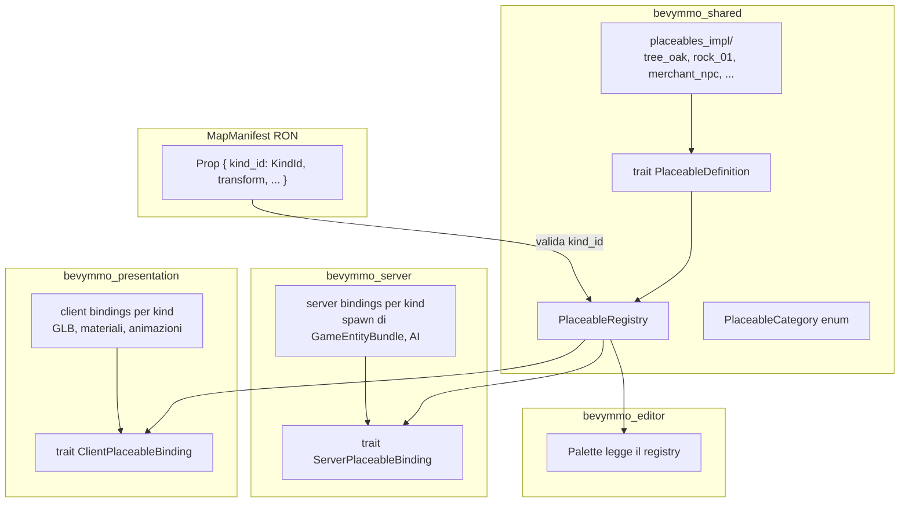
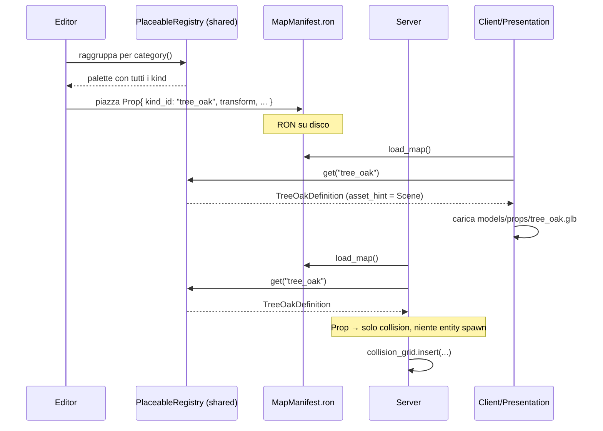

# Plan: Placeable Catalog — un centro per "cosa posso piazzare nel mondo"

> **Status:** proposta in attesa di conferma
> **Scope:** strutturare un unico catalogo dati+comportamento per ogni oggetto piazzabile (props, NPC, trigger, risorse, interactable) che l'editor e il server consumano allo stesso modo.
> **Pattern di riferimento:** `spells/` + `spells_impl/` + `SpellRegistry` (già in repo)

## 1. Perché questo piano esiste

Oggi il sistema è **solo data + stringhe magiche**:

```text
editor/src/picking.rs:        PALETTE_KINDS = ["cube", "tree_oak", "rock_01", ...]
editor/src/picking.rs:        tint_for_kind(kind)        // match su stringa
editor/src/picking.rs:        visual_scale_for_kind(kind)// match su stringa
presentation/src/world.rs:    placeholder_scale(kind)    // match DUPLICATO
presentation/src/world.rs:    placeholder_color(kind)    // match DUPLICATO
shared/src/world/manifest.rs: Prop { kind: String }      // stringa non validata
```

Problemi concreti:
- Aggiungere un oggetto nuovo richiede di modificare 3 file diversi in 3 crate diverse.
- Niente validazione: posso scrivere `kind = "albero_fake"` e il client lo renderizza come cubo grigio silenziosamente.
- I `kind` sono solo visuali — non c'è modo di collegarli a comportamento (NPC che parla, trigger che si attiva, risorsa che si raccoglie).
- L'editor non sa nulla del "significato" di un oggetto, quindi non può raggruppare correttamente o validare il manifest.

## 2. Decisioni di design (D1–D8)

### D1. Il catalogo è **codice compilato**, non un asset `.ron`

Un oggetto come `tree_oak` è solo visual, ma `merchant_npc` ha un sistema di dialogue. Un `.ron` non può esprimere "chiama questo sistema quando il player interacta". Quindi:

- **Catalogo = `trait PlaceableDefinition` + `PlaceableRegistry` in `bevymmo_shared`**
- Implementazioni in `crates/shared/src/placeables_impl/<category>/<kind>.rs`
- Una funzione `register_default_placeables()` registra tutto all'avvio (come `register_default_spells`)

Il **manifest della mappa** resta data-only: contiene solo *dove* e *come* (transform, override tint, override collision), referenziando un `kind_id` del catalogo.

### D2. Una sola gerarchia, cinque categorie

Non cinque trait separati — un `trait PlaceableDefinition` con un `category()` che ritorna una `PlaceableCategory`. Le differenze di comportamento sono metodi opzionali con default no-op.

```rust
pub enum PlaceableCategory {
    Prop,         // alberi, rocce, case: solo visual + collision
    Npc,          // merchant, quest giver: visual + interaction + AI
    Trigger,      // zone PvP, teletrasporto: server logic, niente visual
    ResourceNode, // minerali, erbe: gathering
    Interactable, // porte, levette, forzieri: interaction one-shot
}
```

Perché una gerarchia sola: la maggior parte del codice (editor palette, validazione, spawn visuale) non distingue — guardare `category()` basta. Il server fa dispatch sul category solo dove serve comportamento specifico.

### D3. Il **manifest resta serializzato in RON**, ma referenzia `kind_id` validati

Il manifest non contiene più stringhe qualsiasi — contiene `KindId` (newtype come `SpellId`). La validazione `validate()` del manifest verifica che ogni `kind_id` sia registrato nel catalogo.

### D4. Separazione netta `definition` (shared) vs `binding` (server/client)

Per ogni placeable ci sono **tre strati** disgiunti:

| Strato | Crate | Responsabilità | Pattern |
|---|---|---|---|
| **Definition** | `bevymmo_shared::placeables` | id, nome, categoria, defaults (tint, scale, collision), asset hint | `trait PlaceableDefinition` |
| **Server binding** | `bevymmo_server::placeables` | come si traduce in entità gameplay (spawn di `GameEntityBundle`, AI, interaction handler) | `trait ServerPlaceableBinding` |
| **Client binding** | `bevymmo_presentation::placeables` | come si renderizza (GLB/mesh/materiali, animazioni) | `trait ClientPlaceableBinding` |

Il `kind` è la **chiave** che li collega. Ogni crate registra solo i binding dei placeable che le competono.

### D5. `EntityDefinition` resta per entità **gameplay runtime**

Non fondiamo tutto in `EntityDefinition`. Quello è per entità "vive" replicate (player, enemy, boss). Un `tree_oak` non è un'entità gameplay — è un prop statico. Il catalogo placeable **genera** entity quando serve (un NPC piazza un `GameEntityBundle` col marker `Npc`), ma il catalogo stesso è separato.

Relazione: `trait NpcPlaceable: PlaceableDefinition` dichiara "anche questo placeable sa come istanziare un'entità gameplay" — il server binding chiama `spawn_entity::<T>()` usando il pattern che già avete.

### D6. L'editor non ha dipendenze da `bevymmo_server` o `bevymmo_presentation`

L'editor legge solo il catalogo shared (definition). Per il rendering nel viewport usa il placeholder `mesh_for(category)` + tint di default del definition. Quando il gioco gira (mode `client`), la presentation rimpiazza i placeholder con i GLB veri.

### D7. Un oggetto = una cartella, come gli spells

Ogni `kind` concreto ha una cartella con `definition.rs` (wired al trait) e opzionalmente `server.rs` (binding server) e `client.rs` (binding presentation). Registro centrale include tutto.

### D8. Niente reflection / dinamica eccessiva

Il `PlaceableRegistry` usa `Arc<dyn PlaceableDefinition>` (come `SpellRegistry`). I binding server/client sono registrati come sistemi Bevy separati per category, non tramite trait object — perché ogni binding ha firme di sistema diverse (parametri world diversi).

## 3. Architettura



## 4. Contratti dati

### 4.1 `crates/shared/src/placeables/mod.rs`

```rust
//! Placeable catalog: the single source of truth for "what can be placed
//! in the world". Each kind has a definition (shared), and optionally a
//! server binding (gameplay behavior) and a client binding (rendering).
//!
//! Mirrors the spell framework: `trait` + `Registry` + concrete impls in
//! `placeables_impl/`.

pub mod binding_server;
pub mod binding_client;
pub mod category;
pub mod definition;
pub mod registry;

pub use category::PlaceableCategory;
pub use definition::{PlaceableDefaults, PlaceableDefinition, AssetHint};
pub use registry::{KindId, PlaceableRegistry};
```

### 4.2 `category.rs`

```rust
use serde::{Deserialize, Serialize};

/// Top-level classification of a placeable. Drives editor palette grouping
/// and server-side dispatch (NPC AI vs trigger evaluation vs ...).
#[derive(Debug, Clone, Copy, PartialEq, Eq, Hash, Serialize, Deserialize)]
pub enum PlaceableCategory {
    /// Static visual prop (tree, rock, house). No behavior.
    Prop,
    /// Non-player character with interaction and optional AI.
    Npc,
    /// Invisible gameplay zone (PvP, teleport, area trigger).
    Trigger,
    /// Harvestable node (ore vein, herb).
    ResourceNode,
    /// One-shot interaction (door, lever, chest).
    Interactable,
}

impl PlaceableCategory {
    pub const ALL: [Self; 5] = [
        Self::Prop,
        Self::Npc,
        Self::Trigger,
        Self::ResourceNode,
        Self::Interactable,
    ];

    pub fn label(self) -> &'static str {
        match self {
            Self::Prop => "Props",
            Self::Npc => "NPCs",
            Self::Trigger => "Triggers",
            Self::ResourceNode => "Resources",
            Self::Interactable => "Interactables",
        }
    }
}
```

### 4.3 `definition.rs`

```rust
use bevy::prelude::*;

use crate::world::{CollisionShape, TransformData};
use super::category::PlaceableCategory;
use super::registry::KindId;

/// Hint for the client binding about which asset to load. The catalog stays
/// in `shared` (no AssetServer here), so we only name the asset; the client
/// resolves the path.
#[derive(Debug, Clone)]
pub enum AssetHint {
    /// Render as a placeholder colored cuboid (editor + dev mode).
    Placeholder,
    /// Load a GLB scene at the given relative path (e.g. "models/props/tree_oak.glb").
    Scene(&'static str),
}

/// Default values written into the manifest when the user places the kind.
/// All fields can be overridden per-placement in the editor.
#[derive(Debug, Clone)]
pub struct PlaceableDefaults {
    pub transform: TransformData,
    pub tint: Option<[f32; 3]>,
    pub collision: Option<CollisionShape>,
    pub blocks_movement: bool,
}

/// Single source of truth for a placeable kind. Mirrors the `Spell` trait.
pub trait PlaceableDefinition: Send + Sync + 'static {
    /// Stable identifier stored in the manifest (e.g. "tree_oak").
    fn id(&self) -> KindId;

    /// Human-readable name for the editor palette and tooltips.
    fn display_name(&self) -> &'static str;

    /// Top-level category — drives palette grouping and server dispatch.
    fn category(&self) -> PlaceableCategory;

    /// Asset hint used by the client binding to build the visual.
    fn asset_hint(&self) -> AssetHint {
        AssetHint::Placeholder
    }

    /// Default transform, tint and collision applied on placement.
    fn defaults(&self) -> PlaceableDefaults {
        PlaceableDefaults {
            transform: TransformData::at(0.0, 0.0, 0.0),
            tint: None,
            collision: None,
            blocks_movement: false,
        }
    }

    /// Short description shown in the editor palette tooltip.
    fn description(&self) -> &'static str {
        ""
    }

    /// Optional emoji / glyph used by the editor palette for compact display.
    fn icon(&self) -> &'static str {
        "▢"
    }
}
```

### 4.4 `registry.rs`

```rust
use serde::{Deserialize, Serialize};
use std::borrow::Cow;
use std::collections::HashMap;
use std::sync::Arc;
use bevy::prelude::*;

use super::category::PlaceableCategory;
use super::definition::PlaceableDefinition;

/// Stable unique identifier for a placeable kind. Newtype around a string,
/// like `SpellId`. Stored in the manifest; the loader validates it against
/// the registry.
#[derive(Debug, Clone, PartialEq, Eq, Hash, Serialize, Deserialize)]
pub struct KindId(pub(crate) Cow<'static, str>);

impl KindId {
    pub fn new(id: impl Into<Cow<'static, str>>) -> Self { Self(id.into()) }
    pub fn as_str(&self) -> &str { &self.0 }
}

impl From<&'static str> for KindId {
    fn from(value: &'static str) -> Self { Self::new(value) }
}

/// Central registry of all placeable kinds. Populated at startup by
/// `register_default_placeables()`.
#[derive(Resource, Default)]
pub struct PlaceableRegistry {
    kinds: HashMap<KindId, Arc<dyn PlaceableDefinition>>,
}

impl PlaceableRegistry {
    pub fn register(&mut self, definition: Arc<dyn PlaceableDefinition>) {
        let id = definition.id();
        self.kinds.insert(id, definition);
    }

    pub fn get(&self, id: &KindId) -> Option<Arc<dyn PlaceableDefinition>> {
        self.kinds.get(id).cloned()
    }

    pub fn contains(&self, id: &KindId) -> bool { self.kinds.contains_key(id) }
    pub fn len(&self) -> usize { self.kinds.len() }
    pub fn is_empty(&self) -> bool { self.kinds.is_empty() }

    /// All definitions grouped by category, sorted by display name.
    /// The editor palette is built directly from this.
    pub fn grouped_by_category(&self) -> [(PlaceableCategory, Vec<Arc<dyn PlaceableDefinition>>); 5] {
        let mut buckets: [Vec<_>; 5] = Default::default();
        for def in self.kinds.values() {
            let idx = match def.category() {
                PlaceableCategory::Prop => 0,
                PlaceableCategory::Npc => 1,
                PlaceableCategory::Trigger => 2,
                PlaceableCategory::ResourceNode => 3,
                PlaceableCategory::Interactable => 4,
            };
            buckets[idx].push(def.clone());
        }
        for bucket in buckets.iter_mut() {
            bucket.sort_by(|a, b| a.display_name().cmp(b.display_name()));
        }
        [
            (PlaceableCategory::Prop, buckets[0].take()),
            (PlaceableCategory::Npc, buckets[1].take()),
            (PlaceableCategory::Trigger, buckets[2].take()),
            (PlaceableCategory::ResourceNode, buckets[3].take()),
            (PlaceableCategory::Interactable, buckets[4].take()),
        ]
    }
}
```

### 4.5 Esempio impl: `placeables_impl/props/tree_oak.rs`

```rust
//! Tree oak: static prop. No server or client binding beyond defaults.

use std::sync::Arc;
use bevymmo_shared::placeables::{
    AssetHint, PlaceableCategory, PlaceableDefaults, PlaceableDefinition, PlaceableRegistry,
};
use bevymmo_shared::world::{CollisionShape, TransformData};

pub struct TreeOakDefinition;

impl PlaceableDefinition for TreeOakDefinition {
    fn id(&self) -> KindId { KindId::new("tree_oak") }
    fn display_name(&self) -> &'static str { "Oak Tree" }
    fn category(&self) -> PlaceableCategory { PlaceableCategory::Prop }
    fn icon(&self) -> &'static str { "🌳" }
    fn asset_hint(&self) -> AssetHint { AssetHint::Scene("models/props/tree_oak.glb") }
    fn description(&self) -> &'static str { "Decorative broadleaf tree." }
    fn defaults(&self) -> PlaceableDefaults {
        PlaceableDefaults {
            transform: TransformData {
                translation: [0.0, 0.0, 0.0],
                rotation_deg: [0.0, 0.0, 0.0],
                scale: [0.8, 2.5, 0.8],
            },
            tint: Some([0.2, 0.5, 0.2]),
            collision: Some(CollisionShape::Cylinder { radius: 0.4, height: 2.5 }),
            blocks_movement: true,
        }
    }
}

pub fn register(registry: &mut PlaceableRegistry) {
    registry.register(Arc::new(TreeOakDefinition));
}
```

### 4.6 Esempio impl con NPC: `placeables_impl/npcs/merchant.rs`

```rust
//! Merchant NPC: visual + interaction + server AI bundle.

use std::sync::Arc;
use bevymmo_shared::placeables::*;
use bevymmo_shared::world::TransformData;

pub struct MerchantDefinition;

impl PlaceableDefinition for MerchantDefinition {
    fn id(&self) -> KindId { KindId::new("merchant_general") }
    fn display_name(&self) -> &'static str { "General Goods Merchant" }
    fn category(&self) -> PlaceableCategory { PlaceableCategory::Npc }
    fn icon(&self) -> &'static str { "🧑‍🌾" }
    fn asset_hint(&self) -> AssetHint { AssetHint::Scene("models/npcs/merchant.glb") }
    fn description(&self) -> &'static str { "Sells basic supplies. Opens a shop UI on interact." }
    fn defaults(&self) -> PlaceableDefaults {
        PlaceableDefaults {
            transform: TransformData::at(0.0, 0.0, 0.0),
            tint: None,
            collision: Some(CollisionShape::Cylinder { radius: 0.5, height: 1.8 }),
            blocks_movement: true,
        }
    }
}

// Il server binding corrispondente, in crates/server/src/placeables/npcs/merchant.rs:
//
//     pub struct MerchantServerBinding;
//     impl ServerPlaceableBinding for MerchantServerBinding {
//         fn kind(&self) -> KindId { KindId::new("merchant_general") }
//         fn spawn(&self, commands: &mut Commands, placement: &Placement) {
//             spawn_entity::<MerchantMarker>(commands); // usa il pattern EntityDefinition
//         }
//         fn interaction(&self) -> Option<InteractionKind> { Some(InteractionKind::Shop) }
//     }
```

### 4.7 Estensione del `MapManifest`

```diff
 pub struct Prop {
-    pub kind: String,
+    pub kind: KindId,           // validato contro il registry
     pub transform: TransformData,
     pub tint: Option<[f32; 3]>,
     pub collision: Option<CollisionShape>,
     pub blocks_movement: bool,
 }
```

La validazione in `loader.rs` riceve un `&PlaceableRegistry` (o un owned `HashSet<KindId>` estratto da esso) e segnala `ValidationIssue` per ogni `kind` sconosciuto.

## 5. Flusso end-to-end



## 6. Mappatura con il sistema entity esistente

| Situazione | Dove va |
|---|---|
| Prop statico (albero, roccia) | Solo catalogo + collision grid. **Nessuna entità gameplay**. |
| NPC interattivo | Catalogo + `ServerPlaceableBinding::spawn` → `spawn_entity::<MerchantMarker>()` (riusa `EntityDefinition`) |
| Trigger PvP | Catalogo + server binding speciale `evaluate_triggers` system. Nessuna entità replicata. |
| Boss piazatto nel mondo | Catalogo `category = Npc` + binding che fa `spawn_entity::<BossMarker>()`. Combina con il sistema boss esistente. |
| Resource node (minerali) | Catalogo `category = ResourceNode` + entity con `Harvestable` marker (da creare). |

Il trait `EntityDefinition` non viene toccato: continua a definire i marker `Player/Enemy/Boss/Dummy`. Il catalogo placeable lo *usa* quando serve, attraverso il server binding.

## 7. Fasi di implementazione (slice)

Ogni slice è indipendente e committabile.

### Slice 0 — Fondamenta (shared)
- [ ] `crates/shared/src/placeables/{mod,category,definition,registry}.rs`
- [ ] `KindId` newtype + `From<&str>` + `Serialize/Deserialize`
- [ ] `PlaceableRegistry` resource
- [ ] Tests: registry register/get/grouped_by_category

### Slice 1 — Migrare i `kind` esistenti come definitions
- [ ] `crates/shared/src/placeables_impl/props/{tree_oak,rock_01,rock_02,bush_01,house_simple,fence_01,lamp_01,crate_01,statue_01,cube}.rs`
- [ ] `register_default_placeables()` in `placeables_impl/mod.rs`
- [ ] Sostituire `PALETTE_KINDS`, `tint_for_kind`, `visual_scale_for_kind` con lookup al registry
- [ ] Sostituire `placeholder_scale`, `placeholder_color` in `presentation/world.rs` con `definition.defaults()`
- [ ] Changement: `Prop.kind: String` → `KindId` + adattare `loader::validate` per accettare un set di kind validi

### Slice 2 — Validazione nel loader
- [ ] `validate(manifest, &PlaceableRegistry)` → `Vec<ValidationIssue>` include `unknown kind "xxx"`
- [ ] L'editor passa il registry al loader
- [ ] La status bar dell'editor (già esistente) ora mostra kind mancanti

### Slice 3 — AssetHint + client binding
- [ ] `trait ClientPlaceableBinding { fn kind(&self) -> KindId; fn build(...) -> SceneRoot; }`
- [ ] `crates/presentation/src/placeables/{mod,props,npcs}/...`
- [ ] `spawn_prop_visual` diventa dispatcher: cerca il binding, fallback a placeholder
- [ ] Carica effettivamente `tree_oak.glb` (già parzialmente cablato)

### Slice 4 — ServerPlaceableBinding + NPC spawn
- [ ] `trait ServerPlaceableBinding { fn kind(); fn spawn(); fn interaction(); }`
- [ ] `crates/server/src/placeables/npcs/merchant.rs` come primo esempio concreto
- [ ] Sistema server `spawn_placeables_on_map_load`: legge manifest, per ogni Prop con category=Npc chiama il binding
- [ ] Marker `MerchantMarker` + `EntityDefinition` impl (riusa il pattern esistente)
- [ ] Test: caricamento manifest con merchant → entitàMerchant con stats e Position

### Slice 5 — Triggers (category specifica)
- [ ] Aggiungi `Trigger { id, kind_id, shape, event }` al manifest
- [ ] `placeables_impl/triggers/{pvp_zone,teleport,safe_zone}.rs`
- [ ] Server `evaluate_triggers` system (gia pianificato in `plans/map-editor.md`)
- [ ] Editor: tab "Triggers" dedicato con disegno area

### Slice 6 — Interactable + InteractionPayload
- [ ] `Interactable` nel manifest (gia nel piano originale)
- [ ] Binding lato server gestisce `InteractionRequest`/`InteractionResponse`
- [ ] Prima concretizzazione: porta che apre, forziere che dà loot

### Slice 7 — Resource nodes
- [ ] `ResourceNode { id, kind_id, position, health, respawn_seconds }`
- [ ] Marker `Harvestable` + sistema di gathering (slice separabile, anche solo stub)

### Slice 8 — Editor polish per il catalogo
- [ ] Palette con anteprima visuale (miniatura GLB o icona)
- [ ] Search box "filtra kind"
- [ ] Tooltip con description + defaults
- [ ] Quando si seleziona un kind, mostra i default nella status bar

## 8. Anticipazione: dove vive ogni cosa

```text
crates/shared/src/
├── placeables/                       # contratto + catalogo dati
│   ├── mod.rs
│   ├── category.rs                   # enum PlaceableCategory
│   ├── definition.rs                 # trait PlaceableDefinition
│   ├── registry.rs                   # KindId + PlaceableRegistry
│   ├── binding_server.rs             # trait ServerPlaceableBinding
│   └── binding_client.rs             # trait ClientPlaceableBinding
├── placeables_impl/                  # definitions concrete
│   ├── mod.rs                        # register_default_placeables()
│   ├── props/
│   │   ├── mod.rs
│   │   ├── tree_oak.rs
│   │   ├── rock_01.rs
│   │   └── ...
│   ├── npcs/
│   │   ├── mod.rs
│   │   └── merchant.rs
│   ├── triggers/
│   ├── resources/
│   └── interactables/

crates/server/src/
└── placeables/                       # binding server (gameplay)
    ├── mod.rs
    ├── npcs/
    │   └── merchant.rs               # chiama spawn_entity::<MerchantMarker>()
    └── triggers/

crates/presentation/src/
└── placeables/                       # binding client (rendering)
    ├── mod.rs
    └── props/
        └── tree_oak.rs               # carica tree_oak.glb

crates/editor/src/
└── ... (legge solo PlaceableRegistry)
```

## 9. Rischi e mitigazioni

| Rischio | Mitigazione |
|---|---|
| `KindId` nel manifest rompe i file `.ron` esistenti | `KindId` serializza come stringa trasparente — vecchi `.ron` con `kind: "tree_oak"` continuano a funzionare. |
| Binding server/client dimenticati per un kind | Test nel registry che verifica, per ogni kind di category=Npc/Trigger/..., che il binding sia registrato (Slice 4+). |
| Performance: lookup al registry per ogni prop | HashMap O(1); inoltre il client cache già i `MapPropVisual` per id. |
| Eccessivo boilerplate per prop banali | Slice 1 mostra che un prop statico è ~30 righe in un file. Accettabile per avere un'unica fonte di verità. |
| Conflict con `EntityDefinition` | Documentazione chiara (D5): `EntityDefinition` = entità "viva", `PlaceableDefinition` = "cosa si piazza". Possono coesistere; il binding NPC fa da ponte. |

## 10. Cose **non** incluse in questo piano

- AI dei NPC (è uno slice futuro del server)
- Loot tables per i forzieri (richiede un sistema item separato)
- Editor visuale per disegnare regioni/trigger (slice 5 include solo UI)
- Persistenza DB delle modifiche runtime (oggi è solo file `.ron`)
- Hot-reload del catalogo (richiede `bevy_commonset` o simile; fuori scope)

## 11. Prossimo passo proposto

Confermare le decisioni D1–D8. Se OK, parto dal **Slice 0 + Slice 1** (fondamenta + migrazione degli oggetti esistenti al catalogo). È il refactor che sblocca tutto il resto senza modificare la UX dell'editor.
